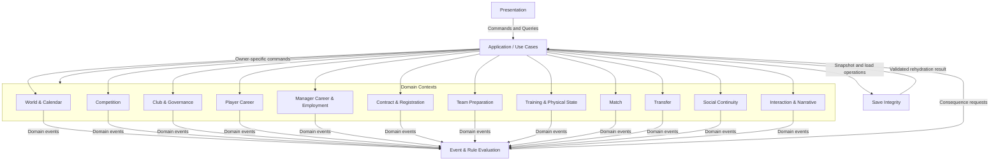

# Domain Modeli

**Belge:** `docs/03_DOMAIN_MODEL.md`
**Durum:** Kesinleşti
**Ana referans:** `docs/01_GAME_DESIGN_DOCUMENT.md`
**MVP sınırı:** `docs/02_MVP_SCOPE.md`
**Mimari yön:** `docs/17_TECHNOLOGY_AND_ARCHITECTURE_DECISION.md`
**İlgili karar günlüğü:** `docs/15_DECISION_LOG.md`

---

## 1. Belgenin Amacı

Bu belge, Football Career Simulator projesinin teknoloji bağımsız domain modelini tanımlar.

Belge:

* bounded context sınırlarını,
* authoritative veri sahipliğini,
* aggregate root adaylarını,
* entity ve value object ayrımını,
* kimlik ve referans kurallarını,
* temel yaşam döngülerini,
* domain değişmezlerini,
* context'ler arası komut ve olay sözleşmelerini,
* güncel state, geçmiş ve türetilmiş veri ayrımını,
* kulüp ve sezon geçişlerini,
* uzun dönem veri büyümesi yaklaşımını,
* save/load açısından domain gereksinimlerini,
* test gereksinimlerini

kesinleştirir.

Bu belge üretim sınıfları, veritabanı tabloları, ORM modelleri veya ayrıntılı event sınıfları tanımlamaz.

---

## 2. Referanslar ve Kapsam

Ana referans:

`docs/01_GAME_DESIGN_DOCUMENT.md`

Kesin MVP sınırı:

`docs/02_MVP_SCOPE.md`

Teknik ve mimari yön:

`docs/17_TECHNOLOGY_AND_ARCHITECTURE_DECISION.md`

MVP domain modeli aşağıdaki ölçeği desteklemelidir:

* 1 kurgusal ülke,
* 1 profesyonel lig,
* 20 kulüp,
* yaklaşık 500 aktif futbolcu,
* en fazla 10 tamamlanmış sezon,
* teknik direktör kariyeri,
* işten çıkarılma ve kulüp değiştirme,
* kadro, antrenman, taktik ve maç,
* transfer ve sözleşmeler,
* ilişki, hafıza ve söz sistemleri,
* yönetim ve temel basın etkileşimleri,
* kayıt ve yükleme,
* olay zaman çizelgesi tabanlı maç sunumu.

Domain modeli yalnızca ilk dikey kesiti değil, kesinleşmiş 10 sezonluk MVP'yi destekler.

---

## 3. Modelleme İlkeleri

1. Her domain verisinin tek bir authoritative owner'ı bulunur.
2. Bir context başka bir context'in iç state'ini doğrudan değiştiremez.
3. Aggregate dışı değişiklikler Application orkestrasyonu, komutlar ve domain olayları üzerinden yürütülür.
4. Domain event gerçekleşmiş bir gerçeği, command ise gerçekleştirilmek istenen niyeti temsil eder.
5. Event'in yayınlanması başka bir context'in state'ini otomatik olarak değiştirmiş sayılmaz.
6. UI domain nesnelerinin, iş kurallarının veya kayıt verisinin sahibi değildir.
7. Domain motor, framework, veritabanı, dosya sistemi ve gerçek saate bağımlı değildir.
8. Aggregate'lar arası referanslar nesne grafiği yerine kalıcı kimliklerle kurulur.
9. İsim, forma numarası, liste sırası veya ekrandaki index kalıcı kimlik olarak kullanılamaz.
10. Snapshot ana runtime state kaynağıdır; tam event sourcing kullanılmaz.
11. Her küçük state değişikliği sonsuza kadar event geçmişinde tutulmaz.
12. Tamamlanmış tarihsel kayıtlar kontrolsüz biçimde silinmez veya yeniden yazılmaz.
13. Rastlantısallık global ve gizli biçimde domain nesnelerine dağıtılamaz.
14. Oyun zamanı ve simülasyon sırası açık simulation context üzerinden yürütülür.
15. Player ve Manager kimliği kulüp değişiminde korunur.
16. Save/load kimlikleri, açık işlemleri ve idempotency kayıtlarını korur.
17. Derived state'in authoritative kaynağı ve yeniden üretim kuralı açık olmalıdır.
18. MVP dışındaki özellikler domain modelinin çalışması için zorunlu bağımlılık hâline getirilemez.

---

## 4. Domain Terminolojisi

### 4.1. Bounded Context

Belirli bir iş sözlüğünün, kuralların ve authoritative veri sahipliğinin geçerli olduğu domain sınırıdır.

Bounded context teknik olarak ayrı servis, repository veya assembly olmak zorunda değildir.

### 4.2. Aggregate Root

Bir tutarlılık sınırının dışarıya açılan tek giriş noktasıdır.

Aggregate içindeki state değişiklikleri root üzerinden doğrulanır.

### 4.3. Entity

Zaman içinde kimliğini koruyan ve state değiştiren domain nesnesidir.

### 4.4. Value Object

Kimliği bulunmayan, değeriyle tanımlanan ve mümkün olduğunca immutable olan kavramdır.

### 4.5. Domain Event

Domain içinde gerçekleşmiş anlamlı bir gerçeğin immutable kaydıdır.

### 4.6. Command

Bir authoritative owner'dan state değişikliği talep eden niyettir.

### 4.7. Snapshot

Belirli bir simulation checkpoint'indeki geçerli runtime state temsilidir.

### 4.8. Historical Record

Tamamlanmış ve geçmişi temsil eden, normal oynanış sırasında yeniden yazılmaması gereken kayıttır.

### 4.9. Derived Data

Başka authoritative state veya tarihsel kayıtlardan hesaplanan projection, özet veya rapordur.

### 4.10. Actor Reference

Relationship, Memory, Promise ve Interaction sistemlerinin farklı aktör türlerine ortak biçimde referans vermesini sağlayan tipli kimlik referansıdır.

Ortak Actor Reference ikinci bir bağımsız kimlik sistemi oluşturmaz. Mevcut `PlayerId`, `ManagerId`, `ClubId` veya diğer aktör kimliklerini `ActorKind` ile birlikte temsil eder.

---

## 5. Bounded Context Listesi

| Context | Ana sorumluluk | Temel authoritative veriler |
| --- | --- | --- |
| World & Calendar | Oyun tarihi, planlama dönemleri ve simulation ordering | Game date, active period, random state |
| Competition | Lig, sezon, fixture ve standings | Season, fixture, accepted result, standings |
| Club & Governance | Kulüp kimliği, politikaları ve bütçe sınırları | Club profile, budget limits, policies |
| Player Career | Futbolcu kimliği ve sportif kariyer devamlılığı | Player profile, development, retirement |
| Manager Career & Employment | Teknik direktör kariyeri, görev ilişkisi ve board trust | Manager career, employment, offers, board trust |
| Contract & Registration | Futbolcu-kulüp hukuki bağlılığı | Contract, registration, active club |
| Team Preparation | Squad, match selection ve reusable tactic planları | Squad membership, selection, tactic plan |
| Training & Physical State | Training plan, fatigue, fitness ve injury | Training plan, physical state |
| Match | Tek maçın çalışma state'i ve sonucu | Match state, timeline, result |
| Transfer | Transfer ihtiyacı, teklif ve müzakere yaşam döngüsü | Transfer process |
| Social Continuity | Relationship, Memory ve Promise devamlılığı | Relationship, memory, promise |
| Interaction & Narrative | Görüşmeler, bekleyen kararlar ve kamusal anlatılar | Interaction, decision request, narrative |
| Event & Rule Evaluation | Event değerlendirme, causation ve idempotency | Event metadata, rule evaluation ledger |
| Save Integrity | Snapshot metadata, schema version ve bütünlük | Save manifest, migration and integrity metadata |

---

## 6. Context Map

Bağlayıcı context map kuralları:

* Presentation yalnızca Application üzerinden çalışır.
* Context'ler başka context'lerin aggregate'larını doğrudan değiştiremez.
* Event & Rule Evaluation business state sahibi değildir.
* Rule sonucu doğrudan tablo güncellemesi değil, authoritative owner'a gönderilen consequence command'dır.
* Save Integrity domain kurallarını atlayarak state oluşturamaz.
* Application transaction, idempotency ve çoklu context orkestrasyonunu yürütür.

---

## 7. Context'lerin Ayrıntılı Sorumluluğu

### 7.1. World & Calendar

1. **Amaç:** Oyun tarihini, zaman pencerelerini, planlama dönemlerini ve deterministik simulation ordering'i yönetmek.
2. **Sahip olduğu veriler:** Güncel oyun tarihi, aktif planlama dönemi, zaman ilerletme cursor'ı, transfer dönemi zaman pencereleri, root seed, RNG version ve runtime random state.
3. **Sahip olmadığı veriler:** Season katılımcıları, fixture, standings, maç sonucu, transfer süreci ve bekleyen kararların domain içeriği.
4. **Aggregate root adayları:** `WorldTimeline`, `SimulationState`.
5. **Entity adayları:** `PlanningPeriod`, `CalendarWindow`, `SimulationCheckpoint`.
6. **Value object adayları:** `GameDate`, `DateRange`, `SimulationStep`, `RandomStateDescriptor`.
7. **Temel komut kategorileri:** Zaman ilerletme, planlama dönemi açma/kapatma, checkpoint oluşturma, simulation stream ayırma.
8. **Ürettiği olay kategorileri:** Tarih ilerledi, dönem başladı/tamamlandı, transfer penceresi açıldı/kapandı, season boundary'ye ulaşıldı.
9. **Tepki verdiği olay kategorileri:** Zorunlu karar açıldı/kapatıldı, maç hazırlığı tamamlandı, kritik kesinti oluştu.
10. **Etkilediği sistemler:** Tüm zaman bağımlı context'ler.
11. **Etkilendiği sistemler:** Interaction, Match, Team Preparation ve Event Evaluation tarafından oluşturulan zaman engelleri.
12. **Temel yaşam döngüsü:** Checkpoint → ilerletme isteği → blocker doğrulaması → sıralı simulation steps → yeni checkpoint.
13. **Domain değişmezleri:** Oyun tarihi geriye gidemez; aynı simulation step iki kez tamamlanamaz; future result runtime state'e uygulanamaz.
14. **Sınır durumları:** Çift maç dönemi, maçsız dönem, transfer kapanış günü, save'in planlama dönemi ortasında alınması.
15. **Temel test senaryoları:** Deterministik zaman ilerletme, blocker testi, save/load sonrası aynı sıranın devamı.
16. **Uzun dönem veri riski:** Kontrolsüz checkpoint ve processing kayıtlarının büyümesi.
17. **MVP ayrıntı seviyesi:** Gerçek fakat sadeleştirilmiş.
18. **Açık bırakılan alt kararlar:** Kesin simulation step granularity ve PRNG algoritması.

### 7.2. Competition

1. **Amaç:** Lig, season, fixture, competition sanction ve standings state'ini yönetmek.
2. **Sahip olduğu veriler:** Competition identity, season, katılımcılar, fixture, kabul edilmiş maç sonuçları, standings ve season result.
3. **Sahip olmadığı veriler:** Maç içi state, squad, sözleşme, bütçe ve teknik direktör görevi.
4. **Aggregate root adayları:** `CompetitionSeason`, `Fixture`.
5. **Entity adayları:** `SeasonParticipant`, `StandingEntry`, `CompetitionSanction`.
6. **Value object adayları:** `Points`, `GoalDifference`, `FixtureRound`, `CompetitionPosition`.
7. **Temel komut kategorileri:** Season oluşturma, fixture planlama, sonucu kabul etme, season tamamlama ve arşivleme.
8. **Ürettiği olay kategorileri:** Season başladı/tamamlandı, fixture planlandı, sonuç kabul edildi, standings değişti.
9. **Tepki verdiği olay kategorileri:** Tarih ilerledi ve Match tamamlandı.
10. **Etkilediği sistemler:** Match, Manager Career & Employment, Club & Governance ve Team Preparation.
11. **Etkilendiği sistemler:** World & Calendar ve Match.
12. **Temel yaşam döngüsü:** Preseason → active season → completed → archived.
13. **Domain değişmezleri:** Bir fixture sonucu yalnızca bir kez kabul edilir; season katılımcıları active season sırasında kontrolsüz değiştirilemez.
14. **Sınır durumları:** Ertelenen maç, aynı tarihte birden fazla fixture, eksik sonuç, season son gününde açık maç.
15. **Temel test senaryoları:** 38 maçlık fikstür, duplicate result, standings rebuild ve season completion.
16. **Uzun dönem veri riski:** Tüm fixture ve ayrıntılı istatistiklerin kontrolsüz tutulması.
17. **MVP ayrıntı seviyesi:** Gerçek fakat tek ligle sadeleştirilmiş.
18. **Açık bırakılan alt kararlar:** Kesin fixture üretme algoritması ve ayrıntılı tie-break kuralları.

### 7.3. Club & Governance

1. **Amaç:** Kulübün kalıcı kurumsal kimliğini, politikalarını, kültür özetini ve bütçe sınırlarını yönetmek.
2. **Sahip olduğu veriler:** Club identity, okunabilir kod, sportif itibar/güç özeti, politikalar, transfer bütçe sınırı, maaş bütçe sınırı ve kulüp tarihçesi.
3. **Sahip olmadığı veriler:** Player nesneleri, contracts, squad membership, transfer süreçleri, board trust, match history ve relationships.
4. **Aggregate root adayları:** `Club`.
5. **Entity adayları:** `ClubPolicy`, `ClubHistoryEntry`, `BudgetBoundary`.
6. **Value object adayları:** `ClubCode`, `Money`, `ReputationLevel`, `PolicyValue`.
7. **Temel komut kategorileri:** Bütçe sınırı belirleme, politika değiştirme, kurumsal geçmiş kaydetme.
8. **Ürettiği olay kategorileri:** Bütçe sınırı değişti, politika değişti, club reputation değişti.
9. **Tepki verdiği olay kategorileri:** Season sonucu, transfer mali taahhüdü, önemli sportif başarı veya kriz.
10. **Etkilediği sistemler:** Transfer, Contract, Manager Career & Employment ve Interaction.
11. **Etkilendiği sistemler:** Competition, Match, Transfer ve Manager Career & Employment.
12. **Temel yaşam döngüsü:** Oluşturuldu → aktif kulüp → season değerlendirmeleri → tarihsel devamlılık.
13. **Domain değişmezleri:** Club identity değişmez; bütçe sınırları negatif olamaz; Club devasa aggregate hâline gelemez.
14. **Sınır durumları:** Bütçe düşüşü sırasında açık transferler, kulüp kodu değişimi, aktif season ortasında politika değişimi.
15. **Temel test senaryoları:** Bütçe doğrulama, policy update ve club identity preservation.
16. **Uzun dönem veri riski:** Her küçük kurumsal değişikliğin kalıcı tarihçe olarak tutulması.
17. **MVP ayrıntı seviyesi:** Gerçek fakat sadeleştirilmiş.
18. **Açık bırakılan alt kararlar:** Kesin kulüp kültürü boyutları ve finansal model.

### 7.4. Player Career

1. **Amaç:** Futbolcunun kulüpten bağımsız kalıcı kimliğini ve sportif kariyer devamlılığını yönetmek.
2. **Sahip olduğu veriler:** Player identity, doğum bilgisi, pozisyon profili, sportif profil, gelişim/düşüş, kariyer state'i, retirement ve kariyer özeti.
3. **Sahip olmadığı veriler:** Aktif contract, squad membership, physical state, transfer process, relationships, memories ve match result.
4. **Aggregate root adayları:** `PlayerCareer`.
5. **Entity adayları:** `CareerMilestone`, `DevelopmentState`.
6. **Value object adayları:** `PlayerName`, `BirthDate`, `PositionProfile`, `AbilityProfile`, `CareerStatus`.
7. **Temel komut kategorileri:** Player oluşturma, gelişim/düşüş uygulama, kariyer aşaması değiştirme ve emekli etme.
8. **Ürettiği olay kategorileri:** Player oluşturuldu, gelişti, düşüşe geçti, kariyer state'i değişti, emekli oldu.
9. **Tepki verdiği olay kategorileri:** Season ilerledi, training sonucu, match performance ve ciddi injury.
10. **Etkilediği sistemler:** Contract, Team Preparation, Match, Transfer ve Social Continuity.
11. **Etkilendiği sistemler:** Training, Match, Competition ve World.
12. **Temel yaşam döngüsü:** Created → active free agent veya contracted career → decline → retired.
13. **Domain değişmezleri:** Retired player aktif squad üyesi olamaz; PlayerId kulüp değişiminde değişmez.
14. **Sınır durumları:** Contract olmadan active player, season ortasında retirement, yeni üretilen futbolcu.
15. **Temel test senaryoları:** Aging, development, decline, retirement ve identity preservation.
16. **Uzun dönem veri riski:** Her antrenman ve maç değişiminin kariyer geçmişine ayrı kayıt olması.
17. **MVP ayrıntı seviyesi:** Gerçek fakat sadeleştirilmiş.
18. **Açık bırakılan alt kararlar:** Kesin ability sayısı, development ve retirement formülleri.

### 7.5. Manager Career & Employment

1. **Amaç:** Manager kariyer kimliğini, employment ilişkisini, iş tekliflerini, board trust ve kariyer itibarını yönetmek.
2. **Sahip olduğu veriler:** Manager identity, career history, reputation, active employment, club active-manager assignment, job offers, season expectations, board trust ve dismissal records.
3. **Sahip olmadığı veriler:** Club bütçesi, squad, match result, player contracts ve relationships.
4. **Aggregate root adayları:** `ManagerCareer`, `ClubEmployment`, `JobOffer`.
5. **Entity adayları:** `CareerMilestone`, `BoardAssessment`, `SeasonExpectation`, `EmploymentPeriod`.
6. **Value object adayları:** `ManagerReputation`, `EmploymentStatus`, `BoardTrust`, `OfferTermsSummary`.
7. **Temel komut kategorileri:** Kariyer başlatma, teklif oluşturma/yanıtlama, employment başlatma, board değerlendirmesi, dismissal ve kariyer tamamlama.
8. **Ürettiği olay kategorileri:** Kariyer başladı, teklif verildi, görev başladı, board trust değişti, işten çıkarıldı, görev sona erdi.
9. **Tepki verdiği olay kategorileri:** Match sonucu, standings, season sonucu, kritik kriz ve public narrative.
10. **Etkilediği sistemler:** Club, Team Preparation, Transfer, Interaction ve Social Continuity.
11. **Etkilendiği sistemler:** Competition, Match, Club Governance, Interaction ve Social Continuity.
12. **Temel yaşam döngüsü:** Career started → unemployed veya employed; offer ayrı lifecycle'dır; dismissal sonrası career identity korunur.
13. **Domain değişmezleri:** Bir manager aynı anda en fazla bir active employment'a; bir club en fazla bir active manager'a sahip olabilir.
14. **Sınır durumları:** Offer kabulü sırasında başka aktif görev, season ortası dismissal, işsizlikte açık promise.
15. **Temel test senaryoları:** Dismissal, unemployment, offer acceptance, club change ve history preservation.
16. **Uzun dönem veri riski:** Board değerlendirmelerinin ve küçük reputation değişimlerinin kontrolsüz büyümesi.
17. **MVP ayrıntı seviyesi:** Tam işlevli kariyer; sadeleştirilmiş iş piyasası.
18. **Açık bırakılan alt kararlar:** İşsizliğin maksimum süresi, erken kariyer sonu ve offer puanlama modeli.

### 7.6. Contract & Registration

1. **Amaç:** Player ile Club arasındaki hukuki bağlılığı ve competition registration durumunu yönetmek.
2. **Sahip olduğu veriler:** Contract identity, taraflar, tarihler, ücret özeti, active state, registration ve authoritative active club.
3. **Sahip olmadığı veriler:** Squad membership, transfer negotiation, player profile, budget limit ve match selection.
4. **Aggregate root adayları:** `PlayerContract`, `PlayerRegistration`.
5. **Entity adayları:** `ContractPeriod`, `RegistrationPeriod`.
6. **Value object adayları:** `ContractDateRange`, `WageSummary`, `ContractStatus`, `RegistrationStatus`.
7. **Temel komut kategorileri:** Contract teklifini aktive etme, sona erdirme, expire etme, registration açma/kapatma.
8. **Ürettiği olay kategorileri:** Contract active oldu, sona erdi, player free agent oldu, active club değişti.
9. **Tepki verdiği olay kategorileri:** Transfer completion request, contract end date ve player retirement.
10. **Etkilediği sistemler:** Player Career, Team Preparation, Transfer ve Club.
11. **Etkilendiği sistemler:** Transfer, World & Calendar ve Player Career.
12. **Temel yaşam döngüsü:** Proposed → agreed → active → expired/terminated → archived.
13. **Domain değişmezleri:** Bir player aynı anda en fazla bir active club contract'ına sahip olabilir.
14. **Sınır durumları:** Aynı gün biten ve başlayan contract, transfer kapanış anı, retired player contract.
15. **Temel test senaryoları:** Overlapping contract rejection, expiry, free agency ve atomic transfer activation.
16. **Uzun dönem veri riski:** Eski contract ayrıntılarının sınırsız büyümesi.
17. **MVP ayrıntı seviyesi:** Gerçek fakat ekonomik ayrıntıları sadeleştirilmiş.
18. **Açık bırakılan alt kararlar:** Kesin contract clause ve negotiation ayrıntıları.

### 7.7. Team Preparation

1. **Amaç:** Kalıcı squad membership, tek maçlık selection ve reusable tactic planlarını yönetmek.
2. **Sahip olduğu veriler:** A takım squad, squad role, MatchSelection, starting eleven, substitutes, TacticPlan ve match plan seçimi.
3. **Sahip olmadığı veriler:** Contract, physical state, match result ve player career profile.
4. **Aggregate root adayları:** `ClubSquad`, `MatchSelection`, `TacticPlan`.
5. **Entity adayları:** `SquadMember`, `SelectedPlayer`, `TacticalAssignment`.
6. **Value object adayları:** `SquadRole`, `SelectionSlot`, `Formation`, `TacticalApproach`.
7. **Temel komut kategorileri:** Squad'a ekleme/çıkarma, selection oluşturma, önceki selection'ı doğrulama, tactic plan oluşturma ve match plan onaylama.
8. **Ürettiği olay kategorileri:** Squad değişti, selection onaylandı/reddedildi, tactic plan değişti, match preparation tamamlandı.
9. **Tepki verdiği olay kategorileri:** Contract/registration değişti, injury/fitness değişti, competition sanction değişti, fixture preparation açıldı.
10. **Etkilediği sistemler:** Match, Promise, Relationship ve Interaction.
11. **Etkilendiği sistemler:** Contract, Training, Competition, Manager Career ve World.
12. **Temel yaşam döngüsü:** Squad devamlıdır; MatchSelection ve match plan her fixture için ayrı lifecycle yürütür.
13. **Domain değişmezleri:** Aynı player ilk 11'de iki kez bulunamaz; invalid, suspended veya unavailable player seçilemez.
14. **Sınır durumları:** Son dakika injury, eski selection'ın artık geçersiz olması, eksik yedek listesi.
15. **Temel test senaryoları:** Duplicate player, unavailable player, previous-selection reuse ve tactic compatibility.
16. **Uzun dönem veri riski:** Her match selection ve tactic revision'ın sonsuza kadar tutulması.
17. **MVP ayrıntı seviyesi:** Kadro tam işlevli; tactics gerçek fakat sadeleştirilmiş.
18. **Açık bırakılan alt kararlar:** Kesin tactic alanları, squad limitleri ve position validation ayrıntıları.

### 7.8. Training & Physical State

1. **Amaç:** Training plan, workload, fatigue, fitness, recovery, injury ve match availability state'ini yönetmek.
2. **Sahip olduğu veriler:** Weekly training plan, intensity, rest, player fatigue, fitness, active injury, recovery ve availability.
3. **Sahip olmadığı veriler:** Player ability profile, permanent development, squad decision, tactic plan ve match result.
4. **Aggregate root adayları:** `TrainingPlan`, `PlayerPhysicalState`.
5. **Entity adayları:** `InjuryEpisode`, `RecoveryProgress`, `TrainingPeriod`.
6. **Value object adayları:** `TrainingLoad`, `FatigueLevel`, `FitnessLevel`, `InjurySeverity`, `AvailabilityStatus`.
7. **Temel komut kategorileri:** Plan belirleme, load uygulama, recovery ilerletme, injury başlatma/sonlandırma.
8. **Ürettiği olay kategorileri:** Training sonucu, fatigue değişti, injury oluştu, player iyileşti, availability değişti.
9. **Tepki verdiği olay kategorileri:** Tarih ilerledi, player match minutes aldı, match injury oluştu.
10. **Etkilediği sistemler:** Team Preparation, Match ve Player Career.
11. **Etkilendiği sistemler:** World, Match ve Team Preparation.
12. **Temel yaşam döngüsü:** Planlandı → uygulandı → sonuçlandı; injury active → recovering → recovered.
13. **Domain değişmezleri:** Physical değerler geçerli aralıkta kalır; recovered olmayan injury kapatılamaz.
14. **Sınır durumları:** Çok maçlı dönem, save/load ortasında recovery, aynı player için eşzamanlı injury yaklaşımı.
15. **Temel test senaryoları:** Load-fatigue, rest-recovery, injury lifecycle ve availability.
16. **Uzun dönem veri riski:** Günlük physical snapshot'ların sınırsız tutulması.
17. **MVP ayrıntı seviyesi:** Gerçek fakat sadeleştirilmiş.
18. **Açık bırakılan alt kararlar:** Injury olasılığı, kesin fiziksel ölçekler ve çoklu injury ayrıntısı.

### 7.9. Match

1. **Amaç:** Tek bir maçın immutable input snapshot'ından tamamlanmış sonuca kadar yaşam döngüsünü yönetmek.
2. **Sahip olduğu veriler:** Match identity, FixtureId, katılımcılar, pre-match snapshot, active state, timeline, score, cards, substitutions, interventions, result ve performance summary.
3. **Sahip olmadığı veriler:** Fixture schedule, standings, permanent squad, reusable tactic plan ve player career.
4. **Aggregate root adayları:** `Match`.
5. **Entity adayları:** `MatchParticipant`, `TimelineEntry`, `Substitution`, `MatchPerformance`.
6. **Value object adayları:** `MatchClock`, `Score`, `MatchSnapshot`, `MatchResult`, `PerformanceSummary`.
7. **Temel komut kategorileri:** Match hazırlama, başlatma, simulation step, intervention ve tamamlama.
8. **Ürettiği olay kategorileri:** Match başladı, gol/kart/injury/değişiklik oldu, match tamamlandı ve performance üretildi.
9. **Tepki verdiği olay kategorileri:** Fixture ready, selection approved, tactic snapshot hazır ve physical snapshot sağlandı.
10. **Etkilediği sistemler:** Competition, Training, Player Career, Social Continuity ve Manager Career.
11. **Etkilendiği sistemler:** Competition, Team Preparation, Training ve World.
12. **Temel yaşam döngüsü:** Prepared → ready → started → completed → result accepted → archived.
13. **Domain değişmezleri:** Completed match yeniden başlatılamaz; result sonradan normal oynanışla değiştirilemez.
14. **Sınır durumları:** Mid-match save, abandoned simulation step, duplicate completion ve invalid substitution.
15. **Temel test senaryoları:** Determinism, lifecycle, duplicate completion, valid score ve thousands-of-matches invariant.
16. **Uzun dönem veri riski:** Bütün timeline event'lerinin 10 sezon boyunca tam ayrıntıyla saklanması.
17. **MVP ayrıntı seviyesi:** Gerçek presentation-neutral simulation.
18. **Açık bırakılan alt kararlar:** Kesin match mathematics ve event çeşitliliği.

### 7.10. Transfer

1. **Amaç:** Transfer ihtiyacından kabul, ret, iptal veya atomik tamamlanmaya kadar süreci yönetmek.
2. **Sahip olduğu veriler:** TransferProcess identity, target, offers, negotiation state, sporting approval, financial approval, player decision ve deadlines.
3. **Sahip olmadığı veriler:** Active contract, active club, club budget state, squad membership ve relationship state.
4. **Aggregate root adayları:** `TransferProcess`.
5. **Entity adayları:** `TransferOffer`, `NegotiationRound`, `ApprovalRecord`.
6. **Value object adayları:** `TransferStatus`, `OfferSummary`, `NegotiationDeadline`, `ApprovalDecision`.
7. **Temel komut kategorileri:** İhtiyaç açma, target belirleme, teklif yapma/değiştirme, karar kaydetme, kabul/ret/iptal ve completion talebi.
8. **Ürettiği olay kategorileri:** Süreç başladı, teklif değişti, approval verildi, kabul edildi, çöktü veya tamamlandı.
9. **Tepki verdiği olay kategorileri:** Transfer window, budget boundary, player decision ve contract activation.
10. **Etkilediği sistemler:** Contract, Club, Team Preparation, Player Career ve Social Continuity.
11. **Etkilendiği sistemler:** World, Club, Manager Career, Social Continuity ve Contract.
12. **Temel yaşam döngüsü:** Need identified → target selected → offer prepared → negotiating → approvals pending → accepted/rejected/cancelled → completed.
13. **Domain değişmezleri:** Completion öncesinde active club ve contract kısmi olarak değiştirilemez.
14. **Sınır durumları:** Window kapanışı, eşzamanlı teklifler, budget değişimi ve contract activation failure.
15. **Temel test senaryoları:** Atomic completion, rollback, rejection, cancellation ve duplicate completion.
16. **Uzun dönem veri riski:** Tamamlanmış bütün negotiation adımlarının kalıcı tutulması.
17. **MVP ayrıntı seviyesi:** Gerçek fakat sadeleştirilmiş.
18. **Açık bırakılan alt kararlar:** Transfer yetkileri, veto, negotiation sorumlusu ve puanlama modeli.

### 7.11. Social Continuity

1. **Amaç:** Relationship, Memory ve Promise verilerinin aktörler ve kulüpler arasında uzun vadeli devamlılığını yönetmek.
2. **Sahip olduğu veriler:** Tek authoritative relationship kaydı, seçici memory kayıtları, promise lifecycle ve bunların current state'i.
3. **Sahip olmadığı veriler:** Diyalog metni, match result, transfer process, board trust ve bütün domain event geçmişi.
4. **Aggregate root adayları:** `Relationship`, `MemoryRecord`, `Promise`.
5. **Entity adayları:** `RelationshipMilestone`, `MemoryReinforcement`, `PromiseProgress`.
6. **Value object adayları:** `ActorRef`, `RelationshipState`, `MemoryImportance`, `PromiseCondition`, `PromiseDeadline`.
7. **Temel komut kategorileri:** Relationship değiştirme, memory oluşturma/güçlendirme/zayıflatma/arşivleme ve promise oluşturma/değerlendirme/sonuçlandırma.
8. **Ürettiği olay kategorileri:** Relationship değişti, memory kaydedildi, promise oluşturuldu, fulfilled veya breached oldu.
9. **Tepki verdiği olay kategorileri:** Selection, match performance, interaction result, transfer result, dismissal ve public statement.
10. **Etkilediği sistemler:** Interaction, Transfer, Manager Career, Player Career ve Event Evaluation.
11. **Etkilendiği sistemler:** Match, Team Preparation, Interaction, Transfer ve Manager Career.
12. **Temel yaşam döngüsü:** Relationship devamlı state; Memory active → weakened/reinforced → archived; Promise proposed → accepted → active → resolved → archived.
13. **Domain değişmezleri:** Relationship çift yönlü kopya kayıt olamaz; Promise aynı anda fulfilled ve breached olamaz.
14. **Sınır durumları:** Aktör retirement, club change, promise sahibi görevden ayrılması ve silinmiş olmayan tarihsel aktör.
15. **Temel test senaryoları:** Single relationship ownership, memory decay/reinforcement, promise lifecycle ve club-change continuity.
16. **Uzun dönem veri riski:** Bütün olayların memory olması ve her relationship delta'nın saklanması.
17. **MVP ayrıntı seviyesi:** Relationship sadeleştirilmiş; Memory ve Promise tam işlevli çekirdek.
18. **Açık bırakılan alt kararlar:** Kesin relationship dimensions, memory formula ve promise türleri.

### 7.12. Interaction & Narrative

1. **Amaç:** Görüşme bağlamını, oyuncuya sunulan kararları, deadlines ve temel public narrative'leri yönetmek.
2. **Sahip olduğu veriler:** Interaction instance, DecisionRequest, seçenekler, cevap, deadline, resolution state ve public narrative.
3. **Sahip olmadığı veriler:** Relationship, Promise, Transfer, BoardTrust ve ManagerReputation.
4. **Aggregate root adayları:** `InteractionSession`, `DecisionRequest`, `PublicNarrative`.
5. **Entity adayları:** `DecisionOption`, `NarrativeReference`.
6. **Value object adayları:** `InteractionContext`, `DecisionDeadline`, `DecisionOutcome`, `NarrativeSummary`.
7. **Temel komut kategorileri:** Görüşme açma, decision üretme, option seçme, expire etme ve narrative yayınlama.
8. **Ürettiği olay kategorileri:** Interaction başladı/tamamlandı, decision verildi/expired oldu, statement yayımlandı.
9. **Tepki verdiği olay kategorileri:** Player request, manager request, promise breach, transfer development, match ve board crisis.
10. **Etkilediği sistemler:** Social Continuity, Manager Career, Transfer ve Event Evaluation.
11. **Etkilendiği sistemler:** Social Continuity, Match, Manager Career, Transfer ve Club.
12. **Temel yaşam döngüsü:** Opened → awaiting decision → answered/expired/cancelled → archived.
13. **Domain değişmezleri:** Resolved decision ikinci kez cevaplanamaz; UI seçenek dışında state değiştiremez.
14. **Sınır durumları:** Save sırasında açık decision, deadline ile aynı anda zaman ilerletme ve actor retirement.
15. **Temel test senaryoları:** Duplicate answer, deadline, save/load pending decision ve owner command production.
16. **Uzun dönem veri riski:** Bütün diyalog metinlerinin ve düşük önemli narrative'lerin saklanması.
17. **MVP ayrıntı seviyesi:** Gerçek fakat sınırlı interaction ve narrative kapsamı.
18. **Açık bırakılan alt kararlar:** Kesin diyalog şablonları, tonlar ve public narrative çeşitleri.

### 7.13. Event & Rule Evaluation

1. **Amaç:** Domain event'lerini bağlamla değerlendirmek, consequence request üretmek ve aynı etkinin iki kez uygulanmasını engellemek.
2. **Sahip olduğu veriler:** Event metadata, correlation, causation, rule evaluation records, processing keys ve delayed evaluation state.
3. **Sahip olmadığı veriler:** Club, Player, Match, Relationship veya Transfer business state'i.
4. **Aggregate root adayları:** `RuleEvaluation`, `EventProcessingRecord`.
5. **Entity adayları:** `RuleMatch`, `ScheduledEvaluation`, `ConsequenceRequest`.
6. **Value object adayları:** `EventId`, `CorrelationId`, `CausationId`, `ProcessingKey`, `GameTimestamp`.
7. **Temel komut kategorileri:** Event değerlendirme, delayed evaluation planlama ve duplicate effect reddetme.
8. **Ürettiği olay kategorileri:** Rule matched, consequence requested, duplicate rejected ve delayed evaluation ready.
9. **Tepki verdiği olay kategorileri:** Tüm context'lerin anlamlı domain event'leri.
10. **Etkilediği sistemler:** Application üzerinden tüm authoritative owner context'ler.
11. **Etkilendiği sistemler:** Tüm event üreten context'ler ve World.
12. **Temel yaşam döngüsü:** Received → validated → evaluated → consequence requested veya ignored → checkpointed.
13. **Domain değişmezleri:** Aynı processing key aynı state etkisini ikinci kez üretemez.
14. **Sınır durumları:** Event replay, load sonrası redelivery, delayed event ve causation cycle.
15. **Temel test senaryoları:** Idempotency, causation chain, duplicate delivery ve delayed evaluation.
16. **Uzun dönem veri riski:** Processing ledger ve audit kayıtlarının sınırsız büyümesi.
17. **MVP ayrıntı seviyesi:** Tam işlevli ve ertelenemez.
18. **Açık bırakılan alt kararlar:** Kesin rule representation ve event bus teknolojisi.

### 7.14. Save Integrity

1. **Amaç:** Snapshot metadata, schema version, migration history, backup ve load validation bütünlüğünü yönetmek.
2. **Sahip olduğu veriler:** SaveId, schema version, game/simulation/content/RNG versions, snapshot metadata, migration history ve integrity status.
3. **Sahip olmadığı veriler:** Runtime domain state'in authoritative canlı kopyası ve domain business rules.
4. **Aggregate root adayları:** `SaveManifest`.
5. **Entity adayları:** `MigrationRecord`, `BackupRecord`, `IntegrityCheckResult`.
6. **Value object adayları:** `SchemaVersion`, `GameVersion`, `ContentVersion`, `IntegrityStatus`, `CanonicalStateHash`.
7. **Temel komut kategorileri:** Snapshot alma, doğrulama, load, migration ve backup.
8. **Ürettiği olay kategorileri:** Save oluşturuldu, load edildi, validation başarısız, migration tamamlandı veya backup oluşturuldu.
9. **Tepki verdiği olay kategorileri:** Application save/load request ve simulation checkpoint.
10. **Etkilediği sistemler:** Application ve tüm rehydrate edilen context'ler.
11. **Etkilendiği sistemler:** Tüm context snapshot'ları ve Infrastructure adapter'ları.
12. **Temel yaşam döngüsü:** Snapshot requested → validated → persisted → loaded → validated → rehydrated.
13. **Domain değişmezleri:** Bozuk veya yarım migration sonucu geçerli save sayılamaz.
14. **Sınır durumları:** Eksik referans, eski schema, interrupted migration ve incompatible content version.
15. **Temel test senaryoları:** Round-trip, migration, corruption detection, identity preservation ve canonical hash.
16. **Uzun dönem veri riski:** Gereksiz audit, backup ve detailed history büyümesi.
17. **MVP ayrıntı seviyesi:** Tam işlevli ve ertelenemez.
18. **Açık bırakılan alt kararlar:** Kesin persistence tabloları, retention eşikleri ve recovery UX.

---

## 8. Aggregate Root'lar

| Context | Aggregate root adayları | Temel tutarlılık sınırı |
| --- | --- | --- |
| World & Calendar | `WorldTimeline`, `SimulationState` | Zaman ve simulation ordering |
| Competition | `CompetitionSeason`, `Fixture` | Season ve fixture sonucu tekilliği |
| Club & Governance | `Club` | Kulüp kimliği ve governance sınırları |
| Player Career | `PlayerCareer` | Player kariyer kimliği |
| Manager Career & Employment | `ManagerCareer`, `ClubEmployment`, `JobOffer` | Kariyer ve employment tekilliği |
| Contract & Registration | `PlayerContract`, `PlayerRegistration` | Aktif contract ve active club |
| Team Preparation | `ClubSquad`, `MatchSelection`, `TacticPlan` | Squad, selection ve tactic bütünlüğü |
| Training & Physical State | `TrainingPlan`, `PlayerPhysicalState` | Plan ve fiziksel state |
| Match | `Match` | Tek maç state'i ve immutable result |
| Transfer | `TransferProcess` | Transfer lifecycle ve completion |
| Social Continuity | `Relationship`, `MemoryRecord`, `Promise` | Sosyal state ve bağımsız lifecycle'lar |
| Interaction & Narrative | `InteractionSession`, `DecisionRequest`, `PublicNarrative` | Decision tekilliği |
| Event & Rule Evaluation | `RuleEvaluation`, `EventProcessingRecord` | Rule ve idempotency |
| Save Integrity | `SaveManifest` | Save metadata ve integrity |

Aggregate root listesi doğrudan üretim sınıfı listesi değildir. Nihai fiziksel kod organizasyonu geliştirme aşamasında ayrıca belirlenir.

---

## 9. Entity ve Value Object Yaklaşımı

### 9.1. Entity adayları

Aşağıdaki kavramlar kimlik ve yaşam döngüsü taşıdığı için entity yönündedir:

* Club
* PlayerCareer
* ManagerCareer
* ClubEmployment
* JobOffer
* PlayerContract
* PlayerRegistration
* Fixture
* Match
* TransferProcess
* Relationship
* MemoryRecord
* Promise
* DecisionRequest
* InteractionSession
* CompetitionSeason
* SimulationCheckpoint
* SaveManifest

### 9.2. Value object adayları

Aşağıdaki kavramlar değerleriyle tanımlanır:

* GameDate
* DateRange
* Money
* Score
* Formation
* TacticalApproach
* ActorRef
* BoardTrust
* ReputationLevel
* FatigueLevel
* FitnessLevel
* InjurySeverity
* ContractDateRange
* PromiseDeadline
* MemoryImportance
* SchemaVersion
* CanonicalStateHash
* CorrelationId
* CausationId

Value object'ler mümkün olduğunca immutable olmalı ve oluşturulurken kendi doğrulamalarını gerçekleştirmelidir.

---

## 10. Kimlik ve Referans Kuralları

1. Kalıcı entity kimlikleri ad, sıra, index veya forma numarasından bağımsızdır.
2. Her ana entity türü kendi güçlü tipli kimliğine sahiptir:

   * `ClubId`
   * `PlayerId`
   * `ManagerId`
   * `CompetitionId`
   * `SeasonId`
   * `FixtureId`
   * `MatchId`
   * `EmploymentId`
   * `ContractId`
   * `RegistrationId`
   * `TransferProcessId`
   * `RelationshipId`
   * `MemoryId`
   * `PromiseId`
   * `InteractionId`
   * `DecisionRequestId`
   * `EventId`
   * `SaveId`
3. Kesin UUID implementasyonu bu belgede seçilmez.
4. Aggregate'lar birbirlerine mutable nesne referanslarıyla değil kimliklerle referans verir.
5. İnsan tarafından okunabilir club code, slug veya content code ayrı alandır.
6. Social context için ikinci bir bağımsız Actor entity kimliği oluşturulmaz.
7. `ActorRef`, `ActorKind` ile mevcut type-specific kimliği birlikte taşır.
8. Authored content stable ID ile runtime instance ID birbirinden ayrıdır.
9. Runtime entity kimliği save/load sonrasında değişmez.
10. Retired, archived veya ayrılmış entity kimlikleri yeniden kullanılmaz.
11. Historical record içindeki kimlik referansları entity aktif olmasa bile korunur.
12. Eksik veya bozuk referans save load sırasında sessizce atlanmaz.
13. Kimlik üretimi deterministik olmak zorunda değildir; fakat oluşturulan kimlik save sonrasında kalıcıdır.
14. Event kimliği ile aggregate kimliği aynı kavram değildir.
15. Match identity ile Fixture identity ayrı tutulur.

---

## 11. Veri Sahipliği Matrisi

| Veri alanı | Authoritative owner | Okuyabilen context'ler | Değiştirebilen context | Değişiklik nedeni |
| --- | --- | --- | --- | --- |
| Oyun tarihi | World & Calendar | Tümü | World & Calendar | `AdvanceTime` |
| Random state | World & Calendar | Simulation ve Save Integrity | World & Calendar | Simulation step/checkpoint |
| Season | Competition | World, Club, Match, Manager | Competition | Season lifecycle |
| Fixture | Competition | Match, Team Preparation, World | Competition | Fixture planning |
| Standings | Competition | Club, Manager, UI | Competition | Accepted match result |
| Competition sanction | Competition | Team Preparation, Match | Competition | Accepted disciplinary result |
| Club identity | Club & Governance | Tümü | Club & Governance | Club creation/migration |
| Club budget limit | Club & Governance | Transfer, Contract, Manager | Club & Governance | Governance decision |
| Club policy | Club & Governance | Manager, Transfer, Interaction | Club & Governance | Policy command |
| Manager identity | Manager Career & Employment | İlgili tüm context'ler | Manager Career & Employment | Career creation |
| Active manager | Manager Career & Employment | Club, Competition, UI | Manager Career & Employment | Employment lifecycle |
| Board trust | Manager Career & Employment | Club, Interaction, UI | Manager Career & Employment | Board assessment |
| Manager reputation | Manager Career & Employment | Transfer, Interaction, UI | Manager Career & Employment | Career result command |
| Player identity | Player Career | İlgili tüm context'ler | Player Career | Player creation |
| Player career state | Player Career | Contract, Team, Match, Transfer | Player Career | Career lifecycle |
| Active club | Contract & Registration | Player, Team, Transfer, Club | Contract & Registration | Contract/registration transition |
| Active contract | Contract & Registration | Player, Club, Transfer | Contract & Registration | Contract lifecycle |
| Squad membership | Team Preparation | Club, Match, Manager | Team Preparation | Squad command |
| Match selection | Team Preparation | Match, Social | Team Preparation | Selection approval |
| Tactic plan | Team Preparation | Match, Manager | Team Preparation | Tactic command |
| Physical state | Training & Physical State | Team, Match, Player | Training & Physical State | Load, recovery, injury |
| Match result | Match | Competition, Manager, Social | Match | Match completion |
| Transfer process | Transfer | Club, Contract, Social | Transfer | Transfer lifecycle |
| Relationship | Social Continuity | Interaction, Transfer, Manager | Social Continuity | Relationship command |
| Memory | Social Continuity | Interaction, Transfer, Career | Social Continuity | Memory command |
| Promise | Social Continuity | Interaction, Team, Match | Social Continuity | Promise lifecycle |
| Pending decision | Interaction & Narrative | World, Manager, UI | Interaction & Narrative | Interaction lifecycle |
| Public narrative | Interaction & Narrative | Manager, Club, Social | Interaction & Narrative | Narrative command |
| Event processing ledger | Event & Rule Evaluation | Application, Save Integrity | Event & Rule Evaluation | Event evaluation |
| Save schema version | Save Integrity | Application, Infrastructure | Save Integrity | Migration/save operation |
| Migration history | Save Integrity | Application, Infrastructure | Save Integrity | Migration completion |

Authoritative owner dışında tutulan projection veya cache verisi owner'ın yerine geçemez.

---

## 12. Temel Yaşam Döngüleri

### 12.1. Futbolcu

Ana kariyer state'i:

`Created → Active → Retired`

Active player'ın contract konumu ayrı lifecycle'dır:

`FreeAgent ↔ Contracted`

Transfer süreci Player Career state'inin parçası değildir. Player, transfer tamamlanana kadar mevcut contract durumunu korur.

Transfer sırasında:

* contracted player contracted kalır,
* free agent free agent kalır,
* active club completion öncesinde değişmez,
* transfer başarısız olursa Player Career state'i bozulmaz.

Geçersiz geçişler:

* `Retired → Active`
* retired player için active registration,
* aynı anda birden fazla active contract.

### 12.2. Teknik Direktör

Kariyer state'i:

`CareerStarted → ActiveCareer → CareerCompleted`

Employment state'i:

`Unemployed ↔ Employed`

Job offer ayrı lifecycle'dır:

`Offered → Accepted/Rejected/Expired/Withdrawn`

Geçersiz geçişler:

* aktif employment kapanmadan ikinci employment başlatmak,
* completed career için yeni employment,
* aynı club'da iki active manager.

### 12.3. Kulüp Season'ı

`Preseason → ActiveSeason → Completed → Archived`

Yeni season ancak önceki season completed durumuna geldikten sonra active olabilir.

### 12.4. Fixture ve Match

Fixture:

`Planned → PreparationOpen → Ready → ResultAccepted → Archived`

Match:

`Prepared → Started → Completed → Archived`

Fixture ile Match aynı lifecycle değildir.

Geçersiz geçişler:

* completed Match'i yeniden başlatmak,
* aynı MatchResult'ı Fixture'a iki kez uygulamak,
* hazır olmayan fixture için match başlatmak.

### 12.5. Promise

`Proposed → Accepted → Active → Fulfilled/Breached/Expired/Cancelled → Archived`

Geçersiz geçişler:

* fulfilled promise'ı breached yapmak,
* breached promise'ı fulfilled yapmak,
* archived promise'a progress eklemek,
* accepted olmadan active yapmak.

### 12.6. Transfer

`NeedIdentified → TargetSelected → OfferPrepared → Negotiating → ApprovalPending → Accepted/Rejected/Cancelled → Completed`

Accepted state, hukuki ve registration değişikliklerinin tamamlandığı anlamına gelmez.

Completed state ancak gerekli Contract, Registration ve Squad işlemleri başarıyla tamamlandığında oluşur.

Geçersiz geçişler:

* rejected veya cancelled süreci completed yapmak,
* completion öncesinde active club değiştirmek,
* transfer window dışında izin verilmeyen yeni teklif üretmek,
* aynı completion effect'ini iki kez uygulamak.

---

## 13. Domain Değişmezleri

1. Bir Player aynı anda en fazla bir active club contract'ına sahip olabilir.
2. Bir Manager aynı anda en fazla bir active employment'a sahip olabilir.
3. Bir Club aynı anda en fazla bir active Manager'a sahip olabilir.
4. Retired Player active squad veya registration içinde bulunamaz.
5. Completed Match yeniden başlatılamaz.
6. Completed MatchResult normal oynanış sırasında değiştirilemez.
7. Aynı Fixture result'ı iki kez kabul edilemez.
8. Aynı Player starting eleven veya substitute listesinde birden fazla kez bulunamaz.
9. Unavailable veya suspended Player geçerli selection içinde bulunamaz.
10. Promise aynı anda birden fazla terminal state'e sahip olamaz.
11. Önceki season completed olmadan sonraki season active olamaz.
12. Transfer completed olmadan active club, contract ve registration kısmen değiştirilemez.
13. Manager club değiştirdiğinde identity, career history, reputation ve personal social history korunur.
14. Player club değiştirdiğinde identity, career history, physical state ve personal social history korunur.
15. Aynı processing key'in domain etkisi birden fazla uygulanamaz.
16. Save/load sonrasında completed operation yeniden çalıştırılamaz.
17. Runtime state geçerli oyun tarihinden sonraya ait completed result içeremez.
18. Aggregate dışı state doğrudan mutation ile değiştirilemez.
19. Archived historical record normal application command ile değiştirilemez.
20. Entity kimliği yeniden kullanılamaz.
21. Eksik authoritative reference geçerli state kabul edilemez.
22. Relationship aynı actor çifti için çift ve çelişkili authoritative kayıt olarak tutulamaz.
23. Event & Rule Evaluation başka context'in state'ini doğrudan değiştiremez.
24. Save Integrity domain invariant'larını atlayarak rehydration yapamaz.
25. Derived projection'ın authoritative source'u bulunmalıdır.

---

## 14. Context'ler Arası Komut ve Olay Sınırları

### 14.1. Command

Command:

* bir niyeti temsil eder,
* authoritative owner'a yöneltilir,
* reddedilebilir,
* invariant kontrolünden geçer,
* başarılı olduğunda result ve domain event üretebilir.

### 14.2. Domain Event

Domain event:

* gerçekleşmiş bir gerçeği temsil eder,
* immutable kabul edilir,
* minimum metadata taşır,
* başka context state'ini doğrudan değiştirmez.

Minimum event metadata:

* EventId
* EventType ve EventVersion
* Source aggregate reference
* Hedef actor veya aggregate referansları, gerekiyorsa
* Game date/time
* CorrelationId
* CausationId
* ProcessingKey veya idempotency bilgisi
* Event importance, gerekiyorsa

### 14.3. Domain Event ve Teknik Mesaj Ayrımı

Domain event domain gerçeğidir.

Teknik mesaj:

* event'in transport envelope'u,
* retry bilgisi,
* serialization metadata,
* delivery attempt

gibi altyapı ayrıntılarını taşıyabilir.

Domain event teknik message broker veya event bus teknolojisine bağımlı olamaz.

### 14.4. Teslim ve Tekillik

Sistem duplicate delivery ihtimaline dayanıklı olmalıdır.

"Exactly once transport" varsayılmayacaktır.

Bunun yerine:

* duplicate delivery tolere edilir,
* domain etkileri idempotent uygulanır,
* ProcessingKey veya operation identity korunur,
* tamamlanmış sonuçlar ikinci kez uygulanmaz.

### 14.5. Application Orkestrasyonu

Birden fazla context'i etkileyen işlemler Application tarafından koordine edilir.

Örnek transfer completion:

1. Transfer süreci completion için uygundur.
2. Eski contract kapanır.
3. Yeni contract ve registration aktive edilir.
4. Eski squad membership kapanır.
5. Yeni squad membership gerekiyorsa oluşturulur.
6. TransferProcess completed olur.
7. Domain event'leri yayınlanır.
8. İşlem herhangi bir aşamada başarısız olursa kısmi geçerli state bırakılmaz.

Kesin transaction ve persistence uygulaması Infrastructure aşamasında belirlenir.

---

## 15. Güncel State, Geçmiş ve Türetilmiş Veri

### 15.1. Güncel State

Örnekler:

* güncel oyun tarihi,
* active season,
* active contract,
* active employment,
* current board trust,
* active squad,
* current physical state,
* active injury,
* active promise,
* active transfer process,
* pending decision,
* current relationship state.

Güncel state snapshot içinde korunur.

### 15.2. Tarihsel Kayıt

Örnekler:

* completed MatchResult,
* archived Fixture,
* eski contract,
* eski employment,
* completed season result,
* dismissal history,
* resolved promise,
* önemli career milestone,
* önemli memory,
* completed transfer summary.

Historical record normal oynanışta immutable kabul edilir.

### 15.3. Türetilmiş Veri

Örnekler:

* standings,
* season statistics,
* career summary,
* form göstergesi,
* UI raporları,
* açıklama ve analysis projection'ları.

Genel yön:

* Yeniden hesaplama maliyeti düşük projection'lar runtime sırasında yeniden üretilebilir.
* Uzun dönem veya sık kullanılan projection'lar persist edilebilir.
* Persist edilen derived data'nın kaynak state'i ve rebuild yöntemi bulunmalıdır.
* Competition standings authoritative projection olarak Competition tarafından tutulabilir.
* Standings kaynağı kabul edilmiş MatchResult kayıtlarıdır.
* Kaynak ve projection uyuşmazlığı integrity hatasıdır.
* UI read model'leri authoritative state değildir.

---

## 16. Kulüp ve Kariyer Geçişleri

### 16.1. Manager Kulüp Değişimi

Taşınan veriler:

* ManagerId
* career history
* season history
* reputation
* personal relationship kayıtları
* personal memories
* kişisel ve hâlâ anlamlı promises
* kariyer milestone'ları

Taşınmayan veriler:

* eski club budget
* eski squad
* eski MatchSelection
* club-owned TacticPlan
* eski board trust
* eski season expectation
* eski employment authority
* club-specific reports
* eski club'ın transfer süreçleri

Club-specific promise'lar sessizce silinmez.

Departure sırasında:

* fulfilled, breached, cancelled veya impossible durumu kurallarla değerlendirilir,
* tarihsel sonuç kaydı korunur,
* yeni club'a otomatik olarak taşınmaz.

### 16.2. Player Transferi

Taşınan veriler:

* PlayerId
* career state
* sportif profil
* development/decline state
* physical state
* active injury
* personal relationships
* memories
* career history
* geçerli competition sanction, kural gerektiriyorsa

Değişen veriler:

* old contract kapanır,
* old registration kapanır,
* new contract açılır,
* new registration açılır,
* old squad membership kapanır,
* new squad membership ayrı command ile oluşturulur.

Taşınmayan veriler:

* forma numarası,
* old club squad role,
* old club MatchSelection,
* club-specific tactic assignment,
* club-specific promise, kural gereği farklı sonuçlanmadıkça.

Transfer completion atomik olmalıdır.

---

## 17. Season Geçişi

Season geçişinde korunacak veriler:

* bütün kalıcı entity kimlikleri,
* Player ve Manager career state'i,
* active contract ve employment kayıtları, tarihler devam ediyorsa,
* physical state ve active injury,
* active ve geleceğe uzanan promises,
* personal relationships ve memories,
* Club identity ve policy state,
* RNG version ve random state,
* event idempotency için gerekli processing kayıtları.

Arşivlenecek veriler:

* completed season,
* final standings,
* season fixtures,
* accepted MatchResult kayıtları,
* season statistics summary,
* club season assessment,
* manager season history,
* completed season expectations.

Yeni season için üretilecek veriler:

* yeni SeasonId,
* yeni season participants snapshot,
* yeni fixture seti,
* yeni planning periods,
* yeni season expectations,
* season-specific derived projections.

Season geçiş adımları:

1. Açık zorunlu maç ve fixture bulunmadığını doğrula.
2. Competition season'ı completed yap.
3. Final standings ve result'ları arşivle.
4. Manager ve Club season değerlendirmelerini tamamla.
5. Contract expiry ve employment tarihlerini değerlendir.
6. Player aging, development, decline ve retirement adımlarını uygula.
7. Gerekli yeni kurgusal futbolcuları üret.
8. Active population invariant'larını doğrula.
9. Yeni season oluştur.
10. Fixture üret.
11. Derived projection'ları yeniden kur.
12. Yeni season'ı active hâle getir.
13. Canonical checkpoint oluştur.

Geçiş yarım kalırsa yeni season geçerli active state olarak kabul edilmez.

---

## 18. Uzun Dönem Veri Büyümesi

### 18.1. Match Verisi

Kalıcı tutulur:

* result,
* katılımcılar,
* önemli events özeti,
* temel statistics,
* performance summary.

Compaction'a uygun:

* ayrıntılı timeline,
* düşük önemli event'ler,
* presentation-only metadata.

Genel yön:

* current season için ayrıntılı timeline tutulabilir,
* eski season'lar compact summary'ye dönüştürülebilir,
* önemli işaretlenmiş maçlar daha ayrıntılı korunabilir,
* kesin eşikler `docs/13_SAVE_SYSTEM.md` içinde belirlenir.

### 18.2. Relationship Verisi

Kalıcı tutulur:

* current relationship state,
* önemli milestone ve neden özetleri.

Compaction'a uygun:

* her küçük delta,
* tekrar eden düşük önemli değişimler.

### 18.3. Memory Verisi

Bütün event'ler memory olmaz.

Memory:

* importance filtresinden geçer,
* benzer memory'lerle birleşebilir,
* zamanla zayıflayabilir,
* yeniden güçlenebilir,
* active veya archived olabilir.

Düşük önemli ve etkisiz memory kayıtları summary veya archive hâline getirilebilir.

### 18.4. Promise Verisi

Active promise tam state ile tutulur.

Resolved promise:

* terminal state,
* taraflar,
* konu özeti,
* deadline,
* result,
* önemli consequence

ile tarihsel summary olarak korunur.

### 18.5. Transfer Verisi

Active process tam ayrıntıyla tutulur.

Resolved transfer için:

* taraflar,
* player,
* final decision,
* tarih,
* mali özet,
* failure reason veya completion summary

korunur.

Tekrar eden negotiation mesajları ve geçici candidate listeleri silinebilir.

### 18.6. Event ve Rule Verisi

Tam event sourcing kullanılmaz.

Kalıcı tutulur:

* önemli historical events,
* açıklanabilirlik için gerekli audit özeti,
* duplicate effect'i önlemek için gerekli processing keys,
* gecikmeli açık evaluations.

Compaction:

* güvenli checkpoint sonrasında,
* tekrar delivery ihtimali kalmadığı doğrulanarak,
* current snapshot ile tutarlı biçimde

yapılabilir.

### 18.7. Season Statistics

Her season için compact aggregate summary tutulur.

Her küçük event-level statistic kalıcı olmak zorunda değildir.

### 18.8. Geçici Veri

Tamamen silinebilecek örnekler:

* UI selection state,
* filter/sort state,
* geçici transfer candidate ranking,
* presentation animation state,
* tekrar üretilebilir read model cache,
* sonuçlanmış düşük önemli notification queue.

---

## 19. Save/Load Açısından Domain Gereksinimleri

Save aşağıdaki bilgileri korumalıdır:

* bütün kalıcı entity ID'leri,
* game date,
* active season ve planning period,
* open lifecycle state'leri,
* active contracts,
* active employment,
* pending decisions,
* active transfer processes,
* Match state, desteklenen kayıt noktasına göre,
* Promise progress ve deadline,
* physical state ve injuries,
* accepted Fixture result identities,
* event processing ve idempotency bilgisi,
* root seed,
* RNG algorithm/version,
* RNG state veya deterministic streams,
* schema version,
* game version,
* simulation version,
* content version,
* migration history,
* canonical checkpoint veya hash bilgisi.

Load öncesinde en az şu doğrulamalar yapılır:

1. Schema version geçerli mi?
2. Gerekli root kayıtları var mı?
3. Kimlikler unique mi?
4. Authoritative referanslar mevcut mu?
5. Bir Player için birden fazla active contract var mı?
6. Bir Manager için birden fazla active employment var mı?
7. Bir Club için birden fazla active Manager var mı?
8. Retired Player active squad'da mı?
9. Completed Match yeniden active görünüyor mu?
10. Fixture result iki kez kabul edilmiş mi?
11. Game date'ten sonraya ait completed result var mı?
12. Processing key duplication var mı?
13. Pending decision ve deadline tutarlı mı?
14. Random state ve version bilgisi mevcut mu?
15. Derived projection kaynak state ile uyumlu mu?

Bozuk save sessizce yüklenmez.

Migration:

* sıralı,
* tekrarlanabilir,
* test edilmiş,
* tek yönlü,
* loglanabilir,
* backup öncesi çalışan

bir süreç olmalıdır.

Domain model kesin SQLite tablo şeması tanımlamaz.

---

## 20. Test Matrisi

| Test kategorisi | Doğrulanan alan |
| --- | --- |
| Entity doğrulama | Kimlik ve temel alan doğrulamaları |
| Value object doğrulama | Geçerli aralıklar ve immutable değerler |
| Aggregate invariant | Aggregate içi değişmezler |
| Lifecycle transition | Geçerli ve geçersiz state geçişleri |
| Context integration | Event → Application → owner command akışı |
| Idempotency | Aynı event/result etkisinin yalnızca bir kez uygulanması |
| Transfer atomicity | Kısmi contract/registration/squad değişikliği bırakılmaması |
| Manager club change | Kariyer geçmişi ve identity korunması |
| Dismissal | Employment kapanışı ve unemployment state'i |
| Season transition | Archive, aging, retirement, new player ve yeni fixture |
| Player retirement | Active contract/squad ihlalinin engellenmesi |
| New player generation | Active population devamlılığı |
| Save/load identity | Bütün kalıcı ID'lerin korunması |
| Save/load round-trip | Canonical state eşdeğerliği |
| Deterministic time | Aynı input ve seed ile aynı sonuç |
| Match determinism | Aynı snapshot ve seed ile aynı result |
| Ten-season invariant | 10 season boyunca bozuk state oluşmaması |
| Reference integrity | Eksik veya orphan referans tespiti |
| Single authoritative owner | Aynı verinin iki context tarafından değiştirilmemesi |
| Derived data rebuild | Projection'ın authoritative source'tan yeniden üretilmesi |
| Historical immutability | Completed record'ların değiştirilememesi |
| Data growth | Runaway event, memory veya timeline büyümesinin tespiti |

10 season testleri en az şu hataları aramalıdır:

* exception,
* invalid lifecycle,
* duplicate result,
* overlapping contract,
* overlapping employment,
* orphan reference,
* uncontrolled memory growth,
* uncontrolled event growth,
* active player pool çökmesi,
* save/load failure,
* determinism failure.

---

## 21. Sınır Durumları

1. Transfer window kapanış anında kabul edilmiş fakat completion bitmemiş süreç.
2. Aynı Player için eşzamanlı birden fazla teklif.
3. Yeni contract aktivasyonu başarısızken old contract'ın kapanmış olması.
4. Manager dismissal ile açık promise deadline'ının aynı tarihe gelmesi.
5. Manager'ın yeni club teklifini eski employment kapanmadan kabul etmesi.
6. Player retirement ile active injury veya contract'ın aynı anda bulunması.
7. Son season fixture'ı tamamlanmadan season transition talebi.
8. Aynı MatchCompleted event'inin save/load sonrasında tekrar teslimi.
9. Mid-match save sırasında incomplete simulation step.
10. Fixture sonucu kabul edilmiş fakat standings projection'ın eksik olması.
11. Actor archived olduktan sonra historical relationship referansı.
12. Memory target actor'ın retired veya unemployed olması.
13. Promise subject'in artık gerçekleştirilemez hâle gelmesi.
14. Önceki MatchSelection'ın yeni injury nedeniyle geçersiz olması.
15. Aynı actor çifti için ters yönlü duplicate relationship kaydı.
16. Migration sırasında yarım state oluşması.
17. Content version değişirken runtime stable ID'nin bulunamaması.
18. Save'de game date'ten ileri completed event bulunması.
19. RNG version eksik veya desteklenmiyor olması.
20. İlk dikey kesitte bulunmayan bir context verisinin sonraki milestone'da eklenmesi.

---

## 22. Açık Kalan Tasarım Soruları

Bu belge aşağıdaki kararları kesinleştirmez:

* kesin futbolcu ability sayısı,
* kesin tactic parametreleri,
* kesin training focus sayısı,
* kesin relationship dimensions,
* kesin personality dimensions,
* kesin memory decay ve reinforcement formülü,
* kesin promise türleri,
* kesin match simulation matematiği,
* transfer karar puanlama formülü,
* transfer veto ve yetki ayrıntıları,
* transfer negotiation sorumlusu,
* injury probability formülü,
* kesin competition tie-break kuralları,
* kesin fixture üretme algoritması,
* event rule representation biçimi,
* event bus veya message queue teknolojisi,
* veritabanı tablo tasarımı,
* serialization alan şeması,
* retention ve compaction için kesin sayısal eşikler,
* UI read model ayrıntıları,
* işsizliğin maksimum süresi,
* erken kariyer bitiş koşulları.

Bu kararlar ilgili alt sistem belgelerine bırakılmıştır.

---

## 23. MVP ve İlk Dikey Kesit Ayrımı

Domain modeli kesin MVP'yi destekler.

İlk dikey kesitte uygulanması gereken aggregate ve lifecycle alt kümesi:

* WorldTimeline
* tek CompetitionSeason,
* Fixture,
* Club,
* PlayerCareer,
* ManagerCareer ve active ClubEmployment,
* PlayerContract ve Registration,
* ClubSquad,
* MatchSelection,
* TacticPlan,
* TrainingPlan,
* PlayerPhysicalState,
* Match,
* sınırlı Relationship,
* sınırlı Memory,
* sınırlı Promise,
* DecisionRequest,
* EventProcessingRecord,
* SaveManifest.

İlk dikey kesitte geçici veya özet temsil edilebilecek alanlar:

* uzak club davranışları,
* iş piyasası,
* club changing,
* uzak match ayrıntıları,
* geniş narrative havuzu,
* NPC manager karar ayrıntıları.

Bunların geçici temsili nihai MVP'de gerekli gerçek lifecycle ve sahiplik sınırlarını değiştiremez.

---

## 24. Riskler

### 24.1. Context'lerin erken fiziksel ayrıştırılması

Bounded context'lerin her biri için ayrı proje veya servis oluşturmak zorunlu değildir.

Tek geliştirici bakım maliyeti göz önünde tutulmalıdır.

### 24.2. Club aggregate'ın büyümesi

Club ekranında gösterilen bütün veriler Club'a ait değildir.

Club, Player, Contract, Match, Relationship ve Transfer aggregate'larını içine alamaz.

### 24.3. Player aggregate'ın büyümesi

Player Career yalnızca kalıcı kariyer kimliğinin sahibidir.

Physical state, contract, squad, relationship ve memory ayrı owner'lara aittir.

### 24.4. Çift authoritative owner

Active manager, active club, standings ve board trust gibi veriler iki farklı context tarafından değiştirilemez.

### 24.5. Event engine'in god object olması

Event & Rule Evaluation bütün business logic'i merkezi olarak sahiplenemez.

Invariant authoritative owner context'te kalır.

### 24.6. Social data growth

Relationship, Memory ve Promise için compaction, decay ve archive yaklaşımı bulunmazsa save kontrolsüz büyür.

### 24.7. Derived data drift

Persist edilen standings veya statistics kaynak sonuçlarla uyuşmaz hâle gelebilir.

Rebuild ve integrity doğrulaması zorunludur.

### 24.8. Transfer atomikliği

Transfer completion'ın birden fazla context'i etkilemesi kısmi state riski taşır.

Application transaction sınırı açık olmalıdır.

### 24.9. Save modelinin domain owner'a dönüşmesi

SQLite veya başka persistence temsili runtime domain state'in yerine geçemez.

### 24.10. Açık kararların yanlışlıkla kapatılması

Alt sistem belgelerine bırakılan formül ve parametre kararları domain modelinde kesinleştirilmemelidir.

---

## 25. Sonraki Adım

Domain modeli kesinleştikten sonraki ana çalışma:

`docs/04_EVENT_RULE_ENGINE.md`

Bu aşamada özellikle şu konular ayrıntılandırılmalıdır:

* domain event envelope,
* rule evaluation modeli,
* processing key ve idempotency,
* causation ve correlation,
* delayed event değerlendirmesi,
* consequence command üretimi,
* event retention ve audit sınırı,
* Application orkestrasyonu,
* cyclic event zincirlerinin engellenmesi,
* deterministik rule ordering.

Üretim koduna geçilmeden önce ilgili event/rule kararları belgeye işlenmelidir.
