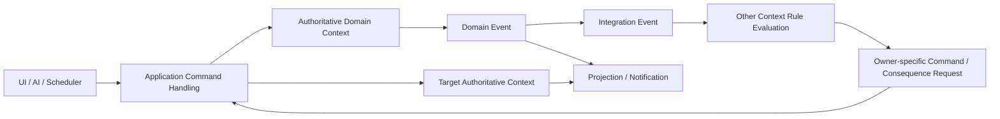

# Olay ve Kural Motoru

**Belge:** `docs/04_EVENT_RULE_ENGINE.md`
**Durum:** Kesinleşti
**Ana referans:** `docs/01_GAME_DESIGN_DOCUMENT.md`
**Kesin MVP sınırı:** `docs/02_MVP_SCOPE.md`
**Domain sınırları:** `docs/03_DOMAIN_MODEL.md`
**Mimari yön:** `docs/17_TECHNOLOGY_AND_ARCHITECTURE_DECISION.md`
**İlgili karar günlüğü:** `docs/15_DECISION_LOG.md`

---

## 1. Belgenin Amacı

Bu belge, Football Career Simulator projesinin olay ve kural motoruna ait teknoloji bağımsız sözleşmeleri ve davranış modelini tanımlar.

Belgenin amacı:

* context'lerin birbirlerinin authoritative state'ini doğrudan değiştirmesini engellemek,
* command, domain event, integration event ve notification sınırlarını kesinleştirmek,
* domain sonuçlarının nedenlerini izlenebilir kılmak,
* gecikmeli sonuçları ve uzun süren süreçleri desteklemek,
* aynı domain etkisinin ikinci kez uygulanmasını engellemek,
* oyun zamanı ve son tarih tabanlı değerlendirmeleri yönetmek,
* olay zincirlerini deterministik ve sınırlı biçimde işlemek,
* kayıt/yükleme sonrasında aktif işlemlerin güvenli biçimde devam etmesini sağlamak,
* 10 sezonluk simülasyonda olay hacmini kontrol altında tutmak,
* kuralları ve olay zincirlerini motor veya UI açılmadan test edilebilir kılmaktır.

Bu belge üretim sınıfları, interface'ler, event bus implementasyonu, veritabanı tabloları, serialization şeması veya bütün event tiplerinin kataloğunu oluşturmaz.

---

## 2. Referanslar ve Kapsam

Ana referans:

`docs/01_GAME_DESIGN_DOCUMENT.md`

Kesin MVP sınırı:

`docs/02_MVP_SCOPE.md`

Authoritative veri sahipliği, bounded context ve aggregate sınırları:

`docs/03_DOMAIN_MODEL.md`

Teknoloji ve yüksek seviyeli katman yönü:

`docs/17_TECHNOLOGY_AND_ARCHITECTURE_DECISION.md`

Bu belge şu bounded context'lerle çalışacak olay ve kural sözleşmelerini kapsar:

* World & Calendar
* Competition
* Club & Governance
* Player Career
* Manager Career & Employment
* Contract & Registration
* Team Preparation
* Training & Physical State
* Match
* Transfer
* Social Continuity
* Interaction & Narrative
* Event & Rule Evaluation
* Save Integrity

Olay ve kural motoru ayrı bir business domain sahibi değildir. Motor:

* olay metadata'sını,
* correlation ve causation bilgisini,
* rule evaluation kayıtlarını,
* processing key'leri,
* delayed evaluation state'ini,
* routing ve güvenlik sınırlarını

yönetebilir; fakat Club, Player, Match, Relationship, Promise, Contract veya Transfer state'inin authoritative owner'ı olamaz.

---

## 3. Bağlayıcı İlkeler

1. Her domain verisinin tek bir authoritative owner context'i bulunur.
2. Bir context başka bir context'in aggregate veya authoritative state'ini doğrudan değiştiremez.
3. UI domain state'i doğrudan değiştiremez.
4. Command bir niyeti, Domain Event gerçekleşmiş bir domain gerçeğini temsil eder.
5. Context dışına sunulan sözleşme Integration Event'tir; her Domain Event Integration Event olmak zorunda değildir.
6. Notification domain gerçeğinin veya pending decision'ın yerine geçemez.
7. Event handler sırası gizli business rule olarak kullanılamaz.
8. Sonradan çalışan handler önceki sonucu sessizce ezemez.
9. Aynı domain sonucu ikinci kez uygulanamaz.
10. "Exactly once transport" veya "exactly once delivery" varsayılmaz.
11. Global, gizli veya sürümsüz rastlantısallık kullanılamaz.
12. Domain kararları duvar saatine veya frame rate'e bağlı olamaz.
13. Oyun zamanı ve simulation ordering açık Simulation Context üzerinden yürütülür.
14. Event & Rule Evaluation başka context'in business state'ini doğrudan değiştiremez.
15. Çoklu context işlemleri Application orkestrasyonu üzerinden ilerler.
16. Kritik tamamlanma işlemleri kısmi geçerli state bırakamaz.
17. Her state değişikliği sonsuza kadar ayrıntılı event stream olarak tutulmaz.
18. Tam event sourcing kullanılmaz.
19. Snapshot authoritative current state'in ana persistence kaynağıdır.
20. Maç motorunun yüksek hacimli iç olayları dünya event akışına doğrudan yayınlanmaz.
21. Domain kuralları UI, persistence, Godot scene veya harici generative AI servisine bağımlı olamaz.
22. MVP'de harici message broker, workflow server veya genel amaçlı rule engine zorunlu bağımlılık değildir.
23. Kurallar mümkün olduğunca saf, typed, tekrar üretilebilir ve otomatik test edilebilir olmalıdır.
24. Açık bırakılmış alt sistem formülleri bu belgede sessizce kesinleştirilemez.

---

## 4. Terminoloji

### 4.1. Command

Bir oyuncunun, AI aktörünün, scheduler'ın veya application use case'inin authoritative owner'dan gerçekleştirmesini istediği niyettir.

Command:

* henüz gerçekleşmiş gerçek değildir,
* doğrulanabilir ve reddedilebilir,
* açık bir hedef context'e yöneltilir,
* mümkünse hedef aggregate referansı taşır,
* tekrar gönderime karşı CommandId veya idempotency key taşımalıdır,
* başarılı olduğunda state transition ve Domain Event üretebilir.

Örnekler:

* `SelectTrainingPlan`
* `ConfirmMatchSquad`
* `MakePromise`
* `SubmitTransferOffer`
* `AdvanceSimulationTime`

### 4.2. Domain Event

Bir bounded context içinde başarıyla gerçekleşmiş ve kabul edilmiş domain gerçeğinin immutable kaydıdır.

Domain Event:

* geçmiş zamanlıdır,
* kaynak context ve aggregate'ı bellidir,
* state değişikliği kabul edilmeden üretilmiş sayılmaz,
* başka context'in state'ini doğrudan değiştirmez,
* context içi kuralları, audit'i veya Integration Event mapping'ini tetikleyebilir.

Örnekler:

* `TrainingPlanSelected`
* `MatchSquadConfirmed`
* `PromiseCreated`
* `TransferOfferSubmitted`
* `MatchCompleted`

### 4.3. Integration Event

Bir context içinde commit edilmiş domain gerçeğinin diğer context'lere sunulan kararlı ve sürümlenmiş sözleşmesidir.

Integration Event:

* committed Domain Event'ten türetilir,
* kaynak context'in iç aggregate yapısını dışarı sızdırmaz,
* tüketicilerin ihtiyaç duyduğu minimum veriyi taşır,
* kendi EventId ve schema version bilgisine sahiptir,
* CausationId üzerinden kaynak Domain Event'e bağlanır,
* foreign state mutation talimatı değildir,
* tüketici context'in kendi command veya rule değerlendirmesine girdi olur.

Her Domain Event Integration Event'e dönüştürülmez. Context sınırını aşmayan, yalnızca aggregate içi veya context içi anlam taşıyan olaylar dışarı yayınlanmaz.

### 4.4. Notification

Oyuncuya, geliştirici aracına veya presentation katmanına gösterilen sunum bilgisidir.

Notification:

* authoritative domain state değildir,
* Domain Event yerine kullanılamaz,
* kaybolması domain state'i bozmamalıdır,
* mümkün olduğunda projection veya current state üzerinden yeniden üretilebilir,
* localization ve metin değişiklikleri domain event schema'sını değiştirmez,
* zamanı durdurma kararının sahibi değildir.

### 4.5. Decision Request

Interaction & Narrative context'inin sahip olduğu, oyuncu veya yetkili aktör kararı bekleyen operational domain entity'sidir.

Decision Request:

* Notification değildir,
* Domain Event değildir,
* oluşturulduğunda bir Domain Event üretilebilir,
* seçenekler, deadline, status ve resolution policy taşır,
* oyuncu seçimi sonucunda owner-specific Command üretir,
* interruption policy tarafından zamanı durdurabilir,
* save/load sırasında korunur,
* terminal state'e ulaştıktan sonra yeniden cevaplanamaz.

### 4.6. Scheduled Evaluation

Belirli oyun tarihinde değerlendirilmesi gereken gelecekteki işlemdir.

Scheduled Evaluation:

* gerçekleşmiş domain gerçeği değildir,
* future Domain Event gibi modellenemez,
* due olduğunda rule evaluation veya owner-specific Command üretir,
* iptal, yeniden planlama ve duplicate korumasına sahiptir,
* save/load sırasında korunur.

Business deadline'ın authoritative sahibi ilgili domain context'tir. Event & Rule Evaluation, due index ve delayed evaluation kaydını tutabilir; bu kayıt business state'in yerine geçmez.

### 4.7. Technical Message ve Processing Record

Retry, delivery attempt, serialization metadata, queue position, processing status, error ve telemetry gibi altyapı bilgileri Domain Event değildir.

Bu bilgiler:

* ayrı engine processing record'unda,
* infrastructure message envelope'unda,
* debug veya audit kaydında

tutulur.

### 4.8. Audit Record

Bir command'ın, kural değerlendirmesinin veya state transition'ın neden ve nasıl gerçekleştiğini açıklayan kayıttır.

Audit Record:

* domain state'in sahibi değildir,
* business rule yerine geçmez,
* player-facing explanation ile developer-facing trace'i ayırır,
* retention ve compaction politikasına tabidir.

### 4.9. Process Manager

Birden fazla aggregate veya context'e yayılan, tek çağrıda tamamlanmayan iş sürecinin ilerlemesini takip eden Application orkestrasyon bileşenidir.

Process Manager:

* business state'in owner'ı değildir,
* süreç kimliği ve tamamlanmış adımları takip eder,
* owner-specific command'lar üretir,
* Integration Event'leri tüketir,
* retry ve duplicate durumlarına dayanıklıdır,
* final completion koşullarını doğrular,
* başarısızlığı ve bekleyen adımları açık state olarak tutar.

---

## 5. Command, Domain Event, Integration Event ve Notification

| Kavram               | Anlam                                              | Reddedilebilir mi?                                                   | Authoritative state değiştirir mi?                     | Kalıcılık yönü                             |
| -------------------- | -------------------------------------------------- | -------------------------------------------------------------------- | -------------------------------------------------------- | ------------------------------------------ |
| Command              | Gerçekleştirilmek istenen niyet                    | Evet                                                                 | Yalnız authoritative owner tarafından işlenirse        | Aktif işlem ve idempotency gerektiriyorsa  |
| Domain Event         | Context içinde gerçekleşmiş gerçek                 | Hayır; üretiminden önce command reddedilebilir                       | Doğrudan değil; gerçekleşmiş state değişimini bildirir | Önemine göre seçici                        |
| Integration Event    | Başka context'lere sunulan kararlı olay sözleşmesi | Tüketici tarafından unsupported veya duplicate olarak reddedilebilir | Foreign state'i doğrudan değiştirmez                   | Aktif delivery/idempotency ihtiyacına göre |
| Notification         | Presentation veya debug bilgisi                    | Uygulanamaz                                                          | Hayır                                                  | Genellikle geçici                          |
| Decision Request     | Bekleyen oyuncu/aktör kararı                       | Seçenek veya deadline kurallarına bağlı                              | Resolution Command üzerinden                           | Aktif olduğu sürece zorunlu                |
| Scheduled Evaluation | Gelecekteki değerlendirme                          | İptal veya yeniden planlanabilir                                     | Due olduğunda Command veya evaluation üretir           | Due veya cancelled olana kadar             |

### 5.1. Command sonucu

Command değerlendirmesi şu sonuçlardan birini üretir:

* kabul ve state transition,
* business rejection,
* validation error,
* conflict,
* decision requirement,
* no action.

Reddedilen command varsayılan olarak Domain Event üretmez. Ancak reddin kendisi domain içinde gerçekleşmiş anlamlı bir karar ise authoritative owner geçmiş zamanlı Domain Event üretebilir. Örneğin oyuncunun yaptığı geçersiz UI tıklaması event değildir; kulübün resmi transfer teklifini reddetmesi domain olayı olabilir.

### 5.2. Commit kuralı

Domain Event, ilgili state transition güvenli biçimde kabul edilmeden dışarı yayınlanmış sayılmaz.

Persistence başarısız olursa:

* state transition başarılı gösterilemez,
* Domain Event committed kabul edilemez,
* Integration Event yayımlanamaz,
* notification başarı mesajı üretemez.

### 5.3. Context sınırını geçme

Context dışı etki şu akışla ilerler:

1. Source context kendi state'ini değiştirir.
2. Domain Event üretir.
3. Gerekliyse Integration Event mapping yapılır.
4. Integration Event deterministik queue'ya eklenir.
5. Tüketici kuralı kendi context'i için consequence veya command talebi üretir.
6. Application command'ı authoritative owner'a yöneltir.
7. Owner kendi invariant'larını değerlendirir.
8. Yeni state transition ve Domain Event oluşabilir.

Bir handler başka context nesnesini veya repository'sini doğrudan mutate edemez.

---

## 6. Event Metadata Sözleşmesi

Event metadata üç katmana ayrılır:

1. Değişmez domain/integration event verisi
2. Engine routing ve processing metadata'sı
3. Debug ve audit metadata'sı

### 6.1. Değişmez event alanları

| Alan                                       | Zorunluluk                 | Açıklama                                                                                   |
| ------------------------------------------- | --------------------------- | -------------------------------------------------------------------------------------------- |
| `EventId`                                  | Zorunlu                    | Event instance'ının benzersiz kimliği                                                      |
| `EventType`                                | Zorunlu                    | Sürümden bağımsız semantik event adı                                                       |
| `EventSchemaVersion`                       | Zorunlu                    | Payload ve anlam sözleşmesinin sürümü                                                      |
| `OccurredAtGameTime`                       | Zorunlu                    | Olayın gerçekleştiği domain oyun zamanı                                                    |
| `SourceContext`                            | Zorunlu                    | Olayı üreten authoritative context                                                         |
| `SourceEntityId` veya `SourceAggregateRef` | Uygulanabildiğinde zorunlu | Kaynak aggregate/entity referansı; context-level olaylarda açık context kaynağı kullanılır |
| `ActorId` veya `ActorRef`                  | Koşullu                    | Olayı başlatan veya domain kararını veren aktör varsa                                      |
| `TargetEntityIds`                          | Koşullu                    | Olayın anlamlı hedefleri varsa tipli ID referansları                                       |
| `CorrelationId`                            | Zorunlu                    | Geniş use case, simulation step veya business process zinciri                              |
| `CausationId`                              | Zorunlu                    | Olayı doğrudan doğuran Command, Event, ScheduledEvaluation veya process adımı              |
| `SimulationStepId`                         | Zorunlu                    | Olayın ait olduğu mantıksal simulation step                                                |
| `Payload`                                  | Zorunlu                    | Event tipine ait minimum immutable domain verisi                                           |

Root olarak görünen olayların da CausationId'si bulunur. Bu değer kaynak CommandId, ScheduledEvaluationId veya system process step kimliği olabilir.

### 6.2. Koşullu event ve audit alanları

| Alan                      | Sahiplik                  | Kullanım                                                                         |
| -------------------------- | --------------------------- | ------------------------------------------------------------------------------------ |
| `RuleSetVersion`          | Audit/event metadata      | Sonuç belirli rule set değerlendirmesine bağlıysa                                |
| `RuleId` / `RuleVersion`  | Audit metadata            | Hangi kuralın sonucu ürettiğini açıklamak için                                   |
| `RandomContextId`         | Event/audit metadata      | Rastlantısal karar kullanıldıysa                                                 |
| `SourceDomainEventId`     | Integration mapping       | Integration Event'in kaynak Domain Event'i; CausationId ile de temsil edilebilir |
| `Importance`              | Domain/audit metadata     | Kalıcı geçmiş ve açıklama önemini belirtmek için                                 |
| `ExplanationCode`         | Audit/projection metadata | Player-facing açıklama üretimine girdi                                           |
| `RecordedAtTechnicalTime` | Audit metadata            | Log ve operasyon teşhisi; domain sıralamasında kullanılmaz                       |

### 6.3. Engine metadata'sı

Aşağıdaki bilgiler event'in immutable domain içeriğinin parçası değildir:

* queue sequence,
* processing phase,
* processing priority,
* delivery attempt,
* processing status,
* retry state,
* last error,
* consumer status,
* recorded technical timestamp,
* quarantine state.

Bunlar EventProcessingRecord veya teknik envelope üzerinde tutulur.

### 6.4. Processing status ayrımı

`ProcessingStatus`, Domain Event üzerinde mutable alan olarak tutulamaz.

Aynı immutable event için farklı tüketicilerin durumları farklı olabilir:

* Consumer A completed
* Consumer B pending
* Consumer C duplicate
* Consumer D failed

Bu nedenle processing state tüketici ve effect kimliğiyle ayrı kayıt olarak modellenir.

### 6.5. Payload sınırı

Event payload:

* büyük mutable object graph taşımaz,
* Godot node veya presentation nesnesi taşımaz,
* repository veya service referansı taşımaz,
* authoritative state'in tam kopyasını zorunlu olmadıkça içermez,
* güçlü tipli ID ve küçük immutable değerler kullanır,
* tüketicinin ihtiyaç duyduğu minimum domain gerçeğini taşır.

---

## 7. Kural Kategorileri

### 7.1. Validation Rules

Command'ın işlenebilir olup olmadığını belirler.

Örnekler:

* transfer dönemi açık mı,
* teknik direktör bu kararı vermeye yetkili mi,
* seçilen futbolcu kayıtlı ve uygun mu,
* command zorunlu alanları taşıyor mu.

Validation rejection normal business sonucudur; teknik exception değildir.

### 7.2. Invariant Rules

Aggregate'ın hiçbir zaman bozamayacağı değişmezleri korur.

Örnekler:

* aynı futbolcu ilk 11'de iki kez bulunamaz,
* completed match yeniden başlatılamaz,
* bir futbolcunun iki active contract'ı olamaz,
* promise iki terminal state'e ulaşamaz.

Invariant authoritative owner context'te uygulanır. Event & Rule Evaluation context'i başka context'in invariant sahibi olamaz.

### 7.3. State Transition Rules

Bir lifecycle içinde geçerli state geçişini belirler.

Örnekler:

* `Promise: Active → Fulfilled`
* `Match: Started → Completed`
* `Transfer: Negotiating → Accepted`
* `JobOffer: Offered → Expired`

### 7.4. Reaction Rules

Bir committed Domain Event veya Integration Event sonrasında context'in değerlendirme yapmasını sağlar.

Örnek:

`MatchCompleted`
→ Competition sonucu kabul etmeyi değerlendirir
→ Training & Physical State maç yükünü değerlendirir
→ Social Continuity promise ilerlemesini değerlendirir
→ Manager Career & Employment board değerlendirmesini planlar.

Reaction Rule doğrudan foreign state değiştirmez. Owner-specific Command, factor, consequence request veya scheduled evaluation üretir.

### 7.5. Scheduled and Deadline Rules

Oyun zamanı due noktaya ulaştığında çalışır.

Örnekler:

* promise deadline,
* contract expiration,
* transfer window close,
* injury recovery evaluation,
* job offer expiration,
* season transition checkpoint.

### 7.6. Evaluation and Scoring Rules

Bir kararın veya durumun birden fazla bağlam girdisiyle değerlendirilmesini sağlar.

Örnekler:

* transfer teklifinin kabul edilme değerlendirmesi,
* board trust değerlendirmesi,
* player concern severity,
* injury risk evaluation.

Kesin formüller ilgili alt sistem belgelerinde tanımlanır.

### 7.7. Decay and Aggregation Rules

Zamana bağlı zayıflama, özetleme veya compaction kararı üretir.

Örnekler:

* memory etki kaybı,
* tekrar eden relationship etkilerinin özetlenmesi,
* eski match timeline'ının summary hâline gelmesi,
* completed processing kayıtlarının temizlenmeye uygun hâle gelmesi.

### 7.8. Kural sözleşmesi

Her kural kavramsal olarak şunları tanımlar:

* `RuleId`
* `RuleVersion`
* bağlı olduğu authoritative context
* tetikleyici Command, Domain Event veya Integration Event kategorisi
* ön koşullar
* okuduğu authoritative veya read-only veriler
* değerlendirme için gereken Simulation Context
* rastlantısallık ihtiyacı
* üretebileceği sonuç türleri
* conflict ve exclusivity davranışı
* açıklama/audit çıktısı
* test senaryoları
* desteklediği event schema sürümleri

Kural:

* UI değiştiremez,
* persistence işlemi yapamaz,
* Godot scene yönetemez,
* gizli global servis kullanamaz,
* başka context'in state'ini doğrudan değiştiremez,
* açıklanamaz rastlantısal değişiklik üretemez.

---

## 8. Olay İşleme Yaşam Döngüsü

Bağlayıcı yaşam döngüsü:

1. UI, AI veya scheduler bir Command üretir.
2. Application CommandId, target context, correlation ve temel request doğrulamasını yapar.
3. Command authoritative owner'a yöneltilir.
4. Owner validation ve invariant kurallarını değerlendirir.
5. Geçerli state transition hazırlanır.
6. State transition, Domain Event ve gerekli idempotency metadata'sı güvenli commit sınırında kabul edilir.
7. Context dışı tüketici gerekiyorsa committed Domain Event Integration Event'e dönüştürülür.
8. Integration Event deterministik logical queue'ya eklenir.
9. Subscription index yalnız ilgili rule set'lerini seçer.
10. Kurallar consequence request, owner-specific command, scheduled evaluation, decision requirement veya no-action sonucu üretir.
11. Application yeni command'ları doğru authoritative owner'lara yöneltir.
12. Queue kararlı duruma gelene, blocking decision oluşana veya güvenlik limiti aşılana kadar devam eder.
13. Gerekli current-state projection'ları güncellenir.
14. UI Notification, report ve audit çıktıları committed state'ten oluşturulur.
15. Simulation step tamamlandığında güvenli checkpoint oluşturulabilir.

### 8.1. Command reddi

Command reddedildiğinde:

* state değişmez,
* varsayılan olarak Domain Event üretilmez,
* business rejection veya validation sonucu oluşturulur,
* gerekli audit açıklaması kaydedilebilir,
* UI domain event yerine application result gösterir.

### 8.2. Subscriber hatası

Source context commit edildikten sonra bir reaction consumer başarısız olursa:

* source Domain Event geri alınmış gibi davranılmaz,
* ilgili process/effect completed işaretlenmez,
* hata ve retry state'i kaydedilir,
* simulation checkpoint kapanmadan tamamlanması zorunlu effect ise step başarısız olur,
* önceki güvenli checkpoint geçerli kalır,
* kısmi owner mutation yapılmışsa bunun business process state'i açıkça görünür veya işlem rollback edilir.

### 8.3. Kısmi başarı

Kısmi başarı yalnız business lifecycle'ın açık ara state'i olarak tanımlanmışsa geçerlidir.

Örnek:

`Transfer: Negotiating`

geçerli bir ara state'tir.

Buna karşılık:

* old contract kapalı,
* new contract açılmamış,
* active club belirsiz

durumu geçerli transfer completion state'i değildir.

---

## 9. Transaction ve Tutarlılık Sınırları

### 9.1. Aggregate-local atomiklik

Bir aggregate içindeki command:

* expected version veya eşdeğer concurrency kontrolü kullanabilir,
* invariant'ları tek değerlendirme sınırında korur,
* state transition ve ürettiği Domain Event ile birlikte kabul edilir,
* başarısızsa hiçbir state değişikliği bırakmaz.

### 9.2. Aynı context içindeki use case

Aynı context içindeki sınırlı sayıda aggregate'ı etkileyen küçük use case, context'in tanımlı transaction veya Unit of Work sınırında tamamlanabilir.

Bu sınır:

* bütün context'i kilitleyen devasa transaction'a dönüşemez,
* persistence implementasyonunu domain kuralına dönüştüremez,
* aggregate invariant'larını atlayamaz.

### 9.3. Context'ler arası süreç

Birden fazla context'i etkileyen süreç:

* tek handler içinde foreign aggregate mutation yapmaz,
* Application-owned Process Manager ile izlenir,
* owner-specific command ve Integration Event üzerinden ilerler,
* her adımı idempotent yapar,
* completed step kimliklerini saklar,
* başarısız veya bekleyen state'i açıkça temsil eder.

### 9.4. Kritik finalization checkpoint'i

Uzun süren sürecin hazırlık aşamaları kontrollü eventual consistency ile ilerleyebilir.

Ancak aşağıdaki gibi kritik completion noktalarında kısmi state bırakılamaz:

* transfer completion,
* manager employment değişimi,
* fixture result acceptance,
* season activation,
* contract expiration sonucunun active club ve registration'a uygulanması.

MVP'nin tek-process mimarisi içinde Application, finalization öncesinde bütün prerequisite'leri doğrular ve sınırlı bir Unit of Work ile gerekli owner transition'larını atomik commit edebilir. Bu yaklaşım dağıtık transaction değildir ve bütün business sürecini tek devasa transaction'a çevirmez.

### 9.5. Oyuncuya görünür atomiklik

Bir simulation step'in oyuncuya gösterilecek sonuçları:

* zorunlu owner transition'ları tamamlanmadan,
* critical conflict çözülmeden,
* idempotency ledger güncellenmeden

başarılı sonuç olarak sunulamaz.

Düşük önemli reporting ve yeniden üretilebilir Notification üretimi daha sonra yapılabilir.

### 9.6. Compensating action

Compensating action yalnız geri döndürülemez harici etki veya commit edilmiş uzun süreç adımı bulunduğunda kullanılır.

MVP'de:

* process state'i,
* retry,
* finalization öncesi validation,
* transaction rollback

önceliklidir.

Her süreç için genel ve otomatik "ters event" yaklaşımı kullanılmaz.

---

## 10. Deterministik İşleme

### 10.1. Varsayılan model

MVP varsayılanı:

> Mantıksal olarak tek sıralı, frame rate'ten bağımsız, persistence ile sırası korunabilen deterministik event processing queue.

Bu karar fiziksel olarak bütün uygulamanın tek thread kullanmasını zorunlu kılmaz. Domain sonuçlarını etkileyen logical processing order tek ve açık olmalıdır.

### 10.2. Queue sıralama anahtarı

Aynı oyun anındaki queue item'ları kavramsal olarak şu sırayla değerlendirilir:

1. `SimulationStepId`
2. due veya occurred game time
3. açık processing phase
4. processing priority class
5. causation generation/depth
6. kalıcı deterministic enqueue sequence
7. yalnız son tie-breaker olarak kararlı teknik kimlik

Processing phase örnekleri:

1. owner command handling
2. owner state commit ve Domain Event üretimi
3. Integration Event mapping
4. cross-context rule evaluation
5. owner-specific consequence command
6. decision/blocker değerlendirmesi
7. projection ve Notification

Kesin numeric phase ve priority değerleri implementasyon aşamasına bırakılır. Fazların semantik sırası sürümlenmiş olmalıdır.

### 10.3. Handler ve rule ordering

Aynı event'i birden fazla kural tükettiğinde:

* subscription listesi hash veya dictionary sırasına bırakılamaz,
* kurallar kararlı RuleId ve RuleVersion üzerinden sıralanır,
* bu sıra yalnız deterministik evaluation düzeni sağlar,
* state sonucunun rule execution order'a bağlı olması yasaktır,
* sıra sonucu etkiliyorsa explicit conflict/resolution policy gerekir.

### 10.4. Queue tamamlanma koşulu

Bir simulation step aşağıdaki koşullarda tamamlanır:

* step'e ait zorunlu queue item'ları işlenmiştir,
* critical process adımları tamamlanmış veya açık pending state'e alınmıştır,
* blocking Decision Request oluşmamıştır ya da interruption checkpoint'inde güvenli biçimde durulmuştur,
* cascade limit aşılmamıştır,
* persistence checkpoint başarılıdır.

### 10.5. Rastlantısallık

Rastlantısal değerlendirme:

* açık seeded Random Context üzerinden yapılır,
* root seed ve RNG version'a dayanır,
* mümkün olduğunda context veya process bazlı isimlendirilmiş stream kullanır,
* başka sistemin random tüketim sayısından gereksiz yere etkilenmez,
* RandomContextId ile audit edilebilir,
* domain rule içinde global RNG çağrısı yapmaz.

Aynı:

* başlangıç snapshot'ı,
* command dizisi,
* content version,
* event schema version,
* rule/simulation version,
* RNG version,
* seed

aynı domain sonucunu ve aynı semantik event zincirini üretmelidir.

Farklı oyun veya rule sürümleri arasında bit düzeyinde aynı sonuç garanti edilmez. Migration ve sürüm davranışı açık olmalıdır.

### 10.6. Duvar saati

Duvar saati:

* log timestamp'i,
* dosya operasyonu,
* performans ölçümü

için kullanılabilir.

Duvar saati:

* deadline belirleyemez,
* rule sonucu değiştiremez,
* domain event sırasını belirleyemez,
* oyuncunun oyun zamanını ilerletemez.

---

## 11. Idempotency ve Duplicate Koruması

### 11.1. Ayrımlar

Şu kavramlar aynı değildir:

* event'in bir kez üretilmesi,
* event'in bir kez kaydedilmesi,
* event'in bir kez teslim edilmesi,
* event'in bir kez tüketilmesi,
* domain etkisinin bir kez uygulanması.

Sistem exactly-once delivery varsaymaz.

Bağlayıcı hedef:

> Event birden fazla kez teslim edilse bile aynı business effect mantıksal olarak yalnızca bir kez uygulanır.

### 11.2. Kimlik katmanları

Duplicate koruması için:

* Command: `CommandId` veya request idempotency key
* Event: `EventId`
* Consumer effect: `ConsumerId + EventId + EffectType`
* Process step: `ProcessId + StepId`
* Business completion: domain-specific completion identity

kullanılır.

### 11.3. Business completion identity örnekleri

* `FixtureId + ResultApplication`
* `MatchId + Completion`
* `TransferProcessId + Completion`
* `PromiseId + Resolution`
* `SeasonId + Finalization`
* `EmploymentId + Closure`
* `ContractId + Expiration`

### 11.4. Processing ledger

Event & Rule Evaluation processing ledger en az şunları ayırt edebilmelidir:

* received,
* validated,
* processing,
* completed,
* duplicate,
* failed,
* quarantined,
* retry pending.

Processing ledger business state'in yerine geçmez.

### 11.5. Save/load ve crash recovery

Save/load sonrasında:

* completed effect yeniden uygulanmaz,
* pending effect aynı deterministic sequence ile devam eder,
* processing durumunda yarım kalmış effect belirsiz kabul edilir ve owner state ile completion identity karşılaştırılır,
* event delivery yeniden yapılabilir,
* domain sonucu duplicate koruması nedeniyle tekrar uygulanamaz.

### 11.6. UI tekrar gönderimi

UI double-click veya network olmayan yerel tekrar gönderimi dahi duplicate command üretebilir.

Application:

* CommandId veya intent key'i kontrol eder,
* tamamlanmış command için aynı application sonucunu döndürebilir,
* command processing durumundaysa ikinci paralel işlem başlatmaz,
* farklı niyet taşıyan yeni command'ı yanlışlıkla duplicate saymaz.

---

## 12. Causation ve Correlation

### 12.1. CausationId

`CausationId`, bir event veya command sonucunu doğrudan tetikleyen önceki mesaj veya process adımını gösterir.

Örnek:

`MatchSquadConfirmed.CausationId = ConfirmMatchSquad.CommandId`

### 12.2. CorrelationId

`CorrelationId`, daha geniş business sürecini, oyuncu kararını veya simulation step zincirini gösterir.

Örnek zincir:

`ConfirmMatchSquad`
→ `MatchSquadConfirmed`
→ `PlayerLeftOut`
→ `PromiseProgressEvaluated`
→ `PlayerConcernRaised`

Bu mesajların tamamı aynı CorrelationId altında izlenebilir.

### 12.3. Correlation kapsamı

Correlation şu düzeylerden birini temsil edebilir:

* oyuncu use case'i,
* AI kararı,
* match completion process'i,
* transfer process'i,
* season transition,
* simulation step,
* scheduled deadline resolution.

Bir correlation sonsuza kadar devam eden kariyer kimliği olarak kullanılmaz. Uzun process'ler kendi ProcessId'sini de taşır.

### 12.4. Causation tree

Debug araçları:

* root Command veya ScheduledEvaluation,
* doğrudan child event'ler,
* integration mapping,
* reaction rule,
* consequence command,
* owner state transition

bağlantılarını ağaç olarak gösterebilmelidir.

Cycle detection aynı causation/correlation graph'ından yararlanır.

---

## 13. Priority ve Interruption

Priority üç ayrı kavramı tek değer altında birleştiremez:

1. Engine processing priority
2. Domain/business importance
3. Presentation severity ve oyuncu interruption davranışı

### 13.1. Processing priority

MVP'de sınırlı kavramsal sınıflar kullanılır:

* Background
* Normal
* Important
* Critical

Processing priority:

* aynı simulation step içindeki teknik işleme önceliğine katkı sağlar,
* invariant veya conflict resolution yerine geçmez,
* rule sonucunu kendi başına değiştirmez.

### 13.2. Domain importance

Domain importance:

* tarihsel saklama,
* memory üretme,
* audit ayrıntısı,
* reporting

kararlarında kullanılabilir.

### 13.3. Presentation severity

Presentation severity Notification'ın gösterim biçimini etkileyebilir. Domain event processing sırasını belirlemez.

### 13.4. Interruption policy

Zamanı durdurma kararı Application/Decision Flow katmanındaki açık policy tarafından verilir.

Kavramsal interruption türleri:

* NonBlocking
* CheckpointBlocking
* ImmediateAtSafePoint

"Immediate", çalışan aggregate transition'ın ortasında durmak anlamına gelmez. Sistem en yakın güvenli processing checkpoint'inde durur.

Zamanı durdurabilecek örnekler:

* due olmak üzere olan zorunlu Decision Request,
* geçersiz hâle gelen maç kadrosu,
* kritik sakatlık nedeniyle zorunlu seçim,
* job offer deadline,
* manuel kontrol altındaki zorunlu görev.

Düşük önem reporting veya presentation olayı zamanı durdurmaz.

### 13.5. Birden fazla karar

Aynı anda birden fazla blocking Decision Request varsa:

* deterministic due time,
* decision priority,
* stable DecisionRequestId veya queue sequence

ile sıralanır.

Oyuncu bütün zorunlu kararları çözmeden zaman ilgili checkpoint'in ötesine geçemez.

---

## 14. Scheduled Events ve Deadlines

### 14.1. Gelecekteki kayıt event değildir

Gelecekte yapılması planlanan işlem `ScheduledEvaluation`, `ScheduledAction` veya owner deadline kaydıdır.

Örnek:

* promise deadline'ın 15 Ağustos olması bir Promise state'idir,
* "15 Ağustos'ta promise breach gerçekleşti" ancak due değerlendirmesi sonrasında Domain Event olabilir.

### 14.2. Authoritative sahiplik

| Deadline türü              | Business owner                   | Scheduling desteği                |
| --------------------------- | ---------------------------------- | ------------------------------------ |
| Promise deadline           | Social Continuity                | Event & Rule Evaluation due index |
| Contract expiration        | Contract & Registration          | Event & Rule Evaluation due index |
| Transfer window            | World & Calendar                 | Calendar window ve scheduler      |
| Transfer offer expiration  | Transfer                         | Due index                         |
| Job offer expiration       | Manager Career & Employment      | Due index                         |
| Injury recovery evaluation | Training & Physical State        | Due index                         |
| Decision deadline          | Interaction & Narrative          | Due index ve interruption policy  |
| Season transition          | Competition / World coordination | Application process manager       |

Scheduler kaydı business deadline'ın ikinci authoritative kopyası olamaz. Load sırasında owner state ile scheduler kaydı tutarlı olmalıdır.

### 14.3. Due item yaklaşımı

Her oyun gününde bütün dünyayı taramak varsayılan çözüm değildir.

Kavramsal yön:

* due game time'a göre index,
* owner context filtresi,
* status filtresi,
* deterministic tie-break key,
* cancellation/reschedule token.

Kesin veri yapısı bu belgede seçilmez.

### 14.4. Zaman ileri sarma

Zaman büyük adımlarla ilerletildiğinde:

1. Başlangıç ve hedef oyun zamanı belirlenir.
2. Aralıktaki en yakın due item bulunur.
3. Dünya zamanı due noktaya ilerler.
4. Due item'lar deterministic sırayla işlenir.
5. Blocking decision oluşursa ilerleme durur.
6. Queue kararlı duruma gelirse bir sonraki due noktaya geçilir.
7. Hedef zamana kadar hiçbir due item atlanmaz.

### 14.5. Duplicate deadline resolution

Aynı scheduled item:

* tek ScheduledEvaluationId,
* owner lifecycle status,
* business completion identity

ile korunur.

Due item ikinci kez teslim edilse bile terminal business sonucu tekrar uygulanmaz.

### 14.6. İptal ve yeniden planlama

Reschedule:

* eski kaydı sessizce değiştirmek yerine version veya reschedule identity taşımalıdır,
* eski due item'ı cancelled/superseded yapar,
* yeni deterministic queue sequence oluşturur,
* causation ve audit bağlantısını korur.

---

## 15. Kural Çatışması Çözümü

### 15.1. Owner kararı

Birden fazla kural aynı domain alanını etkilediğinde nihai karar authoritative owner context'e aittir.

Diğer context'ler:

* doğrudan yeni değer yazmaz,
* factor,
* load contribution,
* request,
* observation,
* consequence input

üretir.

### 15.2. Örnek: Physical State

Training, Match ve Rest sistemleri doğrudan `Player.Fatigue` yazmaz.

Bunun yerine:

* `TrainingLoadApplied`
* `MatchLoadApplied`
* `RestApplied`

girdileri Training & Physical State context'ine ulaşır.

Physical State owner'ı:

* aynı step girdilerini toplar,
* açık merge policy uygular,
* limit ve invariant kontrollerini yapar,
* tek authoritative physical state sonucu üretir.

### 15.3. Resolution policy türleri

Bir owner context açıkça şu politikalardan birini tanımlayabilir:

* additive,
* capped additive,
* strongest effect,
* exclusive,
* first matching rule,
* weighted evaluation,
* priority override,
* reject on conflict.

"Last handler wins" geçerli policy değildir.

### 15.4. Rule priority

Rule priority yalnız:

* aynı owner'a ait,
* belgelenmiş,
* semantik olarak sıralı kurallar

için kullanılabilir.

Rule priority context dışı ownership veya foreign mutation hakkı vermez.

### 15.5. ConflictDetected

Owner, iki sonucu güvenli biçimde birleştiremiyorsa:

* `ConflictDetected` evaluation sonucu üretir,
* state transition commit edilmez,
* conflict audit edilir,
* gerekiyorsa Decision Request veya developer failure oluşturulur.

Kritik conflict sessizce varsayılan sonuca dönüştürülemez.

---

## 16. Process Manager ve Uzun Süren Süreçler

### 16.1. Genel sözleşme

Process Manager en az şunları taşır:

* ProcessId
* ProcessType
* CorrelationId
* current process state
* completed step identities
* pending commands
* expected events
* deadlines
* failure/retry state
* process version
* created/updated game time
* explanation/audit summary

### 16.2. Transfer completion

Transfer süreci uzun sürer; negotiation ve approvals eventual consistency ile ilerleyebilir.

Final completion için:

* transfer accepted olmalı,
* contract ve registration doğrulanmalı,
* bütçe ve yetki koşulları geçerli olmalı,
* old membership kapanmaya uygun olmalı,
* new contract aktivasyona uygun olmalıdır.

Finalization ya tamamen tamamlanır ya da Transfer `Completed` olmaz. Active club completion öncesinde değişmez.

### 16.3. Match completion

Match process:

* Match'in immutable result üretmesini,
* Fixture result'ın Competition tarafından bir kez kabul edilmesini,
* standings etkisinin uygulanmasını,
* player participation/performance kayıtlarını,
* physical load etkilerini,
* gerekli promise/memory/board evaluation taleplerini

izler.

Fixture acceptance ve standings sonucu duplicate uygulanamaz. Oyuncuya match completion özeti, zorunlu step etkileri tamamlanmadan final gösterilemez.

### 16.4. Manager dismissal

Dismissal process:

* board kararını,
* employment kapanışını,
* manager unemployment state'ini,
* club active manager alanının boşalmasını,
* career history kaydını,
* açık decision ve promise etkilerinin değerlendirilmesini

koordine eder.

Manager kimliği ve kişisel sosyal geçmişi korunur.

### 16.5. Manager joining a new club

Process:

* offer acceptance,
* mevcut employment kontrolü,
* yeni employment oluşturma,
* club active manager tekilliği,
* kariyer geçmişi,
* yeni club'a ait access/projection güncellemesi

adımlarını koordine eder.

Eski kulübe ait squad, tactic veya club-specific state taşınmaz.

### 16.6. Season transition

Season transition çok adımlı checkpoint process'idir.

Yeni season:

* önceki season complete olmadan,
* final standings arşivlenmeden,
* gerekli contract/retirement değerlendirmeleri yapılmadan,
* yeni fixture seti oluşturulmadan

active sayılamaz.

Geçiş yarım kalırsa önceki güvenli checkpoint geçerlidir.

### 16.7. Contract expiration

Contract expiration:

* contract terminal state,
* registration,
* authoritative active club,
* squad eligibility,
* transfer/free-agent projection

etkilerini koordine eder.

### 16.8. Promise deadline resolution

Promise deadline due olduğunda Social Continuity owner'ı:

* current progress'i,
* koşulları,
* deadline'ı,
* fulfilment imkânsızlığını,
* cancellation nedenlerini

değerlendirir.

Promise tek terminal state'e ulaşır. Relationship, Memory veya Interaction etkileri ayrı idempotent consequence command'larla ilerler.

---

## 17. Event Chain Güvenlik Sınırları

Her simulation step yapılandırılabilir ve test edilebilir güvenlik bütçelerine sahiptir.

### 17.1. Zorunlu korumalar

* maksimum causation depth,
* simulation step başına maksimum işlenen event sayısı,
* rule execution budget,
* aynı EventId duplicate tespiti,
* aynı business effect duplicate tespiti,
* correlation içinde cycle detection,
* aynı event/effect pattern tekrar sınırı,
* queue size sınırı,
* düşük önem event aggregation,
* tekrar eden sonuçların summary hâline getirilmesi,
* failed processing kaydı,
* invalid event quarantine,
* debug modunda tam causation trace.

Kesin sayısal değerler teknik spike ve performans testlerine bırakılır.

### 17.2. Cycle detection

Cycle detection en az şu kombinasyonları değerlendirebilir:

* CorrelationId
* RuleId
* source event type
* target context
* effect type
* target entity
* state version

Aynı event type'ın tekrar oluşması tek başına cycle kanıtı değildir. Farklı state version ile meşru lifecycle ilerlemesi olabilir.

### 17.3. Düşük önem aggregation

Tekrarlı düşük önem olayları:

* entity + event category + simulation period anahtarıyla birleştirilebilir,
* tek summary event veya historical summary üretebilir,
* player-facing notification spam'ini azaltabilir.

Aggregation önemli individual event'leri veya idempotency bilgisini kaybettiremez.

### 17.4. Limit aşımı

Limit aşılırsa:

* step başarılı kabul edilmez,
* yeni state sessizce bırakılmaz,
* mümkünse current Unit of Work rollback edilir,
* önceki güvenli checkpoint korunur,
* event, rule ve causation trace kaydedilir,
* process failed veya quarantined state'e alınır,
* geliştiriciye deterministik yeniden üretim bilgisi sağlanır.

Limit aşımında event'leri sessizce düşürmek yasaktır.

---

## 18. Event Sourcing ve Persistence Yönü

### 18.1. Karar

MVP tam event sourcing kullanmayacaktır.

Authoritative current state:

* snapshot olarak tutulur,
* normal load sırasında event replay ile sıfırdan oluşturulmaz,
* event log'a bağımlı tek veri kaynağı değildir.

### 18.2. Veri sınıfları

#### Güncel authoritative state

Örnekler:

* aktif promise,
* güncel relationship,
* mevcut fatigue,
* aktif injury,
* aktif contract,
* aktif transfer process,
* pending decision,
* board trust,
* current competition state.

Bu state ilgili authoritative context'e aittir ve save snapshot'ında korunur.

#### Kalıcı önemli geçmiş

Örnekler:

* completed match,
* accepted fixture result,
* transfer completion,
* dismissal,
* manager club join,
* fulfilled veya breached promise,
* season result,
* önemli memory source event.

Bu kayıtlar normal oynanış sırasında yeniden yazılmaz; gerektiğinde summary veya archive representation'a dönüştürülebilir.

#### Operasyonel processing state

Örnekler:

* aktif event queue,
* pending Integration Event,
* scheduled evaluation,
* active Process Manager,
* retry state,
* completed effect identity,
* idempotency ledger.

Aktif olanlar save/load sırasında korunur. Completed kayıtlar güvenli retention ve compaction politikasına tabidir.

#### Debug ve audit state

Örnekler:

* rule trace,
* state diff özeti,
* processing duration,
* random draw özeti,
* non-matching rule ayrıntıları.

Kalıcı domain state değildir. Debug yapılandırmasına ve retention politikasına göre saklanır.

#### Geçici presentation state

Örnekler:

* animation state,
* ekran selection,
* yeniden üretilebilir notification,
* sort/filter state.

Domain save'in zorunlu parçası değildir.

### 18.3. Save/load gereksinimleri

Save en az şunları korur:

* active queue item'ları ve deterministic sequence,
* scheduled evaluations,
* active process manager state'leri,
* pending Decision Request'ler,
* completed business effect identity'leri,
* EventId ve schema version bilgileri,
* correlation ve causation bağlantıları,
* root seed ve RNG version/state,
* rule/simulation version,
* canonical simulation checkpoint.

Geçici Notification queue'sunun kesin saklama davranışı `docs/13_SAVE_SYSTEM.md` içinde belirlenir. Decision Request hiçbir zaman geçici Notification sayılmaz.

### 18.4. Compaction

Compaction yalnız:

* güvenli checkpoint sonrasında,
* active process tarafından referans verilmediği doğrulanarak,
* duplicate redelivery ihtiyacı değerlendirildikten sonra,
* historical explanation kaybolmadan,
* snapshot ile tutarlılık doğrulanarak

yapılabilir.

Kesin retention süreleri bu belgede belirlenmez.

---

## 19. Match Event Katmanları

### 19.1. Match Internal Events

Yalnız Match simulation içinde kullanılan yüksek hacimli hesaplama olaylarıdır.

Örnekler:

* possession phase,
* attack attempt,
* pressure change,
* local tactical evaluation,
* shot calculation,
* marking contest.

Bu olaylar:

* world event queue'ya doğrudan yayınlanmaz,
* bütün context'ler tarafından dinlenmez,
* kalıcı domain history olmak zorunda değildir,
* deterministic match trace veya debug amacıyla geçici tutulabilir.

### 19.2. Match Timeline Events

Oyuncuya sunulabilecek önemli maç olaylarıdır.

Örnekler:

* goal,
* card,
* substitution,
* confirmed injury,
* major chance,
* tactical change,
* disallowed goal.

Timeline Event:

* presentation-neutral veri taşır,
* domain sonucu olmak zorunda değildir,
* current season için ayrıntılı tutulabilir,
* eski season'larda summary hâline getirilebilir.

### 19.3. World Domain Events

Dünya context'lerini etkileyen committed sonuçlardır.

Örnekler:

* `MatchCompleted`
* `FixtureResultFinalized`
* `PlayerParticipatedInMatch`
* `MatchInjuryConfirmed`
* `PlayerMatchPerformanceRecorded`

World Domain Event:

* Match Internal hesaplama ayrıntılarını sızdırmaz,
* duplicate korumasına sahiptir,
* Integration Event'e dönüştürülebilir,
* Competition, Physical State, Social Continuity ve Manager Career context'leri için kararlı girdi sağlar.

### 19.4. Hacim kuralı

Bir maçta binlerce internal calculation oluşması, binlerce global Integration Event oluşturulacağı anlamına gelmez.

World event sayısı yalnız anlamlı ve kararlı domain sonuçlarıyla sınırlıdır.

---

## 20. UI ve Notification Sınırı

UI:

* command oluşturur,
* query/read model tüketir,
* pending Decision Request gösterir,
* Notification gösterir,
* application result sunar.

UI:

* Domain Event üreten authoritative owner olamaz,
* event handler olarak business rule çalıştıramaz,
* event queue sırasını değiştiremez,
* SQLite veya save representation'a doğrudan erişemez,
* relationship, fatigue, promise, transfer veya board trust yazamaz.

Örnek:

Domain Event:

`PromiseDeadlineApproaching`

Notification:

"Verdiğin forma süresi sözünün bitmesine 7 gün kaldı."

Metin, dil veya presentation değişikliği Domain Event schema'sını değiştirmez.

Notification kaybolursa:

* promise deadline değişmez,
* pending Decision Request kaybolmaz,
* simülasyon blocker state'i bozulmaz.

---

## 21. Rule Authoring Yaklaşımı

### 21.1. MVP yönü

Kritik domain kuralları:

* code-first,
* typed,
* versioned,
* otomatik test edilebilir,
* source control altında,
* owner context sınırına bağlı

olacaktır.

Seçilen mimaride implementasyon dili C# olabilir; bu belge belirli class veya interface yapısı tanımlamaz.

### 21.2. Dış veri kullanımı

Şunlar doğrulanmış authored content veya config verisinde tutulabilir:

* eşikler,
* ağırlıklar,
* content tag'leri,
* template verileri,
* importance sınıfları,
* culture parametreleri,
* tunable limitler.

Dış veri:

* invariant logic'in yerine geçemez,
* keyfi runtime script çalıştıramaz,
* schema ve semantic validation'dan geçmelidir,
* stable ID ve content version taşımalıdır.

### 21.3. MVP dışı rule tooling

MVP için zorunlu değildir:

* görsel rule editor,
* genel amaçlı rule DSL,
* runtime scripting,
* harici rule engine,
* workflow server,
* hot-loaded arbitrary code.

### 21.4. Rule versioning

Rule değişikliği:

* RuleId ve RuleVersion ile izlenir,
* simulation/rule set version'a bağlanır,
* determinism testlerini tetikler,
* aktif process ve scheduled evaluation migration'ını değerlendirmeyi gerektirir.

---

## 22. Rule Evaluation Sonuçları

Kavramsal rule result türleri:

| Sonuç                        | Anlam                                                             |
| ------------------------------ | -------------------------------------------------------------------- |
| `Accepted`                   | Command veya değerlendirme geçerli                                |
| `Rejected`                   | Business rule nedeniyle reddedildi                                |
| `NoAction`                   | Kural değerlendirildi, etki gerekmedi                             |
| `StateTransitionRequested`   | Aynı owner context'te transition talebi                           |
| `CommandRequested`           | Authoritative owner'a gönderilecek command talebi                 |
| `DomainEventProduced`        | Committed owner transition sonucu event                           |
| `ScheduledEvaluationCreated` | Gelecekteki değerlendirme kaydı                                   |
| `DecisionRequired`           | Interaction & Narrative context'inde Decision Request gereksinimi |
| `ValidationError`            | Input veya sözleşme geçersiz                                      |
| `ConflictDetected`           | Sonuçlar explicit policy olmadan birleştirilemiyor                |

Rule evaluation doğrudan geniş cross-context mutation paketi üretemez.

Her result audit için en az şunlarla ilişkilendirilebilir:

* RuleId
* RuleVersion
* trigger message ID
* CorrelationId
* kullanılan input referansları
* RandomContextId, kullanıldıysa
* explanation code
* önerilen target context
* result summary.

---

## 23. Hata Davranışı

### 23.1. Business Rejection

Örnekler:

* transfer dönemi kapalı,
* bütçe yetersiz,
* player selection için uygun değil,
* deadline geçmiş.

Davranış:

* state değişmez,
* teknik exception sayılmaz,
* açıklanabilir application sonucu üretilir,
* domain açısından anlamlı resmi ret ise owner Domain Event üretebilir.

### 23.2. Invalid Domain State

Örnekler:

* iki active contract,
* completed match'in yeniden başlaması,
* aynı club'da iki active manager,
* promise'ın iki terminal state'i.

Davranış:

* işlem durdurulur,
* state commit edilmez,
* invariant violation loglanır,
* current simulation step başarısız olabilir,
* önceki checkpoint korunur.

### 23.3. Missing Reference

Davranış:

* sessizce atlanmaz,
* event quarantine veya save corruption değerlendirmesi yapılır,
* owner command uygulanmaz,
* reference ve causation bilgisi loglanır.

### 23.4. Unknown Event Version

Davranış:

* payload anlamı tahmin edilmez,
* event sessizce yok sayılmaz,
* desteklenen adapter/migration varsa uygulanır,
* yoksa event quarantined ve ilgili process blocked olur,
* kullanıcıya teknik olmayan güvenli hata sunulur.

### 23.5. Duplicate Event

Davranış:

* ikinci state değişikliği yapılmaz,
* processing record duplicate olarak işaretlenir,
* önceki completion sonucu bulunabiliyorsa aynı application sonucu döndürülebilir,
* duplicate normal crash-recovery davranışı olarak ele alınabilir.

### 23.6. Rule Execution Failure

Davranış:

* result başarılı sayılmaz,
* rule, version, input ve correlation kaydedilir,
* retry yalnız deterministic ve safe ise yapılır,
* zorunlu effect tamamlanmadıysa simulation step kapanmaz.

### 23.7. Processing Limit Exceeded

Davranış:

* simulation step başarısız kabul edilir,
* trace korunur,
* kısmi Unit of Work rollback edilir,
* event'ler sessizce düşürülmez,
* process quarantined veya failed olur.

### 23.8. Persistence Failure

Davranış:

* state veya processing metadata başarılı kaydedilmiş gibi gösterilmez,
* Integration Event committed kabul edilmez,
* başarı Notification'ı üretilmez,
* önceki sağlıklı checkpoint korunur.

### 23.9. Determinism Mismatch

Davranış:

* canonical state/event chain farkı raporlanır,
* seed, versions, command sequence ve queue order kaydedilir,
* test başarısız olur,
* üretimde otomatik olarak sonuçlardan biri doğru kabul edilmez.

### 23.10. Corrupted Save State

Davranış:

* sessiz load yapılmaz,
* referential integrity ve invariant hataları raporlanır,
* migration veya backup recovery değerlendirilir,
* yarım rehydrated state aktif kariyer olarak sunulmaz.

---

## 24. Event ve Rule Versioning

### 24.1. Event schema

Her Domain Event ve Integration Event:

* EventType,
* EventSchemaVersion

taşır.

EventType adı tek başına sözleşme için yeterli değildir.

### 24.2. Breaking değişiklik

Aşağıdakiler breaking değişiklik olabilir:

* alan anlamının değişmesi,
* zorunlu alan eklenmesi,
* ölçü birimi değişmesi,
* lifecycle semantiğinin değişmesi,
* consumer'ın farklı karar vermesine neden olacak anlam değişimi.

Breaking değişiklikte yeni schema version kullanılır.

### 24.3. Bilinmeyen alanlar

Consumer:

* bilinmeyen, opsiyonel ve semantik olarak etkisiz alanları tolere edebilir,
* bilinmeyen anlamı tahmin edemez,
* zorunlu semantiği eksik event'i işleyemez.

### 24.4. Rule version

Rule evaluation:

* RuleId,
* RuleVersion,
* RuleSetVersion veya SimulationVersion

ile izlenebilir.

Her event'in RuleVersion taşıması zorunlu değildir. Bir event'in sonucu belirli rule değerlendirmesine bağlıysa ve açıklanabilirlik/replay için gerekliyse referans eklenir.

### 24.5. Eski olayların davranışı

Gerçekleşmiş historical event:

* yeni rule set ile yeniden değerlendirilmez,
* normal update sırasında geçmiş sonucu değiştirmez,
* yalnız migration açıkça gerektiriyorsa dönüştürülür.

### 24.6. Aktif süreçler

Aktif Process Manager veya Scheduled Evaluation sürüm değişiminde:

1. eski sürüm destekleniyorsa pinned version ile devam edebilir,
2. açık migration ile yeni state'e dönüştürülebilir,
3. desteklenmiyorsa load blocked ve açıklanabilir hata oluşturulur.

Sessizce yeni rule set altında farklı sonuç üretilemez.

Kesin per-process migration politikası `docs/13_SAVE_SYSTEM.md` ve ilgili alt sistem belgelerinde belirlenir.

---

## 25. Observability ve Açıklanabilirlik

### 25.1. Developer-facing trace

Debug araçları en az şunları gösterebilmelidir:

* Command ve CommandId
* command target context
* command sonucu
* üretilen Domain Event'ler
* Integration Event mapping'leri
* consumer context ve RuleId
* consequence command'lar
* state transition özeti
* Causation tree
* Correlation chain
* SimulationStepId
* oyun tarihi
* seed ve RandomContextId
* event schema ve rule version
* duplicate detection
* queue sequence
* event chain depth
* processing duration
* rejection ve conflict nedenleri
* checkpoint kimliği.

### 25.2. Player-facing explanation

Oyuncuya:

* teknik class adı,
* stack trace,
* database detayı,
* bütün gizli attribute'lar

gösterilmez.

Kritik sonuç için anlaşılır neden özeti sağlanır.

Örnek:

"Yönetim güveni düştü."

yerine:

"Son beş lig maçındaki dört mağlubiyet ve sezon hedefinin yedi puan gerisinde kalınması nedeniyle yönetim güveni düştü."

Kesin puanlama formülü açıklama metnine gömülmez.

### 25.3. Rule evaluation summary

Production audit summary:

* matched rules,
* sonucu etkileyen ana girdiler,
* merge/conflict policy,
* state diff özeti,
* explanation code

bilgilerini saklayabilir.

Bütün non-matching rule ayrıntıları yalnız debug modunda tutulabilir.

### 25.4. Açıklama domain sonucu değildir

Explanation metni:

* domain state'in yerine geçmez,
* localization ile değişebilir,
* event veya rule identity'nin yerine kullanılamaz,
* audit source referanslarına dayanmalıdır.

---

## 26. Performans ve Veri Büyümesi

### 26.1. Routing

Her event bütün rule ve entity'leri tarayamaz.

Routing en az şu filtreleri kullanmalıdır:

* EventType
* EventSchemaVersion
* SourceContext
* target context
* target entity/actor type
* active lifecycle status
* RuleId subscription index.

### 26.2. Entity filtreleme

Rule, yalnız ilgili entity ID'lerini veya dar read model'i okumalıdır.

Event payload içinde bütün Club, Player veya world object graph taşınmaz.

### 26.3. Match izolasyonu

Match Internal Event hacmi global event queue'ya taşınmaz. Dünya context'lerine yalnız kararlı summary ve domain sonuçları gönderilir.

### 26.4. Deadline performansı

Her gün bütün promise, contract, injury ve offer kayıtlarını taramak yerine due index veya eşdeğer scheduler yaklaşımı kullanılır.

### 26.5. Batch world simulation

Düşük önemli NPC veya uzak dünya işlemleri:

* deterministic batch,
* summary result,
* deferred reporting

üretebilir.

Batch işlemi authoritative ownership ve idempotency kurallarını atlayamaz.

### 26.6. Queue büyümesi

Queue için:

* step budget,
* size monitoring,
* correlation bazlı hacim,
* event type histogram,
* long-chain alarmı

bulunmalıdır.

### 26.7. Arşivleme

* current state tam tutulur,
* important history korunur,
* düşük importance geçmiş summary hâline gelebilir,
* completed technical processing kayıtları compact edilebilir,
* debug trace kalıcı save'in zorunlu parçası değildir,
* Notification spam'i kalıcı tarihçeye dönüşmez.

Kesin retention süreleri `docs/13_SAVE_SYSTEM.md` ve performans testlerine bırakılır.

---

## 27. Veri Sahipliğiyle Etkileşim

| Veri veya sonuç             | Authoritative owner         | Event motorunun rolü                                        |
| ------------------------------ | ------------------------------ | ---------------------------------------------------------------- |
| Oyun tarihi                 | World & Calendar            | Due item routing ve ordering                                |
| Standings                   | Competition                 | Match result integration'ını route etmek                    |
| Club budget limit           | Club & Governance            | Değişiklik event'ini ilgili rule'lara sunmak                |
| Board trust                 | Manager Career & Employment | Evaluation input'larını owner'a iletmek                     |
| Active club/contract        | Contract & Registration     | Transfer process consequence'larını koordine etmek          |
| Squad ve selection          | Team Preparation            | Selection event'lerini Social/Match context'lerine iletmek  |
| Fatigue ve injury           | Training & Physical State   | Load contribution'larını owner'a yöneltmek                  |
| Match result                | Match                       | Kararlı world event sözleşmesini üretmek                    |
| Transfer process            | Transfer                    | Process event'lerini Contract/Club context'lerine sunmak    |
| Relationship/Memory/Promise | Social Continuity            | İlgili event'lerden consequence request üretmek             |
| Decision Request            | Interaction & Narrative      | Blocking kararın lifecycle'ını route etmek                  |
| Event processing ledger     | Event & Rule Evaluation      | Duplicate, causation ve evaluation takibi                   |
| Save manifest               | Save Integrity               | Active queue/process metadata'sının persistence doğrulaması |

Event motoru hiçbir satırda business owner'ın yerine geçmez.

---

## 28. Temel Olay Zinciri Örnekleri

### 28.1. Haftalık antrenman

`SelectTrainingPlan`
→ Training & Physical State command validation
→ `TrainingPlanSelected` Domain Event
→ dönem sonunda Scheduled Evaluation
→ `TrainingPeriodResolved`
→ player bazlı `TrainingLoadApplied` Integration Event
→ Physical State owner değerlendirmesi
→ `PlayerFatigueChanged`
→ seeded risk değerlendirmesi
→ olası `InjuryOccurred`
→ haftalık projection ve Notification.

Doğrudan foreign mutation yoktur. Training load, Physical State owner'a girdi olur.

### 28.2. Kadro seçimi ve söz

`ConfirmMatchSquad`
→ Team Preparation validation
→ `MatchSquadConfirmed`
→ `PlayerSelectedForMatch` / `PlayerLeftOut` Integration Event'leri
→ Social Continuity Promise evaluation
→ `PromiseProgressChanged`
→ gerekirse `PromiseBreached`
→ Interaction & Narrative consequence request
→ olası `PlayerConcernRaised` Decision Request
→ UI pending decision projection.

Team Preparation Promise state'i değiştirmez.

### 28.3. Maç tamamlanması

`CompleteMatchSimulation`
→ Match owner final validation
→ `MatchCompleted`
→ world-facing match result Integration Event
→ Competition owner `FixtureResultFinalization` command'ı
→ `FixtureResultFinalized`
→ standings update
→ Physical State load evaluation
→ Player Career performance input
→ Social Continuity promise/memory değerlendirmeleri
→ Manager Career board değerlendirmesi
→ committed summary projection
→ Notification.

Match iç hesaplama olayları global zincire taşınmaz. Her consumer kendi authoritative state'ini kendi command ve kurallarıyla değiştirir.

### 28.4. Transfer tamamlanması

Transfer approvals tamamlanır
→ `TransferCompletionRequested`
→ Process Manager prerequisite doğrulaması
→ Contract & Registration validation
→ Club budget/approval validation
→ old contract ve registration transition hazırlığı
→ new contract ve registration transition hazırlığı
→ Team Preparation membership transition hazırlığı
→ sınırlı finalization Unit of Work
→ `TransferCompleted`
→ Club/Player projections
→ Social Continuity memory/relationship değerlendirmeleri
→ Notification.

Transfer context Active Club alanını doğrudan değiştirmez. Authoritative owner Contract & Registration'dır.

---

## 29. İlk Dikey Kesit Kapsamı

İlk dikey kesitte zorunlu:

* CommandId ve command routing
* aggregate validation ve invariant kontrolü
* Domain Event üretimi
* sınırlı Integration Event mapping
* deterministic logical queue
* EventId, CorrelationId ve CausationId
* SimulationStepId
* EventSchemaVersion
* EventProcessingRecord
* consumer effect idempotency
* business completion identity
* oyun zamanına bağlı Scheduled Evaluation
* seeded Random Context
* blocking Decision Request entegrasyonu
* event chain depth ve step budget
* cycle detection
* developer trace
* save/load sonrasında pending queue bütünlüğü
* processed effect bütünlüğü
* tek sezonluk gerçek olay zincirleri.

İlk dikey kesitte temsilî zincirler:

* weekly training,
* match selection ve promise,
* match completion,
* limited relationship/memory reaction,
* save/load ve duplicate delivery.

İlk dikey kesitte zorunlu değildir:

* paralel event processing
* harici message broker
* harici workflow engine
* görsel rule editor
* özel rule DSL
* runtime scripting
* tam event sourcing
* bütün domain event kataloğu
* gelişmiş distributed retry altyapısı
* uzaktan telemetry servisi
* bütün transfer ve employment process ayrıntıları.

---

## 30. Nihai MVP Kapsamı

Nihai MVP olay ve kural motoru:

* 14 bounded context'in event sınırlarını destekler,
* 20 kulüp ve yaklaşık 500 aktif futbolcu ölçeğinde çalışır,
* en fazla 10 tamamlanmış sezonu destekler,
* weekly control center interruption akışını destekler,
* transfer ve contract process manager'larını destekler,
* dismissal, unemployment ve club join süreçlerini destekler,
* season transition'ı güvenli checkpoint olarak yönetir,
* Match Internal, Timeline ve World Event ayrımını uygular,
* Relationship, Memory ve Promise reaction zincirlerini destekler,
* board ve narrative değerlendirmelerini route eder,
* save/load sırasında active queue, deadline, Decision Request, process ve idempotency state'ini korur,
* versioned event ve rule sözleşmelerini destekler,
* audit, explanation ve deterministic debug trace üretir,
* event/archive büyümesini kontrol eder,
* UI veya Godot açılmadan otomatik test edilebilir.

MVP'de bulunmaz:

* mikroservisler,
* distributed event broker zorunluluğu,
* Kafka/RabbitMQ benzeri altyapı,
* cloud workflow service,
* tam event sourcing,
* arbitrary runtime rule scripts,
* zorunlu generative AI,
* sınırsız event history.

---

## 31. Test Matrisi

| Test kategorisi          | Zorunlu senaryolar                                                                                      |
| --------------------------- | ------------------------------------------------------------------------------------------------------------ |
| Unit Tests               | Command validation, invariant, transition, deadline hesabı, rule predicate/result                       |
| Event Contract Tests     | Metadata zorunluluğu, schema version, payload validation, source/target referansları                    |
| Rule Interaction Tests   | Aynı event'i dinleyen kurallar, exclusive rule, merge policy, ConflictDetected                          |
| Integration Tests        | Domain Event → Integration Event → consequence command → owner transition                               |
| Ordering Tests           | Aynı game time sırası, stable RuleId sırası, collection sırasından bağımsızlık                          |
| Idempotency Tests        | Duplicate event, duplicate command, duplicate match result, duplicate promise resolution                |
| Causation Tests          | Root command, child event, correlation chain ve causation tree doğruluğu                                |
| Cascade Tests            | Normal chain, uzun chain, cycle, depth limit, event budget ve aggregation                               |
| Scheduling Tests         | Due item, cancel, reschedule, time skip, aynı tarihte çok item, save/load                               |
| Decision Tests           | Blocking decision, auto-resolution, deadline, duplicate answer, save/load                               |
| Process Tests            | Transfer completion, match completion, dismissal, club join, season transition, contract expiration     |
| Transaction Tests        | Persistence failure, finalization rollback, yarım state oluşmaması                                      |
| Versioning Tests         | Eski event schema, unknown version, active process migration, rule version değişimi                     |
| Save/Load Tests          | Pending queue, scheduled evaluation, process state, processed effect ve deterministic sequence          |
| Determinism Tests        | Aynı state + command + seed + versions = aynı sonuç; farklı seed = farklı geçerli sonuç                 |
| Observability Tests      | Rule trace, explanation, duplicate trace, state diff ve random context                                  |
| Performance Tests        | Routing index, queue growth, deadline index ve Match Internal izolasyonu                                |
| Long-Running Tests       | 10 sezon, binlerce maç, process leak, event growth, reference integrity                                 |
| Property/Invariant Tests | Match tek finalize, Promise tek terminal state, tek authoritative owner, tek active contract/employment |

### 31.1. Determinism karşılaştırması

Determinism testi yalnız final skor veya state toplamını değil, gerektiğinde şunları karşılaştırır:

* semantic event chain,
* event type sırası,
* owner transition özeti,
* process completion identity,
* canonical state hash,
* Random Context kullanımı.

EventId üretimi deterministik olmak zorunda değilse karşılaştırma semantik normalize edilmiş trace üzerinden yapılabilir.

### 31.2. On sezon testi

10 sezonluk test en az şunları arar:

* exception,
* invalid lifecycle,
* duplicate result,
* duplicate effect,
* overlapping contract,
* overlapping employment,
* orphan reference,
* runaway event chain,
* event queue leak,
* completed Process Manager leak,
* uncontrolled audit growth,
* determinism mismatch,
* save/load failure,
* unsupported version,
* missed deadline.

Testler Godot, UI veya GPU açılmasına bağımlı olamaz.

---

## 32. Domain Değişmezleriyle Uyumluluk

Olay motoru aşağıdaki domain değişmezlerini korumalıdır:

1. Bir Player aynı anda en fazla bir active club contract'ına sahip olabilir.
2. Bir Manager aynı anda en fazla bir active employment'a sahip olabilir.
3. Bir Club aynı anda en fazla bir active Manager'a sahip olabilir.
4. Retired Player active squad veya registration içinde bulunamaz.
5. Completed Match yeniden başlatılamaz.
6. Completed MatchResult normal oynanışta değiştirilemez.
7. Aynı Fixture result iki kez kabul edilemez.
8. Aynı Player selection listesinde birden fazla kez bulunamaz.
9. Unavailable veya suspended Player geçerli selection'da bulunamaz.
10. Promise aynı anda birden fazla terminal state'e sahip olamaz.
11. Önceki season tamamlanmadan sonraki season active olamaz.
12. Transfer completed olmadan active club, contract ve registration kısmen değiştirilemez.
13. Manager ve Player kalıcı kimliği club değişiminde korunur.
14. Aynı processing key'in domain etkisi ikinci kez uygulanamaz.
15. Save/load sonrasında completed operation yeniden çalıştırılamaz.
16. Runtime state gelecekteki completed result içeremez.
17. Aggregate dışı state doğrudan mutation ile değiştirilemez.
18. Archived historical record normal command ile değiştirilemez.
19. Missing authoritative reference geçerli state sayılamaz.
20. Event & Rule Evaluation foreign business state değiştiremez.
21. Save Integrity domain invariant'larını atlayamaz.
22. Derived projection'ın authoritative source'u bulunmalıdır.

Event queue veya rule result bu değişmezleri geçersiz kılamaz.

---

## 33. Sınır Durumları

1. Transfer window kapanırken accepted fakat completion bitmemiş transfer.
2. Aynı Player için eşzamanlı iki transfer process'i.
3. Old contract kapanmışken new contract aktivasyonunun başarısız olması.
4. Aynı MatchCompleted event'inin load sonrasında yeniden teslimi.
5. Fixture result kabul edilmişken standings projection'ın eksik kalması.
6. Match completion sırasında cascade limit aşılması.
7. Promise deadline ile manager dismissal'ın aynı game time'da oluşması.
8. Job offer acceptance sırasında mevcut employment'ın kapanmamış olması.
9. Decision deadline ile AdvanceSimulationTime command'ının aynı step'e gelmesi.
10. Scheduled Evaluation'ın iptal edilmesine rağmen queue'da tekrar görünmesi.
11. Reschedule edilmiş item'ın eski sürümünün due olması.
12. Unknown Integration Event schema version.
13. Rule set değişiminde active Process Manager.
14. RNG version'ın save'de eksik olması.
15. Aynı CorrelationId içinde gerçek cycle ve meşru tekrarın ayırt edilmesi.
16. Bir event'in iki farklı consumer tarafından farklı effect identity ile işlenmesi.
17. Business effect tamamlanmış fakat processing record yazımı yarım kalmış crash.
18. Processing record completed fakat owner state'inde completion bulunmayan corruption.
19. Player retired olduktan sonra historical Memory veya Relationship referansı.
20. Match Internal trace'in yanlışlıkla world queue'ya yayınlanması.
21. Notification kaybı nedeniyle pending Decision Request'ın görünmez hâle gelmesi.
22. Dictionary iteration değişimi nedeniyle rule sırasının değişmesi.
23. Aynı game time'da çok sayıda deadline oluşması.
24. Save'in queue boşalmadan alınması.
25. Migration sırasında deterministic queue sequence'in kaybolması.

Her sınır durumu için en az bir otomatik test veya teknik spike bulunmalıdır.

---

## 34. Açık Kalan Kararlar

Bu belge aşağıdaki kararları kesinleştirmez:

* kesin event chain depth sayısı,
* simulation step başına maksimum event sayısı,
* rule execution budget sayısı,
* queue size sınırı,
* kesin retry sayısı ve backoff politikası,
* event ve audit retention süreleri,
* idempotency kayıtlarının kesin saklama süresi,
* physical queue veri yapısı,
* queue persistence şeması,
* kesin transaction implementasyonu,
* event serialization biçimi,
* tam event payload alanları,
* bütün event type kataloğu,
* bütün Integration Event mapping'leri,
* bütün rule class veya interface yapıları,
* genel amaçlı rule expression DSL,
* MVP sonrası concurrency ve paralelleştirme modeli,
* harici message broker seçimi,
* per-process migration ayrıntıları,
* her event için processing priority,
* her Decision Request için interruption/delegation policy,
* kesin relationship etki formülleri,
* memory decay ve reinforcement formülü,
* promise türleri ve değerlendirme formülleri,
* transfer puanlama formülü,
* board trust formülü,
* injury probability formülü,
* match simulation internal event ayrıntıları,
* kesin PRNG algoritması,
* event compaction ve archive eşikleri.

Bu kararlar ilgili alt sistem belgesi, `docs/13_SAVE_SYSTEM.md`, `docs/14_TEST_STRATEGY.md` veya teknik spike'lara bırakılmıştır.

---

## 35. Riskler ve Azaltma Yönleri

| Risk                                           | Azaltma yönü                                                                  |
| -------------------------------------------------- | ---------------------------------------------------------------------------------- |
| Event engine'in god object olması              | Invariant ve state transition owner context'te kalır                          |
| Handler order'ın gizli business rule olması    | Explicit conflict policy ve stable rule ordering                              |
| Cross-context kısmi state                      | Process Manager, prerequisite validation ve sınırlı finalization Unit of Work |
| Event storm ve cycle                           | Depth, budget, cycle detection, aggregation ve quarantine                     |
| Save/load duplicate effect                     | Processing ledger ve business completion identity                             |
| Rule/version drift                             | EventSchemaVersion, RuleVersion ve active process migration                   |
| Audit ve event geçmişi büyümesi                | Snapshot-first, seçici history, compaction ve retention                       |
| Match event hacmi                              | Internal, Timeline ve World Event ayrımı                                      |
| Açıklama ile gerçek nedenin ayrışması          | Explanation code, rule trace ve state diff referansları                       |
| Açık alt sistem kararlarının erken kapatılması | Açık karar listesi ve belge sahipliği kontrolü                                |

---

## 36. Sonraki Adım

1. Bu belge `docs/04_EVENT_RULE_ENGINE.md` dosyasına uygulanır.
2. Karar günlüğüne `D-054`–`D-072` kayıtları eklenir.
3. Proje indeksinde `04_EVENT_RULE_ENGINE.md` durumu `Kesinleşti` yapılır.
4. Cursor çıktısında yalnız izin verilen üç dosyanın değiştiği doğrulanır.
5. Command/event ayrımı, authoritative ownership, determinism, idempotency ve snapshot yönü diff üzerinden kontrol edilir.
6. Üretim kodundan önce şu küçük doğrulama spike'ları planlanır:

   * deterministic queue ordering,
   * command → event → consequence zinciri,
   * cycle ve event budget,
   * active queue/scheduled evaluation save-load,
   * duplicate effect engelleme,
   * sentetik 10 sezon olay hacmi.
7. Sonraki ana tasarım çalışması `docs/05_MEMORY_AND_PROMISE_SYSTEM.md` olur.

Bu belge kesin event sınıfları veya üretim kodu oluşturmaz.
