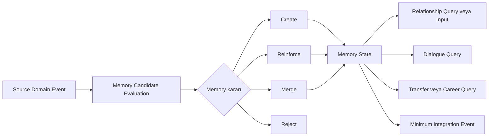
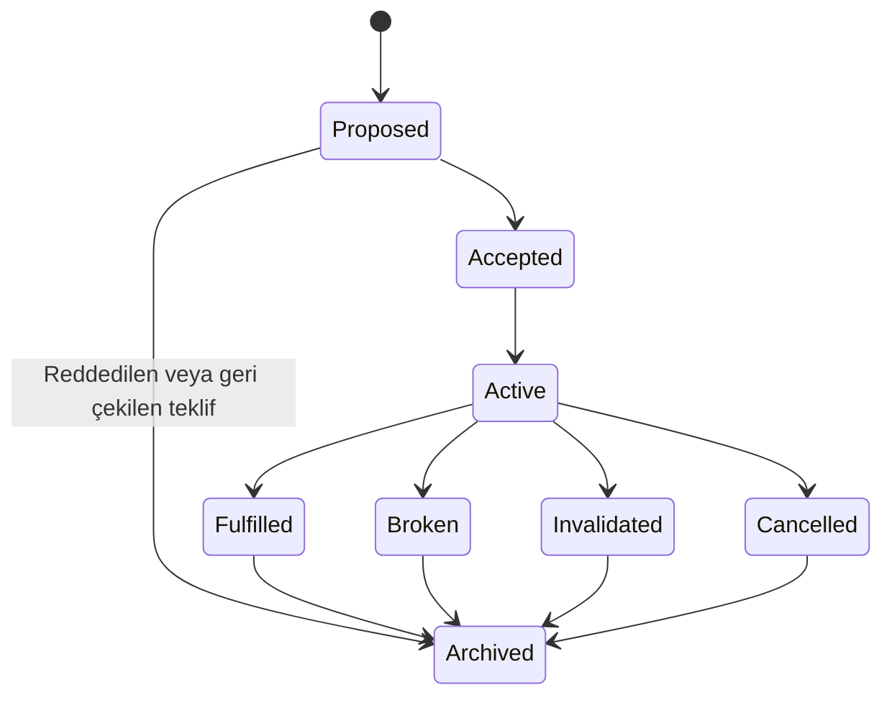

# Hafıza ve Söz Sistemi

**Belge:** `docs/05_MEMORY_AND_PROMISE_SYSTEM.md`  
**Durum:** Kesinleşti  
**Ana referans:** `docs/01_GAME_DESIGN_DOCUMENT.md`  
**Kesin MVP sınırı:** `docs/02_MVP_SCOPE.md`  
**Domain sınırları:** `docs/03_DOMAIN_MODEL.md`  
**Olay ve kural sözleşmeleri:** `docs/04_EVENT_RULE_ENGINE.md`  
**Mimari yön:** `docs/17_TECHNOLOGY_AND_ARCHITECTURE_DECISION.md`  
**İlgili karar günlüğü:** `docs/15_DECISION_LOG.md`

---

## 1. Belgenin Amacı

Bu belge, Football Career Simulator projesinin Hafıza ve Söz sistemine ait teknoloji bağımsız domain kurallarını kesinleştirir.

Sistemin amacı:

- önemli geçmiş olayları ilgili aktörlerin öznel perspektifinden korumak,
- bütün olayların bütün aktörler tarafından hatırlanmasını engellemek,
- hafızaların etkisinin oyun zamanı içinde değişmesini sağlamak,
- benzer veya bağlantılı olayların eski hafızaları pekiştirmesini sağlamak,
- aktörlere verilen sözleri diyalogdan bağımsız bir domain yaşam döngüsüyle izlemek,
- söz koşullarını ölçülebilir ve açıklanabilir hâle getirmek,
- sözlerin yerine getirilmesi, ihlali, geçersizleşmesi veya açık iptali sonucunda gerçek domain sonuçları üretmek,
- teknik direktör ve futbolcu kulüp değiştirdiğinde kişisel sosyal geçmişi korumak,
- save/load sonrasında süre, ilerleme, sonuç ve duplicate korumasını sürdürmek,
- en az 10 sezonluk simülasyonda veri büyümesini kontrol altında tutmaktır.

Bu belge:

- üretim sınıfları veya interface'ler tanımlamaz,
- enum veya kesin veri tipleri üretmez,
- veritabanı tablosu veya serialization şeması belirlemez,
- kesin hafıza etki formülü belirlemez,
- kesin ilişki boyutlarını belirlemez,
- kesin söz türü veya şablon sayısı belirlemez,
- Promise condition DSL'i tasarlamaz,
- medya bilgi yayılım sistemini ayrıntılandırmaz,
- `docs/06_RELATIONSHIP_SYSTEM.md`, `docs/07_DIALOGUE_SYSTEM.md`, `docs/08_TRANSFER_SYSTEM.md` veya `docs/13_SAVE_SYSTEM.md` sorumluluklarını devralmaz.

---

## 2. Referanslar ve Kapsam

Kaynak önceliği:

1. `docs/01_GAME_DESIGN_DOCUMENT.md`
2. `docs/02_MVP_SCOPE.md`
3. `docs/03_DOMAIN_MODEL.md`
4. `docs/04_EVENT_RULE_ENGINE.md`
5. `docs/17_TECHNOLOGY_AND_ARCHITECTURE_DECISION.md`
6. `docs/15_DECISION_LOG.md`

Bu belge, GDD'deki "dünya oyuncunun geçmişini hatırlar" vaadini, MVP kapsamındaki teknik direktör kariyeri için uygulanabilir domain sözleşmelerine dönüştürür.

Kesinleşmiş Domain Model'e göre Relationship, Memory ve Promise, `Social Continuity` bounded context'i içinde yer alır. `MemoryRecord` ve `Promise` ayrı aggregate root adayları ve ayrı yaşam döngüleridir.

### 2.1. Uyumluluk notu

GDD Bölüm 11.4'te söz sistemi, hafıza sisteminin "özel bir alt alanı" olarak ifade edilmiştir. Bu ifade kavramsal yakınlık olarak korunur:

- söz sonuçları güçlü hafıza adayları üretir,
- hafızalar geçmiş sözleri gelecekte tekrar anlamlı hâle getirir,
- iki sistem aynı sosyal devamlılık alanında çalışır.

Ancak bu ifade:

- Promise'ın Memory Record içine gömülmesi,
- Promise state'inin diyalog metninde tutulması,
- Promise'ın bağımsız kimlik ve yaşam döngüsünün kaldırılması

anlamına gelmez.

Bu yaklaşım GDD'yi değiştirmez; kesinleşmiş Domain Model'deki ayrı aggregate ve authoritative ownership sınırını uygular.

---

## 3. Bağlayıcı Tasarım İlkeleri

1. Hafıza, geçmiş olayın kendisi değildir; belirli bir aktörün geçmiş olaya veya konuya ilişkin kalıcı ve öznel kaydıdır.
2. Aynı Source Event farklı aktörlerde farklı Memory Record üretebilir.
3. Her domain olayı hafıza üretmek zorunda değildir.
4. Özel bir olay, bilgi sahibi olmayan aktörlerde hafıza üretemez.
5. Hafıza, Relationship state'inin veya ilişki puanının başka adı değildir.
6. Relationship sisteminin güncel ilişki state'i üzerindeki authoritative ownership'i korunur.
7. Memory sistemi Relationship state'ini doğrudan değiştiremez.
8. Promise, diyalog metninin veya UI state'inin geçici alanı değildir.
9. Promise bağımsız kimliğe, koşula, ilerlemeye ve yaşam döngüsüne sahip domain kaydıdır.
10. Sözün oluşturulması, değiştirilmesi, ilerletilmesi ve sonuçlandırılması yalnız authoritative owner tarafından yapılır.
11. UI, Memory veya Promise state'ini doğrudan değiştiremez.
12. Promise sonucu yalnızca metin veya notification üretmez; domain sonucu üretir.
13. Aynı Promise aynı anda birden fazla terminal sonuca ulaşamaz.
14. Aynı Promise sonucu iki kez uygulanamaz.
15. Aynı Source Event aynı aktör ve aynı memory rule için ikinci kez aynı hafıza etkisini üretemez.
16. Global duvar saati kullanılamaz; bütün süreler oyun zamanına bağlıdır.
17. Rastlantısallık gerekirse açık Simulation Context ve seeded, sürümlenmiş Random Context kullanılır.
18. Hafıza zayıflaması her frame veya her oyun gününde bütün kayıtları kontrolsüz biçimde tarayamaz.
19. Hafıza etkisi, decay, reinforcement, similarity ve conflict formülleri bu belgede kesinleştirilmez.
20. Event sourcing varsayılan persistence modeli değildir.
21. Snapshot güncel state'in ana persistence kaynağıdır.
22. Aktör kulüp değiştirdiğinde kişisel hafızaları sıfırlanmaz.
23. Futbolcu transfer olduğunda kişisel hafızaları korunur; aktif sözleri açık kurallarla değerlendirilir.
24. Teknik direktör işten çıkarıldığında aktif sözler sessizce silinmez.
25. Düşük önem olayları save dosyasını kontrolsüz biçimde büyütemez.
26. Harici üretken yapay zekâ çekirdek Memory veya Promise sistemi için zorunlu bağımlılık olamaz.
27. Başka context'ler Memory Record veya Promise state'ini doğrudan mutate edemez.
28. Context dışı etkiler committed Domain Event, Integration Event, consequence request ve owner-specific Command akışıyla yürür.
29. Handler çalışma sırası gizli bir Promise veya Memory iş kuralı olarak kullanılamaz.
30. Kritik sonuçlar nedenleriyle açıklanabilir olmalıdır.

---

## 4. Terminoloji

### 4.1. Source Event

Memory oluşturulmasına, mevcut Memory'nin pekiştirilmesine veya Promise ilerlemesine neden olabilecek committed domain gerçeğidir.

Örnekler:

- `PlayerSelectedForMatch`
- `PlayerStartedMatch`
- `PlayerLeftOut`
- `PromiseCreated`
- `PromiseFulfilled`
- `PromiseBroken`
- `PromiseInvalidated`
- `ManagerDismissed`
- `TransferCompleted`
- `MatchCompleted`
- `ManagerPubliclySupportedPlayer`

Bir Source Event oluşması otomatik olarak Memory veya Promise değişikliği oluştuğu anlamına gelmez. Authoritative owner kendi kurallarını ayrıca değerlendirir.

### 4.2. Memory Record

Belirli bir aktörün belirli bir olay, aktör veya konu hakkındaki kalıcı ve öznel kaydıdır.

Memory Record:

- hatırlayan aktörü bilir,
- ne veya kim hakkında olduğunu bilir,
- kaynak olay veya kaynak olay soyunu bilir,
- önem ve mevcut etki bilgisi taşır,
- olumlu, olumsuz veya nötr yöne sahip olabilir,
- pekiştirilebilir,
- etkisini kaybedebilir,
- aktif, dormant veya arşivlenmiş olabilir.

### 4.3. Memory Subject

Hafızanın ne hakkında olduğunu gösteren tipli domain konusudur.

Örnekler:

- başka bir aktör,
- teknik direktör,
- futbolcu,
- kulüp,
- söz,
- kadro kararı,
- transfer,
- maç,
- basın açıklaması,
- kariyer olayı,
- ilişki dönüm noktası.

Memory Subject, hatırlayan aktörle aynı aktör olmak zorunda değildir.

### 4.4. Memory Effect

Başka bir sistemin Memory Record'u kendi kuralları içinde değerlendirmesi sonucunda oluşabilecek domain girdisi veya etkidir.

Memory sistemi:

- transfer kararını doğrudan vermez,
- Relationship state'ini doğrudan değiştirmez,
- diyalog seçeneğini doğrudan UI'a yazmaz,
- yönetim güvenini doğrudan değiştirmez.

Bunun yerine query, read model, factor veya minimum integration contract sağlar.

### 4.5. Historical Record

Geçmişte ne olduğunu objektif veya authoritative biçimde kaydeden tamamlanmış domain kaydıdır.

Historical Record ile Memory Record aynı kayıt değildir.

### 4.6. Promise

Bir aktörün başka bir aktöre, belirli bir konu ve koşul altında yerine getirmeyi taahhüt ettiği bağımsız domain kaydıdır.

Promise:

- bağlayıcı tarafları bilir,
- açık bir domain bağlamına sahiptir,
- değerlendirilebilir condition taşır,
- ilerleme state'ine sahiptir,
- terminal sonuca ulaşabilir,
- diyalog bittikten sonra yaşamaya devam eder.

### 4.7. Promise Condition

Sözün yerine getirilmesi için değerlendirilecek ölçülebilir veya açık bağlamsal koşuldur.

Condition yalnız serbest metinden oluşamaz. Player-facing açıklama metni bulunabilir; authoritative değerlendirme yapılandırılmış domain anlamına dayanır.

### 4.8. Promise Progress

Promise Condition'ın gerçekleşme durumunu temsil eden authoritative ilerleme state'idir.

Progress:

- gerçek committed domain olaylarından beslenir,
- aynı event'i iki kez uygulayamaz,
- katkı yapan olayları açıklayabilir,
- terminal sonuçla aynı kavram değildir.

### 4.9. Promise Resolution

Promise'ın bağlayıcı yaşam döngüsünü sonlandıran domain sonucudur.

MVP'de terminal business sonuçları:

- `Fulfilled`
- `Broken`
- `Invalidated`
- `Cancelled`, yalnız açık domain kuralı ve izin verilen süreçle

`Expired`, varsayılan bağımsız terminal business sonucu değildir. Deadline'ın dolması bir değerlendirme tetikleyicisidir; değerlendirme sonucunda Promise `Fulfilled`, `Broken` veya `Invalidated` olabilir.

### 4.10. Memory Candidate

Bir Source Event'in belirli bir aktörde yeni Memory Record oluşturma, mevcut hafızayı pekiştirme, bir özet hafızayla birleştirme veya hiçbir sonuç üretmeme ihtimalini temsil eden geçici değerlendirme girdisidir.

Memory Candidate kalıcı Memory Record olmak zorunda değildir.

---

## 5. Hafıza ve Domain Geçmişi Ayrımı

| Domain History | Memory |
|---|---|
| Geçmişte ne olduğunu kaydeder. | Belirli bir aktörün olayı nasıl hatırladığını temsil eder. |
| Objektif veya authoritative kayıttır. | Öznel, seçici ve perspektife bağlıdır. |
| Olayın taraflarından bağımsız olabilir. | Mutlaka remembering actor'a bağlıdır. |
| Normal oynanışta geçmiş gerçek yeniden yazılmaz. | Etki, pekiştirme ve yaşam döngüsü zamanla değişebilir. |
| Bütün önemli dünya sonuçlarının kaydı olabilir. | Yalnız aktörün bildiği ve hatırlamaya değer bulunan olayları içerir. |
| Bir Source Event tek kayıttır. | Aynı Source Event birden fazla farklı aktör hafızası üretebilir. |

Örnek:

- `PlayerLeftOut`, futbolcunun kadro dışında bırakıldığı authoritative domain gerçeğidir.
- Futbolcunun bunu "haksız ve tutulmayan sözün devamı" olarak hatırlaması Memory Record'dur.
- Takım arkadaşının aynı kararı "adil rekabet" olarak hatırlaması farklı bir Memory Record olabilir.
- Olayı bilmeyen başka bir kulübün futbolcusu Memory Record oluşturamaz.

Memory sistemi bütün domain geçmişinin ikinci bir kopyasını tutamaz.

---

## 6. Hafıza ve İlişki Ayrımı

Relationship:

- aktörler arasındaki güncel sosyal state'tir,
- kendi boyutlarının ve invariant'larının authoritative owner'ıdır,
- mevcut güven, saygı veya diğer kesinleşecek ilişki boyutlarını yönetir.

Memory:

- ilişkinin neden belirli bir durumda olduğunu açıklayan geçmiş girdilerden biridir,
- geçmiş olayın perspektifli kaydını tutar,
- güncel ilişki değerlerini kendi içinde saklamaz,
- Relationship state'ini doğrudan değiştirmez.

Örnek akış:

`PromiseBroken`  
→ ilgili futbolcuda olumsuz Promise Memory adayı  
→ Memory authority Memory Record oluşturur veya pekiştirir  
→ Relationship authority Promise sonucu ve Memory girdilerini değerlendirir  
→ gerekirse kendi `RelationshipChanged` domain sonucunu üretir.

### 6.1. Reputation ayrımı

Reputation:

- daha geniş sosyal, kamusal veya kurumsal değerlendirmedir.

Memory:

- belirli bir aktörün perspektifindeki geçmiş kaydıdır.

Aynı public olay:

- bireysel aktörlerde farklı Memory Record'lar,
- Public Narrative veya Reputation için ayrı domain girdisi

üretebilir.

---

## 7. Söz, Diyalog ve Sözleşme Ayrımı

### 7.1. Promise ve Dialogue

Dialogue:

- sözün talep edildiği, önerildiği, kabul edildiği, reddedildiği veya yeniden müzakere edildiği interaction bağlamıdır,
- metin, seçenek, ton ve sunumdan sorumludur,
- owner-specific Command üretebilir.

Promise:

- interaction sona erdikten sonra yaşamaya devam eder,
- kendi kimliğine, koşuluna, ilerlemesine ve state'ine sahiptir,
- Dialogue state'inin içinde geçici alan olarak tutulamaz.

Diyalog metni veya localization değiştiğinde Promise domain anlamı değişmek zorunda değildir.

### 7.2. Promise ve Contract

Contract:

- hukuki veya kurumsal sözleşme kaydıdır,
- Contract & Registration context'inin authoritative state'idir.

Promise:

- profesyonel, sportif veya kişisel taahhüttür,
- Social Continuity içindeki Promise authority tarafından yönetilir.

Bir kontrat maddesi ile Promise aynı kayıt değildir. Aynı konu hem Contract hem Promise etkisi doğuruyorsa iki authoritative kayıt kendi sınırlarında tutulur ve committed event'lerle koordine edilir.

---

## 8. Veri Sahipliği

Kesinleşmiş bounded context yapısı değiştirilmez.

### 8.1. Memory authoritative ownership

`Social Continuity` bounded context'i içindeki Memory domain alanı, `MemoryRecord` yaşam döngüsünün authoritative owner'ıdır.

Başka context'ler:

- doğrudan Memory Record ekleyemez,
- importance veya influence yazamaz,
- Memory status değiştiremez,
- hafızayı silemez veya pekiştiremez.

Başka context'ler committed domain veya integration event yayınlar. Memory authority kendi kurallarıyla:

- Memory Candidate oluşturur,
- adayı reddeder,
- yeni Memory Record oluşturur,
- mevcut kaydı pekiştirir,
- benzer kayıtları birleştirir,
- influence değerlendirmesi yapar,
- dormant veya archived duruma geçirir,
- compaction işlemi uygular.

### 8.2. Promise authoritative ownership

`Social Continuity` bounded context'i içindeki Promise domain alanı, `Promise` yaşam döngüsünün authoritative owner'ıdır.

Promise authority:

- promisor ve promisee referanslarını doğrular,
- sözün domain bağlamını doğrular,
- Condition'ın değerlendirilebilirliğini doğrular,
- conflict değerlendirmesi yapar,
- Promise kaydını oluşturur,
- kabul ve aktivasyonu yönetir,
- Progress State'i günceller,
- deadline değerlendirmesini yürütür,
- tek terminal sonucu belirler,
- ilgili Domain Event ve minimum Integration Event'leri yayınlar.

Dialogue, Relationship, Transfer, Match, Team Preparation, Board veya Career context'leri Promise state'ini doğrudan değiştiremez.

### 8.3. Relationship ownership

Relationship authority:

- güncel Relationship state'inin tek sahibidir,
- Memory veya Promise'dan factor ve committed sonuç alabilir,
- kendi invariant ve rule set'iyle ilişki sonucu üretir.

### 8.4. UI sınırı

UI:

- hafıza ve sözleri read model üzerinden görüntüler,
- oyuncu kararını Command olarak iletir,
- sonuç ve açıklamaları gösterir.

UI:

- Promise progress artırmaz,
- Promise terminal state seçmez,
- Memory Record oluşturmaz,
- Current Influence değiştirmez,
- deadline'ı doğrudan düzenlemez.

---

## 9. Memory Record Kavramsal Modeli

Bu alanlar kavramsal gereksinimlerdir; fiziksel sınıf, tablo veya serialization şeması değildir.

| Alan | Zorunluluk | Açıklama |
|---|---|---|
| `MemoryId` | Zorunlu | Memory Record'un yaşam döngüsü boyunca değişmeyen kimliği. |
| `RememberingActorId` veya tipli actor referansı | Zorunlu | Hafızayı taşıyan aktör. |
| `SubjectType` | Zorunlu | Hafızanın aktör, kulüp, söz, karar, transfer, maç veya başka bir konu hakkında olduğunu belirtir. |
| `SubjectId` | Koşullu | Subject kimlik taşıyorsa zorunludur. Soyut konu veya özet kategori için uygun konu anahtarı kullanılabilir. |
| `SourceEventId` veya kaynak olay soyu | Zorunlu | Doğrudan kayıtta kaynak event; birleştirilmiş kayıtta korunmuş kaynak lineage veya özet referansı. |
| `MemoryCategory` | Zorunlu | Selection, Promise, Transfer veya diğer kavramsal kategori. |
| `CreatedAtGameTime` | Zorunlu | Hafızanın oluşturulduğu oyun zamanı. |
| `LastReinforcedAtGameTime` | Zorunlu | İlk oluşturulmada creation zamanına eşitlenebilir; son pekiştirme zamanını gösterir. |
| `BaseImportance` | Zorunlu | Olayın oluşturulma anındaki temel önemi. |
| `CurrentInfluence` | Zorunlu | Zaman, pekiştirme ve bağlam sonucundaki mevcut değerlendirme etkisi. |
| `Valence` | Zorunlu | Olumlu, olumsuz veya nötr yönü temsil eder; kesin veri tipi açık bırakılır. |
| `Confidence` | Opsiyonel | Aktörün olay hakkındaki bilgisinin kesinliği ileride gerekirse kullanılır; ilk dikey kesit için zorunlu değildir. |
| `Visibility` veya bilgi kapsamı | Zorunlu kavramsal veri | Olayın private, shared veya public bilgi bağlamını korur; kesin model açık bırakılır. |
| `Status` | Zorunlu | Active, Dormant veya Archived gibi yaşam döngüsü state'i. |
| `ReinforcementCount` | Zorunlu | Kaç geçerli pekiştirme uygulandığını gösterir. |
| `RelatedPromiseId` | Koşullu | Hafıza belirli bir Promise'a bağlıysa kullanılır. |
| `CorrelationId` | Zorunlu | Hafızayı doğuran geniş business zincirini izler. |
| `CausationId` | Zorunlu | Hafıza oluşturma veya pekiştirme sonucunun doğrudan nedenini izler. |
| Kaynak `RuleId` ve `RuleVersion` | Zorunlu | Hafızanın neden üretildiğini ve hangi sürümlü kuralla değerlendirildiğini açıklar. |
| Açıklama nedeni | Zorunlu | Create, reinforce, merge veya reject kararının anlaşılabilir nedenini sağlar. |
| `SchemaVersion` | Zorunlu | Save/load ve migration uyumluluğu için kavramsal sürüm bilgisidir. |

`CurrentInfluence`, Relationship state değildir. Değer persisted edilebilir veya gerekli state'ten deterministik biçimde yeniden hesaplanabilir; kesin persistence tercihi Save System tasarımına bırakılır.

---

## 10. Hafıza Kategorileri

Liste genişletilebilir; sınırsız event type kataloğu değildir.

| Kategori | Oluşabileceği durumlar | Hatırlayabilecek aktörler | Etkileyebileceği sistemler | İlk dikey kesit | Nihai MVP |
|---|---|---|---|---|---|
| Selection Memory | İlk 11, yedek, kadro dışı, tekrar eden forma kararları | İlgili futbolcu, doğrudan etkilenen sınırlı takım aktörleri | Relationship, Dialogue, Promise, Transfer | Zorunlu | Zorunlu |
| Promise Memory | Söz verilmesi, tutulması, ihlali, geçersizleşmesi, iptali | Promisor, promisee ve bilgi sahibi ilgili aktörler | Relationship, Dialogue, Transfer, Career | Zorunlu | Zorunlu |
| Trust Memory | Aktörün güvenilir veya güvenilmez davranışları | Doğrudan taraflar | Relationship, Dialogue, Transfer | Sınırlı | Zorunlu |
| Disciplinary Memory | Ceza, affetme, uyarı, tutarsız disiplin kararı | İlgili futbolcu, teknik direktör, bilgi sahibi takım aktörleri | Relationship, Dialogue, Team Dynamics | Zorunlu değil | Zorunlu sınırlı kapsam |
| Transfer Memory | Satış talebi, reddedilen talep, transfer, geri dönüş, başarısız görüşme | Futbolcu, teknik direktör, ilgili kulüp aktörleri | Transfer, Career, Dialogue, Relationship | Zorunlu değil | Zorunlu |
| Public Support or Criticism Memory | Basın önünde koruma, eleştiri veya suçlama | Açıklamanın hedefi ve bilgiye erişen aktörler | Relationship, Public Narrative, Reputation | Tek örnek yeterli | Zorunlu sınırlı kapsam |
| Career Memory | İşten çıkarılma, işe alınma, önemli başarı, kriz yönetimi | Teknik direktör, ilgili yönetim aktörleri, doğrudan etkilenen kişiler | Manager Career, Board, Offers | Zorunlu değil | Zorunlu |
| Club History Memory | Eski kulübe dönüş, kulüpten ayrılma biçimi, eski kulüple karşılaşma | Teknik direktör, futbolcular ve ilgili kulüp aktörleri | Career, Board, Dialogue, Narrative | Zorunlu değil | Zorunlu |
| Match or Performance Memory | Kritik maç, final, olağanüstü veya ağır sonuç | Doğrudan katılımcılar | Career, Relationship, Narrative | Sınırlı örnek | Önemli olaylarla sınırlı |
| Relationship Milestone Memory | Barışma, kalıcı kırılma, uzun süreli destek, önemli çatışma | İlişkinin tarafları | Relationship, Dialogue, Career | Zorunlu değil | Sınırlı ve özetlenebilir |

Her maç, her kadro kararı veya her Relationship değişikliği ayrı kalıcı Memory Record üretmek zorunda değildir.

---

## 11. Hafıza Oluşturma

Memory oluşturma değerlendirmesi en az şu girdileri kullanabilir:

- Source Event kategorisi,
- domain importance,
- remembering actor'ın olayla doğrudan ilişkisi,
- Memory Subject,
- aktörün olay hakkında bilgi sahibi olup olmadığı,
- olayın public veya private olması,
- mevcut Relationship bağlamı,
- kişilik ve motivasyon girdileri,
- olayın beklenen veya beklenmeyen oluşu,
- aktif Promise bağlantısı,
- olayın tekrar niteliği,
- benzer mevcut Memory Record'lar,
- kariyer dönüm noktası olup olmadığı.

Kesin matematiksel formül bu belgede belirlenmez.

### 11.1. Bağlayıcı değerlendirme akışı

1. Committed Source Event alınır.
2. Event schema ve actor referansları doğrulanır.
3. Olayı bilebilecek aktörler belirlenir.
4. Her uygun aktör için ayrı Memory Candidate değerlendirilir.
5. Aday şu sonuçlardan birine ulaşır:
   - Create,
   - Reinforce,
   - Merge,
   - Reject.
6. Sonuç Memory authority tarafından uygulanır.
7. Duplicate completion identity kaydedilir.
8. Açıklama, causation, correlation ve rule version korunur.
9. Gerekiyorsa minimum Integration Event yayınlanır.

`Reject`, teknik hata değildir. Olayın aktör için hafıza üretmeye değer bulunmadığını veya aktörün olay hakkında bilgi sahibi olmadığını ifade edebilir.

---

## 12. Önem ve Mevcut Etki

`BaseImportance` ve `CurrentInfluence` farklı kavramlardır.

### 12.1. Base Importance

Olayın hafıza oluşturulduğu andaki başlangıç önemidir.

Etkileyebilecek girdiler:

- olay kategorisi,
- olayın kariyer açısından ağırlığı,
- söz bağlantısı,
- kamuya açıklık,
- beklenmeyen oluş,
- remembering actor'ın doğrudan etkilenmesi,
- olayın tekrarı,
- olay anındaki Relationship bağlamı.

### 12.2. Current Influence

Hafızanın başka sistemler tarafından mevcut oyun zamanında değerlendirilirken taşıdığı etkidir.

Etkileyebilecek girdiler:

- Base Importance,
- geçen oyun zamanı,
- kategoriye bağlı decay davranışı,
- reinforcement sayısı ve yakınlığı,
- sonradan oluşan telafi edici olaylar,
- benzer yeni olaylar,
- Promise sonucu,
- kariyer dönüm noktası niteliği,
- aktör kişiliği veya motivasyonu.

Kesin aralık ve formül açık bırakılır.

Current Influence:

- zamanla sıfıra yaklaşabilir,
- dormant hâle gelebilir,
- yeni olaylarla tekrar güçlenebilir,
- kritik tarihsel olaylarda tamamen yok olmak zorunda değildir.

---

## 13. Zamanla Zayıflama

1. Her Memory aynı hızda zayıflamaz.
2. Söz ihlali, işten çıkarılma, önemli transfer ve kariyer dönüm noktaları uzun ömürlü olabilir.
3. Düşük önem günlük selection veya performans olayları daha hızlı etkisini kaybedebilir.
4. Decay yalnız oyun zamanı üzerinden değerlendirilir.
5. Duvar saati, frame delta veya gerçek dünya bekleme süresi kullanılamaz.
6. Her oyun gününde bütün Memory Record'ları taramak varsayılan çözüm değildir.
7. Lazy evaluation, due evaluation veya kontrollü dönemsel batch evaluation kullanılabilir.
8. Memory query sırasında deterministic güncelleme gerekebilir.
9. Büyük zaman atlamasında aradaki decay etkisi atlanamaz.
10. Save/load aynı oyun zamanı için farklı influence sonucu üretemez.
11. Decay ve reinforcement aynı simulation step içinde oluşursa owner tarafından açık ve deterministik conflict policy uygulanır.
12. Kesin algoritma ve performans yaklaşımı teknik tasarım veya spike sırasında doğrulanır.

Decay, hafızanın fiziksel olarak silinmesi anlamına gelmez.

---

## 14. Pekiştirme ve Yeniden Etkinleşme

Bağlantılı yeni olaylar mevcut Memory Record'u pekiştirebilir.

Örnekler:

- aynı futbolcunun tekrar kadro dışı bırakılması,
- benzer ikinci sözün tutulmaması,
- eski kulüple yeniden karşılaşma,
- daha önce desteklenen futbolcunun tekrar korunması,
- geçmiş eleştiriye benzer public açıklama,
- eski Promise sonucunun yeni transfer görüşmesinde tekrar anlam kazanması.

Pekiştirme:

- Current Influence'u artırabilir,
- LastReinforcedAtGameTime bilgisini güncelleyebilir,
- ReinforcementCount'u artırabilir,
- açıklama geçmişi özeti ekleyebilir,
- ayrı yeni bir Memory Record da oluşturabilir.

Tek bir Memory Record sınırsız ayrıntı listesine dönüşemez.

Dormant veya Archived hafızanın yeniden etkili hâle gelmesi:

- açık bir rule evaluation gerektirir,
- kaynak Reinforcement Event'i bilir,
- duplicate korumasına sahiptir,
- eski kaydı sessizce yeniden yazmaz,
- açıklama ve rule version üretir.

Archived Memory'nin doğrudan ve nedensiz şekilde Active yapılması yasaktır.

---

## 15. Birleştirme ve Duplicate Kontrolü

### 15.1. Aynı Source Event

Aynı Source Event:

- aynı remembering actor,
- aynı Memory Rule,
- aynı semantik etki

için ikinci kez sonuç üretemez.

Aday completion identity:

`SourceEventId + RememberingActorId + MemoryRuleId`

### 15.2. Benzer fakat farklı olaylar

Benzer event'ler:

- ayrı kritik Memory Record olarak tutulabilir,
- mevcut kaydı pekiştirebilir,
- kategori bazlı özet Memory'ye birleştirilebilir.

Karar Memory authority'ye aittir.

### 15.3. Birleştirme ilkeleri

- Kritik tekil olaylar bağımsız kayıt olarak korunabilir.
- Düşük önem tekrarlı olaylar özetlenebilir.
- Merge, kaynak nedenleri tamamen görünmez hâle getiremez.
- Özet Memory en az kaynak kategorisini, dönemini, tekrar sayısını ve önemli kaynak referanslarını korur.
- Compaction sonrası açıklanabilirlik kaybolamaz.
- Kesin similarity algoritması açık bırakılır.

### 15.4. Pekiştirme duplicate koruması

Aday completion identity:

`MemoryId + ReinforcementEventId + ReinforcementRuleId`

Aynı Reinforcement Event ikinci kez influence artışı üretemez.

---

## 16. Bilgi ve Görünürlük Sınırı

Bir aktör yalnızca bilgi sahibi olabileceği olayları hatırlayabilir.

Değerlendirilecek bilgi kaynakları:

- doğrudan yaşanan olay,
- yüz yüze görüşme,
- doğrudan Promise tarafı olma,
- kamuya açık basın açıklaması,
- kulüp içinde yetki gereği bilinen karar,
- kendisine iletilen bilgi,
- ayrı bir bilgi yayılım olayı.

### 16.1. Bağlayıcı kurallar

- Özel bir görüşme bütün dünya aktörlerinde Memory oluşturamaz.
- Başka aktörün private Promise görüşmesi otomatik olarak bilinemez.
- Kulüp içi özel karar yalnız yetkili veya bilgilendirilmiş aktörlerde değerlendirilebilir.
- Public olay daha geniş aktör grubuna ulaşabilir; ancak public olması bütün aktörlerin otomatik olarak güçlü Memory oluşturduğu anlamına gelmez.
- Bilgi yayılımı Memory sisteminin gizli yan etkisi olamaz.
- Bilginin başka aktöre ulaşması ayrı committed event veya ilgili context mekanizması gerektirir.
- Memory sistemi private bilgiyi Transfer, Dialogue veya Narrative query'lerinde sızdıramaz.
- Kesin public/private yayılım modeli bu belgede tasarlanmaz.

---

## 17. Hafıza Yaşam Döngüsü

Kavramsal state'ler:

### Active

- güncel değerlendirmelerde kullanılabilir,
- Current Influence anlamlı seviyededir,
- reinforcement alabilir.

### Dormant

- normal sorgularda etkisi düşük veya devre dışıdır,
- tarihsel kayıt olarak korunur,
- bağlantılı yeni olayla açık rule sonucu yeniden etkinleşebilir.

### Archived

- aktif değerlendirme setinden çıkarılmıştır,
- önemli geçmiş veya özet kaydı olarak korunabilir,
- normal akışta doğrudan Active yapılamaz,
- yeniden etkinleşme açık ve audit edilebilir rule sonucu gerektirir.

### Removed

Yalnız:

- bozuk teknik duplicate,
- kişisel veri politikası gerektiren özel durum,
- migration tarafından oluşturulmuş geçersiz teknik kayıt

gibi veri bütünlüğünü bozmayan teknik durumlarda değerlendirilebilir.

Normal gameplay sonucu oluşmuş önemli Memory Record fiziksel olarak sessizce silinemez.

Kavramsal akış:

`Active → Dormant → Archived`

Ek olarak:

- `Active → Archived`, açık compaction veya kategori kuralıyla mümkün olabilir.
- `Dormant → Active`, reinforcement rule ile mümkün olabilir.
- `Archived → yeniden etkili durum`, yalnız açık reactivation veya yeni bağlantılı Memory oluşturma kuralıyla mümkündür.

---

## 18. Hafıza Arşivleme ve Veri Büyümesi

### 18.1. Aktif state

Aktif sorgularda tutulması gerekenler:

- etkili Memory Record'lar,
- yakın dönem reinforcement state'i,
- aktif Promise bağlantılı hafızalar,
- yakın gelecekte tekrar kullanılma ihtimali yüksek kayıtlar.

### 18.2. Önemli geçmiş

Özet veya arşiv olarak korunması gerekenler:

- yerine getirilmiş veya ihlal edilmiş kritik Promise'lar,
- işten çıkarılma,
- önemli transferler,
- kariyer dönüm noktaları,
- eski kulüp ve önemli aktör ilişkileri,
- uzun ömürlü olumlu veya olumsuz Memory'ler.

### 18.3. Özetlenebilir geçmiş

- tekrarlı kadro dışı kalma,
- düşük önem selection olayları,
- küçük performans olayları,
- tekrar eden küçük olumlu veya olumsuz etkileşimler,
- aynı kategori içinde birbirine çok benzeyen düşük önem olayları.

### 18.4. Silinebilecek teknik veri

Güvenli retention sonrasında:

- reddedilmiş geçici Memory Candidate'lar,
- UI notification kuyruğu,
- kısa süreli debug trace,
- başarıyla tamamlanmış geçici processing kayıtları,
- yeniden üretilebilir geçici projection cache'leri.

Kesin retention süreleri ve compaction limitleri `docs/13_SAVE_SYSTEM.md` ile performans testlerine bırakılır.

Aktör emekli olduğunda Memory kayıtları otomatik silinmez.

---

## 19. Promise Kavramsal Modeli

| Alan | Zorunluluk | Açıklama |
|---|---|---|
| `PromiseId` | Zorunlu | Promise'ın değişmeyen kimliği. |
| `PromisorActorId` | Zorunlu | Sözü veren geçerli aktör referansı. |
| `PromiseeActorId` | Zorunlu | Sözü alan geçerli aktör referansı. |
| `PromiseType` veya family reference | Zorunlu | Promise'ın domain anlamını gösterir; kesin katalog açık bırakılır. |
| Domain context veya scope reference | Zorunlu | İlgili kulüp, sezon, transfer dönemi, takım veya başka bağlamı belirtir. |
| `SubjectId` | Koşullu | Promise belirli futbolcu, rol, transfer veya başka entity hakkındaysa kullanılır. |
| `CreatedAtGameTime` | Zorunlu | Promise kaydının oluşturulduğu oyun zamanı. |
| `EffectiveFromGameTime` | Zorunlu | Bağlayıcı değerlendirme döneminin başlangıcı. |
| `DeadlineGameTime` | Koşullu | Son tarihli Promise'larda zorunludur. |
| `ConditionDefinition` | Zorunlu | Sürüm bilgili, ölçülebilir veya açık bağlamsal condition. |
| Condition version | Zorunlu | Aktif Promise'ın koşul anlamının sessizce değişmesini engeller. |
| `ProgressState` | Zorunlu | Condition değerlendirmesi için gerekli güncel ilerleme. |
| `Status` | Zorunlu | Proposed, Accepted, Active veya terminal/archived state. |
| `ResolutionReason` | Terminal state'te zorunlu | Fulfilled, Broken, Invalidated veya Cancelled nedenini açıklar. |
| `ResolvedAtGameTime` | Terminal state'te zorunlu | Terminal kararın oyun zamanı. |
| `SourceDialogueOrDecisionId` | Koşullu | Promise diyalog veya Decision Request üzerinden oluştuysa kaynak referans. |
| İlgili event katkı özeti | Zorunlu kavramsal veri | Progress ve resolution açıklanabilirliği için kullanılır. |
| Conflict references | Koşullu | Bilinen çelişkili Promise veya kurumsal yükümlülükler varsa. |
| `RelatedMemoryIds` | Türetilmiş veya koşullu | Promise state'inin sahibi değildir; gerektiğinde query veya referans olarak kullanılır. |
| `CausationId` | Zorunlu | Promise state değişikliğinin doğrudan nedeni. |
| `CorrelationId` | Zorunlu | Geniş interaction veya business process zinciri. |
| Kaynak `RuleId` ve `RuleVersion` | Zorunlu | Progress veya resolution kararının kural sürümü. |
| `SchemaVersion` | Zorunlu | Save/load ve migration uyumluluğu. |

Condition oluşturulduktan sonra aynı Promise üzerinde sessizce değiştirilemez.

Değişiklik gerekiyorsa:

- açık yeniden müzakere Command'ı,
- eski Promise için açık domain sonucu,
- gerekiyorsa yeni Promise kaydı

oluşturulur.

---

## 20. Söz Aileleri

Kesin Promise type sayısı ve isim kataloğu açık bırakılır.

| Söz ailesi | Örnek domain anlamı | Ölçülebilirlik | Progress kaynakları | Fulfillment yönü | Breach yönü | İlk dikey kesit |
|---|---|---|---|---|---|---|
| Playing Time Promise | Belirli dönemde yeterli maç süresi verme | Count veya percentage based | `PlayerParticipatedInMatch`, maç dakikası özeti, dönem tamamlanması | Tanımlı eşik karşılanır | Deadline'da eşik karşılanmaz | Zorunlu |
| Starting Opportunity Promise | Belirli sayıda ilk 11 fırsatı verme | Count based | `PlayerStartedMatch`, uygun maç fırsatları | Gerekli başlangıç fırsatı verilir | Geçerli fırsatlar varken verilmez | Zorunlu |
| Squad Role Promise | Belirli takım rolünde değerlendirme | State ve opportunity based | Squad role değişimi, selection olayları | Taahhüt edilen rol uygulanır | Açıkça çelişen rol kalıcılaşır | Nihai MVP |
| Transfer or Sale Promise | Teklifleri değerlendirme veya satışa izin verme | Event ve state based | Transfer offer, review, acceptance/rejection, window close | Tanımlı transfer işlemi gerçekleştirilir | Kontrol edilebilir koşullarda taahhüt yok sayılır | Nihai MVP |
| Contract Discussion Promise | Belirli tarihe kadar görüşme başlatma | Date ve event based | `ContractNegotiationStarted`, deadline | Görüşme zamanında başlar | Kontrol edilebilir durumda başlamaz | Nihai MVP |
| Development Opportunity Promise | Antrenman, rol veya maç fırsatı sağlama | Composite | Training plan, selection, role event'leri | Tanımlı fırsatlar sağlanır | Yeterli fırsat verilmez | Zorunlu değil |
| Disciplinary or Behavioral Promise | Belirli davranış karşılığında ceza veya destek yaklaşımı | Event ve state based | Disciplinary event, behavior event | Açık koşul uygulanır | Tutarsız veya aksi karar verilir | Zorunlu değil |
| Support or Protection Promise | Oyuncuyu belirli kriz veya public bağlamda destekleme | Event occurrence based | Public statement, board veya disciplinary interaction | Taahhüt edilen destek olayı gerçekleşir | Gerekli anda aksi davranılır veya sessiz kalınır | Tek örnek değerlendirilebilir |

"Düzenli oynatma" gibi belirsiz player-facing metinler, authoritative Condition içinde ölçülebilir veya fırsat tabanlı anlamla desteklenmelidir.

---

## 21. Söz Yaşam Döngüsü

Kavramsal state'ler:

### Proposed

Söz henüz bağlayıcı biçimde kabul edilmemiştir.

### Accepted

Taraflar Promise'ın bağlayıcı anlamını kabul etmiştir; EffectiveFromGameTime bekleniyor olabilir.

### Active

Condition ve Progress değerlendirmesi yürürlüktedir.

### Fulfilled

Condition geçerli kurallara göre karşılanmıştır.

### Broken

Condition, promisor'ın sorumluluğu ve geçerli bağlam dikkate alınarak karşılanmamıştır.

### Invalidated

Promise, tarafların kontrolü veya Promise'ın geçerli domain bağlamı dışındaki bir nedenle uygulanamaz hâle gelmiştir.

### Cancelled

Yalnız izin verilen açık domain süreciyle, gerekli taraf onayı ve sonuçları üretilerek iptal edilmiştir.

### Archived

Terminal veya kapanmış Promise aktif sorgu setinden çıkarılmış fakat geçmiş olarak korunmuştur.

### 21.1. Geçerli temel geçişler

- `Proposed → Accepted`
- `Accepted → Active`
- `Active → Fulfilled`
- `Active → Broken`
- `Active → Invalidated`
- `Active → Cancelled`
- terminal state → `Archived`

### 21.2. Geçersiz geçişler

- `Fulfilled → Active`
- `Broken → Fulfilled`
- `Invalidated → Broken`
- `Archived → Active`
- `Cancelled → Active`
- aynı Promise için iki terminal transition

### 21.3. Proposal reddi

`RejectPromise`, kabul edilmiş Promise'ın ihlali değildir.

Reddedilen bir teklif:

- Active Promise oluşturmaz,
- Relationship veya Memory sonucu üretebilir,
- proposal geçmişi gerekiyorsa archive/audit olarak korunabilir.

---

## 22. Söz Koşulları

Desteklenebilecek kavramsal condition türleri:

### Count Based

Belirli sayıda olay veya fırsat.

Örnek: Üç maçta ilk 11 başlatma.

### Percentage Based

Tanımlı dönem veya uygun fırsatlar içindeki oran.

Örnek: Uygun olduğu lig maçlarının belirli bölümünde oynatma.

### Date Based

Belirli oyun tarihine kadar gerçekleşmesi gereken sonuç.

Örnek: Transfer dönemi bitmeden sözleşme görüşmesi başlatma.

### Event Occurrence Based

Belirli committed domain olayının gerçekleşmesi.

Örnek: Kamuya açık destek açıklaması yapma.

### State Based

Belirli authoritative state'in oluşması veya korunması.

Örnek: Futbolcunun tanımlı squad role içinde bulunması.

### Opportunity Based

Promisor'ın kontrol edebildiği gerçek fırsatların değerlendirilmesi.

Örnek: Futbolcu uygun ve cezalı değilken oynatma fırsatı verilmesi.

### Composite Condition

Birden fazla condition'ın açık AND, OR veya aşamalı ilişkisidir.

Kesin expression dili veya DSL bu belgede tasarlanmaz.

### 22.1. Condition gereksinimleri

- Domain verileriyle değerlendirilebilir olmalıdır.
- Yalnız serbest metin olarak tutulamaz.
- Condition version bilgisi taşımalıdır.
- Promisor'ın kontrol alanını tanımlayabilmelidir.
- İlgili dönem veya bağlamı açık olmalıdır.
- Progress katkılarının nasıl hesaplanacağını açıklayabilmelidir.
- Terminal değerlendirme kuralıyla uyumlu olmalıdır.
- Oluşturulduktan sonra sessizce değiştirilemez.
- Bilinmeyen veya desteklenmeyen condition version tahmin edilerek çalıştırılamaz.

---

## 23. Söz İlerlemesi

Promise Progress:

- committed domain olaylarından beslenir,
- UI tarafından değiştirilemez,
- aynı event'i iki kez uygulayamaz,
- condition'a özgü ölçümleri korur,
- açıklanabilir katkı özeti üretir.

Örnek girdiler:

- `PlayerSelectedForMatch`
- `PlayerStartedMatch`
- `PlayerParticipatedInMatch`
- `PlayerLeftOut`
- `ContractNegotiationStarted`
- `TransferOfferReceived`
- `TransferOfferReviewed`
- `ManagerPubliclySupportedPlayer`
- `SeasonCompleted`
- ilgili injury veya suspension sonucu
- ilgili transfer veya employment sonucu

Progress kavramsal olarak:

- sayı,
- oran,
- tamamlanmış aşama,
- kullanılan fırsat,
- kaçırılan geçerli fırsat,
- değerlendirme sonucu

tutabilir.

Kesin fiziksel veri tipi belirlenmez.

### 23.1. Progress idempotency

Aday completion identity:

`PromiseId + ProgressEventId + ProgressRuleId`

Aynı Source Event:

- Progress değerini ikinci kez artırmaz,
- kaçırılan fırsatı ikinci kez saymaz,
- aynı explanation katkısını ikinci kez eklemez.

### 23.2. Terminale erken ulaşma

Condition açık biçimde tamamlandıysa Promise deadline beklenmeden `Fulfilled` olabilir.

Erken `Broken` sonucu yalnız:

- condition'ın artık karşılanmasının domain açısından imkânsız olması,
- açık ve geri alınamaz ihlal olayı,
- Promise type'a özgü kural

bulunuyorsa üretilebilir.

---

## 24. Deadline ve Scheduled Evaluation

Deadline içeren Promise'larda:

1. Deadline Promise authoritative state'inin parçasıdır.
2. Event & Rule Evaluation due index veya ScheduledEvaluation desteği sağlar.
3. Scheduler, deadline'ın ikinci authoritative sahibi değildir.
4. Deadline oyun zamanına bağlıdır.
5. Büyük zaman atlamalarında hiçbir due item atlanamaz.
6. Due noktasında Promise Condition son kez değerlendirilir.
7. Sonuç `Fulfilled`, `Broken` veya `Invalidated` olabilir.
8. Aynı deadline iki kez terminal sonuç üretemez.
9. Save/load sonrasında deadline ve ScheduledEvaluation ilişkisi korunur.
10. Notification kaybolsa bile domain deadline çalışmaya devam eder.
11. Deadline ile aynı zamandaki maç, dismissal veya transfer olayları deterministik simulation ordering ile işlenir.
12. Handler sırası gizli business rule olamaz; aynı-step conflict policy açık olmalıdır.

Aday resolution identity:

`PromiseId + ResolutionKind`

Aynı ScheduledEvaluation ikinci kez teslim edilse bile terminal state değişmez.

### 24.1. Yaklaşan deadline bildirimi

`PromiseDeadlineApproaching`:

- domain veya integration event kategorisi olabilir,
- player-facing Notification'dan ayrıdır,
- Notification eşiği açık bırakılır,
- zamanı durdurma kararı Decision Flow interruption policy'ye aittir.

---

## 25. Süresiz ve Bağlamsal Sözler

Her Promise kesin takvim tarihine sahip olmak zorunda değildir.

Desteklenebilecek bağlamlar:

- sezon sonu değerlendirmesi,
- sonraki transfer dönemi,
- futbolcu kulüpte ve uygun olduğu sürece,
- belirli fırsat sayısı oluşana kadar,
- belirli domain event gerçekleşene kadar,
- ilgili görev veya employment devam ettiği sürece.

Süresiz Promise:

- kontrolsüz biçimde sonsuza kadar Active kalamaz,
- açık reevaluation trigger'ına sahip olmalıdır,
- invalidation bağlamını tanımlamalıdır,
- season, transfer window, employment veya actor lifecycle checkpoint'lerinde değerlendirilmelidir,
- save/load sonrasında reevaluation state'ini korumalıdır.

Kesin reevaluation aralıkları Promise type tasarımına bırakılır.

---

## 26. Kısmi İlerleme ve Tolerans

Promise yalnız ikili progress state'ine indirgenmez.

### 26.1. Progress ile resolution ayrımı

- Progress gerçek ölçümleri tutar.
- Fulfilled veya Broken kararı rule evaluation sonucudur.
- Yüzde 80 progress otomatik olarak "yüzde 80 tutulmuş söz" anlamına gelmez.
- Player-facing açıklama, gerçek ilerlemeyi gösterebilir.

### 26.2. Tolerans

Bazı Promise type'larda tolerans bulunabilir.

Tolerans girdileri:

- beklenmeyen uzun süreli sakatlık,
- suspension,
- futbolcunun uygun olmaması,
- transfer,
- oyuncunun kendi talebiyle ayrılması,
- kulübün kurumsal olarak fırsatı engellemesi,
- sezon veya turnuva bağlamının sona ermesi,
- promisor'ın kontrol alanı.

Tolerans:

- gizli rastlantıya dayanamaz,
- handler sırasına bağlı olamaz,
- açıklanabilir olmalıdır,
- Promise type ve rule version ile sürümlenmelidir.

Kesin tolerans değerleri açık bırakılır.

---

## 27. Fulfillment, Breach ve Invalidation

### 27.1. Fulfilled

Promise Condition geçerli değerlendirme kuralına göre karşılanmıştır.

Sonuç:

- terminal state üretir,
- olumlu veya nötr Memory Candidate üretebilir,
- Relationship authority için değerlendirme girdisi sağlayabilir,
- Dialogue, Transfer ve Career projection'larını etkileyebilir.

### 27.2. Broken

Promise Condition karşılanmamış ve başarısızlık promisor'ın sorumluluk alanında değerlendirilmiştir.

Broken:

- "deadline doldu" ile eş anlamlı değildir,
- dış koşullar ve geçerli fırsatlar incelenmeden üretilemez,
- olumsuz Memory Candidate üretebilir,
- Relationship, player concern, transfer request veya career sonucu için girdi sağlayabilir,
- açık ResolutionReason taşımalıdır.

### 27.3. Invalidated

Promise uygulanamaz veya anlamsız hâle gelmiştir.

Örnekler:

- uzun süreli sakatlık,
- futbolcunun transferi,
- futbolcunun emekliliği,
- teknik direktörün işten çıkarılması,
- ilgili kulüp bağlamının sona ermesi,
- kulübün taahhüt edilen kararı artık verememesi,
- ilgili sezon veya turnuvanın sona ermesi.

Invalidated:

- otomatik Fulfilled değildir,
- otomatik Broken değildir,
- nedensiz biçimde Promise'ı yok etmez,
- Memory ve Relationship sistemlerinin bağlama göre farklı değerlendirme yapmasına izin verir.

### 27.4. Expiration yaklaşımı

Deadline dolması:

- bir Scheduled Evaluation tetikler,
- Condition'ı değerlendirir,
- gerçek terminal anlamı seçer.

Bu nedenle MVP'de ayrı `Expired` business terminal state'i kullanılmaz.

---

## 28. İptal ve Yeniden Müzakere

Aktif Promise sessizce silinemez veya düzenlenemez.

### 28.1. İptal

Cancellation:

- açık diyalog veya domain kararı gerektirir,
- Promise type'a göre promisee kabulü gerektirebilir,
- ayrı domain sonucu üretir,
- Memory ve Relationship etkisi oluşturabilir,
- eski Promise geçmişini korur.

`Cancelled`, "hiç söz verilmemiş" anlamına gelmez.

### 28.2. Yeniden müzakere

Renegotiation:

1. Açık request veya Command ile başlar.
2. Mevcut Promise ve Condition görünürdür.
3. Tarafların kararı alınır.
4. Eski Promise sessizce değiştirilmez.
5. Eski Promise:
   - Cancelled,
   - Invalidated,
   - veya type'a özgü başka izin verilen terminal sonuca
   ulaşabilir.
6. Yeni Condition için yeni Promise oluşturulur.
7. Correlation ve previous-promise referansı korunur.

Kesin diyalog seçenekleri `docs/07_DIALOGUE_SYSTEM.md` sorumluluğundadır.

---

## 29. Çelişen Sözler

Örnek çatışmalar:

- aynı pozisyon için iki futbolcuya düzenli ilk 11 sözü,
- futbolcuya satış izni sözü verirken yönetimin satmama kararı,
- bir oyuncuya belirli rolü garanti ederken başka oyuncuya aynı özel rolü verme,
- oynama süresi taahhüdü ile sakat veya uygun olmayan kadro planı,
- birbirini dışlayan iki public destek taahhüdü.

### 29.1. Bağlayıcı conflict kuralları

- Promise oluşturulurken bilinen conflict değerlendirmesi yapılır.
- Bütün conflict'ler otomatik olarak yasaklanmak zorunda değildir.
- Oyuncuya bilinen risk gösterilebilir.
- Conflict gizlenemez veya yok sayılamaz.
- Conflict handler sırasına göre çözülemez.
- Promise authority conflict değerlendirme sonucu üretir.
- Gerekirse `PromiseConflictDetected` Domain Event'i veya Decision Request oluşturulur.
- Conflict, ileride gerçek progress ve resolution sonuçları üretir.
- Kesin conflict puanlama formülü açık bırakılır.

### 29.2. Birden fazla aktör

MVP temel modeli:

- bir promisor,
- bir promisee,
- bir Promise kaydıdır.

Grup sözü veya çoklu aktör taahhüdü:

- ayrı Promise kayıtları,
- ortak correlation veya gelecekte Promise Group kimliği

ile genişletilebilir.

Promise Group'ın kesin modeli MVP için zorunlu değildir ve açık bırakılır.

---

## 30. Kulüp Değişimi ve İşten Çıkarılma

Teknik direktör kulüp değiştirdiğinde:

- Manager kimliği korunur,
- kişisel Memory Record'ları korunur,
- eski futbolculara ilişkin önemli Memory'ler korunur,
- eski kulüp ve yönetim aktörlerine ilişkin geçmiş korunur,
- eski kulübün authoritative kurumsal state'i yeni kulübe taşınmaz.

### 30.1. Aktif Promise değerlendirmesi

Her aktif Promise:

- Promise type,
- domain context,
- promisor kontrol alanı,
- employment termination reason,
- deadline ve mevcut progress

üzerinden ayrı değerlendirilir.

Olası sonuçlar:

- `Invalidated`: görev sona erdiği için Promise artık uygulanamıyorsa,
- `Broken`: promisor'ın kontrolündeki ihlal dismissal öncesinde kesinleşmişse veya type'a özgü açık kural varsa,
- `Fulfilled`: condition dismissal öncesinde tamamlanmışsa,
- Active kalmama: eski kulüp bağlamlı Promise yeni kulübe taşınmaz.

Bütün Promise'lar otomatik olarak Invalidated veya Broken yapılamaz.

### 30.2. Dismissal aynı simulation step'teyse

Promise resolution ile `ManagerDismissed` aynı simulation step içindeyse:

- logical event ordering açık olmalıdır,
- committed state ve occurred game time dikkate alınır,
- last-handler-wins kullanılamaz,
- owner conflict policy tek sonuç üretir,
- save/load aynı sonucu yeniden üretir.

---

## 31. Futbolcu Transferi, Serbest Kalma ve Emeklilik

### 31.1. Transfer

Futbolcu transfer olduğunda:

- Player kimliği korunur,
- kişisel Memory Record'ları korunur,
- eski teknik direktör ve kulübe ilişkin önemli Memory'ler korunur,
- eski Relationship geçmişi sessizce sıfırlanmaz,
- aktif Promise'lar context ve Promise type'a göre değerlendirilir.

Olası Promise sonuçları:

- transfer nedeniyle `Invalidated`,
- transfer öncesinde açık ihlal varsa `Broken`,
- transfer işlemi Promise Condition'ı karşılıyorsa `Fulfilled`.

### 31.2. Serbest kalma

Contract sona erdiğinde:

- Player kimliği ve Memory'leri korunur,
- kulüp bağlamlı Promise'lar reevaluation alır,
- hukuki Contract sonucu Promise sonucunun yerine geçmez,
- Promise authority kendi terminal kararını üretir.

### 31.3. Emeklilik

Futbolcu emekli olduğunda:

- kişisel önemli Memory geçmişi otomatik silinmez,
- aktif Promise'lar retirement nedeni üzerinden değerlendirilir,
- uygulanamaz sözler genellikle Invalidated olabilir,
- emeklilikten önce kesinleşmiş breach kaybolmaz,
- tarihsel referanslar korunur.

Geçmiş Promise ve Memory sonuçları gelecekte:

- eski teknik direktörle yeniden karşılaşma,
- kariyer özeti,
- iş teklifi bağlamı,
- public narrative,
- oyuncunun yeni role geçmesi

gibi sistemlerde kullanılabilir.

---

## 32. İlişki Sistemiyle Entegrasyon

Memory ve Promise, Relationship state'ini doğrudan değiştiremez.

Örnek:

`PromiseBroken`  
→ Memory Candidate değerlendirmesi  
→ ilgili aktörde olumsuz Memory oluşturma veya pekiştirme  
→ Relationship authority kendi kurallarını değerlendirir  
→ gerekiyorsa `RelationshipChanged`.

Relationship değerlendirmesinde kullanılabilecek girdiler:

- Promise terminal sonucu,
- ResolutionReason,
- Memory Category,
- Current Influence,
- Valence,
- tekrar ve reinforcement özeti,
- kişilik,
- mevcut Relationship state'i,
- olayın public/private bağlamı.

Kesin Relationship boyutları, aralıkları ve formülleri `docs/06_RELATIONSHIP_SYSTEM.md` belgesine bırakılır.

Memory veya Promise tarafından doğrudan:

- trust düşürme,
- respect artırma,
- relationship score yazma

yasaktır.

---

## 33. Diyalog ve Karar Sistemiyle Entegrasyon

Dialogue ve Decision sistemi:

- aktif Promise'ları query ile okuyabilir,
- ilgili Memory Record'ları read model üzerinden sorgulayabilir,
- geçmiş sonuçlara göre seçenek oluşturabilir,
- player-facing explanation sunabilir,
- owner-specific Command üretebilir.

Örnek command niyetleri:

- `MakePromise`
- `AcceptPromise`
- `RejectPromise`
- `RequestPromiseRenegotiation`
- `CancelPromise`
- `RejectPromiseRequest`

Dialogue sistemi:

- Promise state'ini doğrudan değiştiremez,
- Memory Record oluşturamaz,
- yalnız metin üreterek domain sonucunu atlayamaz,
- notification'ı Promise sonucu yerine kullanamaz.

Diyalog içeriği değişse bile Memory ve Promise domain contract'ları kararlı kalmalıdır.

---

## 34. Transfer, Yönetim ve Kariyer Entegrasyonu

### 34.1. Transfer

Transfer sistemi:

- Memory ve Promise read model'larını karar girdisi olarak kullanabilir,
- geçmiş tutulmuş veya tutulmamış sözleri değerlendirebilir,
- eski teknik direktörle olumlu veya olumsuz geçmişi kullanabilir,
- transfer tamamlandığında committed event yayınlar.

Transfer sistemi Memory veya Promise state'ini doğrudan değiştiremez.

Kesin transfer karar formülü `docs/08_TRANSFER_SYSTEM.md` belgesine bırakılır.

### 34.2. Yönetim

Board veya governance değerlendirmesi için kullanılabilecek sonuçlar:

- yönetim taahhütlerinin sonucu,
- teknik direktörün verdiği ve ihlal ettiği önemli sözler,
- kriz yönetimi Memory'leri,
- public destek veya eleştiri,
- eski kulüple ayrılma biçimi.

Board Trust, Manager Career & Employment context'inin authoritative state'idir.

### 34.3. Teknik direktör kariyeri

Memory ve Promise sonuçları:

- iş teklifi bağlamına,
- kariyer özetine,
- eski kulüp ilişkilerine,
- yeniden işe alınma değerlendirmesine,
- itibar ve anlatı girdilerine

katkı sağlayabilir.

Manager Career state'i doğrudan Memory sistemi tarafından değiştirilemez.

### 34.4. Basın ve public narrative

MVP'de devasa kolektif medya hafızası zorunlu değildir.

- Public önemli olaylar Narrative veya Reputation girdisi üretebilir.
- Bireysel Memory ile public narrative ayrı authoritative kavramlardır.
- Public açıklama, bilgiye erişen aktörlerde Memory Candidate oluşturabilir.
- Kesin medya yayılım ağı bu belgede tasarlanmaz.

---

## 35. Olay ve Kural Motoruyla Entegrasyon

Sistem `docs/04_EVENT_RULE_ENGINE.md` kararlarına uyar.

### 35.1. Mesaj ayrımı

- Command: değişiklik niyeti
- Domain Event: context içinde gerçekleşmiş gerçek
- Integration Event: committed gerçeğin context dışına sunulan sürümlü minimum sözleşmesi
- Notification: presentation bilgisi
- Scheduled Evaluation: gelecekte yapılacak değerlendirme
- Decision Request: oyuncu veya aktör kararı bekleyen operational entity

### 35.2. Bağlayıcı event kuralları

- Her Memory ve Promise sonucu benzersiz event/effect kimliği taşır.
- CausationId ve CorrelationId korunur.
- Context dışına yalnız gereken minimum contract yayınlanır.
- Event başka context'in state'ini doğrudan değiştirme talimatı değildir.
- Owner kendi invariant'larını yeniden değerlendirir.
- Aggregate-local değişiklikler atomiktir.
- Context'ler arası süreç Application orkestrasyonu ile yürür.
- Deadline, Scheduled Evaluation yaklaşımını kullanır.
- Handler order iş kuralı değildir.
- Rule ve event schema versioning desteklenir.
- Chain depth, event budget ve duplicate-effect limitleri korunur.
- Debug trace business state'in sahibi değildir.

### 35.3. Okunan temel veriler

Memory authority:

- Source Event,
- actor referansları,
- bilgi erişim bağlamı,
- Relationship read input,
- personality/motivation girdileri,
- mevcut Memory query sonucu,
- Simulation Context.

Promise authority:

- Promise current state,
- ConditionDefinition,
- progress Source Event,
- actor lifecycle,
- employment/transfer/injury gibi committed state sonuçları,
- Simulation Context,
- Scheduled Evaluation.

---

## 36. Command ve Event Kategorileri

İsimler kavramsal örnektir; kesin kod kontratı değildir.

### 36.1. Memory command kategorileri

- `EvaluateMemoryCandidate`
- `CreateMemory`
- `ReinforceMemory`
- `MergeMemories`
- `ArchiveMemory`
- `ReactivateMemory`
- `RecalculateMemoryInfluence`
- `CompactActorMemories`

### 36.2. Promise command kategorileri

- `ProposePromise`
- `AcceptPromise`
- `RejectPromise`
- `ActivatePromise`
- `EvaluatePromiseProgress`
- `ResolvePromise`
- `InvalidatePromise`
- `RequestPromiseRenegotiation`
- `CancelPromise`

### 36.3. Memory event aileleri

- `MemoryCreated`
- `MemoryReinforced`
- `MemoryMerged`
- `MemoryInfluenceChanged`
- `MemoryDormant`
- `MemoryReactivated`
- `MemoryArchived`
- `MemoryCompacted`
- `MemoryCandidateRejected`

### 36.4. Promise event aileleri

- `PromiseProposed`
- `PromiseAccepted`
- `PromiseActivated`
- `PromiseProgressChanged`
- `PromiseDeadlineApproaching`
- `PromiseFulfilled`
- `PromiseBroken`
- `PromiseInvalidated`
- `PromiseCancelled`
- `PromiseArchived`
- `PromiseConflictDetected`

Her internal Domain Event dışarı Integration Event olarak yayınlanmak zorunda değildir.

---

## 37. Notification Sınırı

Domain Event ile oyuncuya gösterilen mesaj ayrı kavramlardır.

Örnek Domain Event:

`PromiseDeadlineApproaching`

Örnek Notification:

"Verdiğin ilk 11 sözünün değerlendirilmesine 14 oyun günü kaldı."

Notification:

- authoritative state değildir,
- kaybolduğunda Promise state'ini bozamaz,
- localization değişikliğinin event schema'sını değiştirmesine neden olamaz,
- terminal sonucu belirleyemez,
- zamanı durdurma kararının sahibi değildir,
- read model veya committed state'ten yeniden üretilebilir.

Kritik Promise sonucu oyuncuya bildirilse bile notification teslimi domain commit'in parçası değildir.

---

## 38. Determinizm ve Idempotency

Aynı:

- başlangıç state'i,
- committed event dizisi,
- event sırası,
- oyun zamanı,
- content ve rule version,
- simulation version,
- seed

aynı Memory ve Promise sonuçlarını üretmelidir.

### 38.1. Determinizm kuralları

- Koleksiyon iterasyon sırasına güvenilmez.
- Thread scheduling sırasına güvenilmez.
- Duvar saati kullanılmaz.
- Gizli global random kullanılmaz.
- Stable tie-break key kullanılır.
- Decay oyun zamanı üzerinden çalışır.
- Deadline aynı logical noktada değerlendirilir.
- Save/load sonucu değiştiremez.
- Personality veya fuzzy değerlendirmede random kullanılırsa açık Random Context kullanılır.

### 38.2. Idempotency kimlikleri

Memory:

- `SourceEventId + RememberingActorId + MemoryRuleId`
- `MemoryId + ReinforcementEventId + ReinforcementRuleId`

Promise:

- `PromiseId + ProgressEventId + ProgressRuleId`
- `PromiseId + ResolutionKind`
- `PromiseId + ScheduledEvaluationId`

Integration consumer:

- `ConsumerId + EventId + EffectType`

### 38.3. Güvenli duplicate davranışları

- Aynı `PlayerLeftOut` event'i ikinci Memory etkisi üretmez.
- Aynı progress event ikinci kez sayılmaz.
- Aynı deadline ikinci terminal sonuç üretmez.
- Aynı `PromiseBroken` Relationship tarafında ikinci etki üretmez.
- Aynı `TransferCompleted` ikinci transfer Memory'si üretmez.
- Load sonrası redelivery aynı completion identity nedeniyle no-op olur.

---

## 39. Save/Load Gereksinimleri

### 39.1. Memory için korunacak state

- Active Memory Record'lar,
- gerekli Dormant kayıtlar,
- önemli Archived özetler,
- MemoryId ve actor referansları,
- Subject referansları,
- kaynak event lineage,
- CreatedAt ve LastReinforced oyun zamanı,
- BaseImportance,
- CurrentInfluence veya deterministik yeniden hesaplama state'i,
- Status,
- ReinforcementCount,
- Promise bağlantısı,
- processed effect kimlikleri,
- Rule ve Schema Version.

### 39.2. Promise için korunacak state

- Proposed, Accepted ve Active kayıtlar,
- terminal Promise geçmişi,
- Promisor ve Promisee referansları,
- context ve subject,
- ConditionDefinition ve version,
- ProgressState,
- EffectiveFrom ve Deadline,
- terminal Resolution ve reason,
- ScheduledEvaluation ilişkisi,
- processed progress ve resolution kimlikleri,
- causation ve correlation,
- Rule ve Schema Version.

### 39.3. Load sonrası invariant'lar

- Progress ikinci kez uygulanamaz.
- Deadline farklı sonuçla yeniden çözülemez.
- Memory aynı Source Event'ten yeniden oluşturulamaz.
- Aktör kimlikleri korunur.
- Terminal Promise yeniden Active olamaz.
- Önemli Archived geçmiş kaybolmaz.
- Owner state ile scheduler kaydı doğrulanır.
- Eksik actor, subject veya Promise referansı sessizce atlanmaz.
- Bilinmeyen schema veya rule version tahmin edilmez.
- Canonical state eşdeğerliği test edilebilir olmalıdır.

Kesin serialization ve SQLite tablo yapısı bu belgede belirlenmez.

---

## 40. Açıklanabilirlik

Kritik sonuçlar yalnız soyut mesajlarla açıklanamaz.

Zayıf açıklama:

"Futbolcunun güveni azaldı."

Beklenen açıklama yönü:

"Son sekiz uygun lig maçının yalnızca birinde ilk 11 başlattığın ve verdiğin düzenli oynama sözünün koşulunu karşılamadığın için söz ihlal edildi."

### 40.1. Geliştirici ve tasarım araçları

En az şu bilgiler izlenebilmelidir:

Memory:

- Source Event,
- remembering actor,
- Subject,
- oluşturma rule'u ve version,
- BaseImportance,
- CurrentInfluence nedeni,
- decay değerlendirme zamanı,
- reinforcement özeti,
- merge veya compaction nedeni,
- causation ve correlation.

Promise:

- taraflar,
- Promise family,
- ConditionDefinition,
- condition version,
- ProgressState,
- progress'e katkı yapan event'ler,
- uygun ve kaçırılan fırsatlar,
- deadline,
- tolerans veya invalidation girdileri,
- terminal karar nedeni,
- Rule Version,
- causation ve correlation.

Oyuncuya bütün teknik ayrıntıların gösterilmesi zorunlu değildir. Player-facing açıklama ile developer trace ayrılır.

---

## 41. Temel Olay Zincirleri

### 41.1. Oynama süresi sözü oluşturma

`MakePromise`  
→ Application command routing  
→ Promise authority validation  
→ conflict ve condition validation  
→ `PromiseProposed`  
→ kabul kararı  
→ `PromiseAccepted`  
→ effective time geldiğinde `PromiseActivated`  
→ Dialogue sonucu  
→ ilgili aktörlerde Memory Candidate değerlendirmesi.

Foreign context state'ine doğrudan mutation yapılmaz.

### 41.2. Kadro seçimiyle Promise ilerlemesi

`MatchSquadConfirmed`  
→ `PlayerSelectedForMatch` veya `PlayerLeftOut`  
→ Promise progress reaction rule  
→ `EvaluatePromiseProgress`  
→ Promise authority duplicate kontrolü  
→ `PromiseProgressChanged` veya no-action  
→ deadline veya erken terminal değerlendirmesi  
→ gerekirse Notification.

### 41.3. Promise'ın yerine getirilmesi

Condition tamamlanır  
→ Promise authority terminal invariant kontrolü  
→ `PromiseFulfilled`  
→ Memory Candidate  
→ olumlu Memory oluşturma veya pekiştirme  
→ Relationship authority değerlendirmesi  
→ Dialogue, Transfer ve Career projection güncellemesi.

### 41.4. Promise'ın ihlali

Deadline due olur  
→ ScheduledEvaluation  
→ Condition ve tolerans değerlendirmesi  
→ `PromiseBroken`  
→ olumsuz Memory Candidate  
→ Relationship evaluation  
→ player concern veya transfer request değerlendirmesi  
→ kritik Notification.

Notification kaybolsa bile Promise `Broken` state'i korunur.

### 41.5. Teknik direktörün işten çıkarılması

`ManagerDismissed`  
→ ilgili aktif Promise'ların bulunması  
→ her Promise için type, context, progress ve termination reason değerlendirmesi  
→ `PromiseInvalidated`, `PromiseBroken` veya önceden tamamlanmışsa `PromiseFulfilled`  
→ futbolcu ve teknik direktör Memory Candidate'ları  
→ Manager Career geçmişi  
→ eski kulüple gelecekteki bağlamın korunması.

### 41.6. Futbolcu transferi

`TransferCompleted`  
→ Player kimliği ve personal history korunur  
→ eski kulüp bağlamlı aktif Promise değerlendirmesi  
→ terminal Promise sonucu  
→ Transfer Memory Candidate  
→ eski teknik direktör ve kulüp Relationship değerlendirmeleri  
→ yeni kulüpte kullanılabilecek geçmiş query'leri.

---

## 42. Domain Değişmezleri

1. Her Promise benzersiz kimliğe sahiptir.
2. Her Memory Record benzersiz kimliğe sahiptir.
3. Bir Promise aynı anda yalnızca bir lifecycle state'inde olabilir.
4. Bir Promise birden fazla terminal sonuca ulaşamaz.
5. Fulfilled Promise tekrar Active olamaz.
6. Broken Promise sonradan Fulfilled yapılamaz.
7. Invalidated Promise sonradan Broken yapılamaz.
8. Archived Promise tekrar Active olamaz.
9. Condition olmadan Active Promise oluşturulamaz.
10. Promisor ve Promisee geçerli tipli actor referanslarına sahip olmalıdır.
11. Promise'ın domain context'i değerlendirilebilir olmalıdır.
12. Aynı progress event aynı Promise'a iki kez uygulanamaz.
13. Aynı deadline aynı Promise için iki resolution üretemez.
14. Condition sessizce değiştirilemez.
15. Terminal Promise geçmişi sessizce silinemez.
16. Promise, Dialogue nesnesinin geçici state'i olarak yaşayamaz.
17. Aynı Source Event aynı remembering actor ve Memory Rule için iki kez aynı etkiyi üretemez.
18. Aynı reinforcement event aynı Memory'ye iki kez uygulanamaz.
19. Memory başka context'in authoritative state'ini doğrudan değiştiremez.
20. Promise başka context'in authoritative state'ini doğrudan değiştiremez.
21. Archived Memory nedensiz ve doğrudan Active yapılamaz.
22. Memory'nin remembering actor referansı zorunludur.
23. Private olayı bilmeyen aktörde Memory oluşturulamaz.
24. Aktör kulüp değiştirdiğinde kimliği ve kişisel Memory'leri korunur.
25. Futbolcu transfer olduğunda Memory geçmişi sıfırlanamaz.
26. Save/load sonrasında kimlikler ve terminal state'ler korunur.
27. Gelecekteki oyun zamanına ait resolution erken uygulanamaz.
28. UI Memory veya Promise state'ini doğrudan değiştiremez.
29. Relationship state'i Memory veya Promise tarafından doğrudan yazılamaz.
30. CurrentInfluence geçerli domain sınırlarının dışına çıkamaz.
31. Aynı effect iki authoritative owner tarafından uygulanamaz.
32. Bilinmeyen rule veya condition version sessizce tahmin edilemez.

---

## 43. İlk Dikey Kesit Kapsamı

### 43.1. Memory

İlk dikey kesitte:

- sınırlı Memory kategorileri,
- actor-perspective Memory Record,
- doğrudan Source Event'ten Memory oluşturma,
- bilgi erişim kontrolü,
- duplicate koruması,
- olumlu ve olumsuz valence,
- sınırlı importance,
- basit deterministic time decay,
- en az bir reinforcement senaryosu,
- Create, Reinforce ve Reject kararları,
- Relationship veya Dialogue için okunabilir query,
- save/load

bulunmalıdır.

Merge ve compaction'ın tam performans uygulaması zorunlu değildir; ancak genişlemeyi engellemeyen kavramsal sınırlar korunmalıdır.

### 43.2. Promise

İlk dikey kesitte:

- sınırlı Promise family,
- Promise oluşturma,
- kabul,
- aktivasyon,
- ölçülebilir Condition,
- Progress takibi,
- deadline,
- ScheduledEvaluation,
- Fulfilled,
- Broken,
- Invalidated,
- tekil resolution,
- duplicate progress ve resolution koruması,
- Memory ve Relationship için domain sonuçları,
- save/load

bulunmalıdır.

### 43.3. İlk dikey kesitte zorunlu olmayanlar

- Promise Group,
- gelişmiş fuzzy tolerans,
- karmaşık yeniden müzakere,
- geniş Memory kategori kataloğu,
- gelişmiş bilgi yayılım ağı,
- kapsamlı public memory,
- görsel rule editor,
- AI tabanlı Memory özetleme,
- gelişmiş similarity modeli,
- kesin performans compaction politikası.

---

## 44. Nihai MVP Kapsamı

Nihai MVP'de sistem:

- en fazla 10 tamamlanmış sezon boyunca çalışmalı,
- kişisel Memory'leri kulüp değişiminde korumalı,
- işten çıkarılmayı işleyebilmeli,
- futbolcu transferi, serbest kalma ve emekliliği işleyebilmeli,
- eski futbolcu ve kulüplerle yeniden karşılaşmada geçmişi kullanabilmeli,
- Transfer kararlarına girdi sağlayabilmeli,
- Dialogue seçeneklerini bağlama göre etkileyebilmeli,
- Relationship authority için açıklanabilir girdiler üretebilmeli,
- Promise'ın uzun vadeli sonuçlarını koruyabilmeli,
- deadline ve bağlamsal Promise'ları yönetebilmeli,
- data volume'u control altında tutabilmeli,
- deterministik ve idempotent çalışabilmeli,
- save/load sonrasında aynı sonucu koruyabilmeli,
- önemli sonuçları oyuncuya ve geliştiriciye açıklayabilmelidir.

Nihai MVP, bütün olası Promise type'ları veya bütün dünya aktörleri için sınırsız Memory simülasyonu gerektirmez.

---

## 45. Test Matrisi

Henüz test kodu üretilmez.

### 45.1. Unit Tests

- Memory Candidate değerlendirmesi
- bilgi erişim kontrolü
- BaseImportance değerlendirmesi
- CurrentInfluence değerlendirmesi
- decay
- reinforcement
- merge kararı
- Promise Condition validation
- Promise state transition
- Progress calculation
- deadline evaluation
- Promise resolution
- invalidation reason evaluation
- conflict detection

### 45.2. Invariant Tests

- Promise tek terminal state
- aynı progress event'in iki kez uygulanmaması
- aynı deadline'ın iki kez resolution üretmemesi
- aynı Source Event'in duplicate Memory üretmemesi
- aynı reinforcement event'in iki kez uygulanmaması
- Archived kaydın geçersiz biçimde aktive edilmemesi
- geçersiz actor referansının reddedilmesi
- Condition'sız Active Promise'ın reddedilmesi
- private olayın bilgisiz aktörde Memory oluşturmaması

### 45.3. Integration Tests

- Squad event → Promise Progress
- Promise result → Memory Candidate
- Promise result → Relationship evaluation
- Memory → Dialogue query
- Memory → Transfer query
- Transfer completion → Promise evaluation
- Manager dismissal → Promise terminal evaluation
- Public statement → ilgili aktör Memory'si
- Contract end → Promise reevaluation
- Retirement → Promise invalidation ve Memory preservation

### 45.4. Contract Tests

- Integration Event minimum payload
- Event Schema Version uyumluluğu
- ActorRef uyumluluğu
- Condition version uyumluluğu
- bilinmeyen schema/version reddi
- Notification'ın domain state'ten ayrılığı

### 45.5. Determinism Tests

- aynı state, event ve Rule Version → aynı Memory sonucu
- aynı Promise state ve event dizisi → aynı Progress
- aynı deadline state'i → aynı resolution
- aynı decay oyun zamanı → aynı CurrentInfluence
- save/load sonrası aynı final state hash'i
- farklı collection order → aynı canonical sonuç

### 45.6. Idempotency Tests

- aynı event iki kez geldiğinde tek Memory etkisi
- aynı progress event iki kez geldiğinde tek katkı
- aynı Promise resolution iki kez geldiğinde tek terminal sonuç
- aynı Promise sonucu Relationship'e iki kez ulaştığında tek effect
- aynı transfer event'i iki kez geldiğinde tek Memory
- load sonrası redelivery'de no-op

### 45.7. Save/Load Tests

- Active Promise progress korunması
- deadline korunması
- ScheduledEvaluation korunması
- terminal Promise geçmişi korunması
- Memory influence ve reinforcement state'i korunması
- actor ve subject referanslarının korunması
- rule/schema version korunması
- archive ve compaction özeti korunması
- canonical state round-trip

### 45.8. Lifecycle Tests

- Proposed → Accepted → Active → Fulfilled
- Proposed → Accepted → Active → Broken
- Active → Invalidated
- Active → Cancelled
- terminal → Archived
- Memory Active → Dormant → Archived
- dormant Memory reinforcement
- futbolcu transferi
- teknik direktör işten çıkarılması
- serbest kalma
- emeklilik
- eski kulübe dönüş

### 45.9. Conflict Tests

- aynı futbolcuya çelişen Promise'lar
- aynı pozisyondaki iki futbolcuya çelişen fırsat Promise'ları
- Promise ile board policy çatışması
- deadline ve dismissal aynı step
- transfer completion ve Promise resolution aynı step
- decay ve reinforcement aynı step

### 45.10. Long-Running Tests

- 10 sezon boyunca Memory sayısının kontrollü kalması
- Promise processing state sızıntısı olmaması
- Archived kayıtların aktif query performansını bozmaması
- aynı aktörde kontrolsüz duplicate Memory oluşmaması
- terminal Promise ayrıntılarının sınırsız büyümemesi
- geçmiş kararların sonraki sezonlarda yeniden kullanılabilmesi
- eski kulüp ve futbolcu referanslarının bozulmaması
- save boyutu ve query süresinin raporlanması

### 45.11. Property Tests

- terminal Promise yeniden Active olmaz
- Promise en fazla bir terminal state'e sahiptir
- CurrentInfluence geçerli sınırlar içinde kalır
- Active Promise'ın geçerli Condition'ı vardır
- Active Promise'ın geçerli actor referansları vardır
- aynı effect iki owner tarafından uygulanmaz
- Memory bilgi erişim sınırını aşmaz
- compaction önemli lineage bilgisini tamamen yok etmez

---

## 46. Sınır Durumları

| Durum | Beklenen yön |
|---|---|
| Futbolcu Promise verildikten hemen sonra sakatlanır | Condition ve kontrol alanı değerlendirilir; otomatik Broken üretilmez. |
| Futbolcu deadline'dan önce transfer olur | Promise type ve transfer nedeni üzerinden Fulfilled, Broken veya Invalidated kararı verilir. |
| Teknik direktör deadline'dan önce işten çıkarılır | Promise'lar ayrı ayrı termination reason ile değerlendirilir; sessizce silinmez. |
| Teknik direktör eski kulübüne döner | Eski kişisel Memory'ler korunur ve yeniden query edilebilir. |
| Aynı futbolcuya çelişen iki Promise verilir | Conflict tespit edilir; risk görünür olur; handler sırası çözüm değildir. |
| Aynı pozisyondaki iki futbolcuya benzer Promise verilir | Her Promise bağımsız izlenir ve conflict ilişkisi korunur. |
| Promise deadline maç günüyle aynıdır | Deterministic simulation ordering ve owner conflict policy uygulanır. |
| Save deadline'dan hemen önce alınır | Load sonrası deadline tek kez ve aynı sonuçla değerlendirilir. |
| Aynı Source Event iki kez gelir | İkinci delivery aynı Memory veya Progress etkisini üretmez. |
| Futbolcu emekli olurken Active Promise vardır | Retirement nedeni üzerinden terminal değerlendirme yapılır. |
| Kulüp kurumsal kararla fırsatı imkânsız kılar | Promisor control ve context değerlendirilir; Invalidated mümkün olabilir. |
| Uzun sakatlık Condition'ı etkiler | Tolerans veya invalidation rule'u açıklanabilir biçimde uygulanır. |
| Promise promisor'ın kontrolü dışında gerçekleşemez | Otomatik Broken yerine control-scope değerlendirmesi yapılır. |
| Memory Source Event arşivlenmiştir | Korunmuş lineage veya historical reference kullanılmaya devam eder. |
| Memory Subject emekli olmuştur | Historical actor reference korunur. |
| Düşük önem Memory'ler compaction alır | Özet, tekrar sayısı, dönem ve önemli nedenleri korur. |
| Aynı olay bir aktörde olumlu, diğerinde olumsuzdur | Ayrı actor-perspective Memory Record'lar oluşturulabilir. |
| Public olay bilgisiz aktörde Memory üretir | Bilgi erişim kuralı ihlali olarak test başarısız olmalıdır. |
| Decay ve reinforcement aynı step'tedir | Açık owner policy ve deterministic ordering uygulanır. |
| Promise resolution ve dismissal aynı step'tedir | Tek terminal sonuç owner tarafından üretilir. |
| Condition version load sırasında bilinmiyor | Promise tahmin edilerek çalıştırılmaz; migration veya açık hata gerekir. |
| Actor referansı bozuk | Save sessizce yüklenmez veya kayıt sessizce atlanmaz. |

---

## 47. Performans ve Veri Büyümesi

### 47.1. Temel riskler

- her maç kadro kararının ayrı kalıcı Memory üretmesi,
- her Relationship değişiminin yeni Memory üretmesi,
- Promise Progress'in her küçük katkısının sonsuz ayrıntıyla saklanması,
- bütün aktörlerin bütün public olayları hatırlaması,
- terminal Promise kayıtlarının sonsuza kadar tam trace taşıması,
- emekli aktörlerin düşük önem bütün kayıtlarının aktif query'de kalması,
- processing ve audit ledger'ın sınırsız büyümesi,
- save dosyasının ve load süresinin kontrolsüz artması.

### 47.2. Bağlayıcı performans yönü

- Memory Candidate aşamasında erken Reject uygulanabilir.
- Bilgi erişimi ve doğrudan ilgililik, aday aktör sayısını sınırlar.
- Aynı Source Event duplicate koruması kullanır.
- Düşük önem tekrarlı olaylar reinforcement veya summary olarak işlenebilir.
- Decay için global günlük full scan zorunlu değildir.
- Active query set'i Archived geçmişten ayrılır.
- Promise Progress olay katkıları özetlenebilir; explanation için gereken minimum lineage korunur.
- Terminal Promise ayrıntıları kategori ve önem bazında sıkıştırılabilir.
- Retention ve compaction işlemleri deterministik ve test edilebilir olmalıdır.
- 10 sezonluk soak testleri kayıt sayısı, save boyutu, load süresi ve query maliyetini raporlamalıdır.
- Kesin performans bütçeleri ve retention süreleri açık bırakılır.

---

## 48. Açık Kalan Kararlar

Aşağıdaki ayrıntılar bu belgeyle kesinleştirilmemiştir:

- kesin Promise type sayısı,
- kesin Promise type isimleri,
- ilk dikey kesitteki kesin Promise havuzu,
- kesin Memory kategori sayısı,
- kesin decay formülü,
- kesin reinforcement formülü,
- kesin BaseImportance ve CurrentInfluence aralıkları,
- kesin Valence veri tipi,
- kesin Confidence modeli,
- kesin Relationship etki formülü,
- kesin conflict puanlama yöntemi,
- kesin tolerans değerleri,
- kesin Promise DSL veya condition expression yapısı,
- kesin memory similarity algoritması,
- kesin merge ve compaction limitleri,
- kesin retention süreleri,
- kesin Notification eşikleri,
- kesin public/private bilgi yayılım sistemi,
- kesin actor group veya Promise Group modeli,
- kesin persistence şeması,
- kesin serialization biçimi,
- kesin lazy/due decay veri yapısı,
- kesin Archived Memory reactivation implementasyonu,
- kesin player-facing açıklama metinleri,
- kesin Progress storage biçimi,
- kesin Promise condition template kataloğu.

Bu kararlar ilgili alt sistem belgeleri, teknik spike'lar veya uygulama öncesi ayrıntılı tasarım çalışmaları olmadan sessizce kapatılamaz.

---

## 49. Riskler ve Azaltma Yönleri

| Risk | Azaltma yönü |
|---|---|
| Memory'nin ikinci bir event log'a dönüşmesi | Seçici candidate evaluation, merge, archive ve compaction. |
| Promise'ın Dialogue state'ine gömülmesi | Bağımsız Promise kimliği ve authoritative lifecycle. |
| Relationship ile Memory ownership'inin karışması | Relationship current state, Memory historical input ayrımı. |
| Private bilginin sızması | Açık bilgi erişim ve visibility değerlendirmesi. |
| Deadline duplicate resolution | ScheduledEvaluationId ve business completion identity. |
| İşten çıkarılmada bütün Promise'ların aynı sonuçlanması | Type, context, progress ve termination reason bazlı evaluation. |
| Formula ve toleransların açıklanamaz olması | Rule version, explanation ve event contribution trace. |
| 10 sezonda save büyümesi | Active/history/summary/technical ayrımı ve soak testleri. |
| Save/load sonrası farklı sonuç | Canonical round-trip, deterministic ordering ve version koruması. |
| GDD'deki "Promise alt alan" ifadesinin yanlış uygulanması | Kavramsal yakınlık korunurken bağımsız Promise aggregate ve lifecycle açıkça belgelenir. |

---

## 50. Sonraki Adım

En küçük mantıklı sonraki tasarım adımı:

`docs/06_RELATIONSHIP_SYSTEM.md`

Bu belge hazırlanırken:

- Relationship'in authoritative current state'i,
- kesin ilişki boyutları,
- Promise ve Memory girdilerinin Relationship evaluation'a nasıl dönüştüğü,
- doğrudan mutation yasağı,
- açıklanabilirlik,
- kulüp değişimi,
- 10 sezonluk veri ve test gereksinimleri

bu belgede belirlenen sınırlar değiştirilmeden ayrıntılandırılmalıdır.

Hafıza decay formülü, Promise DSL, persistence şeması veya kesin Promise type kataloğu Relationship belgesi içinde sessizce kesinleştirilmemelidir.
