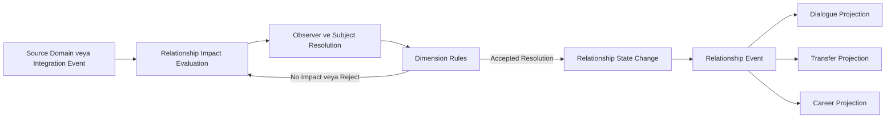
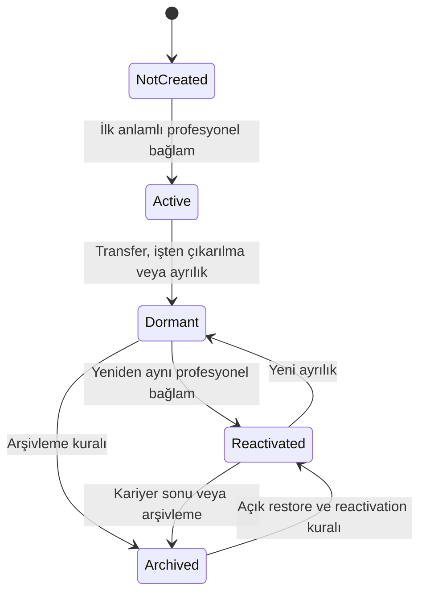

# İlişki Sistemi

**Belge:** `docs/06_RELATIONSHIP_SYSTEM.md`
**Durum:** Kesinleşti
**Ana referans:** `docs/01_GAME_DESIGN_DOCUMENT.md`
**Kesin MVP sınırı:** `docs/02_MVP_SCOPE.md`
**Domain sınırları:** `docs/03_DOMAIN_MODEL.md`
**Olay ve kural sözleşmeleri:** `docs/04_EVENT_RULE_ENGINE.md`
**Hafıza ve söz sözleşmeleri:** `docs/05_MEMORY_AND_PROMISE_SYSTEM.md`
**Mimari yön:** `docs/17_TECHNOLOGY_AND_ARCHITECTURE_DECISION.md`
**İlgili karar günlüğü:** `docs/15_DECISION_LOG.md`

---

## 1. Belgenin Amacı

Bu belge, Football Career Simulator projesinin İlişki Sistemine ait teknoloji bağımsız domain kurallarını kesinleştirir.

Sistemin amacı:

* bir aktörün başka bir aktöre yönelik güncel profesyonel değerlendirmesini temsil etmek,
* ilişkiyi tek boyutlu iyi veya kötü puanına indirgememek,
* geçmiş olayların kendisini kopyalamadan bu olayların güncel ilişki üzerindeki sonuçlarını taşımak,
* sözlerin, diyalogların, kadro kararlarının, disiplin uygulamalarının ve kamuya açık davranışların ilişkiyi açıklanabilir biçimde değiştirmesini sağlamak,
* aynı olayın farklı aktörlerde farklı ilişki sonuçları üretebilmesini desteklemek,
* kulüp değişimi, transfer ve işten çıkarılma sonrasında kişisel ilişkileri korumak,
* eski ilişkilerin sonraki sezonlarda yeniden etkinleşebilmesini sağlamak,
* ilişki state'inin yalnız Relationship authoritative owner'ı tarafından değiştirilmesini güvence altına almak,
* deterministik, idempotent ve otomatik test edilebilir sonuçlar üretmek,
* yaklaşık 500 aktif futbolcu ve 10 sezonluk simülasyonda veri büyümesini kontrol altında tutmaktır.

Bu belge:

* üretim sınıfları, interface'ler veya enum'lar tanımlamaz,
* kesin veri tipi veya sayısal ölçek belirlemez,
* kesin ilişki delta değerleri üretmez,
* veritabanı tablosu veya serialization şeması belirlemez,
* kişilik sisteminin kesin boyutlarını yeniden tanımlamaz,
* ayrıntılı Team Cohesion sistemi tasarlamaz,
* futbolcu-futbolcu sosyal ağı oluşturmaz,
* diyalog, transfer, disiplin, basın veya save sistemlerinin kendi authoritative kararlarını devralmaz,
* harici üretken yapay zekâyı çekirdek ilişki değerlendirmesi için zorunlu bağımlılık hâline getirmez.

---

## 2. Referanslar ve Kapsam

Kaynak önceliği:

1. `docs/01_GAME_DESIGN_DOCUMENT.md`
2. `docs/02_MVP_SCOPE.md`
3. `docs/03_DOMAIN_MODEL.md`
4. `docs/04_EVENT_RULE_ENGINE.md`
5. `docs/05_MEMORY_AND_PROMISE_SYSTEM.md`
6. `docs/17_TECHNOLOGY_AND_ARCHITECTURE_DECISION.md`
7. `docs/15_DECISION_LOG.md`

Kesinleşmiş Domain Model'e göre Relationship, Memory ve Promise, `Social Continuity` bounded context'i içindedir.

Bu belgede kullanılan **Relationship context** ifadesi:

> `Social Continuity` bounded context'i içindeki Relationship domain alanını, kurallarını ve authoritative ownership sınırını ifade eder.

Bu ifade:

* yeni bir on beşinci bounded context oluşturmaz,
* `docs/03_DOMAIN_MODEL.md` içindeki context listesini değiştirmez,
* Memory veya Promise aggregate ownership'ini Relationship'e taşımaz.

MVP ilişki sistemi özellikle teknik direktör kariyerindeki insan yönetimini destekler. Nihai MVP'nin zorunlu ana ilişki yönü:

> Futbolcu → Teknik Direktör

İlişki sistemi aşağıdaki sistemlerle kararlı event, command, query veya projection sözleşmeleri üzerinden çalışır:

* Memory,
* Promise,
* Dialogue,
* Team Preparation,
* Match,
* Transfer,
* Manager Career & Employment,
* Player Career,
* Interaction & Narrative,
* Event & Rule Evaluation,
* Save Integrity.

---

## 3. Bağlayıcı Tasarım İlkeleri

1. İlişki, iki aktör arasındaki güncel değerlendirme state'idir.
2. İlişki geçmiş olayın kendisi değildir.
3. Hafıza, ilişkinin neden değiştiğini açıklayan girdilerden biridir.
4. Promise sonucu, ilişki değerlendirmesi için bir girdidir; ilişki state'i değildir.
5. İlişki tek bir genel puan değildir.
6. İlişki yönlüdür.
7. A aktörünün B'ye yönelik değerlendirmesi, B aktörünün A'ya yönelik değerlendirmesiyle aynı olmak zorunda değildir.
8. Karşılıklı ilişki gerektiğinde iki ayrı yönlü kayıt veya iki yönü açıkça birleştiren türetilmiş projection kullanılmalıdır.
9. Aynı yön için iki authoritative kayıt oluşturulamaz.
10. Relationship context, Relationship Record state'inin tek authoritative owner'ıdır.
11. Başka context'ler ilişki boyutlarını doğrudan değiştiremez.
12. Başka context'ler olay, factor, request veya query girdisi sağlayabilir.
13. UI ilişki state'ini doğrudan değiştiremez.
14. Memory sistemi ilişki state'ini doğrudan değiştiremez.
15. Promise sistemi ilişki state'ini doğrudan değiştiremez.
16. Event & Rule Evaluation, Relationship business state'inin sahibi değildir.
17. Morale, Relationship Record içinde saklanamaz.
18. Reputation, Relationship Record'un yerine kullanılamaz.
19. Board Confidence, teknik direktör-yönetim ilişkisi adı altında Relationship state'ine taşınamaz.
20. Team Cohesion, bireysel ilişkilerin basit toplamı veya ortalaması kabul edilemez.
21. Futbolcu transfer olduğunda eski ilişkiler otomatik olarak silinmez.
22. Teknik direktör kulüp değiştirdiğinde kişisel ilişkileri korunur.
23. Aynı kaynak event aynı relationship effect'i iki kez uygulayamaz.
24. Domain kararlarında duvar saati kullanılamaz.
25. Gizli global rastlantısallık kullanılamaz.
26. Handler çalışma sırası gizli business rule olamaz.
27. Son çalışan handler önceki sonucu sessizce ezemez.
28. Aynı simulation step içindeki çelişen etkiler owner kurallarıyla birlikte çözümlenir.
29. Kesin sayısal ölçekler ve katsayılar bu belgede belirlenmez.
30. Event sourcing, Relationship sisteminin varsayılan persistence modeli değildir.
31. Snapshot, güncel authoritative state'in ana persistence kaynağıdır.
32. Kritik ilişki değişimleri oyuncuya ve debug araçlarına açıklanabilir olmalıdır.
33. Tam sosyal ağ simülasyonu MVP kapsamında değildir.
34. Harici üretken yapay zekâ, çekirdek ilişki değerlendirmesinin zorunlu bağımlılığı olamaz.

---

## 4. Terminoloji

### 4.1. Relationship Record

Belirli bir Observer Actor'ın belirli bir Subject Actor'a yönelik güncel profesyonel ilişki state'idir.

Relationship Record:

* yönlüdür,
* iki aktörün kalıcı kimliklerini bilir,
* belirli bir Relationship Type taşır,
* bağımsız ilişki boyutlarının current state'ini taşır,
* lifecycle status'una sahiptir,
* geçmiş olayların ayrıntılı kopyasını tutmak zorunda değildir,
* değişim nedenlerini sınırlı açıklama veya tarihsel referanslarla izlenebilir kılar.

### 4.2. Observer Actor

İlişki değerlendirmesini taşıyan aktördür.

Örnek:

Bir futbolcunun teknik direktöre duyduğu güven ilişkisinde:

* futbolcu Observer Actor,
* teknik direktör Subject Actor'dır.

### 4.3. Subject Actor

İlişki değerlendirmesinin yöneldiği aktördür.

Subject Actor, değerlendirmeyi taşıyan taraf değildir. Ters yöndeki değerlendirme gerekiyorsa ayrı yönlü kayıt gerekir.

### 4.4. Relationship Dimension

İlişkinin belirli ve bağımsız semantik eksenidir.

MVP boyutları:

* Trust,
* Respect,
* Professional Compatibility.

### 4.5. Relationship Change Input

Başka bir domain gerçeğinden, committed event'ten, Memory projection'ından, Promise sonucundan veya kararlı integration contract'tan gelen ve Relationship context tarafından değerlendirilmesi gereken girdidir.

Relationship Change Input:

* yeni ilişki değerini emretmez,
* kaynak olayın kategorisini ve bağlamını taşır,
* Observer ve Subject çözümüne yardım eder,
* importance, causation ve correlation bilgisi taşıyabilir,
* nihai değişimin authoritative kaynağı değildir.

### 4.6. Relationship Change

Relationship context'in kendi kurallarıyla yaptığı değerlendirme sonucunda oluşan authoritative state değişikliğidir.

Relationship Change:

* bir veya birden fazla boyutu etkileyebilir,
* hiçbir etki üretmeyebilir,
* sınırlandırılabilir,
* reddedilebilir,
* milestone üretebilir,
* kaynak event ve rule ile açıklanabilir olmalıdır.

### 4.7. Relationship State Label

Dahili current state'in oyuncuya sunulan niteliksel özetidir.

Kavramsal örnekler:

* Çok düşük güven
* Düşük güven
* Nötr güven
* Güçlü güven
* Çok güçlü güven

Kesin metinler, localization ve UI tasarımında değişebilir. Kesin eşikler dengeleme ve implementasyon aşamasına bırakılır.

### 4.8. Relationship Milestone

İlişkinin önemli bir eşiğe ulaşmasını veya kariyer açısından anlamlı bir değişim yaşamasını temsil eden domain sonucudur.

Örnek kategoriler:

* güvenin ciddi biçimde kaybedilmesi,
* uzun süreli profesyonel uyum oluşması,
* ilişkinin kritik kriz seviyesine gelmesi,
* eski bir ilişkinin yeniden etkinleşmesi,
* ciddi bir çatışmanın çözülmesi.

Milestone, her küçük delta için üretilmez.

### 4.9. Active Relationship

Aktörlerin mevcut profesyonel bağlamda düzenli etkileşime girdiği ve ilişki girdilerinin aktif olarak değerlendirildiği ilişkidir.

### 4.10. Dormant Relationship

Aktörlerin artık aynı kulüpte veya düzenli profesyonel etkileşim içinde olmadığı; fakat current state ve önemli geçmişin korunduğu ilişkidir.

### 4.11. Reactivated Relationship

Daha önce Dormant veya açık restore kuralıyla Archived olan bir ilişkinin aktörler yeniden anlamlı profesyonel bağlama girdiğinde tekrar etkinleştirilmiş hâlidir.

Reactivation yeni ve ilgisiz bir Relationship Record oluşturmak yerine mevcut yönlü ilişkinin kimliğini korur.

### 4.12. Archived Relationship

Aktif karar sorgularında varsayılan olarak kullanılmayan ancak tarihsel bütünlük, kariyer özeti veya açık restore süreci için saklanan ilişkidir.

---

## 5. Relationship, Memory, Morale ve Reputation Ayrımı

### 5.1. Relationship ve Memory

Memory:

* belirli geçmiş olayların aktör perspektifli kaydıdır,
* olayın kim veya ne hakkında olduğunu bilir,
* importance ve Current Influence taşıyabilir,
* zamanla zayıflayabilir veya pekişebilir,
* ilişkinin neden değiştiğini açıklayan girdilerden biridir.

Relationship:

* belirli bir Observer Actor'ın belirli bir Subject Actor'a yönelik güncel değerlendirmesidir,
* geçmiş event'in veya Memory Record'un kopyası değildir,
* kendi boyutlarının current state'ini taşır,
* state değişiminin authoritative owner'ıdır.

Memory Record, Relationship Dimension olarak saklanamaz.

Memory Current Influence azaldığında Relationship state otomatik olarak önceki değerine dönmek zorunda değildir. Hafızanın zayıflaması, sonraki değerlendirmelerdeki bağlamsal ağırlığını değiştirebilir.

### 5.2. Relationship ve Morale

Morale:

* futbolcunun genel veya kısa vadeli psikolojik durumudur,
* maç sonuçları, fiziksel durum, kişisel hedefler, takım atmosferi ve başka etkenlerden beslenebilir,
* belirli tek bir Subject Actor'a yönelmek zorunda değildir.

Relationship:

* belirli bir Subject Actor'a yöneliktir,
* profesyonel değerlendirmeyi temsil eder.

Bir futbolcu:

* yüksek morale sahipken teknik direktöre düşük Trust duyabilir,
* düşük morale sahipken teknik direktöre yüksek Respect duyabilir.

Morale, Relationship Dimension değildir ve Relationship Record içinde saklanamaz.

### 5.3. Relationship ve Reputation

Reputation:

* daha geniş sosyal veya kurumsal çevredeki değerlendirmedir,
* çok sayıda aktörün veya kurumun ortak algısını temsil edebilir,
* doğrudan bire bir ilişki olmak zorunda değildir.

Relationship:

* belirli Observer Actor'ın belirli Subject Actor'a yönelik değerlendirmesidir.

Bir teknik direktör yüksek genel Reputation'a sahipken belirli bir futbolcunun ona Trust değeri düşük olabilir.

### 5.4. Relationship ve Board Confidence

Board Confidence:

* yönetimin teknik direktörün görevine, performansına ve istihdamına ilişkin kurumsal değerlendirmesidir,
* `Manager Career & Employment` veya ilgili Board domain alanının authoritative state'idir,
* Relationship Dimension değildir.

MVP'de yönetici → teknik direktör kişisel ilişkisi zorunlu değildir.

Gelecekte kişisel yönetici ilişkileri eklense bile:

* Board Confidence'ın yerine geçemez,
* Board Confidence ile aynı authoritative kayıt olamaz,
* teknik direktörün iş güvenliği doğrudan bireysel Relationship Record'dan yönetilemez.

### 5.5. Relationship ve Team Cohesion

Team Cohesion:

* grubun birlikte çalışma durumunu,
* takım seviyesindeki uyumu,
* ortak davranış veya performans kapasitesini

temsil eden ayrı bir takım state'idir.

Bireysel ilişkiler Team Cohesion sistemine girdi sağlayabilir. Ancak Team Cohesion:

* Relationship Record'ların basit toplamı değildir,
* Relationship boyutlarının ortalaması değildir,
* Relationship context'in authoritative state'i değildir.

MVP'de ayrıntılı hizip, klik ve tam takım sosyal ağı zorunlu değildir.

---

## 6. MVP İlişki Kapsamı

Nihai MVP'de zorunlu ana ilişki yönü:

> Futbolcu → Teknik Direktör

Bu Relationship Type, futbolcunun teknik direktöre yönelik profesyonel değerlendirmesini temsil eder.

MVP'de Relationship Record oluşturulması zorunlu olmayan yönler:

* futbolcu → futbolcu,
* teknik direktör → futbolcu,
* personel → teknik direktör,
* gazeteci → teknik direktör,
* taraftar lideri → teknik direktör,
* yönetici → teknik direktör kişisel ilişkisi,
* menajer → teknik direktör,
* aile ve özel yaşam ilişkileri.

Teknik direktörün futbolcu hakkındaki değerlendirmeleri öncelikle şu domain verileriyle temsil edilir:

* kadro statüsü,
* sportif değerlendirme,
* taktik uygunluk,
* performans değerlendirmesi,
* gelişim planı,
* transfer kararı.

Bu veriler otomatik olarak Relationship state'i kabul edilemez.

Domain modeli gelecekte yeni aktör türleri ve yeni yönlü Relationship Type'lar eklenmesini engellememelidir. Ancak MVP için bütün aktörler arasında tam sosyal grafik kurulamaz.

---

## 7. Yönlü İlişki Modeli

Relationship Record açık biçimde:

* Observer Actor,
* Subject Actor,
* Relationship Type

bileşenleriyle tanımlanır.

Bağlayıcı benzersizlik yönü:

> Aynı `ObserverActorId + SubjectActorId + RelationshipType` birleşimi için aynı anda birden fazla Active authoritative Relationship Record bulunamaz.

Ters yön ayrı ilişkidir.

Örnek:

* futbolcu → teknik direktör Trust,
* teknik direktör → futbolcu değerlendirmesi

aynı state değildir.

Karşılıklı görünüm gerekirse UI veya query katmanı:

* iki ayrı yönlü kaydı birlikte gösterebilir,
* karşılıklı durum projection'ı oluşturabilir.

Bu projection:

* yeni bir authoritative Relationship Record değildir,
* iki yönü sessizce eşitleyemez,
* iki yönlü değişikliği tek mutation olarak uygulayamaz.

Relationship kayıtları Player veya Manager aggregate'larının içine karşılıklı ve kopyalı listeler olarak gömülemez.

---

## 8. Kesin MVP İlişki Boyutları

MVP'de Futbolcu → Teknik Direktör ilişkisi üç bağımsız boyuttan oluşur.

### 8.1. Trust — Güven

Futbolcunun teknik direktörü:

* sözünü tutan,
* tutarlı,
* adil,
* öngörülebilir,
* dürüst,
* kendisini yanıltmayan

bir aktör olarak görme derecesidir.

Trust özellikle şu girdilerden etkilenebilir:

* Promise oluşturulması ve terminal sonucu,
* açıklanan gerekçe ile gerçek davranışın tutarlılığı,
* kadro kararlarında algılanan adalet,
* özel görüşmelerin gizliliği,
* transfer veya sözleşme iletişimindeki dürüstlük,
* kamuya açık destek veya suçlama,
* tutarlı veya keyfi disiplin uygulamaları.

Trust:

* Respect ile aynı değildir,
* Morale değildir,
* genel memnuniyet puanı değildir.

### 8.2. Respect — Saygı

Futbolcunun teknik direktörün:

* sportif yeterliliğine,
* liderliğine,
* karar alma gücüne,
* otoritesine,
* kriz yönetimine,
* başarı geçmişine

duyduğu profesyonel saygıdır.

Respect özellikle şu girdilerden etkilenebilir:

* sportif sonuçlar,
* taktik kararların başarısı,
* kriz yönetimi,
* disiplin kararlarının tutarlılığı,
* güçlü veya zayıf liderlik algısı,
* kamuya açık sorumluluk alma,
* takımın zor dönemden çıkarılması.

Tek bir maç sonucu doğrudan büyük ve kalıcı Respect değişimi üretmemelidir.

### 8.3. Professional Compatibility — Profesyonel Uyum

Futbolcunun teknik direktörün çalışma biçimiyle şu alanlardaki uyumudur:

* rol beklentisi,
* taktik yaklaşım,
* pozisyon kullanımı,
* antrenman yaklaşımı,
* iletişim biçimi,
* kadro kullanım yöntemi,
* kariyer planı.

Professional Compatibility özellikle şu girdilerden etkilenebilir:

* oynatılma şekli,
* futbolcunun uygun veya uygun olmayan rolde kullanılması,
* rol beklentisiyle gerçek kullanımın uyuşması,
* antrenman yaklaşımı,
* taktik sistem,
* disiplin ve iletişim tarzı,
* kariyer hedefi ile teknik direktör planının uyuşması.

### 8.4. Boyutların bağımsızlığı

Üç boyut birbirinin yerine geçemez.

Örnek:

* futbolcu teknik direktörün sportif becerisine yüksek Respect duyabilir,
* verdiği sözlere düşük Trust duyabilir,
* çalışma biçimiyle düşük Professional Compatibility yaşayabilir.

Bir boyuttaki olumlu değişiklik diğer boyutları otomatik olarak olumlu yapmaz.

### 8.5. MVP dışında tutulan boyutlar

Aşağıdakiler MVP'de ayrı authoritative Relationship Dimension değildir:

* kişisel yakınlık,
* arkadaşlık,
* korku,
* hayranlık,
* kıskançlık,
* romantik bağ,
* sadakat,
* öfke,
* kırgınlık,
* genel memnuniyet.

Bu kavramlar gerektiğinde:

* Memory,
* Morale,
* Personality,
* Motivation,
* gelecekteki Relationship genişlemeleri

üzerinden temsil edilebilir.

---

## 9. Veri Sahipliği

Relationship authoritative ownership yönü:

* Relationship context, Relationship Record'ların tek authoritative owner'ıdır.
* Relationship context, `Social Continuity` bounded context'i içindeki Relationship domain alanıdır.
* Player Career context futbolcunun Relationship Dimension state'ini doğrudan saklamaz veya değiştirmez.
* Manager Career & Employment context Relationship Dimension state'ini doğrudan değiştirmez.
* Memory domain alanı Relationship state'ini doğrudan değiştirmez.
* Promise domain alanı Relationship state'ini doğrudan değiştirmez.
* Interaction & Narrative, diyalog veya public statement sonuçları üretir.
* Team Preparation, Match, Transfer ve Manager Career ilgili committed event'leri yayınlar.
* Event & Rule Evaluation routing, metadata, rule evaluation ve idempotency desteği verir; Relationship business state'ini değiştirmez.
* Application katmanı context'ler arası orkestrasyonu yürütür.
* Save Integrity, Relationship invariant'larını atlayarak state oluşturamaz.
* Presentation yalnız command, query ve read model akışı üzerinden çalışır.

Başka context'ler Relationship state'ini:

* kararlı query,
* read model,
* projection,
* integration event,
* aggregate raporu

üzerinden okuyabilir.

---

## 10. Relationship Record Kavramsal Modeli

Relationship Record en az şu kavramsal bilgileri desteklemelidir:

* `RelationshipId`
* `ObserverActorId`
* `SubjectActorId`
* `RelationshipType`
* `TrustState`
* `RespectState`
* `ProfessionalCompatibilityState`
* `Status`
* `CreatedAtGameTime`
* `LastChangedAtGameTime`
* `LastMeaningfulInteractionAtGameTime`
* `SourceContext`
* `SchemaVersion`
* `CurrentContextId`, yalnız gerekli profesyonel bağlam referansı için
* `LastChangeReasonSummary`, türetilmiş veya sınırlı açıklama olarak
* son değişime ait `CorrelationId`, gerekiyorsa
* gerekli relationship rule veya version referansı
* gerekli idempotency veya processed effect referansları.

Kesin class, veri tipi, UUID biçimi, tablo veya serialization şeması bu belgede belirlenmez.

### 10.1. Current state ve değişim nedenlerinin ayrılması

Relationship Record'un authoritative current state'i:

* üç boyutun mevcut değeri,
* lifecycle status'u,
* gerekli zaman ve kimlik bilgileri

ile sınırlıdır.

Değişim nedenleri:

* source event referansı,
* milestone,
* sınırlı change summary,
* seçici history,
* debug veya audit trace

üzerinden izlenebilir.

Her küçük delta'nın bütün ayrıntıları Relationship Record içinde sonsuza kadar saklanamaz.

### 10.2. Temel invariant

Aynı:

* Observer Actor,
* Subject Actor,
* Relationship Type

yönü için aynı anda birden fazla Active authoritative kayıt bulunamaz.

---

## 11. İlişki Oluşturma

Her olası aktör çifti için oyun başlangıcında Relationship Record oluşturulması zorunlu değildir.

Relationship Record şu durumlarda oluşturulabilir:

* aktörler aynı profesyonel bağlama katıldığında,
* futbolcu teknik direktörün takımına geldiğinde,
* ilk anlamlı görüşme gerçekleştiğinde,
* ilk Relationship Change Input oluştuğunda,
* Promise gibi ilişki değerlendirmesi gerektiren bir süreç başladığında.

İlk ilişki değerleri:

* nötr olabilir,
* sınırlı bağlamsal başlangıç kullanabilir,
* teknik direktörün Reputation bilgisinden etkilenebilir,
* futbolcunun geçmiş deneyimlerinden etkilenebilir,
* kişilik ve motivasyon girdilerini kullanabilir,
* kulüp ve rol bağlamını değerlendirebilir.

Başlangıç değerleri:

* açıklamasız rastgele olamaz,
* gizli global RNG kullanamaz,
* aynı başlangıç girdileriyle farklı ve izlenemeyen sonuç üretemez.

İlk dikey kesitte nötr veya hafif bağlamsal başlangıç yeterlidir.

Relationship Record bulunmadan Promise veya başka anlamlı etki oluşursa Relationship context:

* kaydı oluşturabilir,
* girdiyi doğruladıktan sonra başlangıç ve değişimi aynı resolution içinde uygulayabilir,
* duplicate kayıt oluşmasını engellemelidir.

---

## 12. İlişki Değişikliği Akışı

Bağlayıcı genel akış:

1. Kaynak context committed Domain Event veya Integration Event üretir.
2. Event metadata, causation ve correlation bilgisi doğrulanır.
3. Relationship context girdinin ilişki açısından anlamlı olup olmadığını değerlendirir.
4. Observer Actor ve Subject Actor çözülür.
5. Gerekirse mevcut Relationship Record bulunur veya oluşturulur.
6. Etkilenecek Relationship Dimension'lar belirlenir.
7. Mevcut state, kişilik, motivasyon, ilgili Memory girdileri, aktif Promise ve bağlam değerlendirilir.
8. Tekrarlı event paterni ve aynı simulation step içindeki diğer girdiler değerlendirilir.
9. Sonuç kabul edilir, reddedilir, birleştirilir veya sınırlandırılır.
10. Relationship Record authoritative olarak güncellenir.
11. `RelationshipChanged` veya eşdeğer domain sonucu üretilir.
12. Gerekirse milestone, conflict veya decision-required sonucu üretilir.
13. Dialogue, Transfer, Career ve UI projection'ları committed state'ten güncellenir.

Kaynak context:

* "Trust değerini -10 yap"
* "Respect'i maksimuma çıkar"
* "Relationship state'ini doğrudan değiştir"

gibi talimatlar gönderemez.

Kaynak context bunun yerine:

* gerçekleşen olayın kategorisini,
* olayın taraflarını,
* bağlamını,
* önemini,
* kontrol ve sorumluluk bilgisini,
* causation ve correlation bilgisini,
* gerekli stable kimlikleri

sağlar.

Nihai ilişki değişimini Relationship context hesaplar.

---

## 13. İlişki Değişikliği Girdileri

### 13.1. Promise sonuçları

Değerlendirilebilecek sonuçlar:

* `PromiseFulfilled`
* `PromiseBroken`
* `PromiseInvalidated`
* `PromiseCancelled`
* `PromiseRenegotiated`, ilgili Promise sözleşmesinde destekleniyorsa

Promise sonuçları özellikle Trust üzerinde anlamlı girdi oluşturabilir.

### 13.2. Kadro ve oynama kararları

Değerlendirilebilecek olaylar:

* ilk 11 başlama,
* maç kadrosuna alınma,
* yedek bırakılma,
* sürekli kadro dışında kalma,
* rol beklentisine uygun kullanım,
* beklenmeyen dışarıda bırakılma,
* aktif Promise'a uygun veya aykırı kullanım,
* istemediği pozisyon veya rolde sürekli oynatılma.

Bu girdiler Trust ve Professional Compatibility üzerinde etkili olabilir.

### 13.3. Diyalog sonuçları

Değerlendirilebilecek olaylar:

* açıklama yapma,
* talebi kabul etme,
* talebi reddetme,
* talebi erteleme,
* destekleyici iletişim,
* sert fakat tutarlı iletişim,
* yanıltıcı açıklama,
* önceki açıklamayla çelişme,
* özür veya uzlaşma sonucu.

Diyalog sonucu doğrudan sabit delta değildir. Relationship context sonucu kendi kurallarıyla değerlendirir.

### 13.4. Disiplin kararları

Değerlendirilebilecek olaylar:

* uyarı,
* para veya sportif ceza,
* kadro dışı bırakma,
* cezanın kaldırılması,
* tutarlı disiplin,
* keyfi veya çelişkili disiplin.

Disiplin olayları Trust, Respect ve Professional Compatibility boyutlarında farklı yönlerde sonuç üretebilir.

### 13.5. Sportif sonuçlar

Değerlendirilebilecek girdiler:

* takım başarısı,
* uzun süreli başarısızlık,
* kriz yönetimi,
* taktik kararların oyuncu performansına etkisi,
* önemli bir maçta doğru veya yanlış yönetim,
* oyuncunun gelişimine yardımcı olan kullanım.

Sportif sonuçlar özellikle Respect üzerinde etkili olabilir.

Tek bir rutin maç sonucu büyük ve kalıcı ilişki değişikliği üretmemelidir.

### 13.6. Kamuya açık destek veya eleştiri

Değerlendirilebilecek olaylar:

* futbolcuyu basında koruma,
* futbolcuyu kamuya açık eleştirme,
* oyuncuyu suçlama,
* sorumluluğu üstlenme,
* özel bilgiyi kamuya açıklama,
* başarıyı oyuncuyla paylaşma.

Public event yalnız olay hakkında bilgi sahibi olan ve doğrudan ilgili aktörlerde değerlendirme oluşturabilir.

### 13.7. Transfer kararları

Değerlendirilebilecek olaylar:

* transfer talebini kabul etme,
* transfer talebini reddetme,
* satış listesine koyma,
* gelen teklifi açıklama veya gizleme,
* kariyer hedeflerine destek olma,
* istemediği transfere zorlama,
* anlaşılmış planı değiştirme.

Bu girdiler Trust ve Professional Compatibility üzerinde etkili olabilir.

### 13.8. Kariyer ve kulüp geçişleri

Değerlendirilebilecek olaylar:

* teknik direktörün işten çıkarılması,
* futbolcunun transfer olması,
* futbolcunun serbest kalması,
* teknik direktörün kulüp değiştirmesi,
* eski teknik direktörün kulübe dönmesi,
* eski futbolcunun yeniden aynı teknik direktörle çalışması,
* aktörün emekli olması.

Bu olaylar ilişkiyi otomatik olarak sıfırlamaz.

---

## 14. Promise Entegrasyonu

Promise terminal sonuçları Relationship context için güçlü girdilerdir.

Genel değerlendirme yönü:

* `PromiseFulfilled`, çoğunlukla Trust için olumlu girdi sağlar.
* `PromiseBroken`, çoğunlukla Trust için olumsuz girdi sağlar.
* `PromiseInvalidated`, otomatik olarak nötr kabul edilemez.
* Invalidation reason, kontrol alanı, sorumluluk, açıklama ve aktörün olayı nasıl değerlendirdiği dikkate alınır.
* `PromiseCancelled`, yalnız Promise sisteminde geçerli açık süreçle oluşmuşsa değerlendirilir.
* Yeniden müzakere edilmiş bir Promise, önceki sözün sessizce silinmesi anlamına gelmez.

Promise context:

* Relationship state'ini doğrudan değiştiremez,
* sabit Trust deltası gönderemez.

Promise Integration Event en az:

* Promise kimliğini,
* tarafları,
* terminal sonucu,
* resolution reason'ı,
* kontrol veya sorumluluk bağlamını,
* oyun zamanını,
* causation ve correlation bilgisini

sağlayabilmelidir.

Aynı Promise resolution:

* aynı Observer,
* aynı Subject,
* aynı Relationship Rule

için yalnızca bir kez uygulanabilir.

Promise sonucu ayrıca Memory adayı oluşturabilir. Aynı kaynak Promise sonucu hem doğrudan Promise kanalı hem Memory kanalı üzerinden duplicate relationship effect üretemez.

Rule ownership açık olmalıdır:

* Promise terminal gerçeğinin doğrudan Trust değerlendirmesi Promise integration kanalından yürütülebilir.
* Memory, aynı olayın uzun dönem bağlamsal hatırlanmasını ve sonraki değerlendirmelerde etkisini sağlar.
* Memory event'i, aynı terminal sonucu ikinci kez delta olarak uygulayamaz.

Kesin Promise-to-Relationship katsayıları bu belgede belirlenmez.

---

## 15. Memory Entegrasyonu

Memory context Relationship state'inin authoritative owner'ı değildir.

İki entegrasyon yolu desteklenebilir.

### 15.1. Event-driven input

Aşağıdaki gibi kararlı integration event'ler Relationship context'e değerlendirme girdisi sağlayabilir:

* `MemoryCreated`
* `MemoryReinforced`
* `MemoryInfluenceChanged`
* `MemoryArchived`
* `RelationshipMilestoneMemoryCreated`

Her Memory değişikliği Relationship değişikliği üretmek zorunda değildir.

### 15.2. Query-based contextual evaluation

Relationship context kritik bir değerlendirme sırasında:

* ilgili aktif Memory Record'ları,
* Current Influence değerlerini,
* Memory Category bilgisini,
* Memory Subject bilgisini,
* importance ve valence gibi kesinleşmiş girdileri

query veya read model üzerinden okuyabilir.

### 15.3. Duplicate etki sınırı

Aynı Source Event:

* doğrudan domain event kanalıyla,
* Promise sonucu kanalıyla,
* Memory oluşturma veya reinforcement kanalıyla

birden fazla kez aynı Relationship effect'i üretemez.

Her relationship rule için hangi kanalın:

* primary effect,
* contextual factor,
* explanation reference

olduğu açıkça tanımlanmalıdır.

Memory etkisinin zamanla azalması Relationship state'i otomatik olarak nötre döndürmez.

---

## 16. Kişilik ve Motivasyon Etkisi

Aynı olay farklı futbolcularda farklı ilişki değişimleri üretebilir.

Relationship evaluation aşağıdaki kesinleşmiş veya ilgili belgede tanımlanmış girdileri kullanabilir:

* profesyonellik,
* hırs,
* sabır,
* sadakat,
* para motivasyonu,
* oynama süresi motivasyonu,
* rol beklentisi,
* kariyer hedefi,
* iletişim beklentisi,
* sportif hedefler.

Kişilik ve motivasyon:

* Relationship state'inin owner'ı değildir,
* yeni ilişki değerini doğrudan yazamaz,
* olayın yorumunu,
* etkinin yönünü,
* ağırlığını,
* threshold veya pattern değerlendirmesini

etkileyebilir.

Kişilik etkisi deterministic rule evaluation içinde kullanılmalıdır.

Kesin kişilik boyutları, katsayıları veya gelişim kuralları bu belgede değiştirilmez.

---

## 17. Tek Olay Değişim Sınırları

Tek bir düşük veya orta önem olayı ilişkiyi anlamsız biçimde uç noktaya taşıyamaz.

Bağlayıcı yön:

* Her event kategorisi için kavramsal maksimum etki bulunmalıdır.
* Düşük önem olayları sınırlı etki üretmelidir.
* Kritik kariyer olayları daha yüksek etki üretebilir.
* Büyük değişimler açık gerekçe ve rule trace gerektirir.
* Aynı simulation step içinde oluşan etkiler birlikte çözümlenebilir.
* Son çalışan handler önceki sonucu ezemez.
* Boyutlar geçerli minimum ve maksimum sınırların dışına çıkamaz.
* Bir boyut sınırdaysa `LimitReached` veya eşdeğer açıklanabilir sonuç üretilebilir.
* Tek event'in birden fazla boyutu farklı yönlerde etkilemesi mümkündür.

Kesin maksimum delta değerleri bu belgede belirlenmez.

---

## 18. Tekrarlı Olaylar

Aynı olay türünün tekrarı her zaman aynı etkiyi üretmek zorunda değildir.

Relationship evaluation şu kavramları desteklemelidir:

* diminishing returns,
* cumulative escalation,
* threshold crossing,
* pattern recognition,
* Memory reinforcement,
* context window,
* expectation violation,
* previous warning veya previous explanation.

Örnek:

* Bir futbolcunun ilk kez kadro dışında kalması küçük etki üretebilir.
* Art arda ve açıklamasız biçimde kadro dışında kalması daha güçlü olumsuz sonuç üretebilir.
* Küçük olumlu görüşmeler Trust'ı sınırsız biçimde artıramaz.
* Tekrarlanan özürler gerçek davranış değişikliği olmadan giderek daha düşük olumlu etki üretebilir.
* Tekrarlanan söz ihlalleri cumulative escalation oluşturabilir.

Tekrar değerlendirmesi:

* yalnız event sayısına dayanmak zorunda değildir,
* oyun zamanı penceresini,
* rol beklentisini,
* aktif Promise'ı,
* mevcut Memory'leri,
* önceki açıklamaları

kullanabilir.

Kesin pencere uzunluğu, diminishing returns veya escalation formülü bu belgede belirlenmez.

---

## 19. Çelişen Girdilerin Çözümü

Aynı dönemde olumlu ve olumsuz Relationship Change Input'ları oluşabilir.

Örnekler:

* futbolcu ilk 11 başlar fakat kamuya açık eleştirilir,
* Promise yerine getirilir fakat futbolcu istemediği pozisyonda oynatılır,
* takım sportif başarı kazanır fakat futbolcu sürekli kadro dışında kalır,
* disiplin cezası adildir fakat iletişim biçimi aşağılayıcıdır.

Bağlayıcı çözüm yönü:

1. Girdiler handler sırasına göre birbirini silmez.
2. Her Relationship Dimension kendi owner kurallarıyla değerlendirilir.
3. Aynı olay farklı boyutları farklı yönlerde etkileyebilir.
4. Aynı simulation step etkileri tek relationship resolution içinde birleştirilebilir.
5. Çözülemeyen semantik conflict açık `ConflictDetected` sonucu üretebilir.
6. Final state değişimi tek owner tarafından atomik olarak uygulanır.
7. Sonuç change breakdown üretmelidir.
8. Player-facing açıklama ile developer-facing trace ayrılmalıdır.

---

## 20. Relationship State Label'ları

Her Relationship Dimension:

* sınırlandırılmış dahili current state'e,
* nötr başlangıç noktasına,
* semantik eşiklere,
* niteliksel label projection'ına

sahip olmalıdır.

Kavramsal label seviyeleri:

* Çok düşük
* Düşük
* Nötr
* Yüksek
* Çok yüksek

Bağlayıcı yön:

* Kesin eşikler dengeleme veya implementasyon aşamasına bırakılır.
* Oyuncuya ham sayısal değer göstermek zorunlu değildir.
* Oyuncuya niteliksel label gösterilmelidir.
* Oyuncuya son anlamlı değişim nedeni gösterilebilmelidir.
* Debug ve test araçlarında exact internal state görülebilir.
* Bir adet authoritative `OverallRelationshipScore` tutulamaz.
* UI için genel ilişki özeti gerekirse üç boyuttan türetilmiş projection olabilir.
* Türetilmiş genel özet, domain kararlarının tek kaynağı olamaz.
* Önemli label veya semantic threshold geçişleri Relationship Milestone üretebilir.

---

## 21. Açıklanabilirlik

Player-facing açıklama örnekleri:

* "Verdiğin oynama süresi sözünü tuttuğun için güven arttı."
* "Futbolcuyu art arda kadro dışında bıraktığın için profesyonel uyum düştü."
* "Takımı kriz döneminden çıkardığın için saygı arttı."
* "Oyuncuyu kamuya açık biçimde suçladığın için güven azaldı."
* "Transfer talebini açıklama yapmadan reddettiğin için güven düştü."
* "Adil fakat sert disiplin kararın nedeniyle saygı korunurken güven bir miktar azaldı."

Player-facing açıklama:

* iç katsayıların tamamını göstermek zorunda değildir,
* gerçek source event ve semantik nedene dayanmalıdır,
* yanıltıcı veya yalnız flavor text olmamalıdır.

Debug ve test araçları en az şunları gösterebilmelidir:

* source event,
* event schema version,
* kullanılan Relationship Rule,
* RuleId ve RuleVersion,
* Observer Actor,
* Subject Actor,
* etkilenen boyut,
* önceki state,
* değerlendirilen factor'lar,
* uygulanan change,
* yeni state,
* kullanılan Personality veya Motivation girdileri,
* kullanılan Memory veya Promise girdileri,
* causation,
* correlation,
* idempotency effect identity,
* limit veya conflict sonucu,
* milestone sonucu.

`LastChangeReasonSummary` yalnız sınırlı current explanation kolaylığı sağlar. Tam debug trace'in Relationship Record içinde kalıcı olarak tutulması zorunlu değildir.

---

## 22. İlişki Yaşam Döngüsü

Kavramsal lifecycle:

1. Not Created
2. Active
3. Dormant
4. Reactivated
5. Dormant veya Archived

Relationship lifecycle actor identity'den bağımsız olarak korunur.

Lifecycle transition'ları:

* açık domain olayına,
* geçerli aktör referanslarına,
* authoritative owner doğrulamasına,
* oyun zamanına,
* idempotency kontrolüne

dayanmalıdır.

---

## 23. Active, Dormant, Reactivated ve Archived

### 23.1. Active

İlişki Active olduğunda:

* aktörler aynı kulüpte veya aktif profesyonel bağlamdadır,
* Relationship Change Input'ları düzenli olarak değerlendirilebilir,
* Dialogue ve Transfer gibi sistemlerin normal current query'lerinde bulunabilir.

### 23.2. Dormant

İlişki Dormant olabilir:

* futbolcu başka kulübe transfer olduğunda,
* teknik direktör işten çıkarıldığında,
* teknik direktör başka kulübe geçtiğinde,
* futbolcu serbest kaldığında,
* aktörler artık düzenli profesyonel etkileşimde olmadığında.

Dormant state:

* current relationship boyutlarını sıfırlamaz,
* aktör kimliklerini değiştirmez,
* önemli Memory ve milestone bağlantılarını silmez,
* normal aktif kadro query'lerinden ayrılabilir.

### 23.3. Reactivated

Reactivation oluşabilir:

* eski futbolcu yeniden teknik direktörün takımına geldiğinde,
* teknik direktör eski kulübüne döndüğünde ve eski futbolcuyla tekrar çalıştığında,
* aktörler başka kulüpte yeniden aynı profesyonel bağlama girdiğinde.

Reactivation:

* eski RelationshipId'yi mümkün olduğunca korur,
* mevcut yön bilgisini korur,
* eski current state'i ve önemli Memory influence'larını değerlendirir,
* yeni bir projection oluşturur,
* anlamlı bir Relationship Milestone üretebilir.

Reactivation, automatic bonus veya penalty uygulamak zorunda değildir.

### 23.4. Archived

İlişki Archived olabilir:

* aktör emekli olduğunda,
* ilişki uzun süre aktif kararlar için kullanılmadığında,
* düşük önem geçmişi özetlendiğinde,
* kariyer sonu arşivleme süreci çalıştığında.

Archived ilişki:

* normal aktif query'lerde varsayılan olarak kullanılmaz,
* tarihsel bütünlük için korunur,
* açık restore veya rebuild kuralı olmadan Active hâle gelemez.

---

## 24. Zaman ve Relevance Yaklaşımı

Bütün Relationship Dimension state'lerine uygulanan evrensel ve sürekli otomatik decay zorunlu değildir.

Bağlayıcı yön:

* Relationship state yalnız zaman geçtiği için otomatik olarak nötre dönmez.
* Eski state tarihsel ve kişisel değerlendirme olarak korunabilir.
* Dormant ilişkinin current relevance değeri ayrı projection olarak azalabilir.
* Memory Current Influence azalması sonraki değerlendirmelerin bağlamını değiştirebilir.
* Uzun süre etkileşim olmaması yeni olayların yorumunu etkileyebilir.
* Normalization veya reconciliation gerekiyorsa açık scheduled rule üzerinden yapılmalıdır.
* Her oyun gününde bütün Relationship Record'ların taranması zorunlu değildir.
* Zaman hesaplaması oyun zamanını kullanır.
* Duvar saati veya frame rate kullanılamaz.

Kesin decay, relevance veya reconciliation formülü bu belgede belirlenmez.

---

## 25. Transfer Etkisi

Futbolcu başka kulübe transfer olduğunda:

* Relationship Record silinmez,
* ilişki Dormant hâle gelebilir,
* current state korunur,
* önemli milestone ve change summary korunur,
* ilgili Memory kayıtları korunur,
* aktif Promise sonuçları Promise kurallarına göre ayrı değerlendirilir,
* transferin biçimi yeni Relationship Change Input üretebilir.

Örnekler:

* futbolcunun istediği transfere destek olunması Trust için olumlu girdi olabilir,
* futbolcunun isteği dışında satılması bağlama göre olumsuz girdi olabilir,
* transfer talebinin açıklama yapılmadan reddedilmesi Trust'ı etkileyebilir,
* gelen teklifin gizlenmesi Trust üzerinde güçlü olumsuz girdi olabilir,
* kariyer hedefiyle uyumlu karar Professional Compatibility üzerinde olumlu girdi olabilir.

Transfer sistemi:

* Relationship state'ini doğrudan değiştiremez,
* Relationship Record'un status'unu doğrudan yazamaz,
* committed transfer olayları üretir.

Kesin transfer puanlama ve karar formülleri `docs/08_TRANSFER_SYSTEM.md` sorumluluğundadır.

---

## 26. İşten Çıkarılma ve Kulüp Değişimi

Teknik direktör işten çıkarıldığında:

* futbolcu → teknik direktör ilişkileri silinmez,
* ilgili Active ilişkiler Dormant değerlendirmesine alınabilir,
* işten çıkarılma olayı yeni Relationship veya Memory girdisi oluşturabilir,
* bütün futbolcular aynı sonucu üretmek zorunda değildir,
* futbolcuların mevcut Trust, Respect, kişilik ve motivasyonları farklı yorumlara neden olabilir,
* aktif Promise'lar `docs/05_MEMORY_AND_PROMISE_SYSTEM.md` kurallarına göre sonuçlandırılır.

Teknik direktör yeni kulübe geçtiğinde:

* yeni futbolcularla gerektiğinde yeni Relationship Record'lar oluşturulur,
* eski ilişkiler kişisel kariyer geçmişinde kalır,
* eski Relationship Record'lar yeni kulübün state'ine taşınmaz; aktörler arası kişisel sosyal state olarak korunur,
* eski futbolcu yeni kulübe gelirse ilişki yeniden etkinleşebilir,
* eski kulüple yeniden karşılaşma Memory veya Narrative bağlamı oluşturabilir.

Kulüp değişimi:

* PlayerId veya ManagerId'yi değiştiremez,
* ilişki yönünü tersine çeviremez,
* dormant ilişkileri otomatik sıfırlayamaz.

---

## 27. Emeklilik ve Kariyer Sonu

Futbolcu emekli olduğunda:

* aktif futbolcu kadro state'i sona erer,
* Relationship Record otomatik silinmez,
* Active ilişki Dormant veya Archived olabilir,
* emekli aktör normal aktif kadro ilişkisi gibi işlenemez,
* önemli Relationship Milestone'ları teknik direktör kariyer geçmişinde kullanılabilir.

Teknik direktör kariyeri tamamlandığında:

* aktif ilişki değerlendirmeleri durabilir,
* ilişkiler kariyer özeti için archive edilebilir,
* önemli ilişki geçmişleri kariyer değerlendirme ekranında kullanılabilir,
* save bütünlüğü için actor ve relationship referansları korunur.

Aktif relationship crisis bulunan futbolcunun emekli olması:

* krizi sessizce silmez,
* crisis state'in başka sisteme ait sonuçları varsa ilgili owner kuralları çalışır,
* Relationship history'de önemli milestone veya summary korunabilir.

---

## 28. Group Relationship ve Sosyal Ağ Sınırı

MVP'de tam sosyal grafik simülasyonu bulunmayacaktır.

MVP için zorunlu değildir:

* bütün futbolcu-futbolcu ilişkileri,
* arkadaşlık grupları,
* milliyet veya dil klikleri,
* soyunma odası hizipleri,
* sosyal lider ağları,
* aile ilişkileri,
* özel yaşam ilişkileri,
* personel sosyal ağı,
* taraftar lideri ilişkileri,
* gazeteci ilişkileri.

Public event bütün dünya aktörleri arasında otomatik Relationship Record oluşturamaz.

İleride sosyal ağ sistemi eklenirse:

* yönlü Relationship modeli yeniden kullanılabilir,
* yeni Relationship Type'lar eklenebilir,
* mevcut Futbolcu → Teknik Direktör kayıtları bozulmamalıdır,
* migration ve schema version kuralları uygulanmalıdır.

Takım atmosferi için MVP'de sınırlı türetilmiş göstergeler kullanılabilir. Bu göstergeler:

* Relationship authoritative state'i değildir,
* bireysel kayıtların kontrolsüz kopyası değildir,
* bu belgede ayrıntılı Team Cohesion sistemi hâline getirilmez.

---

## 29. Diyalog Sistemiyle Entegrasyon

Dialogue veya Interaction context şu bilgileri okuyabilir:

* güncel Relationship Dimension label'ları,
* son önemli değişim nedenleri,
* ilgili aktif Memory Record özetleri,
* aktif Promise state'i,
* önemli Relationship Milestone'ları,
* relationship status ve relevance projection'ı.

Dialogue context:

* Relationship state'ini doğrudan değiştiremez,
* diyalog seçeneğine sabit relationship delta gömemez,
* `SetTrustValue` benzeri command üretemez,
* oyuncunun seçimini ilgili owner'a command veya committed domain sonucu olarak iletir.

Örnek:

"Bu hafta seni oynatacağım."

seçeneği doğrudan Trust artırmaz.

Bu seçim:

* Promise oluşturma command'ı üretebilir,
* açıklama veya interaction sonucu oluşturabilir,
* sonraki gerçek kadro davranışıyla birlikte Relationship context tarafından değerlendirilebilir.

Relationship state:

* diyalog seçeneklerinin uygunluğunu,
* aktörün tonu veya kabul olasılığını,
* kritik görüşme gereksinimini

etkileyebilir.

Kesin diyalog eşikleri ve seçenek üretim kuralları `docs/07_DIALOGUE_SYSTEM.md` sorumluluğundadır.

---

## 30. Kadro ve Maç Sistemiyle Entegrasyon

Team Preparation ve Match context'leri kararlı event'ler sağlayabilir.

Örnek event kategorileri:

* `PlayerSelectedForMatch`
* `PlayerStartedMatch`
* `PlayerLeftOut`
* `PlayerUsedAsSubstitute`
* `PlayerSubstituted`
* `PlayerPlayedOutOfRole`
* `PlayerRoleAssigned`
* `PlayerMatchPerformanceRecorded`
* `MatchCompleted`

Relationship context:

* her maç event'ini otomatik büyük ilişki değişimine dönüştürmez,
* aktif Promise'ı,
* futbolcunun rol beklentisini,
* tekrar paternini,
* mevcut Relationship state'ini,
* kişilik ve motivasyon girdilerini,
* sakatlık veya kadro uygunluğu gibi açıklayıcı bağlamı

değerlendirir.

Futbolcu kadro onaylandıktan sonra sakatlanırsa:

* dışarıda kalma otomatik olarak teknik direktör kararı kabul edilemez,
* injury ve control scope bilgisi değerlendirilir,
* haksız Promise breach veya Trust kaybı üretilmemelidir.

Maç performansı veya sonucu:

* Respect için bağlamsal girdi olabilir,
* rutin tek maç üzerinden büyük kalıcı değişim üretmemelidir.

---

## 31. Disiplin Sistemiyle Entegrasyon

Disiplin kararları aynı olayda farklı boyutlarda farklı sonuç üretebilir.

Örnek:

Adil ve tutarlı ceza:

* Trust küçük ölçüde azalabilir veya korunabilir,
* Respect artabilir veya korunabilir,
* Professional Compatibility iletişim tarzına göre değişebilir.

Keyfi ve tutarsız ceza:

* Trust düşebilir,
* Respect düşebilir,
* Professional Compatibility düşebilir.

Disiplin değerlendirmesi şu bağlamları kullanabilir:

* ihlalin ağırlığı,
* önceki uyarılar,
* kulüp politikası,
* benzer olaylarda uygulanan kararlar,
* futbolcunun kişiliği,
* iletişim biçimi,
* public veya private oluşu,
* oyuncuya açıklama yapılıp yapılmadığı.

Disiplin sistemi Relationship state'ini doğrudan değiştiremez.

Kesin disiplin lifecycle'ı ve ceza formülleri ilgili ayrı sistem belgesine bırakılır.

---

## 32. Transfer Sistemiyle Entegrasyon

Transfer sistemi Relationship query veya projection'larını kendi authoritative kuralları içinde değerlendirebilir.

Örnek girdiler:

* düşük Trust, futbolcunun teknik direktörle çalışmak istememesine katkı sağlayabilir,
* yüksek Respect, futbolcunun teknik direktör nedeniyle bir kulübü tercih etmesine katkı sağlayabilir,
* düşük Professional Compatibility, ayrılma talebini güçlendirebilir,
* Dormant eski ilişki, yeniden çalışma kararında bağlamsal girdi olabilir.

Transfer sistemi:

* Relationship state'ini doğrudan değiştiremez,
* Relationship sonucu üzerinden tek başına transfer kararı vermek zorunda değildir,
* kendi domain faktörleriyle final kararı üretir.

Transfer olayları yeni Relationship Change Input oluşturabilir.

Kesin transfer ağırlıkları ve eşikleri `docs/08_TRANSFER_SYSTEM.md` içinde belirlenmelidir.

---

## 33. Yönetim ve Kariyer Entegrasyonu

Board Confidence Relationship sisteminin parçası değildir.

Manager Career veya Board sistemleri türetilmiş aggregate verileri kullanabilir:

* kadrodaki Trust label dağılımı,
* yüksek Respect oranı,
* kritik relationship crisis sayısı,
* uzun süre çözülemeyen oyuncu sorunları,
* son dönemde oluşan ciddi milestone'lar.

Bu veriler:

* projection,
* rapor,
* aggregate summary

olmalıdır.

Board veya Manager Career:

* tek tek Relationship Record'ları doğrudan değiştiremez,
* Board Confidence'ı Relationship Dimension olarak saklayamaz,
* futbolcu relationship dağılımını Board Confidence'ın tek belirleyicisi yapamaz.

Relationship sistemi teknik direktörün insan yönetimi kimliği için türetilmiş kariyer göstergeleri sağlayabilir. Bu göstergeler authoritative Relationship state'inin yerine geçmez.

---

## 34. Basın Sistemiyle Entegrasyon

Kamuya açık açıklamalar Relationship context'e girdi sağlayabilir.

Bağlayıcı yön:

* Basın veya Interaction sistemi Relationship state'ini doğrudan değiştiremez.
* Public statement committed event olarak yayınlanır.
* Açıklamanın hedefi ve kapsamı açık olmalıdır.
* Hangi futbolcuların açıklamadan haberdar olduğu bilgi yayılım kurallarına bağlıdır.
* Aynı açıklama farklı futbolcularda farklı sonuç üretebilir.
* Açıklamayı bilmeyen futbolcuda Relationship effect üretilemez.
* Public event bütün dünya aktörlerinde otomatik Relationship Record oluşturamaz.
* Aynı açıklama event'i iki kez tüketildiğinde ikinci effect uygulanamaz.

Kesin bilgi yayılım modeli bu belgede belirlenmez.

---

## 35. Olay ve Kural Motoruyla Entegrasyon

Relationship sistemi `docs/04_EVENT_RULE_ENGINE.md` kararlarına uymalıdır.

Zorunlu gereksinimler:

* Command, Domain Event, Integration Event ve Notification ayrımı,
* authoritative owner,
* aggregate-local state değişikliği,
* foreign context mutation yasağı,
* causation ve correlation,
* deterministic simulation ordering,
* idempotent event consumption,
* event/effect identity,
* rule versioning,
* event schema versioning,
* chain depth ve step budget korumaları,
* correlation cycle detection,
* UI interruption policy ayrımı,
* pending evaluation save/load bütünlüğü,
* snapshot-first persistence,
* tam event sourcing kullanılmaması.

Event & Rule Evaluation:

* Relationship business state'ini tutamaz,
* final Relationship Dimension değerini yazamaz,
* Relationship context'e consequence request veya owner-specific command yöneltebilir,
* duplicate effect'i reddetmek için processing ledger desteği sağlayabilir.

Aynı simulation step içinde birden fazla Relationship Change Input varsa:

* girdiler kararlı sırada toplanır,
* owner rule set'iyle merge edilir,
* handler sırası final state'i belirleyemez.

---

## 36. Command ve Event Kategorileri

### 36.1. Kavramsal command kategorileri

* `EvaluateRelationshipImpact`
* `ApplyRelationshipResolution`
* `CreateRelationshipRecord`
* `MarkRelationshipDormant`
* `ReactivateRelationship`
* `ArchiveRelationship`
* `RebuildRelationshipProjection`
* `CompactRelationshipHistory`

Bu adlar kesin kod kontratı değildir.

`RebuildRelationshipProjection`:

* authoritative state'i tahmin ederek değiştiremez,
* mevcut authoritative state'ten read model üretir.

`CompactRelationshipHistory`:

* current state'i değiştiremez,
* önemli milestone veya causation bilgisini kaybedemez.

UI'nin aşağıdaki gibi command üretmesi yasaktır:

* `SetTrustValue`
* `IncreaseRespect`
* `SetRelationshipScore`
* `MakePlayerHappyWithManager`

### 36.2. Kavramsal event kategorileri

* `RelationshipCreated`
* `RelationshipChanged`
* `RelationshipDimensionChanged`
* `RelationshipMilestoneReached`
* `RelationshipBecameDormant`
* `RelationshipReactivated`
* `RelationshipArchived`
* `RelationshipImpactRejected`
* `RelationshipConflictDetected`
* `RelationshipSummaryUpdated`, yalnız projection sonucu olarak

Her context dışı Integration Event:

* gerekli minimum veriyi taşımalı,
* internal aggregate yapısını dışarı sızdırmamalı,
* başka context'e doğrudan mutation talimatı vermemelidir.

### 36.3. Kavramsal evaluation sonuçları

* `NoRelationshipImpact`
* `CreateRelationship`
* `ApplyDimensionChange`
* `ApplyMultipleDimensionChanges`
* `LimitReached`
* `MilestoneReached`
* `ConflictDetected`
* `DormancyRequested`
* `ReactivationRequested`
* `ArchiveRequested`
* `ValidationRejected`

Her sonuç:

* source event'i,
* kullanılan rule'u,
* etkilenen boyutları,
* değişim nedenini,
* causation ve correlation bilgisini,
* effect identity'yi

izlenebilir kılmalıdır.

---

## 37. Determinizm ve Idempotency

### 37.1. Determinizm

Aynı:

* başlangıç Relationship state'i,
* source event dizisi,
* Memory ve Promise girdileri,
* oyun zamanı,
* kişilik ve motivasyon girdileri,
* rule version,
* event schema version,
* açık seed, rastlantı kullanılıyorsa

aynı ilişki sonucunu üretmelidir.

Bağlayıcı yön:

* duvar saati kullanılamaz,
* gizli global RNG kullanılamaz,
* collection iteration sırasına güvenilemez,
* thread scheduling sırasına güvenilemez,
* aynı simulation step etkileri kararlı sıralamayla çözümlenir,
* handler sırası business sonucu belirleyemez,
* save/load sonrası aynı event farklı sonuç üretemez.

MVP Relationship evaluation için rastlantı zorunlu değildir. Kullanılırsa yalnız açık, seeded ve versioned Random Context kullanılabilir.

### 37.2. Idempotency

Güvenli ele alınması gereken duplicate durumları:

* aynı `PromiseBroken` event'inin iki kez gelmesi,
* aynı `PromiseFulfilled` event'inin iki kez gelmesi,
* aynı `PlayerLeftOut` event'inin iki kez gelmesi,
* aynı public statement event'inin iki kez tüketilmesi,
* aynı transfer completion event'inin yeniden işlenmesi,
* save/load sonrasında pending Relationship evaluation'ın yeniden başlaması.

Kavramsal effect identity adayları:

* `SourceEventId + ObserverActorId + SubjectActorId + RelationshipRuleId`
* `PromiseId + Resolution + ObserverActorId + SubjectActorId`
* `DialogueDecisionId + ObserverActorId + RelationshipRuleId`
* `TransferProcessId + ObserverActorId + SubjectActorId + RelationshipRuleId`
* `PublicNarrativeId + ObserverActorId + RelationshipRuleId`

Kesin persistence şeması bu belgede belirlenmez.

Relationship state değişikliği ve processed effect kaydı kısmi geçerli state bırakamaz. Crash recovery yaklaşımı:

* atomic owner transaction,
* idempotent retry,
* explicit pending processing state

yönlerinden biriyle güvence altına alınmalıdır.

---

## 38. Save/Load Gereksinimleri

Save dosyasında en az şu bilgiler korunmalıdır:

* Active Relationship Record'lar,
* Dormant Relationship Record'lar,
* gerekli önemli Archived ilişki özetleri,
* Trust current state'i,
* Respect current state'i,
* Professional Compatibility current state'i,
* Relationship status,
* Observer ve Subject actor kimlikleri,
* Relationship Type,
* oluşturulma oyun zamanı,
* son değişim oyun zamanı,
* son anlamlı etkileşim zamanı,
* önemli milestone geçmişi veya özet referansları,
* gerekli processed event/effect kimlikleri,
* pending Relationship evaluation state'i, varsa,
* schema version,
* gerekli rule version veya migration bilgisi.

Save/load sonrasında:

* duplicate Relationship Record oluşmamalı,
* Observer ve Subject yönü tersine dönmemeli,
* Dormant ilişki kendiliğinden Active olmamalı,
* Archived ilişki açık transition olmadan Reactivated olmamalı,
* aynı event tekrar delta uygulamamalı,
* actor referansları korunmalı,
* transfer olmuş veya emekli aktörlerle tarihsel bağlantı kaybolmamalı,
* current state ve processed effect state'i tutarlı olmalı,
* unknown schema veya actor reference sessizce tahmin edilmemelidir.

Kesin serialization biçimi ve fiziksel SQLite şeması bu belgede belirlenmez.

---

## 39. Veri Büyümesi ve Arşivleme

10 sezonluk simülasyonda temel riskler:

* her kadro kararının ayrı kalıcı Relationship history satırı üretmesi,
* her maç olayının Relationship change üretmesi,
* aynı actor çifti için duplicate kayıt oluşması,
* Dormant ilişkilerin Active query'leri yavaşlatması,
* bütün küçük deltaların sonsuza kadar saklanması,
* her Relationship change için Memory Record'un kopyalanması,
* arşivlenmiş aktörlerin bütün düşük önem ilişkilerinin ayrıntılı tutulması,
* idempotency ledger'ın sınırsız büyümesi.

Saklama yönü dört kategoriye ayrılır.

### 39.1. Güncel authoritative state

* üç Relationship Dimension current state'i,
* lifecycle status,
* son anlamlı etkileşim zamanı,
* actor kimlikleri,
* gerekli idempotency state'i,
* schema version.

### 39.2. Kalıcı önemli geçmiş

* büyük semantic threshold geçişleri,
* ciddi Promise breach etkisi,
* kariyer dönüm noktaları,
* reactivation,
* ciddi çatışma,
* önemli uzlaşma,
* kariyer sonu ilişki özeti.

### 39.3. Özetlenebilir geçmiş

* tekrarlı küçük kadro etkileri,
* düşük önem diyalog etkileri,
* rutin olumlu veya olumsuz değişimler,
* aynı pattern içindeki düşük önemli event'ler.

Bu geçmiş:

* summary,
* aggregate counter,
* bounded recent history,
* milestone reference

biçiminde compact edilebilir.

### 39.4. Silinebilecek teknik veri

* geçici evaluation input'ları,
* yeniden üretilebilir UI notification'ları,
* kısa süreli debug trace,
* güvenli retention sonrasında tamamlanmış delivery attempt kayıtları,
* authoritative state için artık gerekli olmayan transient processing verisi.

Compaction:

* current state'i değiştiremez,
* önemli milestone nedenini silemez,
* causation veya idempotency bütünlüğünü bozamaz,
* save/load sonrasında farklı relationship sonucu oluşturamaz.

Kesin retention süreleri ve compaction limitleri bu belgede belirlenmez.

---

## 40. Temel Olay Zincirleri

### 40.1. Sözün tutulması

`PromiseFulfilled`
→ Promise Integration Event doğrulanır
→ Relationship impact evaluation
→ Observer futbolcu ve Subject teknik direktör çözülür
→ duplicate effect kontrolü
→ Trust için olumlu değerlendirme
→ Relationship authoritative state güncellenir
→ `RelationshipChanged`
→ gerekirse `RelationshipMilestoneReached`
→ Dialogue ve Transfer projection'ları güncellenir.

### 40.2. Sözün ihlali

`PromiseBroken`
→ Promise sonucu ve Memory candidate ayrı owner'lar tarafından değerlendirilir
→ Relationship impact evaluation
→ duplicate kanal kontrolü
→ Trust için olumsuz değerlendirme
→ Relationship change breakdown
→ olası oyuncu kaygısı veya crisis değerlendirme girdisi
→ Dialogue decision point
→ gerekirse Transfer sistemi ayrılma talebini değerlendirir.

### 40.3. Kadro dışında bırakılma paterni

`PlayerLeftOut`
→ sakatlık ve selection context'i doğrulanır
→ tek olay veya tekrar paterni değerlendirilir
→ rol beklentisi ve aktif Promise sorgulanır
→ Personality ve Motivation girdileri değerlendirilir
→ Professional Compatibility ve gerekirse Trust etkisi
→ açıklanabilir `RelationshipChanged` veya `NoRelationshipImpact`.

### 40.4. Kamuya açık destek

`ManagerPubliclySupportedPlayer`
→ statement committed event'i
→ bilgi erişimi doğrulanır
→ ilgili futbolcu için Memory candidate değerlendirmesi
→ Relationship impact evaluation
→ Trust veya Respect için olumlu değerlendirme
→ Relationship event
→ UI explanation projection.

### 40.5. Teknik direktörün işten çıkarılması

`ManagerDismissed`
→ aktif Relationship Record'lar belirlenir
→ Dormancy evaluation
→ aktif Promise'lar Promise owner tarafından ayrı sonuçlandırılır
→ futbolcuların mevcut Relationship, Personality ve Motivation girdileriyle farklı impact'ler oluşabilir
→ Relationship current state korunur
→ `RelationshipBecameDormant`
→ Career history projection güncellenir.

### 40.6. Eski futbolcuyla yeniden çalışma

`PlayerJoinedClub`
→ aynı Observer, Subject ve Relationship Type için eski Dormant kayıt aranır
→ actor kimlikleri doğrulanır
→ duplicate Active kayıt kontrolü
→ `ReactivateRelationship` değerlendirmesi
→ eski current state ve önemli Memory influence bağlamı kullanılır
→ `RelationshipReactivated`
→ yeni Dialogue, Transfer ve Career projection'ları oluşturulur.

Bu zincirlerin hiçbirinde foreign context state'ine doğrudan mutation yapılamaz.

---

## 41. Domain Değişmezleri

1. Her Relationship Record benzersiz kimliğe sahiptir.
2. Observer ve Subject aynı yönlü kayıtta açıkça belirlenir.
3. Observer ve Subject için geçerli actor referansları bulunmalıdır.
4. Aynı yön ve Relationship Type için birden fazla Active authoritative kayıt bulunamaz.
5. Ters yön otomatik olarak aynı state kabul edilemez.
6. Trust geçerli sınırların dışına çıkamaz.
7. Respect geçerli sınırların dışına çıkamaz.
8. Professional Compatibility geçerli sınırların dışına çıkamaz.
9. Relationship context dışında hiçbir sistem Relationship Dimension state'ini doğrudan değiştiremez.
10. Aynı source event aynı relationship rule ile iki kez effect uygulayamaz.
11. Archived ilişki açık restore veya reactivation süreci olmadan Active hâle gelemez.
12. Dormant ilişki kulüp değişiminde otomatik silinmez.
13. Actor identity değişmeden relationship bağlantısı korunur.
14. Emekli aktör ilişkisi aktif kadro ilişkisi gibi işlenemez.
15. UI doğrudan relationship delta uygulayamaz.
16. Genel ilişki özeti authoritative tek değer olamaz.
17. Board Confidence Relationship state'i olarak saklanamaz.
18. Morale Relationship Dimension olarak saklanamaz.
19. Memory Record Relationship Dimension olarak kopyalanamaz.
20. Promise sonucu aynı Observer ve rule için yalnız bir kez Relationship evaluation effect'i üretebilir.
21. Save/load sonrasında yön, kimlik, status ve current state korunur.
22. Gelecekte oluşacak event'in Relationship effect'i önceden uygulanamaz.
23. Geçersiz actor referansı taşıyan Relationship Change Input reddedilir.
24. Handler sırası final Relationship state'ini belirleyemez.
25. Compaction önemli milestone veya idempotency bütünlüğünü bozamaz.
26. Dormant relationship kendiliğinden Active olamaz.
27. Relationship projection authoritative state'in yerine geçemez.
28. Public event, bilgi sahibi olmayan aktörde Relationship effect üretemez.
29. Relationship state ve processed effect kaydı crash sonrasında çelişkili kalamaz.
30. RelationshipId kulüp değişimi nedeniyle gereksiz biçimde değiştirilemez.

---

## 42. İlk Dikey Kesit Kapsamı

İlk dikey kesitte Relationship sistemi en az şunları desteklemelidir:

* yalnız Futbolcu → Teknik Direktör yönü,
* Trust,
* Respect,
* Professional Compatibility,
* nötr veya sınırlı bağlamsal başlangıç,
* `PromiseFulfilled` girdisi,
* `PromiseBroken` girdisi,
* kadro seçimi girdisi,
* kadro dışında kalma girdisi,
* sınırlı diyalog sonucu girdisi,
* kamuya açık destek veya eleştiri için en az bir gerçek olay zinciri,
* Relationship State Label'ları,
* son anlamlı değişim nedeni,
* deterministik evaluation,
* idempotent event consumption,
* save/load,
* sınırlı Relationship Milestone,
* Memory context ile en az bir gerçek entegrasyon,
* Dormant transition için en az bir doğrulanabilir senaryo,
* debug trace.

İlk dikey kesitte zorunlu değildir:

* futbolcu-futbolcu ilişkileri,
* arkadaşlık ve hizip ağı,
* personel ilişkileri,
* gazeteci ilişkileri,
* taraftar lideri ilişkileri,
* ayrıntılı Team Cohesion,
* gelişmiş Relationship decay,
* otomatik uzlaşma sistemi,
* özel Relationship editörü,
* yapay zekâ tabanlı sosyal yorumlama,
* bütün disiplin ve transfer edge case'leri.

---

## 43. Nihai MVP Kapsamı

Nihai MVP Relationship sistemi:

* yaklaşık 500 futbolcu içinde gerekli Active ilişkileri yönetebilmeli,
* 10 sezon boyunca veri bütünlüğünü korumalı,
* teknik direktör kulüp değiştirdiğinde eski ilişkileri saklamalı,
* futbolcu transfer olduğunda ilişki geçmişini korumalı,
* eski futbolcu yeniden aynı teknik direktörle çalıştığında ilişkiyi Reactivate edebilmeli,
* işten çıkarılma etkilerini değerlendirebilmeli,
* Promise ve Memory girdilerini kullanabilmeli,
* kadro ve maç kararlarını değerlendirebilmeli,
* sınırlı disiplin sonuçlarını değerlendirebilmeli,
* kamuya açık destek ve eleştiri sonuçlarını değerlendirebilmeli,
* Dialogue seçeneklerine kararlı input sağlayabilmeli,
* Transfer kararlarına kararlı input sağlayabilmeli,
* oyuncu crisis değerlendirmelerine girdi sağlayabilmeli,
* kritik Relationship değişimlerini açıklayabilmeli,
* duplicate effect'leri engelleyebilmeli,
* save/load sonrasında aynı state'i koruyabilmeli,
* önemli geçmişi korurken düşük önem geçmişi compact edebilmeli,
* headless uzun dönem testlerinde çalışabilmelidir.

Tam sosyal ağ simülasyonu nihai MVP için zorunlu değildir.

---

## 44. Test Matrisi

### 44.1. Unit Tests

* Relationship Record oluşturma
* Observer ve Subject çözümü
* Relationship Type doğrulama
* Dimension change evaluation
* Multi-dimension resolution
* State label türetme
* Dormant transition
* Reactivation transition
* Archive transition
* tekrarlı event değerlendirmesi
* dimension sınırları
* milestone değerlendirmesi
* no-impact sonucu
* conflict sonucu

### 44.2. Invariant Tests

* tek yön için tek Active kayıt
* ters yönün ayrı state olması
* aynı event'in iki kez delta uygulamaması
* UI mutation yasağı
* foreign context mutation yasağı
* Archived → Active geçişinin açık kural gerektirmesi
* Dormant ilişkinin kulüp değişiminde silinmemesi
* Board Confidence'ın Relationship Dimension olmaması
* Morale'ın Relationship Dimension olmaması
* genel relationship score'un authoritative olmaması
* invalid actor reference'ın reddedilmesi

### 44.3. Integration Tests

* Promise fulfilled → Trust evaluation
* Promise broken → Trust evaluation
* Promise invalidated → reason-aware evaluation
* Memory reinforced → Relationship contextual evaluation
* Squad selection → Professional Compatibility
* repeated PlayerLeftOut → pattern evaluation
* public support → Relationship impact
* public criticism → Relationship impact
* information access check → no false public effect
* Manager dismissal → Dormant Relationship
* Player transfer → Dormant Relationship
* Player joins manager's club → Reactivation
* Relationship state → Dialogue options
* Relationship state → Transfer evaluation
* Relationship aggregate report → Manager Career projection

### 44.4. Determinism Tests

* aynı state ve event dizisi aynı Relationship sonucunu üretir
* aynı Memory ve Promise girdileri aynı değişimi üretir
* aynı rule version aynı sonucu üretir
* save/load sonrası aynı event aynı sonucu üretir
* aynı simulation step input'larının kararlı sırası aynı sonucu üretir
* collection iteration sırası sonucu değiştirmez
* açık seed kullanılıyorsa aynı seed aynı sonucu üretir

### 44.5. Idempotency Tests

* duplicate Promise resolution
* duplicate PlayerLeftOut
* duplicate public statement
* duplicate transfer completion
* duplicate ManagerDismissed
* pending evaluation reload
* state commit sonrası effect retry
* effect record sonrası response retry

### 44.6. Save/Load Tests

* Active Relationship state korunur
* Dormant state korunur
* Archived summary korunur
* Observer ve Subject yönü korunur
* Relationship Type korunur
* processed effect kimlikleri korunur
* pending evaluation korunur
* Reactivation sonrası state korunur
* transfer olmuş actor referansları korunur
* emekli actor referansları korunur
* schema version doğrulanır
* duplicate kayıt oluşmaz

### 44.7. Lifecycle Tests

* Not Created → Active
* Active → Dormant
* Dormant → Reactivated
* Reactivated → Dormant
* Dormant → Archived
* Archived → Reactivated, yalnız açık restore kuralıyla
* futbolcu transferi
* teknik direktör işten çıkarılması
* teknik direktör kulüp değişimi
* futbolcu emekliliği
* teknik direktör kariyer sonu

### 44.8. Long-Running Tests

* 10 sezonda duplicate Relationship Record oluşmaması
* yaklaşık 500 futbolcu ölçeğinde Active query bütünlüğü
* Dormant kayıtların kontrolsüz büyümemesi
* Archived kayıtların Active query'leri etkilememesi
* dimension state'lerinin geçerli sınırlar içinde kalması
* eski ilişkilerin yeniden kullanılabilmesi
* Relationship history'nin save boyutunu kontrolsüz büyütmemesi
* idempotency state'inin güvenli compaction'ı
* actor identity continuity
* uzun işsizlik veya kulüp değişimi dönemlerinde state korunması

### 44.9. Property Tests

* her Active Relationship için geçerli Observer ve Subject vardır
* Observer ve Subject yönü kaybolmaz
* ters yön state'i otomatik eşit değildir
* her authoritative değişimin açıklanabilir source event'i vardır
* aynı effect iki kez uygulanmaz
* authoritative owner yalnız Relationship context'tir
* genel özet üç boyut state'inin yerine geçmez
* Dormant state silinme anlamına gelmez
* invalid transition reddedilir
* compaction current state'i değiştirmez

Henüz test kodu üretilmeyecektir.

---

## 45. Sınır Durumları

### 45.1. Relationship Record yokken Promise verilmesi

Promise kendi owner'ı tarafından oluşturulur. İlk anlamlı Relationship evaluation sırasında Futbolcu → Teknik Direktör kaydı oluşturulabilir. Duplicate kayıt engellenmelidir.

### 45.2. Aynı source event'in iki kez gelmesi

İkinci event delivery, effect identity üzerinden duplicate olarak reddedilir. Relationship state ikinci kez değişmez.

### 45.3. Aynı simulation step içinde Promise fulfilled ve public criticism

Her iki girdi birlikte değerlendirilir. Trust ve Respect farklı yönlerde değişebilir. Handler sırası sonuç belirleyemez.

### 45.4. Kadro onayından sonra sakatlık

Futbolcunun dışarıda kalması teknik direktörün kontrolündeki kadro kararı kabul edilmeden önce injury context'i doğrulanır. Yanlış Trust kaybı veya Promise breach etkisi üretilmez.

### 45.5. Transferden hemen sonra teknik direktörün işten çıkarılması

Transfer ve dismissal event'leri kendi committed sıralarıyla işlenir. Aynı Relationship Record için duplicate Dormant transition uygulanmaz.

### 45.6. Teknik direktörün eski kulübüne dönmesi

Eski Relationship Record'lar actor kimlikleriyle bulunur. Yalnız yeniden aynı profesyonel bağlama giren ilişkiler Reactivate edilir.

### 45.7. Eski futbolcunun yeni kulüpte yeniden teknik direktörle çalışması

Yeni Relationship Record oluşturmak yerine eski Dormant kayıt aranır. Geçerli kayıt varsa Reactivation uygulanır.

### 45.8. Aktif relationship crisis sırasında futbolcunun emekli olması

Relationship state silinmez. İlişki Dormant veya Archived olur. İlgili crisis sisteminin terminal davranışı kendi owner kurallarına göre çalışır.

### 45.9. Observer veya Subject actor arşivlenmişse

Yeni Active change varsayılan olarak uygulanamaz. Actor lifecycle ve restore durumu doğrulanır.

### 45.10. Promise invalidated etkisinin belirsiz olması

Invalidation reason, control scope ve responsibility bilgisi yetersizse Relationship effect reddedilebilir veya karar için açık validation sonucu üretilebilir. Otomatik nötr veya otomatik breach kabul edilmez.

### 45.11. Uzun süre etkileşim olmaması

Relationship state otomatik sıfırlanmaz. Relevance projection azalabilir. Sonraki event'te eski state ve önemli Memory'ler bağlam olarak değerlendirilebilir.

### 45.12. Dormant ilişkinin on sezon sonra Reactivate edilmesi

Actor identity ve RelationshipId doğrulanır. Archived ise açık restore kuralı gerekir. Exact bonus veya penalty otomatik uygulanmaz.

### 45.13. Tek event'in üç boyutu farklı yönlerde etkilemesi

Owner resolution, boyutları bağımsız değerlendirir ve tek atomic multi-dimension change üretebilir.

### 45.14. Çok yüksek Trust sonrasında büyük Promise ihlali

State sınırları korunur. Büyük ihlal anlamlı düşüş üretebilir; mevcut yüksek state değişimi engellemez. Kesin delta formülü açık kalır.

### 45.15. Art arda küçük olumlu diyaloglar

Diminishing returns veya pattern rule uygulanabilir. Trust sınırsız biçimde artamaz.

### 45.16. Public açıklamadan habersiz futbolcu

Information access doğrulanmazsa Relationship effect üretilmez.

### 45.17. Save, event işlenmeden hemen önce alınırsa

Pending event veya evaluation operational state'te korunur. Load sonrasında idempotent biçimde işlenir.

### 45.18. State güncellenip effect kaydı yazılmadan hata oluşursa

Atomic transaction veya idempotent recovery mekanizması state ve processing kaydını tutarlı hâle getirmelidir. Kısmi geçerli state kabul edilemez.

### 45.19. Actor ID referansı eksikse

Relationship Change Input `ValidationRejected` ile reddedilir. Yeni sahte actor veya Relationship Record oluşturulmaz.

### 45.20. Compaction önemli milestone nedenini silmeye çalışırsa

Compaction reddedilir veya milestone referansını koruyacak şekilde sınırlandırılır.

---

## 46. Açık Kalan Kararlar

Aşağıdaki kararlar bu belgede sessizce kesinleştirilmemiştir:

* kesin dahili sayısal aralık,
* kesin Relationship State Label eşikleri,
* event başına kesin delta değerleri,
* maksimum tek event değişimi,
* diminishing returns formülü,
* cumulative escalation formülü,
* pattern değerlendirme penceresi,
* kesin Relationship Milestone eşikleri,
* kesin Dormant süresi,
* kesin Archive süresi,
* kesin Reactivation bonus veya penalty değerleri,
* kesin Team Cohesion formülü,
* kesin oyuncu crisis eşiği,
* kesin transfer karar ağırlıkları,
* kesin diyalog seçenek eşikleri,
* kesin kişilik katsayıları,
* kesin Memory influence çevirim formülü,
* kesin persistence şeması,
* kesin serialization biçimi,
* Relationship effect ledger retention süresi,
* history compaction limitleri,
* public information propagation modeli,
* ileride eklenecek futbolcu-futbolcu ilişki modeli,
* gelecekteki yönetici, personel, menajer veya gazeteci ilişki türleri,
* görsel Relationship ekranı tasarımı.

Bu kararlar:

* dengeleme çalışmaları,
* ilgili authoritative sistem belgeleri,
* Save System ve Test Strategy belgeleri,
* teknik implementation design,
* küçük ve ölçülebilir spike'lar

üzerinden karara bağlanmalıdır.

---

## 47. Riskler ve Azaltma Yönleri

### 47.1. Relationship ve Memory'nin tekrar birleşmesi

**Risk:** Memory Record'ların gizli ilişki puanı gibi kullanılması.

**Azaltma:** Ayrı lifecycle, ayrı authoritative state, açık integration contract ve duplicate-channel testleri.

### 47.2. Tek genel puana geri dönüş

**Risk:** UI veya başka sistemlerin bütün kararları türetilmiş genel özet üzerinden vermesi.

**Azaltma:** Üç authoritative boyutun korunması ve genel özetin yalnız projection olması.

### 47.3. Handler sırasına bağlı sonuç

**Risk:** Aynı simulation step içindeki etkilerin last-handler-wins ile çözülmesi.

**Azaltma:** Owner-controlled multi-input resolution, deterministic ordering ve conflict testleri.

### 47.4. Her maçta ilişki değişmesi

**Risk:** Gürültülü oynanış ve kontrolsüz history büyümesi.

**Azaltma:** Importance, expectation, pattern ve no-impact kuralları.

### 47.5. Duplicate Promise ve Memory etkisi

**Risk:** Aynı olayın iki kanaldan iki kez uygulanması.

**Azaltma:** Primary effect ve contextual factor ownership'i ile ortak causation/effect identity.

### 47.6. Tam sosyal ağın kapsamı büyütmesi

**Risk:** MVP'nin yüzlerce aktör arasında gereksiz ilişki grafiğine dönüşmesi.

**Azaltma:** MVP yönünü Futbolcu → Teknik Direktör ile sınırlamak.

### 47.7. Save bütünlüğü

**Risk:** State değişikliği ile processed effect kaydının ayrışması.

**Azaltma:** Atomic owner transaction, pending state ve idempotent recovery.

### 47.8. Açıklanamaz sayısal değişimler

**Risk:** Oyuncunun ilişki sonucunu keyfi algılaması.

**Azaltma:** Player-facing reason summary ve developer-facing rule trace.

### 47.9. Dormant verinin sınırsız büyümesi

**Risk:** Uzun kariyerlerde query ve save maliyetinin artması.

**Azaltma:** Active index, summary history, archive ve güvenli compaction.

### 47.10. Alt sistem formüllerinin bu belgeye sızması

**Risk:** Transfer, Dialogue, Personality veya Team Cohesion kararlarının sessizce kesinleştirilmesi.

**Azaltma:** Açık Kalan Kararlar listesinin korunması ve owner belgelerine yönlendirme.

---

## 48. Sonraki Adım

Bir sonraki en küçük mantıklı adım:

> `docs/07_DIALOGUE_SYSTEM.md` belgesinde, kesinleşen Relationship query girdileri, Promise oluşturma sınırları, Memory bağlamı ve diyalog sonuç event'leri teknoloji bağımsız biçimde tanımlanmalıdır.

Bu adımdan önce:

* üretim kodu yazılmamalı,
* Relationship sayısal dengeleme değerleri belirlenmemeli,
* tam sosyal ağ kapsamı açılmamalı,
* bu belgede açık bırakılan başka sistem formülleri sessizce kapatılmamalıdır.
