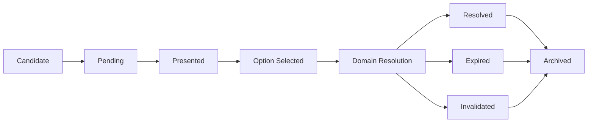
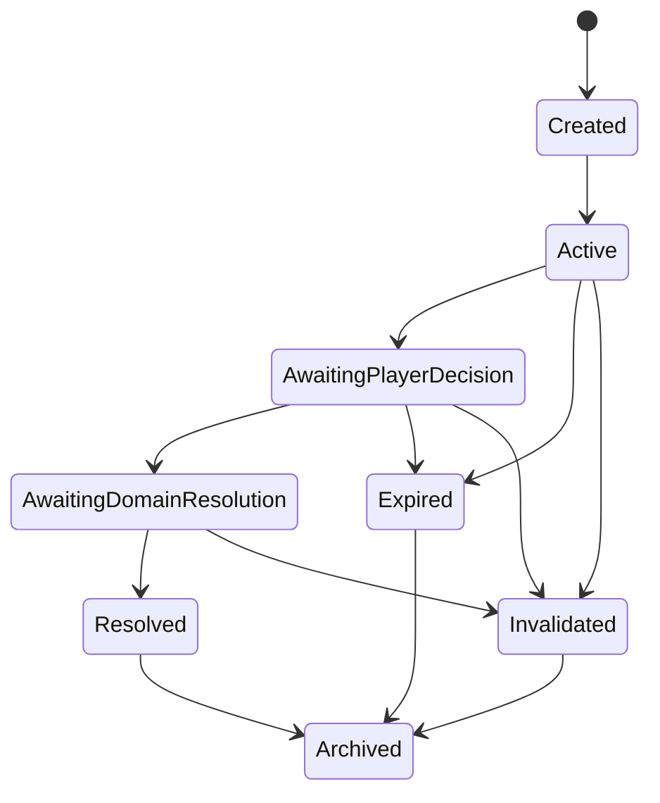
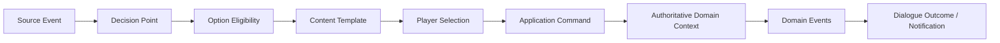

# Diyalog ve Karar Sistemi

**Belge:** `docs/07_DIALOGUE_SYSTEM.md`
**Durum:** Kesinleşti
**Ana referans:** `docs/01_GAME_DESIGN_DOCUMENT.md`
**Kesin MVP sınırı:** `docs/02_MVP_SCOPE.md`
**Domain sınırları:** `docs/03_DOMAIN_MODEL.md`
**Olay ve kural sözleşmeleri:** `docs/04_EVENT_RULE_ENGINE.md`
**Hafıza ve söz sözleşmeleri:** `docs/05_MEMORY_AND_PROMISE_SYSTEM.md`
**İlişki sözleşmeleri:** `docs/06_RELATIONSHIP_SYSTEM.md`
**Mimari yön:** `docs/17_TECHNOLOGY_AND_ARCHITECTURE_DECISION.md`
**İlgili karar günlüğü:** `docs/15_DECISION_LOG.md`

---

## 1. Belgenin Amacı

Bu belge, Football Career Simulator projesinin Diyalog ve Karar Sistemine ait teknoloji bağımsız domain kurallarını kesinleştirir.

Sistemin amacı:

* oyuncuya bağlamsal, yapılandırılmış kararlar sunmak,
* oyuncunun seçimlerini Application katmanı üzerinden ilgili authoritative domain context'lerine Command olarak iletmek,
* diyalog metnini, semantic intent'i, command'ı ve domain sonucunu birbirinden ayrı ve izlenebilir kavramlar olarak tutmak,
* Promise, Memory, Relationship, Transfer, Discipline, Board ve Press sistemleriyle yalnızca committed event, command ve query sözleşmeleri üzerinden kontrollü biçimde entegre olmak,
* aynı konuşmaların veya mekanik kararların anlamsız biçimde tekrarlanmasını engellemek,
* serbest üretken yapay zekâ servisine ihtiyaç duymadan çalışmak,
* kullanıcı arayüzünü veya diyalog metnini domain kurallarının sahibi hâline getirmemek,
* en az 10 sezonluk bir kariyerde açıklanabilir, deterministik ve idempotent kararlar üretmektir.

Bu belge:

* üretim sınıfları, interface'ler veya enum'lar tanımlamaz,
* kesin veri tipi, serialization formatı veya veritabanı şeması belirlemez,
* kesin Dialogue Type, template veya metin varyasyonu kataloğu üretmez,
* kesin ton listesi veya ton katsayıları belirlemez,
* kesin cooldown, repetition scoring veya auto-resolution formülü belirlemez,
* localization teknolojisi, içerik dosya biçimi veya içerik editörü seçmez,
* transfer, yönetim, basın veya disiplin sistemlerinin kendi authoritative kararlarını devralmaz,
* `docs/03_DOMAIN_MODEL.md`, `docs/04_EVENT_RULE_ENGINE.md`, `docs/05_MEMORY_AND_PROMISE_SYSTEM.md` veya `docs/06_RELATIONSHIP_SYSTEM.md` kararlarını değiştirmez,
* harici üretken yapay zekâyı çekirdek diyalog sistemi için zorunlu bağımlılık hâline getirmez.

---

## 2. Referanslar ve Kapsam

Kaynak önceliği:

1. `docs/01_GAME_DESIGN_DOCUMENT.md`
2. `docs/02_MVP_SCOPE.md`
3. `docs/03_DOMAIN_MODEL.md`
4. `docs/04_EVENT_RULE_ENGINE.md`
5. `docs/05_MEMORY_AND_PROMISE_SYSTEM.md`
6. `docs/06_RELATIONSHIP_SYSTEM.md`
7. `docs/17_TECHNOLOGY_AND_ARCHITECTURE_DECISION.md`
8. `docs/15_DECISION_LOG.md`

### 2.1. Uyumluluk notu

Kesinleşmiş Domain Model'e göre diyalog ve karar akışı `Interaction & Narrative` bounded context'i içinde yer alır. Bu context zaten şu aggregate root adaylarını tanımlamıştır: `InteractionSession`, `DecisionRequest`, `PublicNarrative`; entity adayları: `DecisionOption`, `NarrativeReference`; value object adayları: `InteractionContext`, `DecisionDeadline`, `DecisionOutcome`, `NarrativeSummary`.

Bu belgede kullanılan **Dialogue sistemi** ifadesi:

> `Interaction & Narrative` bounded context'i içindeki diyalog orkestrasyonu, karar sunumu ve sonuç özeti sorumluluğunu ifade eder.

Bu ifade:

* yeni bir on beşinci bounded context oluşturmaz,
* `docs/03_DOMAIN_MODEL.md` içindeki context listesini veya aggregate root adaylarını değiştirmez,
* Domain Model'in `InteractionSession` / `DecisionRequest` için tanımladığı sadeleştirilmiş lifecycle özetini geçersiz kılmaz; bu belge yalnızca kavramsal düzeyde daha ayrıntılı bir alt-yaşam-döngüsü sunar (bkz. Bölüm 13 ve 14). Ayrıntılı alt durumlar, Domain Model'in `Opened → awaiting decision → answered/expired/cancelled → archived` özetiyle çelişmez; bu özetin içini dolduran kavramsal aşamalardır.

Bu belge şu bounded context'lerle kararlı event, command, query veya projection sözleşmeleri üzerinden çalışır:

* Interaction & Narrative (kendi ana context'i),
* Social Continuity (Relationship, Memory, Promise),
* Transfer,
* Manager Career & Employment,
* Club & Governance,
* Team Preparation,
* Match,
* Event & Rule Evaluation,
* Save Integrity.

### 2.2. Proje bağlamı

Football Career Simulator; uzun vadeli, olay tabanlı, sistemik, geçmiş kararları hatırlayan, verilen sözlerin ve ilişkilerin gerçek sonuçlar ürettiği, teknik direktör kariyerine odaklanan ve en az 10 sezon güvenilir biçimde simüle edilebilen bir futbol kariyeri simülasyonudur. Diyaloglar yalnızca metin sunumu değildir; oyuncuya bağlamsal kararlar sunar, kararları domain command'larına dönüştürür ve UI'ı domain kurallarının sahibi hâline getirmez.

---

## 3. Bağlayıcı Tasarım İlkeleri

1. Diyalog sistemi authoritative domain state owner değildir.
2. Diyalog sistemi yapılandırılmış bir karar bağlamı, orkestrasyon ve sunum katmanıdır.
3. Diyalog metni, semantic intent, command ve domain sonucu birbirinden ayrı kavramlardır.
4. Oyuncunun seçtiği Dialogue Option doğrudan Relationship, Memory, Promise, Transfer, Discipline, Board veya başka bir bounded context state'ini değiştiremez.
5. Seçim, Application katmanı üzerinden ilgili authoritative context'e bir Command üretir.
6. Command ilgili authoritative domain context tarafından doğrulanır.
7. Başarılı veya başarısız domain sonucu ilgili sistem tarafından belirlenir.
8. Domain state değişimi varsa ilgili sistem Domain Event yayınlar.
9. UI yalnızca uygun seçenekleri gösterir, açıklamaları sunar ve oyuncunun kararını toplar.
10. Bir seçeneğin ekranda görünmesi, seçildiğinde kesin başarı üreteceği anlamına gelmez.
11. Gösterilmiş bir seçenek seçim anında yeniden doğrulanmalıdır.
12. Diyalog sistemi serbest metin üretimine veya harici generative AI servisine bağımlı olamaz.
13. Generative AI gelecekte yalnızca opsiyonel metin varyasyonu veya sunum katmanı olarak kullanılabilir.
14. Generative AI semantic intent, command, eligibility, domain validation veya domain sonucu belirleyemez.
15. Diyalog metinlerinin değiştirilmesi save contract'larını veya domain contract'larını bozmamalıdır.
16. Diyalog sistemi Relationship veya Memory yerine geçen tek boyutlu bir "cevap puanı" sistemi olmamalıdır.
17. Notification kaybı veya render hatası authoritative domain sonucunu geri alamaz ya da değiştiremez.
18. Dialogue Outcome, authoritative event zincirinden türetilen bir sunum özetidir; domain sonucunu kendisi uyduramaz.
19. UI domain state'i doğrudan değiştiremez; yalnızca command/query ve read model akışı üzerinden çalışır.
20. Diyalog içeriği kritik iş kuralı tanımlayamaz; kritik kurallar code-first ve test edilebilir olmalıdır.
21. Aynı simulation step'te oluşan çelişen diyalog girdileri handler sırasına göre çözülemez; owner context'in açık conflict policy'si uygulanır.
22. Kesin sayısal, içerik ve UI ayrıntıları bu belgede kesinleştirilmez.

---

## 4. Terminoloji

### 4.1. Dialogue

Oyuncuya veya bir simülasyon aktörüne sunulan yapılandırılmış konuşma bağlamıdır.

### 4.2. Decision Point

Oyuncunun karar vermesini gerektiren domain veya application durumudur. Her Decision Point bir diyalog olmak zorunda değildir.

Örnekler:

* transfer teklifini kabul etme,
* futbolcunun talebine yanıt verme,
* basın açıklaması seçme,
* yönetim talebine yanıt verme.

### 4.3. Dialogue Session

Bir konuşma bağlamının açılmasından sonuçlandırılmasına, geçersizleşmesine veya süresinin dolmasına kadar süren oturumdur.

### 4.4. Dialogue Turn

Dialogue Session içindeki tek konuşma veya karar adımıdır. MVP'de uzun ve kontrolsüz dallanan konuşmalar yerine kısa, yapılandırılmış ve kontrollü oturumlar tercih edilmelidir.

### 4.5. Dialogue Option

Oyuncuya gösterilen seçimdir. Bir Dialogue Option kavramsal olarak şunlara sahip olabilir: görüntülenen metin, semantic intent, uygunluk koşulları, command üretim tanımı, ton, risk veya sonuç ipucu.

### 4.6. Dialogue Intent / Semantic Intent

Gösterilen metinden bağımsız domain anlamıdır.

Örnek semantic intent'ler (kesin kod enum'ları değil, kavramsal kategori örnekleridir):

* `AcceptRequest`
* `RejectRequest`
* `DelayDecision`
* `MakePromise`
* `ChallengePlayer`
* `SupportPlayer`
* `WarnPlayer`
* `PubliclyDefend`
* `PubliclyCriticize`

### 4.7. Dialogue Outcome

Seçim sonrasında authoritative domain context'lerin ürettiği gerçek sonuçların oyuncuya sunulan özetidir.

### 4.8. Notification

Oyuncuya gösterilen bilgi mesajıdır. Notification bir Dialogue veya Decision Point olmak zorunda değildir.

### 4.9. Narrative Text

Domain veya application sonucunun kullanıcıya doğal dilde sunulmasıdır. Narrative Text authoritative domain state değildir.

---

## 5. Dialogue, Decision Point ve Notification Ayrımı

| Kavram | Ne temsil eder | Domain state mi? | Sunum gerektirir mi? | Örnek |
|---|---|---|---|---|
| Dialogue / Dialogue Session | Yapılandırılmış konuşma bağlamı | Hayır (orkestrasyon kaydı) | Genellikle evet | Futbolcuyla forma süresi görüşmesi |
| Decision Point | Karar gerektiren domain/application durumu | Kısmen (kaynağı authoritative context'tedir) | Zorunlu değil | Transfer teklifini kabul/ret |
| Notification | Bilgi mesajı | Hayır | Evet, fakat karar gerektirmez | "Sözleşmen 30 gün içinde bitiyor." |
| Narrative Text | Domain sonucunun doğal dile çevrilmiş hâli | Hayır | Evet | "Takımı kriz döneminden çıkardığın için saygı arttı." |

Bağlayıcı ayrımlar:

* Her Decision Point bir Dialogue Session gerektirmez; bazı Decision Point'ler arka planda, sunum olmadan çözülebilir (örn. otomatik fallback).
* Her Dialogue Session bir Decision Point içermek zorunda değildir; bazı Dialogue Session'lar yalnızca bilgilendirme veya açıklama sunabilir.
* Notification bir domain gerçeğinin yerine geçmez; kaybolması pending Decision Point'i veya domain sonucunu bozmaz.
* Narrative Text, Dialogue Outcome'ın bir bileşeni olabilir fakat authoritative kaynak değildir; her zaman committed Domain Event'lere dayanmalıdır.
* Bir basın toplantısı sorusu hem Decision Point hem Dialogue Session olabilir; rutin bir bilgilendirme mesajı yalnızca Notification olabilir.

---

## 6. Domain ve Sunum Sınırı

Diyalog sistemi authoritative domain state owner değildir; yapılandırılmış bir karar bağlamı, orkestrasyon ve sunum katmanıdır.

Bağlayıcı akış:

* Diyalog metni, semantic intent, command ve domain sonucu birbirinden ayrı kavramlardır.
* Oyuncunun seçtiği Dialogue Option doğrudan Relationship, Memory, Promise, Transfer, Discipline, Board veya başka bir bounded context state'ini değiştiremez.
* Seçim, Application katmanı üzerinden ilgili authoritative context'e bir Command üretir.
* Command ilgili authoritative domain context tarafından doğrulanır.
* Başarılı veya başarısız domain sonucu ilgili sistem tarafından belirlenir.
* Domain state değişimi varsa ilgili sistem Domain Event yayınlar.
* UI yalnızca uygun seçenekleri gösterir, açıklamaları sunar ve oyuncunun kararını toplar.
* Bir seçeneğin ekranda görünmesi, seçildiğinde kesin başarı üreteceği anlamına gelmez.
* Gösterilmiş bir seçenek seçim anında yeniden doğrulanmalıdır.
* Diyalog sistemi serbest metin üretimine veya harici generative AI servisine bağımlı olamaz.
* Generative AI gelecekte yalnızca opsiyonel metin varyasyonu veya sunum katmanı olarak kullanılabilir; semantic intent, command, eligibility, domain validation veya domain sonucu belirleyemez.
* Diyalog metinlerinin değiştirilmesi save contract'larını veya domain contract'larını bozmamalıdır.
* Diyalog sistemi Relationship veya Memory yerine geçen tek boyutlu bir "cevap puanı" sistemi olamaz.
* Notification kaybı veya render hatası authoritative domain sonucunu geri alamaz ya da değiştiremez.
* Dialogue Outcome, authoritative event zincirinden türetilen bir sunum özetidir; domain sonucunu kendisi uyduramaz.

Owner ayrımı özeti:

| Sorumluluk | Owner |
|---|---|
| Diyalog oturumu, seçenek sunumu, sonuç özeti | Interaction & Narrative (Dialogue sistemi) |
| Relationship boyutları | Social Continuity (Relationship) |
| Memory Record | Social Continuity (Memory) |
| Promise lifecycle | Social Continuity (Promise) |
| Transfer süreci | Transfer |
| Board Confidence / employment kararı | Manager Career & Employment |
| Disiplin cezası | ilgili domain context (örn. Team Preparation / Club policy kapsamı) |
| Public narrative yayılımı | Interaction & Narrative (Public Narrative) |

---

## 7. MVP Diyalog Kapsamı

Aşağıdaki diyalog aileleri nihai MVP kapsamı için bağlayıcı kabul edilir:

1. Forma süresi talebi
2. İlk 11 veya kadro rolü talebi
3. Söz oluşturma görüşmesi
4. Aktif sözün ilerlemesi veya ihlali görüşmesi
5. Transfer isteği
6. Satış veya kulüpten ayrılma görüşmesi
7. Disiplin görüşmesi
8. Performans görüşmesi
9. Futbolcuyu destekleme veya eleştirme
10. Kritik yönetim talebi
11. Kritik basın sorusu
12. İşten çıkarılma veya görev durumu bağlamındaki kritik kararlar
13. Yeni kulübe katılma veya eski aktörle yeniden karşılaşma bağlamları

Bu liste `docs/02_MVP_SCOPE.md` Bölüm 14.10'daki "ilk görüşme kapsamı" (forma süresi talebi, söz görüşmesi, disiplin görüşmesi, transfer isteği, kritik basın cevabı, kritik yönetim cevabı) ile çelişmez; MVP scope belgesindeki altı öğe bu on üç ailenin bir alt kümesidir ve nihai MVP'de tamamı (basın **ve** yönetim dahil) gerçek sonuç üretmelidir.

---

## 8. İlk Dikey Kesit Kapsamı

İlk dikey kesitte zorunlu minimum kapsam:

* Forma süresi talebi
* Söz verme veya reddetme
* Disiplin görüşmesi
* Transfer isteği
* Bir kritik basın veya yönetim cevabı (en az biri)
* Relationship sistemiyle en az bir gerçek entegrasyon
* Memory sistemiyle en az bir gerçek entegrasyon
* Promise sistemiyle en az bir gerçek entegrasyon
* Pending Decision save/load desteği
* Tekrar kontrolü
* Deterministik seçenek üretimi

İlk dikey kesitte zorunlu olmayanlar:

* Uzun ve çok aşamalı konuşma ağaçları
* Serbest metin girişi
* Seslendirme
* Lip-sync
* Gelişmiş sinematik sunum
* Harici generative AI
* Tam medya simülasyonu
* Gazeteci ilişki ağı
* Personel ve aile diyalogları
* Futbolcu-futbolcu özel konuşmaları
* Çok oyunculu konuşma kararları

Bu kapsam `docs/02_MVP_SCOPE.md` Bölüm 6.1 (Kilometre Taşı 1) ile uyumludur; ilk dikey kesit nihai MVP değildir.

---

## 9. Dialogue Session Kavramsal Modeli

Aşağıdaki alanlar kavramsal gereksinimlerdir; fiziksel sınıf, tablo veya serialization şeması değildir.

| Alan | Owner / katman | Neden gerekli, save/load ve determinism notu |
|---|---|---|
| `DialogueSessionId` | Interaction & Narrative | Session'ın kalıcı kimliğidir; save/load sonrasında korunur, duplicate session oluşumunu engeller. |
| `DialogueType` | Interaction & Narrative (content ile birlikte) | Hangi diyalog ailesine ait olduğunu belirler; seçenek üretimi ve içerik template seçimi bu alana bağlıdır. |
| `InitiatorActorId` | Interaction & Narrative | Görüşmeyi başlatan aktör; audit ve eligibility değerlendirmesi için gereklidir. |
| `PrimaryParticipantActorId` | Interaction & Narrative | Diyaloğun asıl muhatabı; Relationship/Memory query'lerinin Observer/Subject çözümü için kullanılır. |
| `AdditionalParticipantIds` (gerekiyorsa) | Interaction & Narrative | Menajer, yönetim temsilcisi gibi ek taraflar; ileride grup görüşmeleri için genişletilebilir alan. |
| `SourceDecisionPointId` | Interaction & Narrative | Session'ın hangi Decision Point'ten doğduğunu bağlar; Decision Point ile Session lifecycle'larının ayrı fakat izlenebilir olmasını sağlar. |
| `SourceEventId` | Event & Rule Evaluation ile paylaşılan referans | Causation zincirinin başlangıcını gösterir; açıklanabilirlik ve duplicate tespiti için gereklidir. |
| `CreatedAtGameTime` | Interaction & Narrative | Session'ın oyun zamanına bağlı başlangıcıdır; duvar saati kullanılmaz. |
| `DeadlineGameTime` (varsa) | Interaction & Narrative / Event & Rule Evaluation due index | Session'ın süresiz açık kalmamasını sağlar; auto-resolution tetikleyicisidir. |
| `Status` | Interaction & Narrative | Lifecycle durumunu taşır (bkz. Bölüm 14); save/load sonrasında terminal state'in geri açılmamasını güvence altına alır. |
| `CurrentTurn` | Interaction & Narrative | Kısa ve kontrollü turn sayısını izler; sınırsız dallanmayı engellemek için kullanılır. |
| `ContextSnapshotReference` | Interaction & Narrative | Seçenek üretiminde kullanılan bağlamın (Relationship/Memory/Promise durumu) referansıdır; determinism ve açıklanabilirlik için gereklidir; foreign state'in kopyası değildir. |
| `AvailableOptionIds` | Interaction & Narrative | Sunulan seçeneklerin kimliğidir; save/load sonrasında aynı seçeneklerin kontrolsüz biçimde değişmesini engeller. |
| `SelectedOptionId` (seçildiyse) | Interaction & Narrative | Oyuncunun kararını taşır; aynı option'ın iki kez seçilememesi idempotency'nin temelidir. |
| `ResolvedCommandIds` | Interaction & Narrative | Seçim sonucu üretilen Command referanslarıdır; aynı seçimin iki kez Command üretmediğini doğrulamak için kullanılır. |
| `OutcomeEventIds` | Interaction & Narrative | Dialogue Outcome'ın dayandığı authoritative Domain Event referanslarıdır; outcome'ın uydurulmadığını garanti eder. |
| `CausationId` | Event & Rule Evaluation sözleşmesi | Session'ı doğrudan tetikleyen Command/Event/ScheduledEvaluation'ı gösterir. |
| `CorrelationId` | Event & Rule Evaluation sözleşmesi | Session'ın ait olduğu geniş business sürecini (örn. Promise müzakeresi) izler. |
| `ContentTemplateVersion` | Content katmanı | Session'da kullanılan içerik sürümünü sabitler; save sonrası content değişse bile session anlamının bozulmamasını sağlar. |
| `SchemaVersion` | Save Integrity | Save/load ve migration uyumluluğu için gerekli sürüm bilgisidir. |

Bu alanlardan kesin class, interface, enum, serialization formatı veya database şeması üretilmez.

---

## 10. Decision Point Kavramsal Modeli

Decision Point en az şu sorumlulukları taşır:

* kaynak domain/application durumunu temsil etmek (örn. transfer teklifi, futbolcu talebi, yönetim ültimatomu),
* benzersiz kimlik taşımak,
* kaynak event ve rule ile ilişkilendirilmek (`SourceEventId`, `SourceRuleId`),
* oyuncuya sunulabilir veya arka planda çözülebilir olmak,
* deadline taşıyabilmek,
* pending state'in save/load ile korunmasını sağlamak,
* terminal sonucun yalnızca bir kez oluşmasını garanti etmek,
* Dialogue Session'dan ayrı bir lifecycle'a sahip olmak (bkz. Bölüm 13 ve 14).

Kesin class veya tablo şeması oluşturulmaz.

Decision Point'in Dialogue Session'dan bağımsız olması şu anlama gelir:

* Bir Decision Point, sunum olmadan (örn. otomatik fallback ile) sonuçlanabilir.
* Bir Dialogue Session, bağlı Decision Point domain tarafından geçersizleştirilirse `Invalidated` olabilir.
* Decision Point'in `Resolved` olması, ona bağlı bütün Dialogue Session'ların otomatik olarak `Resolved` sayılması anlamına gelmez; Session kendi terminal transition'ını izler.

---

## 11. Dialogue Option ve Semantic Intent

Aşağıdaki alanlar kavramsal düzeyde değerlendirilir; kesin veri formatı, DSL, enum, dosya yapısı veya sınıf oluşturulmaz.

| Alan | Açıklama |
|---|---|
| `OptionId` | Seçeneğin kalıcı kimliği; aynı seçimin iki kez Command üretmemesi için kullanılır. |
| `SemanticIntent` | Metinden bağımsız domain anlamı (bkz. Bölüm 4.6); command mapping'in temelidir. |
| `DisplayTemplateId` | Gösterilecek metin template'inin referansı; semantic intent'in yerine geçmez. |
| `EligibilityRuleReferences` | Seçeneğin görüntülenebilirliğini belirleyen domain/Application kural referansları. |
| `CommandDefinitionReference` | Seçim sonucunda üretilecek Command tanımına referans. |
| `ToneTag` | Seçeneğin ton bilgisi (bkz. Bölüm 12); semantic intent'ten ayrıdır. |
| `RiskHint` (varsa) | Oyuncuya gösterilebilecek risk veya sonuç ipucu; kesin domain sonucunu garanti etmez. |
| `PromiseOfferDefinition` (varsa) | Seçenek bir Promise teklifi içeriyorsa, teklifin domain bağlamına referans. |
| `RequiresConfirmation` | Seçimin ek onay adımı gerektirip gerektirmediği. |
| `ContentVersion` | Seçeneğin bağlı olduğu içerik sürümü. |
| `LocalizationKey` | Görüntülenecek metnin localization anahtarı. |

### 11.1. Semantic Intent örnekleri

Semantic Intent, gösterilen metinden bağımsız domain anlamıdır. Örnek kategoriler (kesin enum değildir):

* `AcceptRequest`
* `RejectRequest`
* `DelayDecision`
* `MakePromise`
* `ChallengePlayer`
* `SupportPlayer`
* `WarnPlayer`
* `PubliclyDefend`
* `PubliclyCriticize`

Bu örnekler kavramsal kategori olarak kullanılır; kesin kod enum'ları olarak tanımlanmaz.

---

## 12. Ton ve Domain Niyeti Ayrımı

Ton ile domain niyeti aynı kavram olarak tasarlanmaz.

Örnek:

Semantic intent: `RejectPlayingTimeRequest`

Olası ton varyasyonları: açıklayıcı, sert, destekleyici, erteleyici.

Ton:

* Relationship veya Memory sistemleri tarafından değerlendirilebilecek farklı event verileri üretebilir,
* aktörün yorumu veya gelecekteki hafıza içeriği üzerinde etkili olabilir,
* ancak temel domain kararının semantic anlamını kendiliğinden değiştirmez.

Kesinleştirme:

* Semantic intent, metinden bağımsızdır.
* Tone, semantic intent'in yerine geçmez.
* Tone, foreign state'i doğrudan değiştirmez.
* Tone ve semantic intent, authoritative context'in değerlendireceği Command veya Domain Event verisinde ayrı alanlar olarak temsil edilebilir.

Açık bırakılan konular (bkz. Bölüm 46):

* kesin ton sayısı,
* kesin ton listesi,
* tonların relationship etkisi,
* hangi diyaloglarda ton seçilebildiği,
* metin varyasyonu sayısı.

---

## 13. Decision Point Yaşam Döngüsü

Kavramsal aşamalar:

1. Candidate Detected
2. Decision Point Created
3. Pending
4. Presented
5. Option Selected
6. Command Submitted
7. Domain Resolution Pending
8. Resolved
9. Expired
10. Invalidated
11. Archived

Bağlayıcı kurallar:

* Aynı Decision Point iki kez sonuçlandırılamaz.
* Option seçilmesi, domain sonucunun başarıyla uygulandığı anlamına gelmez.
* Command reddedilebilir.
* Son tarihi geçen Decision Point açık bir fallback policy ile otomatik sonuçlandırılabilir.
* `Expired` ve `Invalidated` aynı kavram değildir: `Expired` deadline'ın dolmasıyla tetiklenen bir değerlendirme durumunu, `Invalidated` ise Decision Point'in domain bağlamının artık geçerli olmadığını ifade eder.
* Save/load sonrasında pending state korunmalıdır.
* Decision Point sessizce kaybolmamalıdır.
* Aynı source event ve aynı rule duplicate aktif Decision Point üretmemelidir.
* Terminal state yeniden `Pending` hâle gelemez.
* Archiving domain sonucunu silmez.
* Presentation başarısızlığı Decision Point'i otomatik olarak çözülmüş sayamaz.
* Automatic resolution da manuel resolution ile aynı idempotency güvencelerine sahip olmalıdır.

---

## 14. Dialogue Session Yaşam Döngüsü

Kavramsal durumlar:

* Created
* Active
* AwaitingPlayerDecision
* AwaitingDomainResolution
* Resolved
* Expired
* Invalidated
* Archived

MVP yönü:

* Varsayılan olarak tek karar adımlı kısa oturumlar kullanılır.
* Gerektiğinde birkaç kontrollü turn desteklenebilir.
* Uzun, kontrolsüz ve içerik patlamasına yol açan dallanmış konuşma ağaçlarından kaçınılır.
* Kesin maksimum turn sayısı açık karar olarak bırakılır (bkz. Bölüm 46).
* Session lifecycle'ı ile Decision Point lifecycle'ı aynı şey değildir: bir Decision Point sunum gerektirmeden sonuçlanabilir; bir Dialogue Session, bağlı Decision Point domain tarafından geçersizleştirilirse `Invalidated` olabilir.
* Aynı session yalnızca bir terminal resolution'a ulaşmalıdır.

---

## 15. Seçenek Üretimi

Dialogue Option üretimi sabit bir seçenek listesinin gösterilmesi olarak tasarlanmaz.

Uygun seçeneklerin belirlenmesinde değerlendirilebilecek girdiler:

* Dialogue Type,
* Source Decision Point,
* aktör kimlikleri,
* Relationship state,
* ilgili Memory kayıtları,
* aktif Promise kayıtları,
* kişilik ve motivasyon,
* teknik direktörün yetkisi,
* kulüp politikaları,
* oyun zamanı,
* deadline,
* önceki benzer görüşmeler,
* önceki seçilen semantic intent'ler,
* önceki tonlar,
* ilgili domain state,
* içerik template uygunluğu,
* rule version,
* content version,
* seeded seçim bağlamı (rastlantı kullanılıyorsa).

Bağlayıcı kurallar:

* Eligibility domain veya Application kurallarıyla belirlenir.
* UI seçenek icat etmez.
* Geçersiz seçenek gösterilmemelidir.
* Gösterildikten sonra state değişimi nedeniyle geçersizleşen seçenek seçim anında yeniden doğrulanmalıdır (bkz. Bölüm 16).
* Seçenek üretimi deterministik olmalıdır.
* Aynı semantic intent birden fazla metin varyasyonuyla sunulabilir.
* Metin varyasyonu semantic intent'i değiştiremez.
* Metin varyasyonu domain sonucunu değiştiremez.
* Template bulunamaması semantic intent'in veya pending kararın kaybolmasına yol açmamalıdır; güvenli fallback template kullanılır.
* Koleksiyon, dictionary veya dosya okuma sırası seçenek setini etkilememelidir.
* Bir seçeneğin render edilememesi domain state'i değiştiremez.
* Save/load sonrası mevcut semantic options kontrolsüz biçimde yeniden üretilmemelidir.

---

## 16. Seçenek Doğrulaması

Görüntüleme anındaki eligibility ile seçim anındaki validation ayrı kavramlardır:

* **Eligibility (görüntüleme anı):** seçeneğin sunulup sunulmayacağını belirler.
* **Selection-time validation (seçim anı):** oyuncunun tıkladığı anda seçeneğin hâlâ geçerli olup olmadığını yeniden doğrular.

Seçim anında en az şu koşullar yeniden doğrulanmalıdır:

* Decision Point hâlâ aktif mi?
* Dialogue Session hâlâ geçerli mi?
* Aktörler hâlâ geçerli bağlamda mı?
* Deadline geçilmiş mi?
* Option mevcut content ve semantic contract ile eşleşiyor mu?
* Option hâlâ eligible mı?
* İlgili authority veya permission hâlâ mevcut mu?
* Promise veya başka bir teklif conflict oluşturuyor mu?
* Aynı option daha önce seçilmiş mi?
* Aynı command daha önce gönderilmiş mi?

Eski veya geçersiz bir option sessizce uygulanamaz. Reddedilme açıklanabilir olmalı ve gerekiyorsa Decision Point için yeniden sunum veya invalidation politikası çalışmalıdır.

---

## 17. Metin ve Domain Sonucu Ayrımı

Bağlayıcı akış (Diyagram 1 — Diyalog karar akışı):

Adımlar:

1. Domain veya Application katmanı bir Decision Point oluşturur.
2. Dialogue sistemi uygun semantic options kümesini belirler.
3. Content katmanı her semantic option için uygun metin template'ini seçer.
4. UI render edilmiş metni ve açıklamaları gösterir.
5. Oyuncu bir option seçer.
6. Application katmanı seçimi ilgili Command'a dönüştürür.
7. Authoritative domain context Command'ı doğrular.
8. Domain state değişirse Domain Event üretir.
9. Relationship, Memory, Promise veya diğer sistemler bu event'lere kendi kurallarıyla tepki verir.
10. Dialogue Outcome authoritative event sonuçlarından oluşturulur.
11. Notification veya sonuç özeti oyuncuya gösterilir.

Dialogue sistemi doğrudan:

* Trust artıramaz veya azaltamaz,
* Respect değiştiremez,
* Promise oluşturamaz veya state değiştiremez,
* Transfer state değiştiremez,
* Board Confidence değiştiremez,
* Memory Record oluşturamaz,
* disiplin cezası uygulayamaz,
* sözleşme veya kadro state'ini değiştiremez.

---

## 18. İçerik Verisi ve İş Kuralları

Bağlayıcı yaklaşım:

* Dialogue template'leri ve doğal dil metinleri koddan ayrılabilir içerik verisi olarak tutulabilir.
* Semantic intent ve command mapping typed, doğrulanabilir ve test edilebilir olmalıdır.
* Kritik iş kuralları code-first ve otomatik test edilebilir olmalıdır.
* İçerik dosyaları keyfi domain mutation tanımlayamaz.
* İçerik dosyaları runtime'da keyfi script çalıştırmayı zorunlu kılamaz.
* İçerik verisi yalnızca önceden tanımlı, doğrulanabilir contract'lara referans verebilir.
* Template'ler açık veri sözleşmesinden gelen placeholder'lar kullanabilir.
* Eksik placeholder, bilinmeyen semantic intent, geçersiz command mapping veya bozuk referans validation hatası üretmelidir.
* İçerik sistemi localization'a uygun olmalıdır.
* İçerik doğrulama hataları mümkün olduğunca build-time, import-time veya başlangıç validation aşamasında bulunmalıdır.
* Runtime fallback, domain anlamını sessizce değiştiremez.

Kesinleştirme:

* İş kuralı content template içinde saklanmaz.
* Display text authoritative semantic kaynak değildir.
* Localization metni semantic intent'i değiştiremez.
* Content authoring ile domain authoring aynı yetki alanı değildir.

Açık bırakılır (bkz. Bölüm 46): kesin dosya biçimi, dialogue editor, localization framework, placeholder sözdizimi, içerik paketleme yöntemi.

Bu yaklaşım `docs/17_TECHNOLOGY_AND_ARCHITECTURE_DECISION.md` Bölüm 11.2'deki authored content yönüyle (UTF-8 JSON, stable ID, version, validation) tutarlıdır.

---

## 19. Template ve Placeholder Yaklaşımı

Template'ler:

* localization key taşıyabilir,
* aktör adı, kulüp adı, rol, deadline veya söz özeti gibi placeholder'lar kullanabilir,
* yalnızca açık bir presentation data contract üzerinden veri almalıdır,
* foreign domain repository'lere doğrudan sorgu yapmamalıdır,
* domain mutation gerçekleştirememelidir.

Validation en az şunları kontrol etmelidir:

* bilinmeyen placeholder,
* gerekli placeholder'ın eksik olması,
* tip uyuşmazlığı,
* duplicate template ID,
* bulunamayan localization key,
* yanlış semantic intent bağlantısı,
* uyumsuz content version,
* uygun olmayan Dialogue Type bağlantısı.

Kesin veri formatı, DSL, enum, dosya yapısı veya sınıf bu belgede oluşturulmaz.

---

## 20. Localization Yönü

Bağlayıcı ilkeler:

* Localization key, semantic intent'ten ayrıdır.
* Dil değişimi domain state'i veya option eligibility'yi değiştiremez.
* Dil değişimi aynı semantic option'ın anlamını korumalıdır.
* Placeholder contract diller arasında tutarlı olmalıdır.
* Eksik çeviri domain resolution'ı engellememelidir.
* Fallback metni semantic anlamı bozmayacak güvenli bir template olmalıdır.
* Kesin localization teknolojisi bu belgede seçilmez.

---

## 21. İçerik Sürümleme

Bağlayıcı yön:

* Dialogue template'leri version bilgisi taşımalıdır.
* Semantic intent, metin template'inden bağımsızdır.
* Save içinde pending diyalog için gerekli content version referansı bulunmalıdır.
* Yalnızca yazım veya metin düzeltmesi domain migration gerektirmez.
* Semantic anlamı değiştiren content değişikliği yeni version gerektirir.
* Eksik eski template sessizce başka semantic intent'e ait template'e bağlanamaz.
* Eski template bulunamıyorsa güvenli, anlamı koruyan fallback veya migration yolu kullanılmalıdır.
* Fallback davranışının ayrıntısı `docs/13_SAVE_SYSTEM.md` belgesine bırakılabilir.
* Content version değişimi pending Dialogue Option'ın Command mapping'ini sessizce değiştiremez.
* Localization değişikliği semantic version değişikliğiyle aynı şey değildir.

Bu ilkeler `docs/04_EVENT_RULE_ENGINE.md` Bölüm 24 (Event ve Rule Versioning) ile uyumludur.

---

## 22. Tekrar Kontrolü

Tekrarı azaltmak sistemin temel sorumluluklarından biridir.

En az şu yaklaşımlar değerlendirilir:

* aynı template'in yakın zamanda tekrar kullanılmasını engelleme,
* semantic intent geçmişini izleme,
* Dialogue Type bazında cooldown,
* aynı aktör çifti için tekrar paterni,
* önceki seçimlerin dikkate alınması,
* Relationship ve Memory bağlamına göre varyasyon,
* düşük önem görüşmelerini özetleme,
* benzer talepleri tek Decision Point içinde birleştirme,
* gereksiz diyalog üretmeme,
* Notification'ın Dialogue'dan daha uygun olduğu durumları ayırma,
* tekrarlanan taleplerde yeni domain bilgisi veya değişen risk yoksa yeniden interrupt etmeme,
* kritik olmayan benzer durumları toplu özetleme.

Bağlayıcı kurallar:

* Tekrar önleme yalnızca daha fazla metin varyasyonu üretmeye dayanamaz.
* Aynı mekanik karar sürekli yeniden sorulmamalıdır.
* Önceki kararların Memory ve Dialogue geçmişi yeni diyalogu etkileyebilmelidir.
* Kritik kararlar tekrar kontrolü nedeniyle kaybolmamalıdır.
* Kritik deadline veya Promise sonucu cooldown nedeniyle gizlenemez.
* Cooldown, duplicate prevention ile aynı şey değildir.
* Cooldown terminal sonucu ortadan kaldıramaz.
* Kesin cooldown süreleri açık bırakılır.
* Tekrar bastırılan içerik, domain event'in işlenmesini engellememelidir.
* Aynı semantic intent farklı metinle sunulsa bile semantic tekrar olarak değerlendirilebilmelidir.

---

## 23. Öncelik ve Zaman Kesintisi

Her Dialogue veya Decision Point'in oyun zamanını durdurması zorunlu değildir.

Zaman kesintisi kararı şu sorumlulukta olmalıdır: **Decision Flow / Application interruption policy** (bkz. `docs/04_EVENT_RULE_ENGINE.md` Bölüm 13).

Kavramsal önem seviyeleri (Event & Rule Engine ile aynı kategoriler):

* Background
* Normal
* Important
* Critical

Önem seviyesi tek başına zamanı durdurmamalıdır.

Zamanı durdurabilecek örnekler:

* süresi dolmak üzere olan söz,
* ciddi futbolcu krizi,
* transfer döneminin kapanmasına bağlı karar,
* yönetim ültimatomu,
* iş durumunu etkileyen kritik görüşme.

Varsayılan olarak zamanı durdurmaması gereken örnekler:

* rutin basın sorusu,
* düşük önem oyuncu yorumu,
* tekrar eden küçük memnuniyetsizlik,
* yalnızca bilgilendirme niteliğindeki mesajlar.

Interruption policy şu girdileri değerlendirebilir:

* önem seviyesi,
* deadline yakınlığı,
* geri döndürülemezlik,
* oyuncu kariyerine etkisi,
* aktif ekran veya simulation phase,
* aynı anda bekleyen kritik karar sayısı,
* otomatik fallback'in riski.

Kesin UI davranışı veya zaman durdurma eşikleri bu belgede belirlenmez.

---

## 24. Deadline ve Otomatik Sonuçlandırma

Bağlayıcı kurallar:

* Deadline oyun zamanı kullanır.
* Duvar saati kullanılmaz.
* Save/load sonrasında deadline korunur.
* Büyük simulation time step'lerinde deadline atlanamaz.
* Aynı deadline iki kez terminal sonuç üretemez.
* Oyuncu yanıt vermeden deadline geçerse Dialogue Type'a bağlı açık fallback policy uygulanır.
* Fallback sessiz veya rastgele seçilmemelidir.
* Otomatik erteleme, reddetme veya başka bir sonuç kullanılıyorsa oyuncuya açıklanmalıdır.
* `Expired` olmak ile domain tarafından `Invalidated` olmak ayrıdır.
* Auto-resolution da Command ve authoritative validation akışını atlayamaz.
* Fallback Command domain tarafından reddedilebilir.
* Reddedilen fallback için güvenli ve idempotent bir terminal veya escalation politikası gerekir.
* Aynı Decision Point birden fazla deadline etkisine sahipse açık bir öncelik veya earliest-effective-deadline yaklaşımı kullanılmalıdır; kesin formül belirlenmez.
* Kesin fallback politikaları Dialogue Type alt tasarımlarına bırakılır.

Bu yaklaşım `docs/04_EVENT_RULE_ENGINE.md` Bölüm 14 (Scheduled Events ve Deadlines) ve `docs/05_MEMORY_AND_PROMISE_SYSTEM.md` Bölüm 24 ile uyumludur.

---

## 25. Hafıza Sistemiyle Entegrasyon

Dialogue sistemi:

* ilgili aktif Memory kayıtlarını okuyabilir,
* seçenek uygunluğunu Memory verilerine göre değiştirebilir,
* geçmiş kararları açılış metninde veya risk açıklamasında kullanabilir,
* geçmiş semantic intent'leri tekrar kontrolünde değerlendirebilir.

Dialogue sistemi:

* Memory Record oluşturamaz,
* Memory Influence değiştiremez,
* Memory'nin authoritative owner'ı olamaz,
* Memory'nin decay veya retention kurallarını belirleyemez.

Örnek: geçmişte verilen bir sözün tutulmaması futbolcunun yeni talebinde daha sert açılış metnine, düşük güven bağlamında bazı seçeneklerin farklı açıklanmasına, yeni söz verirken risk uyarısına veya yeni talebin daha yüksek importance ile değerlendirilmesine neden olabilir.

Aynı Memory kaynak event'i hem eligibility aşamasında hem sonuç aşamasında duplicate domain etki üretmemelidir.

Memory entegrasyonu `docs/05_MEMORY_AND_PROMISE_SYSTEM.md` sınırlarına tabidir.

---

## 26. Söz Sistemiyle Entegrasyon

Dialogue sistemi:

* Promise talebini sunabilir,
* Promise oluşturma Command'ı üretebilir,
* Promise reddetme Command'ı üretebilir,
* yeniden müzakere Command'ı üretebilir,
* aktif Promise durumunu sunum amacıyla gösterebilir,
* Promise riskini açıklayabilir.

Dialogue sistemi:

* Promise oluşturamaz,
* Promise Progress değiştiremez,
* Promise'ı `Fulfilled`, `Broken`, `Expired` veya başka bir state'e geçiremez,
* Promise conflict kurallarının authoritative owner'ı olamaz.

Promise sonucu yeni diyalog veya Decision Point oluşturabilir: sözün tutulduğu görüşme, sözün ihlal edildiği kriz, yeniden müzakere talebi, deadline öncesi uyarı.

Kesin Promise koşulları ve lifecycle kararları `docs/05_MEMORY_AND_PROMISE_SYSTEM.md` belgesine tabidir.

Promise option gösterilmiş olsa bile seçim sırasında conflict nedeniyle Command reddedilebilir.

---

## 27. İlişki Sistemiyle Entegrasyon

Dialogue option eligibility ve outcome presentation, Relationship state'i okuyabilir.

Örnekler:

* düşük Trust nedeniyle bazı açıklamalar daha az ikna edici değerlendirilebilir,
* yüksek Respect nedeniyle sert bir disiplin cevabı farklı yorumlanabilir,
* düşük Professional Compatibility transfer isteği oluşumuna katkıda bulunabilir.

Dialogue sistemi:

* doğrudan relationship delta uygulayamaz,
* Trust, Respect veya başka bir relationship eksenini doğrudan değiştiremez,
* Relationship Record oluşturmanın authoritative owner'ı olamaz.

Seçilen semantic intent ve tone, Relationship context'in değerlendireceği Domain Event verisi oluşturabilir.

Kesin katsayılar, threshold'lar veya relationship formülleri bu belgede belirlenmez; bunlar `docs/06_RELATIONSHIP_SYSTEM.md` kapsamındadır.

Relationship Record bulunmuyorsa sistem güvenli bir varsayılan okuma veya ilişki context'ine delegasyon yaklaşımı kullanmalıdır; kesin başlangıç değeri bu belgede belirlenmez (bkz. `docs/06_RELATIONSHIP_SYSTEM.md` Bölüm 11).

---

## 28. Transfer Sistemiyle Entegrasyon

Diyalog sistemi şu bağlamları destekleyebilir:

* futbolcunun ayrılma talebi,
* gelen teklif hakkında görüşme,
* satış kararının açıklanması,
* transfer talebinin reddedilmesi,
* gelecekte satış sözü,
* yeni transferle rol görüşmesi.

Transfer state'inin authoritative owner'ı Transfer context'tir.

Dialogue sistemi:

* transferi tamamlayamaz,
* teklif kabulünü authoritative biçimde uygulayamaz,
* sözleşme değiştiremez,
* oyuncuyu doğrudan başka kulübe taşıyamaz,
* transfer window veya registration kurallarını belirleyemez.

Dialogue selection ilgili Transfer Command'ını üretebilir. Kesin transfer formülleri ve state geçişleri `docs/08_TRANSFER_SYSTEM.md` kapsamına bırakılır.

`docs/08_TRANSFER_SYSTEM.md` dosyası bu görev kapsamında değiştirilmemiştir.

---

## 29. Yönetim Sistemiyle Entegrasyon

Yönetim diyalogları şu bağlamları sunabilir: sezon hedefi, bütçe talebi, performans değerlendirmesi, kritik yönetim kararı, iş güvenliği, yönetim ültimatomu.

Board Confidence veya eşdeğer yönetim state'i Dialogue içinde tutulamaz ve Dialogue tarafından doğrudan değiştirilemez.

Dialogue option; kabul, ret, karşı teklif, erteleme, sorumluluk alma, hedefe itiraz gibi semantic intent'lerden birine karşılık gelebilir.

Authoritative sonuç ilgili Board veya Career context (`Manager Career & Employment`) tarafından belirlenir.

---

## 30. Basın Sistemiyle Entegrasyon

Basın ile yönetim diyaloglarının aynı domain sistemi olmadığı açıkça belirtilir.

Basın bağlamlarında şu semantic intent'ler sunulabilir: kamuya açık destek, kamuya açık eleştiri, sorumluluk alma, oyuncuyu koruma, hedef açıklama, beklentiyi düşürme veya yükseltme.

Basın sistemi:

* kamuya açık Domain Event üretebilir,
* yalnızca ilgili aktörlerin bilgi sahibi olmasını sağlayabilir,
* Relationship, Memory veya Reputation sistemlerinin kendi kurallarıyla tepki vermesine neden olabilir.

Dialogue sistemi bilgi yayılımını kendisi doğrudan uygulamaz.

Her maç öncesi ve sonrası zorunlu basın toplantısı MVP kapsamında değildir (bkz. `docs/02_MVP_SCOPE.md` Bölüm 14.13).

Kesin basın bilgi yayılımı, gazeteci ağı ve reputation formülleri açık bırakılır.

---

## 31. Disiplin ve Performans Görüşmeleri

Disiplin görüşmesinde şu girdiler kullanılabilir: olayın kendisi, futbolcunun geçmişi, mevcut Relationship state, kişilik, önceki uyarılar, aktif Promise kayıtları, kulüp politikası, teknik direktör yetkisi.

Dialogue option şunları üretebilir: uyarı Command'ı, açıklama talebi, destekleyici müdahale, ilgili disiplin Command'ı.

Ceza veya yaptırımın authoritative owner'ı ilgili domain context olmalıdır. Dialogue metni doğrudan ceza uygulayamaz.

Performans görüşmelerinde de övgü, eleştiri, hedef belirleme veya destek semantic intent'leri foreign state'e doğrudan mutation yapamaz.

---

## 32. Olay ve Kural Motoruyla Entegrasyon

`docs/04_EVENT_RULE_ENGINE.md` kararlarıyla uyumlu bir entegrasyon aşağıdaki ayrımları korur:

* Source Domain Event
* Decision Point detection rule
* Decision Point creation
* Dialogue option eligibility
* Player selection
* Application Command
* Authoritative domain resolution
* Resulting Domain Events
* Downstream reactions
* Dialogue Outcome presentation

Kural motoru ile içerik sistemi aynı şey değildir. Dialogue content keyfi rule veya effect tanımlayamaz.

Causation ve correlation zinciri source event'ten outcome presentation'a kadar izlenebilmelidir.

---

## 33. Command ve Event Kategorileri

Kesin class veya enum üretmeden kavramsal Command ve Event kategorileri:

### 33.1. Örnek Command kategorileri

* oyuncu talebine yanıt verme,
* Promise oluşturma talebi,
* Promise reddetme veya yeniden müzakere,
* disiplin işlemi talebi,
* transfer talebine yanıt,
* kamuya açık açıklama,
* yönetim talebine yanıt.

### 33.2. Örnek Event kategorileri

* Decision Point oluşturuldu,
* Dialogue Session açıldı,
* Option seçildi,
* Command kabul edildi veya reddedildi,
* Promise oluşturuldu,
* Promise sonucu oluştu,
* Relationship değerlendirmesi oluştu,
* Memory sonucu oluştu,
* transfer veya Board sonucu oluştu,
* Dialogue Outcome hazırlandı,
* Decision Point expired veya invalidated oldu.

Bunlar implementasyon tipi olarak kesinleştirilmez.

---

## 34. Sonuç Sunumu

Domain çözümünden sonra Dialogue Outcome oluşturulabilir.

Outcome en az şunları gösterebilir: oyuncunun seçimi, Command'ın kabul veya reddedilmesi, oluşturulan Promise, önemli Relationship sonucu, önemli Memory sonucu, transfer veya yönetim state değişikliği, yeni Decision Point, sonraki deadline.

Outcome bütün teknik event zincirini oyuncuya göstermek zorunda değildir. Ancak kritik sonuçların anlaşılır nedeni bulunmalıdır.

Outcome:

* Domain Event'lerden türetilmelidir.
* Domain başarısı kesinleşmeden başarılı gösterilemez.
* Bildirim render edilmedi diye domain işlemi tekrar çalıştırılamaz.
* Presentation idempotency kimliği taşımalıdır.
* Teknik debug ayrıntısı ile oyuncuya gösterilen özet ayrılmalıdır.

---

## 35. Determinizm

Aynı: başlangıç state'i, Decision Point, aktörler, Relationship state, Memory state, Promise state, içerik sürümü, oyun zamanı, rule version, seed (rastlantı kullanılıyorsa) aynı uygun semantic option kümesini ve aynı semantic sonuç akışını üretmelidir.

Bağlayıcı kurallar:

* Duvar saati kullanılmaz.
* Gizli global random kullanılmaz.
* Template seçimi rastlantılıysa seeded context kullanılır.
* Metin varyasyonu değişse bile semantic option değişmemelidir.
* Koleksiyon veya dosya okuma sırasına güvenilmez.
* Save/load sonrasında mevcut options kontrolsüz biçimde değişmez.
* State değişmişse seçim anında option yeniden doğrulanır.
* Determinizm, domain validation'ın sabit başarı anlamına gelmez; aynı state ve girdiler aynı sonucu üretmelidir.
* Content fallback deterministic olmalıdır.
* Aynı seed farklı semantic intent üretmek için kullanılamaz; yalnızca izin verilen varyasyon alanlarında etkili olabilir.

Bu ilkeler `docs/04_EVENT_RULE_ENGINE.md` Bölüm 10 ile uyumludur.

---

## 36. Idempotency

En az şu duplicate durumlar ele alınır:

* Aynı source event iki Decision Point oluşturur.
* Aynı option iki kez seçilir.
* Aynı Command iki kez gönderilir.
* Aynı Dialogue Outcome iki kez işlenir.
* Save/load sonrasında pending resolution tekrar çalışır.
* Aynı Promise veya Relationship etkisi iki kez uygulanır.
* Aynı deadline birden fazla kez işlenir.
* Aynı notification birden fazla kez render edilir.

Kavramsal effect identity örnekleri:

* `SourceEventId + DialogueRuleId`
* `DecisionPointId + Resolution`
* `DialogueSessionId + SelectedOptionId`
* `SelectedOptionId + CommandSubmission`
* `OutcomeEventId + Presentation`

Bunlar kesin persistence şeması olarak tanımlanmaz.

Garantiler:

* Duplicate presentation kabul edilebilir bir UI problemi olabilir; duplicate domain mutation kabul edilemez.
* Aynı selection yalnızca bir Command submission üretmelidir.
* Replayed Command authoritative context tarafından idempotent veya duplicate-aware işlenmelidir.
* Pending resolution recovery, sonucu iki kez uygulamamalıdır.
* Terminal lifecycle state tekrar açılamaz.

---

## 37. Save/Load Gereksinimleri

Save içinde en az şunların korunması gerekir:

* Pending Decision Point'ler
* Dialogue Session state'i
* Current turn (gerekiyorsa)
* Available semantic option referansları
* Seçilen option
* Domain resolution durumu
* Deadline
* Actor kimlikleri
* Source event kimliği
* Causation ve correlation
* Content template version
* Rule version (gerekiyorsa)
* Processed effect identity
* Schema version

Save/load sonrasında:

* aynı diyalog iki kez açılmaz,
* seçilmiş option tekrar seçilebilir hâle gelmez,
* pending Command kaybolmaz,
* domain çözümü iki kez uygulanmaz,
* deadline değişmez,
* actor referansları korunur,
* terminal state geri alınmaz,
* content sürümü değiştiyse güvenli fallback veya migration gereksinimi raporlanır,
* available semantic options kontrolsüz biçimde başka anlamlara bağlanmaz,
* pending session save compaction sırasında kaybolmaz.

Kesin serialization formatı veya persistence şeması bu belgede belirlenmez.

---

## 38. Veri Büyümesi ve Arşivleme

En az 10 sezonluk kariyerde ele alınan riskler:

* bütün konuşmaların tam metnini sonsuza kadar saklamak,
* her notification'ı kalıcı tutmak,
* her option listesini save içinde tekrarlamak,
* tamamlanmış Dialogue Session'ları aktif state'te tutmak,
* aynı tür taleplerin sürekli yeni kayıt oluşturması,
* bütün metin varyasyonlarını runtime state'e kopyalamak,
* debug trace'lerini production save'e taşımak.

### 38.1. Aktif state

Pending Decision Point, aktif Dialogue Session, deadline, seçili option, resolution state, idempotency verileri.

### 38.2. Önemli geçmiş

Kritik Promise oluşturma, ciddi futbolcu krizi, transfer isteği, disiplin dönüm noktası, kritik yönetim veya basın kararı, kariyer açısından önemli görüşme.

### 38.3. Özetlenebilir geçmiş

Rutin talepler, küçük performans konuşmaları, tekrar eden düşük önem görüşmeler.

### 38.4. Kalıcı tutulması gerekmeyen veri

UI layout state, yeniden üretilebilir notification metni, geçici template render sonucu, kısa süreli debug trace, eligibility kontrolünde reddedilen bütün option adayları, yeniden üretilebilir metin varyasyonları.

Kesin retention süreleri bu belgede belirlenmez. Arşivleme veya compaction, pending state'i ya da idempotency kimliklerini silemez.

---

## 39. Açıklanabilirlik ve Debug

Debug araçları kavramsal olarak en az şunları gösterebilmelidir:

* Decision Point kaynağı
* Decision Point creation rule
* Dialogue Type
* Aktörler
* Option eligibility nedenleri
* Reddedilen option nedenleri
* Selected semantic intent
* Tone
* Üretilen Command
* Command sonucu
* Üretilen Domain Events
* Relationship sonuç referansları
* Memory sonuç referansları
* Promise sonuç referansları
* Causation
* Correlation
* Rule version
* Content version
* Seed (kullanıldıysa)
* Deadline ve fallback policy
* Duplicate prevention veya idempotency sonucu

Oyuncuya bütün teknik ayrıntılar gösterilmez. Kritik sonuçların oyuncu açısından anlaşılır nedeni bulunmalıdır. Debug verisi authoritative state'in yerine geçmez.

---

## 40. Temel Olay Zincirleri

Her zincir; source event veya candidate detection ile başlar, Decision Point oluşturulmasını gösterir, option eligibility aşamasını içerir, oyuncu selection'ını semantic intent üzerinden gösterir, Application Command üretimini gösterir, authoritative context validation'ını gösterir, Domain Event sonuçlarını gösterir ve Dialogue Outcome veya Notification ile biter. Hiçbir zincir foreign context state'ine doğrudan mutation içermez.

### 40.1. Forma süresi talebi

Futbolcu forma süresi talep eder → Decision Point oluşturulur (candidate detection: tekrarlı yedek kalma paterni) → option eligibility (Relationship/Memory/Promise bağlamı okunur) → oyuncu semantic intent seçer (`AcceptRequest` / `DelayDecision` / `RejectRequest`) → Application Command üretilir → ilgili authoritative context (Team Preparation/Promise) doğrular → gerekiyorsa Promise oluşturma Domain Event'i üretilir → Dialogue Outcome ve Notification.

### 40.2. Söz verme ve Promise oluşturma

Diyalog içinde `MakePromise` semantic intent seçilir → Application Command Promise authority'e yöneltilir → conflict ve condition validation → `PromiseProposed` → kabul → `PromiseAccepted`/`PromiseActivated` → Dialogue Outcome söz özetini gösterir.

### 40.3. Söz ihlali sonrası kriz görüşmesi

Promise deadline due olur → Promise authority `PromiseBroken` üretir → Memory Candidate ve Relationship evaluation → Interaction & Narrative yeni bir Decision Point/Dialogue Session açar (kriz görüşmesi) → oyuncu semantic intent seçer (özür, açıklama, reddetme) → Command ilgili context'e gönderilir → sonuç Dialogue Outcome ile sunulur.

### 40.4. Transfer isteği

Futbolcu transfer isteği bildirir → Decision Point oluşturulur → option eligibility (Relationship, kariyer hedefi, kulüp politikası) → oyuncu semantic intent seçer (kabul/ret/erteleme) → Transfer context'e Command gönderilir → Transfer kendi kurallarıyla süreci başlatır veya reddeder → Domain Event'ler → Dialogue Outcome.

### 40.5. Disiplin görüşmesi

Disiplin olayı tespit edilir → Decision Point oluşturulur → option eligibility (geçmiş, kulüp politikası, Promise) → oyuncu semantic intent seçer (uyarı/ceza/destek) → ilgili disiplin Command'ı authoritative context'e gönderilir → Domain Event üretilir → Relationship/Memory reaksiyonu → Dialogue Outcome.

### 40.6. Kamuya açık oyuncu desteği

Kritik basın sorusu Decision Point'i oluşur → oyuncu semantic intent seçer (`PubliclyDefend`/`PubliclyCriticize`) → Command Press/Narrative context'e gönderilir → kamuya açık Domain Event üretilir → bilgiye erişen aktörlerde Memory/Relationship reaksiyonu → Dialogue Outcome.

### 40.7. Kritik yönetim talebi

Yönetim ültimatomu Decision Point'i oluşturur → oyuncu semantic intent seçer (kabul/ret/karşı teklif) → Command Manager Career & Employment context'ine gönderilir → Board kendi kurallarıyla sonucu belirler → Domain Event (örn. board trust değişimi) → Dialogue Outcome.

### 40.8. Pending Decision save/load ve resolution

Oyuncu Dialogue Session açıkken save alır → save pending Decision Point ve Session state'ini korur → load sonrası aynı options kontrolsüz biçimde değişmez → oyuncu seçim yapar → Command idempotent biçimde işlenir → domain sonucu yalnızca bir kez uygulanır → Dialogue Outcome sunulur.

---

## 41. Domain Değişmezleri

1. Her Decision Point benzersiz kimliğe sahiptir.
2. Aynı source event ve aynı rule aynı aktif Decision Point'i iki kez oluşturamaz.
3. Terminal Decision Point yeniden `Pending` olamaz.
4. Her Dialogue Session benzersiz kimliğe sahiptir.
5. Bir session içindeki option yalnızca geçerliyse seçilebilir.
6. Bir session yalnızca bir terminal resolution'a ulaşabilir.
7. Seçilen option doğrudan foreign domain state değiştiremez.
8. Dialogue UI Domain Event'in authoritative owner'ı olamaz.
9. Dialogue sistemi Promise state değiştiremez.
10. Dialogue sistemi Relationship state değiştiremez.
11. Dialogue sistemi Memory Record oluşturamaz.
12. Dialogue sistemi Transfer veya Board state değiştiremez.
13. Domain Command doğrulanmadan sonuç başarılı gösterilemez.
14. Deadline yalnızca bir kez terminal sonuç üretebilir.
15. Save/load sonrasında actor ve correlation kimlikleri korunur.
16. Metin template'i semantic intent'in authoritative kaynağı değildir.
17. Eksik template domain state'i bozamaz.
18. Notification kaybı domain sonucunu değiştiremez.
19. Aynı selected option iki kez Command üretemez.
20. Geçersiz veya eski option yeniden doğrulanmadan uygulanamaz.
21. Presentation retry domain mutation retry anlamına gelemez.
22. Archived session aktif session olarak yorumlanamaz.
23. Content version değişikliği pending option'ın semantic anlamını sessizce değiştiremez.

---

## 42. Sınır Durumları

| Durum | Beklenen yön |
|---|---|
| Diyalog açıkken ilgili futbolcu transfer olur | Session ilgili Decision Point'in geçerliliğini yeniden değerlendirir; gerekirse `Invalidated` olur; foreign state doğrudan değiştirilmez. |
| Teknik direktör diyalog açıkken işten çıkarılır | Session ve Decision Point authority/permission kontrolüyle yeniden değerlendirilir; yetkisiz seçim reddedilir. |
| Oyuncu deadline'dan hemen önce save alır | Load sonrası deadline aynı sonuçla ve yalnızca bir kez değerlendirilir. |
| Save sonrasında content version değişir | Güvenli fallback veya migration gerekir; semantic anlam sessizce değişmez. |
| Seçenek gösterildikten sonra domain state değişir | Seçim anında yeniden doğrulama yapılır; geçersizse açıklanabilir ret üretilir. |
| Promise seçeneği gösterilir ancak conflict nedeniyle Command reddedilir | Ret açıklanır; Session terminal olmayan bir state'te kalabilir veya yeniden sunum yapılabilir. |
| Aynı source event iki kez gelir | İkinci teslim duplicate olarak reddedilir; ikinci Decision Point oluşmaz. |
| Oyuncu aynı option'a iki kez tıklar | İkinci tıklama aynı Command'ı ikinci kez üretmez; idempotent işlenir. |
| Dialogue Outcome kaydedilmeden uygulama kapanır | Domain sonucu zaten committed'sa kaybolmaz; outcome sunumu yeniden üretilebilir olmalıdır. |
| Aktör sakatlanır ve oynama sözü bağlamı değişir | Promise ve Session context'i injury/control-scope bilgisiyle yeniden değerlendirilir; otomatik breach üretilmez. |
| Futbolcu emekli olurken pending görüşme vardır | Decision Point retirement nedeniyle `Invalidated` olabilir; sessizce kaybolmaz. |
| İlgili Relationship Record bulunmamaktadır | Güvenli varsayılan okuma veya delegasyon kullanılır; hata fırlatılmaz. |
| Memory subject arşivlenmiştir | Korunmuş historical reference kullanılmaya devam eder. |
| Public basın açıklaması yalnızca bazı aktörlere ulaşmalıdır | Bilgi erişimi doğrulanır; bilgisiz aktörde etki üretilmez. |
| Bir Decision Point hem transfer kapanışı hem maç günü deadline'ına sahiptir | Açık öncelik/earliest-effective-deadline yaklaşımı kullanılır; kesin formül açık bırakılır. |
| Aynı simulation step içinde birden fazla kritik görüşme oluşur | Deterministic sıralama ve interruption policy ile işlenir; handler sırası sonucu belirlemez. |
| UI template'i bulunamaz | Güvenli fallback template kullanılır; semantic intent kaybolmaz. |
| Localization key eksiktir | Fallback metin kullanılır; domain resolution engellenmez. |
| Otomatik fallback Command'ı domain tarafından reddedilir | Güvenli, idempotent terminal veya escalation politikası uygulanır. |
| Pending Dialogue Session 10 sezonluk save compaction sırasında kaybolma riski taşır | Compaction pending state'i veya idempotency kimliklerini silemez. |
| Dialogue açıldıktan sonra teknik direktörün ilgili yetkisi kaldırılır | Seçim anında authority yeniden doğrulanır; yetkisiz Command reddedilir. |
| Oyuncu option seçerken bağlantılı Promise başka bir event nedeniyle terminal state'e geçer | Command conflict nedeniyle reddedilebilir; açıklanabilir sonuç üretilir. |
| Notification render edilir ancak presentation acknowledgement kaydedilemez | Domain sonucu etkilenmez; presentation retry mutation tekrarlamaz. |
| İçerik paketinde aynı template ID iki kez tanımlanır | Validation hatası üretilir; import/build aşamasında engellenir. |

Her sınır durumunda foreign context'e doğrudan mutation yapılmadan lifecycle, validation, invalidation, fallback veya recovery yönü izlenir.

---

## 43. Test Matrisi

### 43.1. Unit Tests

Option eligibility, semantic intent mapping, template placeholder validation, Decision Point lifecycle, Dialogue Session lifecycle, deadline calculation, repetition suppression, state label ve context selection, selection-time revalidation, content version compatibility.

### 43.2. Invariant Tests

Tek terminal resolution, duplicate Decision Point engeli, seçili option'ın iki kez Command üretmemesi, UI mutation yasağı, Promise owner sınırı, Memory owner sınırı, Relationship owner sınırı, Transfer ve Board owner sınırı, geçersiz option seçiminin reddedilmesi, presentation retry'nin domain mutation üretmemesi.

### 43.3. Integration Tests

Player request → Decision Point, Dialogue selection → Command, Command → Promise creation, Promise result → Follow-up dialogue, Relationship state → Option eligibility, Memory state → Dialogue variant, Transfer request → Transfer Command, Public answer → Public Domain Event, Board demand → Career veya Board result, Discipline dialogue → Authoritative discipline resolution.

### 43.4. Determinism Tests

Aynı state → aynı semantic options, aynı content version → aynı template seçimi, aynı seed → aynı izin verilen varyasyon, save/load → aynı pending options, farklı collection order → aynı option sonucu, localization değişimi → aynı semantic options.

### 43.5. Idempotency Tests

Duplicate source event, double option click, replayed Command, duplicate Outcome Event, reloaded pending resolution, duplicate deadline processing, repeated presentation acknowledgement.

### 43.6. Save/Load Tests

Pending Decision Point korunur, Dialogue Session korunur, deadline korunur, selected option korunur, content version korunur, correlation korunur, domain sonuç iki kez uygulanmaz, invalidated state tekrar açılmaz, pending session compaction sırasında korunur.

### 43.7. Content Validation Tests

Eksik template, eksik localization key, geçersiz placeholder, tanımsız semantic intent, geçersiz Command mapping, duplicate content ID, eski content version, yanlış Dialogue Type-template bağlantısı, semantic anlamı değişmiş uyumsuz version.

### 43.8. Repetition Tests

Aynı aktörde yakın tekrar, aynı Dialogue Type cooldown, farklı metin/aynı semantic tekrar, kritik diyalogun cooldown nedeniyle kaybolmaması, düşük önem tekrarların özetlenmesi, Notification'ın Dialogue yerine seçilmesi, değişen domain state nedeniyle tekrarın yeniden anlamlı hâle gelmesi.

### 43.9. Long-Running Tests

10 sezonda session sızıntısı olmaması, pending kararların kaybolmaması, tamamlanmış konuşmaların save'i kontrolsüz büyütmemesi, tekrarlı metin ve semantic karar oranının kabul edilebilir kalması, eski Relationship ve Memory kayıtlarının yeni diyaloglarda kullanılabilmesi, content version değişikliklerinde pending session bütünlüğü, arşivleme ve compaction sonrasında idempotency bütünlüğü.

---

## 44. Nihai MVP Kapsamı

Nihai MVP Diyalog ve Karar Sistemi:

* Bölüm 7'de listelenen on üç diyalog ailesinin tamamını (basın ve yönetim dahil) gerçek domain sonuçlarıyla destekler,
* Relationship, Memory ve Promise sistemleriyle gerçek entegrasyon sağlar,
* deterministik ve idempotent seçenek üretimi ve command akışı üretir,
* pending Decision Point ve Dialogue Session'ları save/load boyunca korur,
* tekrar kontrolü ile kritik kararların gizlenmesini engeller,
* deadline ve auto-resolution politikalarını domain-specific fallback ile yönetir,
* interruption policy'yi Event & Rule Engine ile paylaşılan önem seviyeleriyle uygular,
* content versioning ve localization'a uygun template yaklaşımını destekler,
* 10 sezonluk veri büyümesini archive/compaction ile kontrol altında tutar,
* debug ve player-facing açıklamayı ayrı tutar,
* harici generative AI'a zorunlu bağımlı olmadan çalışır.

---

## 45. MVP Sonrasına Ertelenenler

Aşağıdakiler MVP sonrasına ertelenmiştir (bkz. `docs/02_MVP_SCOPE.md` Bölüm 23 ile uyumlu):

* uzun ve çok aşamalı konuşma ağaçları,
* serbest metin girişi,
* seslendirme ve lip-sync,
* gelişmiş sinematik sunum,
* zorunlu harici generative AI entegrasyonu,
* tam medya simülasyonu ve kapsamlı gazeteci ilişki ağı,
* personel ve aile diyalogları,
* futbolcu-futbolcu özel konuşmaları,
* çok oyunculu konuşma kararları,
* özel dialogue editor.

---

## 46. Açık Kalan Kararlar

Aşağıdaki konular bu belgede kesinleştirilmemiştir:

* kesin Dialogue Type sayısı,
* kesin template sayısı,
* kesin metin varyasyonu sayısı,
* kesin ton listesi,
* tonların kesin domain etkileri,
* kesin cooldown süreleri,
* kesin maksimum Dialogue Turn sayısı,
* kesin option sayısı,
* kesin option eligibility formülleri,
* kesin repetition scoring,
* kesin auto-resolution politikaları,
* kesin localization teknolojisi,
* kesin içerik dosya biçimi,
* kesin içerik editörü,
* kesin placeholder sözdizimi,
* kesin basın bilgi yayılımı,
* kesin generative AI genişletme modeli,
* kesin UI ekran tasarımı,
* kesin seslendirme veya animasyon yaklaşımı,
* kesin persistence şeması,
* kesin serialization biçimi.

Bu kararlar dengeleme çalışmaları, ilgili authoritative sistem belgeleri (`docs/08_TRANSFER_SYSTEM.md`, `docs/13_SAVE_SYSTEM.md`, `docs/14_TEST_STRATEGY.md`), teknik implementation design veya küçük ve ölçülebilir spike'lar üzerinden karara bağlanmalıdır.

---

## 47. Riskler ve Azaltma Yönleri

| Risk | Azaltma yönü |
|---|---|
| Dialogue sisteminin foreign domain owner'a dönüşmesi | Katı authoritative ownership sınırı, yalnızca Command üretimi, invariant testleri. |
| Metin ile semantic intent'in birbirine bağlanması | Semantic intent'in metinden bağımsız modellenmesi, ayrı template katmanı. |
| Content dosyalarının iş kuralı çalıştırması | Content validation, yalnızca deklaratif referanslar, runtime script yasağı. |
| Seçenek patlaması | Eligibility filtreleme, sınırlı option sayısı yönü, content version kontrolü. |
| Uzun dallanan konuşmaların test edilemez hâle gelmesi | Kısa/yapılandırılmış session yaklaşımı, sınırlı turn sayısı. |
| Tekrar kontrolünün kritik kararları gizlemesi | Kritik deadline/Promise sonucunun cooldown'dan muaf tutulması. |
| Generative AI bağımlılığı | Çekirdek sistemin generative AI olmadan çalışması, AI'ın yalnızca opsiyonel metin katmanı olması. |
| Save/load sonrası semantic option değişmesi | Content version referansı, deterministic option üretimi, save/load testleri. |
| Duplicate Command veya event etkisi | Effect identity, idempotency ledger, replay-safe Command handling. |
| Content version uyumsuzluğu | Version referansı, migration/fallback politikası, validation. |
| 10 sezonluk save büyümesi | Active/history/summary/technical veri ayrımı, compaction. |
| Her diyalogun zamanı durdurması | Interruption policy'nin Application katmanında ayrı ve açık tutulması. |
| UI hatasının domain sonucunu tekrar çalıştırması | Presentation idempotency kimliği, domain mutation'dan ayrı retry. |
| Açıklanamayan domain sonuçları | Player-facing explanation ile developer-facing trace ayrımı, rule/causation trace. |

---

## 48. Sonraki Adım

Bu belge kesinleştikten sonra önerilen en küçük sıradaki tasarım çalışması:

`docs/08_TRANSFER_SYSTEM.md`

Bu adımdan önce:

* üretim kodu yazılmamalı,
* Dialogue sayısal, içerik ve UI ayrıntıları belirlenmemeli,
* transfer formülleri veya yetki ayrıntıları bu belgede sessizce kapatılmamalı,
* proje belgelerindeki sıra ve MVP kapsamı değiştirilmemelidir.

`docs/08_TRANSFER_SYSTEM.md` hazırlanırken, bu belgede tanımlanan Dialogue-Transfer entegrasyon sınırı (Bölüm 28), Promise/Relationship etkileşimi ve Command/Event kategorileri değiştirilmeden ayrıntılandırılmalıdır.
