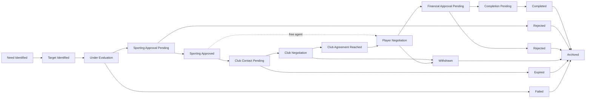
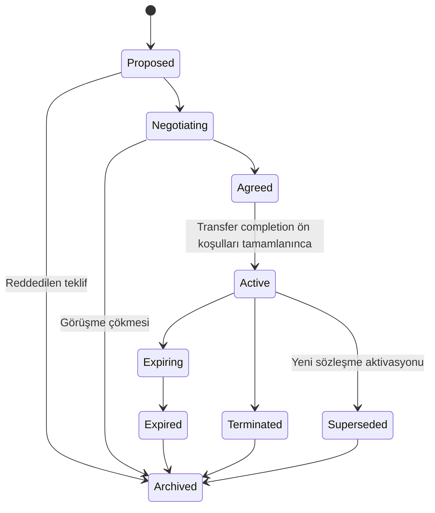
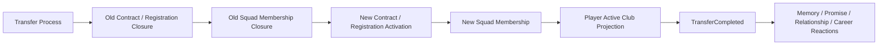

# Transfer ve Sözleşme Sistemi

**Belge:** `docs/08_TRANSFER_SYSTEM.md`
**Durum:** Kesinleşti
**Ana referans:** `docs/01_GAME_DESIGN_DOCUMENT.md`
**Kesin MVP sınırı:** `docs/02_MVP_SCOPE.md`
**Domain sınırları:** `docs/03_DOMAIN_MODEL.md`
**Olay ve kural sözleşmeleri:** `docs/04_EVENT_RULE_ENGINE.md`
**Hafıza ve söz sözleşmeleri:** `docs/05_MEMORY_AND_PROMISE_SYSTEM.md`
**İlişki sözleşmeleri:** `docs/06_RELATIONSHIP_SYSTEM.md`
**Diyalog ve karar sözleşmeleri:** `docs/07_DIALOGUE_SYSTEM.md`
**Mimari yön:** `docs/17_TECHNOLOGY_AND_ARCHITECTURE_DECISION.md`
**İlgili karar günlüğü:** `docs/15_DECISION_LOG.md`

---

## 1. Belgenin Amacı

Bu belge, Football Career Simulator projesinin Transfer ve Sözleşme Sistemine ait teknoloji bağımsız domain kurallarını kesinleştirir.

Sistemin amacı en az şunları kapsar:

* teknik direktörün sportif kadro ihtiyaçlarını transfer süreçlerine dönüştürmek,
* kulübün finansal yetkisi ile teknik direktörün sportif yetkisini ayırmak,
* transferleri yalnız genel güç, piyasa değeri ve maaş karşılaştırmasına indirgememek,
* futbolcunun kariyer hedeflerini, oynama ihtimalini, ilişkilerini ve motivasyonlarını değerlendirmek,
* transfer süreçlerini çok adımlı, izlenebilir ve güvenli biçimde yürütmek,
* başarılı, reddedilmiş, geri çekilmiş, çökmüş ve süresi dolmuş süreçleri ayırmak,
* transfer pencerelerini ve son tarihleri oyun zamanı üzerinden desteklemek,
* oyuncunun kulübü dışındaki AI kulüplerinin de transfer faaliyeti yürütmesini sağlamak,
* completion sonrasında Player, Club, Contract, Registration ve Squad state'lerinin tutarlı kalmasını sağlamak,
* save/load sonrasında aynı transferin ikinci kez tamamlanmasını engellemek,
* on sezon boyunca piyasa hareketi ve kadro yenilenmesini desteklemek,
* transfer kararlarını ve başarısızlıklarını oyuncuya açıklayabilmektir.

Bu belge:

* üretim sınıfları, interface'ler, enum'lar veya record'lar tanımlamaz,
* veritabanı şeması, migration veya SQL üretmez,
* kesin serialization şeması belirlemez,
* kesin Market Value, transfer fiyatı, AI teklif veya Player Decision formülü belirlemez,
* kesin negotiation round sayısı, Counter Offer toleransı veya Offer süresi belirlemez,
* kesin transfer dönemi tarihlerini belirlemez,
* Loan, Player Swap, release clause, buy-back clause, sell-on percentage veya çok taraflı transfer için MVP lifecycle'ı tasarlamaz,
* ayrıntılı Player Agent ağı, menajer komisyonu veya menajer portföyü tasarlamaz,
* `docs/03_DOMAIN_MODEL.md`, `docs/04_EVENT_RULE_ENGINE.md`, `docs/05_MEMORY_AND_PROMISE_SYSTEM.md`, `docs/06_RELATIONSHIP_SYSTEM.md` veya `docs/07_DIALOGUE_SYSTEM.md` kararlarını değiştirmez,
* GDD'nin nihai Player Agent vizyonunu kaldırmaz veya reddetmez; yalnızca MVP'nin sadeleştirilmiş temsilini tanımlar.

---

## 2. Referanslar ve Kapsam

Kaynak önceliği:

1. `docs/01_GAME_DESIGN_DOCUMENT.md`
2. `docs/02_MVP_SCOPE.md`
3. `docs/03_DOMAIN_MODEL.md`
4. `docs/04_EVENT_RULE_ENGINE.md`
5. `docs/05_MEMORY_AND_PROMISE_SYSTEM.md`
6. `docs/06_RELATIONSHIP_SYSTEM.md`
7. `docs/07_DIALOGUE_SYSTEM.md`
8. `docs/17_TECHNOLOGY_AND_ARCHITECTURE_DECISION.md`
9. `docs/15_DECISION_LOG.md`

Kesinleşmiş Domain Model'e göre Transfer süreci `Transfer` bounded context'inin, Player Contract ve Registration ise `Contract & Registration` bounded context'inin authoritative state'idir. Bu belge, mevcut 14 bounded context yapısını değiştirmez ve yeni bir bounded context oluşturmaz.

### 2.1. Kapsam notu — GDD ile MVP arasındaki fark

`docs/01_GAME_DESIGN_DOCUMENT.md` Bölüm 16.2, nihai oyun vizyonunda oyuncu menajerlerini **bağımsız aktörler** olarak tanımlar. Bölüm 16.3, gizli talepler, taviz, blöf, süre baskısı ve rakip teklifler gibi gelişmiş pazarlık davranışlarını nihai vizyonun parçası olarak belirtir.

`docs/02_MVP_SCOPE.md` Bölüm 14.11 ise ayrıntılı menajer ağını, karmaşık sözleşme maddelerini, çok katmanlı temsilci ilişkilerini ve gelişmiş transfer taksitlerini MVP sonrasına bırakır.

Bu belge bu ayrımı açıkça korur:

* GDD'nin nihai oyuncu menajeri vizyonu **iptal edilmemiştir**; yalnızca MVP kapsamına alınmamıştır.
* MVP'de ayrıntılı bir oyuncu menajeri ağı veya menajer ilişki simülasyonu kurulmaz.
* MVP'de kulüp tarafındaki idari ve finansal yürütüm, soyutlanmış bir **Operasyonel Müzakere Temsilcisi** (Operational Negotiation Representative) ile temsil edilir (bkz. Bölüm 8).
* Bu temsilci, oyuncu menajeriyle **aynı kavram değildir**; menajer futbolcuyu, temsilci kulübü temsil eder.
* Domain sınırları, gelecekte bağımsız bir Player Agent aktörünün eklenmesini engellemez (bkz. Bölüm 46).
* Menajer komisyonu, menajer portföyü, ayrıntılı menajer ilişkileri ve gelişmiş blöf davranışları MVP sonrası kapsamına bırakılmıştır (bkz. Bölüm 46).

Bu kapsam notu, GDD'nin nihai vizyonu ile MVP'nin sadeleştirilmiş temsili arasında bir çelişki değildir; ikisi arasındaki ayrımı belgeler.

---

## 3. Bağlayıcı Tasarım İlkeleri

1. Transfer, Contract, Registration ve Squad Membership ayrı authoritative state'lerdir; aynı kavram olarak birleştirilemez.
2. `Transfer` context, Transfer Process yaşam döngüsünün tek authoritative owner'ıdır.
3. `Contract & Registration` context, Player Contract, Registration ve authoritative active club state'inin tek authoritative owner'ıdır.
4. `Player active club projection`, yalnızca `Contract & Registration` authoritative state'inden türetilir; Player Career context'inde ikinci bir authoritative active club alanı bulunmaz.
5. Teknik direktör kulüp bütçesinin, maaş yapısının veya finansal onayın authoritative sahibi değildir.
6. Kulüp yönetimi sportif uygunluğun authoritative sahibi değildir.
7. Sporting Approval ve Financial Approval ayrı authoritative kararlardır; birleştirilemez.
8. Transfer context, başka context'lerin aggregate veya repository'lerini doğrudan değiştiremez; foreign mutation yasaktır.
9. Çok context'li completion, Application-owned process manager ile yürütülür.
10. Aynı Transfer Process ikinci kez tamamlanamaz; aynı maliyet iki kez uygulanamaz.
11. Transferler yalnız genel güç, piyasa değeri veya maaş karşılaştırmasına indirgenemez; Player Decision çok bağlamlıdır.
12. AI kulüpleri aynı domain kurallarına tabidir; yalnız karar sahibi insan yerine seeded simülasyon politikasıdır.
13. Domain kararlarında duvar saati veya gizli global rastlantısallık kullanılamaz.
14. Aynı simulation step içindeki çelişen girdiler handler sırasına göre çözülemez; owner'ın açık conflict policy'si uygulanır.
15. Kesin sayısal formüller, katsayılar ve UI ayrıntıları bu belgede belirlenmez.
16. Board/Finance adıyla yeni bir bounded context oluşturulmaz; mali sınırlar `Club & Governance`, Board Confidence ve teknik direktörün kurumsal görev ilişkisi `Manager Career & Employment` alanına aittir.
17. Loan sistemi MVP kapsamında değildir; ancak domain modeli gelecekte Loan eklenmesini engellemez.
18. Dialogue sistemi Transfer Process state'ini doğrudan değiştiremez, completion gerçekleştiremez veya Approval veremez.

---

## 4. Terminoloji

### 4.1. Transfer Need

Kulübün veya teknik direktörün sportif kadro ihtiyacıdır. Yalnız genel oyuncu gücü açığı olarak tasarlanmaz; eksik pozisyon, yetersiz kadro derinliği, yaşlanan futbolcular, sakatlıklar, sona yaklaşan sözleşmeler, satılması planlanan futbolcu, taktik gereksinim, rol uyumsuzluğu, kulüp politikası veya sezon hedefi gibi kaynaklardan doğabilir.

### 4.2. Transfer Target

Belirli bir Transfer Need için değerlendirilen aday futbolcudur.

### 4.3. Shortlist Entry

Futbolcunun izleme, uygunluk ve öncelik kaydıdır. Aktif bir Transfer Process değildir (bkz. Bölüm 11).

### 4.4. Transfer Process

Belirli bir futbolcu ve ilgili taraflar için açılan, benzersiz kimliği ve çok adımlı yaşam döngüsü bulunan süreçtir.

### 4.5. Club Offer

Kulüpler arasındaki transfer şartları teklifidir (Offered Fee, ödeme bağlamı, ilgili şartlar).

### 4.6. Player Contract Proposal

Futbolcuya sunulan temel çalışma ve sözleşme şartlarıdır (maaş özeti, süre, rol beklentisi).

### 4.7. Sporting Approval

Teknik direktörün transferin sportif uygunluğuna ilişkin kararıdır.

### 4.8. Financial Approval

Kulüp yönetiminin mali uygunluk kararıdır.

### 4.9. Player Decision

Futbolcunun transfer ve sözleşme teklifine ilişkin kararıdır.

### 4.10. Transfer Completion

Bütün zorunlu ön koşullar ve owner transition'ları tamamlandıktan sonra oluşan kontrollü finalization sonucudur.

### 4.11. Transfer Failure

Reddedilme, oyuncu reddi, finansal ret, pencere kapanması, geçersiz state veya doğrulanmış başka nedenle sürecin tamamlanamamasıdır.

### 4.12. Registration

Futbolcunun yeni kulüpte oynama uygunluğuna ilişkin `Contract & Registration` state'idir.

### 4.13. Squad Membership

Futbolcunun `Team Preparation` içindeki aktif kadro üyeliğidir.

Registration, Squad Membership ve Transfer Completion aynı kavram değildir; her biri ayrı authoritative owner'a sahiptir (bkz. Bölüm 14).

---

## 5. Yetki ve Sorumluluk Modeli

Transfer sistemi üç ana yetki alanı üzerine kuruludur: teknik direktörün sportif yetkisi, kulüp yönetiminin mali yetkisi ve operasyonel müzakere temsilcisinin idari yürütme rolü. Bu üç alan birbirinin yerine geçemez.

Nihai finansal onay, mevcut bounded context sınırları içinde Application tarafından orkestre edilen bir kulüp yönetimi kararıdır; ayrı bir "Board/Finance context" olarak modellenmez.

---

## 6. Teknik Direktörün Yetkileri

### 6.1. Yapabilecekleri

Teknik direktör:

* kadro ihtiyacını belirler,
* ihtiyaç pozisyonlarını ve öncelikleri belirler,
* transfer hedeflerini sportif açıdan değerlendirir,
* hedef listesini önceliklendirir,
* gelen A takım transferi için Sporting Approval verir veya reddeder,
* mevcut futbolcunun satışına ilişkin sportif görüş bildirir,
* futbolcunun takım rolü ve oynama ihtimali hakkında görüş bildirir,
* ilgili Promise kuralları izin veriyorsa sportif söz önerebilir,
* kritik transfer kararlarında manuel kontrolü seçebilir.

### 6.2. Yapamayacakları

Teknik direktör:

* kulüp bütçesini değiştiremez,
* transfer ücretini tek başına nihai olarak onaylayamaz,
* maaş yapısının authoritative sahibi olamaz,
* sözleşmeyi hukuken aktive edemez,
* finansal rezervasyonu veya harcamayı doğrudan uygulayamaz,
* Transfer, Contract veya Squad state'ini UI üzerinden doğrudan değiştiremez.

---

## 7. Kulüp Yönetiminin Yetkileri

### 7.1. Yapabilecekleri

Kulüp yönetimi:

* transfer bütçesi sınırını belirler,
* maaş bütçesi sınırını belirler,
* kulüp politikalarını uygular,
* finansal sınırları değerlendirir,
* nihai Financial Approval verir veya reddeder,
* finansal açıdan kabul edilemez transferi durdurabilir,
* teknik direktör talebini bütçe veya politika gerekçesiyle reddedebilir,
* alternatif hedef veya daha düşük maliyetli çözüm talep edebilir.

### 7.2. Yapamayacakları

Kulüp yönetimi sportif uygunluğun authoritative sahibi yapılmamalıdır; Sporting Approval'ı doğrudan veremez veya geçersiz kılamaz.

---

## 8. Operasyonel Müzakere

MVP'de idari ve finansal müzakere, kulüp adına soyutlanmış bir **Operasyonel Müzakere Temsilcisi** tarafından yürütülür.

Bu temsilci:

* teklifleri iletir,
* karşı teklifleri alır,
* tanımlı finansal sınırlar içinde ilerler,
* kritik dönemeçleri teknik direktöre veya yönetime sunar,
* müzakere state'ini doğrudan authoritative owner dışında değiştirmez,
* nihai sportif veya mali karar sahibi değildir.

Bu temsilci, oyuncu menajeriyle aynı kavram değildir: menajer futbolcuyu temsil eden bağımsız bir aktör olabilirken, bu temsilci yalnızca kulübün idari/finansal yürütme kolunun soyutlanmış temsilidir. Ayrıntılı sportif direktör, transfer departmanı, personel işe alma veya transfer çalışanı yönetimi MVP kapsamına alınmaz.

---

## 9. Sportif Veto ve Yönetim Müdahalesi

### 9.1. Gelen transfer

MVP'de kulüp, teknik direktörün açık Sporting Rejection kararına rağmen A takım için yeni futbolcu transferini tamamlayamaz.

Yönetim:

* hedef önerebilir,
* alternatif sunabilir,
* daha düşük maliyetli oyuncu isteyebilir,
* teknik direktörün transfer talebini reddedebilir.

Yönetim, teknik direktörün istemediği futbolcuyu A takıma gizli veya kontrolsüz biçimde transfer edemez.

### 9.2. Giden transfer

Teknik direktör mevcut futbolcunun sportif olarak tutulmasını isteyebilir.

Yönetim:

* finansal açıdan satış talep edebilir,
* önemli teklifi teknik direktöre sunabilir,
* satış baskısı veya hedefi oluşturabilir.

MVP'de finansal kriz, zorunlu satış veya sahip müdahalesi ayrıntılı biçimde modellenmediği için normal oyuncu satışı, teknik direktörün açık Sporting Rejection kararına rağmen tamamlanamaz.

Aşağıdakiler normal satıştan ayrı kavramlardır:

* sözleşme bitişi,
* futbolcunun yeni sözleşmeyi reddetmesi,
* futbolcunun serbest kalması,
* futbolcunun ayrılma talebi,
* gelecekte eklenebilecek release clause veya başka sözleşme maddeleri.

Teknik direktör ile yönetim anlaşmazlığı; Board Confidence, transfer fırsatı, oyuncu memnuniyeti, ilgili Relationship veya Memory değerlendirmeleri ve sonraki bütçe kararları için event girdisi oluşturabilir; ancak gizli transfer completion üretemez.

---

## 10. Transfer Need ve Target Modeli

Transfer Need yalnız genel oyuncu gücü açığı olarak tasarlanmaz.

İhtiyaç kaynakları en az şunları içerebilir:

* eksik pozisyon,
* yetersiz kadro derinliği,
* yaşlanan futbolcular,
* sakatlıklar,
* sona yaklaşan sözleşmeler,
* satılması planlanan futbolcu,
* taktik gereksinim,
* rol uyumsuzluğu,
* kulüp politikası,
* sezon hedefi.

Teknik direktör ihtiyacı manuel oluşturabilir. Personel veya simülasyon sistemi öneri üretebilir; ancak teknik direktörün sportif kararının yerine geçemez (`docs/02_MVP_SCOPE.md` Bölüm 12.2 ile uyumlu).

Transfer Target, belirli bir Transfer Need için değerlendirilen adaydır; Target belirlenmesi otomatik olarak aktif bir Transfer Process açılması anlamına gelmez.

---

## 11. Shortlist ve Aktif Süreç Ayrımı

Shortlist Entry ile Transfer Process ayrımı bağlayıcı bir invariant'tır:

* Shortlist Entry, futbolcunun izleme, uygunluk ve öncelik kaydıdır; kendi başına bir Transfer Process değildir.
* Bir futbolcu birden fazla Shortlist Entry'de yer alabilir (farklı Transfer Need'ler için).
* Shortlist Entry, Transfer Process'e dönüşmeden önce Sporting Approval, Club Offer veya Financial Approval taşımaz.
* Shortlist Entry'den Transfer Process'e geçiş açık bir command ile gerçekleşir (`AddTransferTarget` sonrası ilerleme kararı); sessiz veya örtük geçiş yasaktır.
* Bir Transfer Process, ilişkili olduğu Shortlist Entry archived olsa bile bağımsız yaşam döngüsünü sürdürebilir.
* Shortlist'in kontrolsüz büyümesi veri büyümesi riski olarak Bölüm 38'de ele alınır.

---

## 12. Transfer Process Kavramsal Modeli

Aşağıdaki alanlar kavramsal gereksinimlerdir; kesin class, interface, enum, tablo veya serialization şeması değildir.

| Alan | Neden gerekli | Authoritative owner | Save/load önemi | Determinism/idempotency bağlantısı |
|---|---|---|---|---|
| `TransferProcessId` | Sürecin kalıcı ve benzersiz kimliğidir; bütün ilişkili command/event'ler bu kimliğe bağlanır. | Transfer | Save/load sonrası aynı sürecin ikinci kez tamamlanmaması için zorunludur. | `TransferProcessId + Completion` idempotency kimliğinin temelidir. |
| İlgili `TransferNeedId` | Sürecin hangi sportif ihtiyaçtan doğduğunu izler; açıklanabilirlik sağlar. | Transfer | Need geçmişiyle sürecin ilişkisini korur. | Causation zincirinin başlangıcıdır. |
| `TargetPlayerId` | Sürecin hangi futbolcu için açıldığını belirler. | Transfer (referans); Player Career (identity authority) | Player identity kulüp değişiminde korunmalıdır. | Aynı Player için eşzamanlı süreç kontrolüne girdi sağlar. |
| Alıcı kulüp referansı | Hangi kulübün transferi talep ettiğini belirtir. | Transfer (referans); Club & Governance (identity authority) | Club identity referans bütünlüğü için gereklidir. | Financial Approval'ın hangi kulübe ait olduğunu belirler. |
| Satıcı kulüp veya free-agent işareti | Sürecin free-agent mi yoksa kulüpler arası mı olduğunu ayırır. | Transfer | Free-agent süreçlerinin farklı lifecycle alt kümesini belirler. | Club Negotiation adımının atlanıp atlanmayacağını belirler. |
| Initiator | Süreci kimin başlattığını (kulüp, teknik direktör, satıcı kulüp, futbolcu talebi) izler. | Transfer | Audit ve açıklanabilirlik için gereklidir. | Process direction ile birlikte causation'ı netleştirir. |
| Process direction | Gelen mi giden mi olduğunu ayırır; Sporting Veto kurallarının (Bölüm 9) hangi yönde uygulanacağını belirler. | Transfer | Yaşam döngüsü ve invariant uygulaması için gereklidir. | Deterministic rule seçimini etkiler. |
| Sporting evaluation state | Teknik direktörün değerlendirme aşamasında olup olmadığını gösterir. | Transfer | Ara state'in save/load sonrası korunması gerekir. | Sporting Approval command'ının ön koşuludur. |
| Sporting Approval | Teknik direktörün sportif onay/ret kararıdır. | Transfer (kayıt); teknik direktör yetkisi Manager Career & Employment'tan doğrulanır | Onay olmadan completion'ın tamamlanmaması için zorunludur. | `RequestSportingApproval` → `SportingApprovalGranted/Rejected` idempotent çift olmalıdır. |
| Club Offer kayıtları | Kulüpler arası teklif ve karşı teklif geçmişini tutar. | Transfer | Negotiation Round'ların özetlenebilir geçmişi save büyümesini etkiler (Bölüm 38). | Her Offer benzersiz kimlik taşır; aynı Offer iki kez uygulanamaz. |
| Negotiation state | Müzakerenin hangi aşamada olduğunu (Initial Offer, Counter Offer, Breakdown vb.) gösterir. | Transfer | Ara state save/load sonrası korunmalıdır. | Deterministic conflict policy ile ilerler. |
| Player Contract Proposal | Futbolcuya sunulan temel şartları taşır. | Transfer (teklif); Contract & Registration (aktivasyon) | Agreed proposal referansı Contract modeline bağlanır (Bölüm 13). | Player Decision'ın girdisidir. |
| Player Decision | Futbolcunun teklife ilişkin kararıdır. | Transfer (kayıt); futbolcunun kararı Player Career/Social Continuity girdileriyle değerlendirilir | Kabul/ret geçmişi açıklanabilirlik için korunur. | Aynı teklif için tekrar karar üretilmez. |
| Financial Approval | Yönetimin mali onay/ret kararıdır. | Transfer (kayıt); mali yetki Club & Governance'tan doğrulanır | Onay olmadan maliyetli completion'ın engellenmesi için zorunludur. | `RequestFinancialApproval` → `FinancialApprovalGranted/Rejected` idempotent çift olmalıdır. |
| Transfer window referansı | Sürecin hangi transfer penceresinde değerlendirildiğini belirtir. | World & Calendar (pencere authority); Transfer (referans) | Pencere kapanışında pending süreç davranışını belirler (Bölüm 23). | Deadline sıralamasının parçasıdır. |
| Deadline'lar | Offer süresi, karar süresi gibi son tarihleri taşır. | Transfer (business deadline); Event & Rule Evaluation (due index desteği) | Save/load sonrası deadline değişmemelidir. | Aynı deadline iki kez terminal sonuç üretemez. |
| Process status | Sürecin hangi lifecycle state'inde olduğunu gösterir (Bölüm 15). | Transfer | Terminal state'in save/load sonrası korunması zorunludur. | Geçersiz geçişlerin engellenmesinin temelidir. |
| Process version veya revision | Aynı hedef için yeniden girişimlerin ayrı revizyon olarak izlenmesini sağlar. | Transfer | Revizyon geçmişi özetlenebilir (Bölüm 38). | Yeni Offer/revizyon gerektiğinde yeni kayıt oluşturur. |
| Completed process steps | Process manager'ın hangi adımların tamamlandığını izlemesini sağlar. | Application (process manager); Transfer (referans) | Yarım transfer state'inin save/load sonrası tespit edilebilmesi için zorunludur. | Her step idempotent olmalıdır (Bölüm 18). |
| Failure veya rejection reason | Başarısızlığın nedenini açıklar. | Transfer | Açıklanabilirlik ve geçmiş için korunur. | Aynı ret nedeni ikinci kez üretilmez. |
| Causation | Süreci veya adımı doğrudan tetikleyen command/event'i gösterir. | Transfer (event metadata) | `docs/04_EVENT_RULE_ENGINE.md` Bölüm 6 ile uyumludur. | Debug trace ve cycle detection için gereklidir. |
| Correlation | Sürecin ait olduğu geniş business zincirini gösterir. | Transfer (event metadata) | Aynı korelasyonun geniş sürecini izler. | Determinism testlerinde kullanılır. |
| Rule/model version | Hangi kural/model sürümüyle değerlendirildiğini gösterir. | Transfer | Eski süreçlerin yeni kurallarla sessizce yeniden değerlendirilmemesini sağlar. | `docs/04_EVENT_RULE_ENGINE.md` Bölüm 24 ile uyumludur. |
| Schema version | Save/load ve migration uyumluluğu için gereklidir. | Save Integrity (format); Transfer (içerik) | Migration ve geriye dönük uyumluluk için zorunludur. | Bilinmeyen sürüm sessizce tahmin edilmez. |
| Explanation/audit özeti | Kararın nedenini oyuncuya ve geliştiriciye açıklar. | Transfer | Player-facing ve developer-facing ayrımını destekler (Bölüm 39). | Rule trace ile ilişkilidir. |

Bu tablo doğrudan üretim sınıfı listesi değildir; fiziksel kod organizasyonu geliştirme aşamasında belirlenir.

---

## 13. Contract Kavramsal Modeli

Contract alanı Transfer context'in içine taşınmaz; `Contract & Registration` bounded context'inin authoritative state'idir (`docs/03_DOMAIN_MODEL.md` Bölüm 7.6 ile uyumlu).

Contract için en az şu kavramsal bilgiler değerlendirilir:

| Alan | Açıklama |
|---|---|
| `ContractId` | Sözleşmenin kalıcı kimliği. |
| `PlayerId` | Sözleşmenin tarafı olan futbolcunun kalıcı kimliği. |
| `ClubId` | Sözleşmenin tarafı olan kulübün kalıcı kimliği. |
| Başlangıç oyun tarihi | Sözleşmenin bağlayıcı hâle geldiği oyun zamanı. |
| Bitiş oyun tarihi | Sözleşmenin normal sona erme tarihi. |
| Temel maaş özeti | Sadeleştirilmiş ücret özeti; ayrıntılı bonus yapısı MVP dışıdır (Bölüm 21, 26). |
| Temel mali taahhüt | Sözleşmenin kulübe toplam mali yükünün özeti (Total Financial Commitment, bkz. Bölüm 27). |
| Contract status | Sözleşmenin lifecycle durumu (Bölüm 16). |
| Agreed proposal reference | Sözleşmenin dayandığı Player Contract Proposal'a referans. |
| Transfer process reference, varsa | Sözleşmenin bir Transfer Process sonucu aktive edildiğini gösteren referans. |
| Activation identity | Aktivasyonun idempotency kimliği (`ContractId + Activation`). |
| Termination veya expiration reason | Sözleşmenin nasıl sona erdiğini açıklar. |
| Causation | Aktivasyon veya sonlanmanın doğrudan nedeni. |
| Correlation | Geniş transfer veya sözleşme sürecinin izlenmesi. |
| Schema version | Save/load ve migration uyumluluğu. |

Kesin sözleşme alanları, bonuslar, maddeler veya fiziksel veri formatı bu belgede belirlenmez.

### 13.1. Promise ile Contract Ayrımı

* Contract, kurumsal ve hukuki çalışma kaydıdır; `Contract & Registration` authoritative owner'ıdır.
* Promise, sportif veya profesyonel taahhüttür; `Social Continuity` authoritative owner'ıdır (`docs/05_MEMORY_AND_PROMISE_SYSTEM.md` Bölüm 7.2 ile uyumlu).
* Bir kadro rolü veya oynama beklentisi hem Contract Proposal bağlamı hem Promise bağlamı doğurabilir; ancak aynı authoritative kayıt olamaz. Örneğin bir Player Contract Proposal görüşmesinde "düzenli forma şansı" konuşulması, hem sözleşme görüşmesinin bir parçası olabilir hem de ayrı bir Playing Time Promise doğurabilir; bu iki kayıt bağımsız lifecycle'lara sahiptir ve biri diğerinin yerine geçmez.

---

## 14. Veri Sahipliği

| Veri alanı | Authoritative owner | Transfer context'in rolü |
|---|---|---|
| Transfer Process yaşam döngüsü | Transfer | Owner |
| Player Contract, Registration, authoritative active club | Contract & Registration | Yalnızca referans/tetikleyici command üretir |
| Player kalıcı kimliği ve kariyer state'i | Player Career | Yalnızca query/read model okur |
| Kulüp kimliği, politikaları, bütçe sınırları | Club & Governance | Financial Approval için query okur; bütçeyi doğrudan değiştiremez |
| Squad Membership, Squad Role | Team Preparation | Completion sonrası owner-specific command üretir |
| Teknik direktör kariyeri, Board Confidence | Manager Career & Employment | Sporting Approval yetkisini doğrulamak için query okur |
| Relationship, Memory, Promise | Social Continuity | Query okur; committed event yayınlar, doğrudan değiştiremez |
| Decision Request, Dialogue akışı | Interaction & Narrative | Command üretir; Transfer state'ini doğrudan değiştiremez |
| Event metadata, rule evaluation, idempotency | Event & Rule Evaluation | Routing ve duplicate koruması sağlar; business state sahibi değildir |
| Snapshot, schema version, kayıt bütünlüğü | Save Integrity | Transfer state'ini snapshot'a dahil eder; domain kurallarını atlayarak state oluşturamaz |

Application katmanı, bu context'ler arası use case, process manager, transaction ve orkestrasyon sınırıdır (`docs/03_DOMAIN_MODEL.md` Bölüm 6 ile uyumlu).

---

## 15. Transfer Yaşam Döngüsü

En az şu kavramsal durumlar tanımlanır:

1. Need Identified
2. Target Identified
3. Under Evaluation
4. Sporting Approval Pending
5. Sporting Approved
6. Club Contact Pending
7. Club Negotiation
8. Club Agreement Reached
9. Player Negotiation
10. Financial Approval Pending
11. Completion Pending
12. Completed
13. Rejected
14. Withdrawn
15. Expired
16. Failed
17. Archived

Her süreç bütün ara durumları kullanmak zorunda değildir. Free-agent süreçleri satıcı kulüp müzakeresi (6-8) adımlarını atlayabilir.

### 15.1. Geçersiz Geçişler

* `Completed → Negotiating` geçişi yapılamaz.
* `Rejected`, `Expired`, `Withdrawn` veya `Failed` süreç sessizce tekrar aktif yapılamaz.
* Yeni teklif veya yeniden girişim gerekiyorsa yeni Offer, process revision veya yeni Transfer Process oluşturulmalıdır.
* Transfer penceresi kapandıktan sonra normal Completion gerçekleşemez.
* Terminal süreç ikinci kez tamamlanamaz.
* Archived süreç doğrudan aktif state'e dönemez.

---

## 16. Sözleşme Yaşam Döngüsü

En az şu kavramsal durumlar değerlendirilir:

* Proposed
* Negotiating
* Agreed
* Active
* Expiring
* Expired
* Terminated
* Superseded
* Archived

### 16.1. Bağlayıcı Kurallar

* Bir futbolcu aynı anda en fazla bir aktif kulüp sözleşmesine sahip olabilir.
* Agreed sözleşme, transfer completion ön koşulları tamamlanmadan Active olamaz.
* Yeni sözleşme aktivasyonu ile eski sözleşmenin kapanışı tutarlı finalization içinde yürütülmelidir.
* Sözleşme bitişi oyun zamanı üzerinden değerlendirilir.
* Sözleşme sona erdiğinde Player Career kaydı silinmez.
* Contract, Registration, Squad Membership ve Promise ayrı state'lerdir.
* Contract expiration ile transfer rejection aynı kavram değildir.
* Superseded state yalnız açık sözleşme geçişiyle kullanılabilir.

---

## 17. Transfer Süreci Akışı

Belgede aşağıdaki genel akış bağlayıcıdır:

1. Transfer Need oluşturulur.
2. Target belirlenir.
3. Sportif değerlendirme yapılır.
4. Teknik direktör Sporting Approval verir.
5. Satıcı kulüple temas kurulur; free agent ise bu adım atlanır.
6. Kulüpler şartları sadeleştirilmiş biçimde müzakere eder.
7. Oyuncuyla Player Contract Proposal görüşülür.
8. Futbolcu kariyer, rol ve sözleşme koşullarını değerlendirir.
9. Yönetim nihai Financial Approval verir.
10. Transfer Completion process başlatılır.
11. Eski Contract ve Registration kontrollü biçimde kapanır.
12. Eski Squad Membership kontrollü biçimde kapanır.
13. Yeni Contract ve Registration aktive edilir.
14. Yeni Squad Membership oluşturulur.
15. Player active club projection yeniden oluşturulur.
16. Bütün zorunlu adımlar doğrulandıktan sonra `TransferCompleted` yayınlanır.
17. Memory, Promise, Relationship, Manager Career ve diğer sistemler kendi kurallarıyla tepki verir.
18. Transfer Process arşivlenir.

Bu akış hiçbir foreign aggregate üzerinde doğrudan mutation içermez; her adım Application orkestrasyonu üzerinden ilgili authoritative owner'a yöneltilen command'lar aracılığıyla yürütülür.

---

## 18. Completion ve Process Manager

Transfer completion çok context'li bir süreçtir. Bağlayıcı ilkeler:

* Application-owned process manager kullanılır (`docs/04_EVENT_RULE_ENGINE.md` Bölüm 16.2 ile uyumlu).
* Transfer context başka context'lerin repository veya aggregate'larını doğrudan değiştiremez.
* Process manager gerekli adımları, tamamlanmış step'leri ve pending step'leri izler.
* Her step idempotent olmalıdır.
* Yarım transfer state'i tespit edilebilmelidir.
* Başarısız adım güvenli retry, transaction rollback veya açık compensation gereksinimi üretmelidir.
* Futbolcu iki kulüpte aynı anda aktif sözleşmeli kalamaz.
* Futbolcu completion sonunda iki aktif Registration veya iki Squad Membership taşıyamaz.
* Completion tamamlanmış görünürken futbolcu geçersiz biçimde kulüpsüz kalamaz.
* `TransferCompleted` yalnız bütün zorunlu owner transition'ları tamamlandıktan sonra yayınlanır.
* Aynı Transfer Process ikinci kez tamamlanamaz.
* Save/load yarım process manager state'ini korur.
* Bütün dünyayı kontrolsüz biçimde kilitleyen tek devasa transaction tanımlanmaz.
* Kesin persistence veya transaction implementasyonu belirlenmez.

Tek-process mimari yönüyle uyumlu olarak (`docs/17_TECHNOLOGY_AND_ARCHITECTURE_DECISION.md` Bölüm 8.9, `docs/04_EVENT_RULE_ENGINE.md` Bölüm 9.4), finalization öncesi bütün prerequisites doğrulanabilir ve kritik owner transition'ları sınırlı bir Application Unit of Work içinde atomik commit edilebilir. Bu, dağıtık transaction veya tüm transfer yaşam döngüsünü kapsayan tek transaction olarak tanımlanmaz.

---

## 19. Futbolcu Transfer Kararı

Futbolcu kararı yalnız maaş veya kulüp genel gücüyle belirlenmez.

En az şu girdiler değerlendirilir:

* maaş,
* sözleşme süresi,
* oynama ihtimali,
* önerilen Squad Role,
* pozisyon rekabeti,
* teknik direktörün itibarı,
* futbolcunun teknik direktörle Relationship state'i,
* kulübün sportif itibarı,
* kulübün mevcut kadrosu,
* kulübün sezon beklentisi,
* kariyer hedefleri,
* yaş ve kariyer aşaması,
* profesyonellik,
* hırs,
* sadakat,
* para motivasyonu,
* oynama süresi motivasyonu,
* mevcut kulüpteki durum,
* aktif Promise kayıtları,
* ilgili Memory kayıtları,
* rakip teklifler,
* transfer window ve deadline bağlamı.

Kesin matematiksel puanlama formülü veya katsayı bu belgede belirlenmez.

Sonuç açıklanabilir olmalıdır. Örnek açıklama yönleri:

* "Daha yüksek maaşa rağmen düşük oynama ihtimali nedeniyle reddetti."
* "Daha düşük itibarlı kulübü önemli rol ve güçlü teknik direktör ilişkisi nedeniyle kabul etti."
* "Mevcut kulübüne bağlılığı nedeniyle teklifi reddetti."
* "Aktif oynama sözü ve mevcut rolü nedeniyle ayrılmayı istemedi."

---

## 20. Satıcı Kulüp Kararı

En az şu girdiler değerlendirilir:

* Offered Fee,
* tahmini Market Value,
* Asking Price,
* futbolcunun sportif önemi,
* sözleşmesinin kalan süresi,
* futbolcunun ayrılma isteği,
* kadro derinliği,
* yerine oyuncu bulma ihtimali,
* kulübün bütçe durumu,
* teknik direktörün Sporting Opinion kararı,
* sezon zamanı,
* pencerenin kapanmasına kalan süre,
* futbolcunun yaşı,
* kulüp politikaları,
* alternatif teklifler.

Kesin fiyat formülü bu belgede belirlenmez.

---

## 21. Alıcı Kulüp Kararı

En az şu girdiler değerlendirilir:

* Transfer Need,
* Target Priority,
* sportif uygunluk,
* tahmini transfer maliyeti,
* maaş yapısına etkisi,
* Total Financial Commitment,
* alternatif hedefler,
* oyuncunun kabul olasılığı,
* pencerede kalan süre,
* teknik direktör Sporting Approval,
* yönetimin finansal sınırları,
* kadro limiti ve Squad Need,
* kulüp politikası,
* mevcut açık transfer süreçleri.

AI kulüpleri rastgele oyuncu değiştirerek transfer yapmaz. Aynı domain kuralları AI aktörlerine uygulanır; yalnız karar sahibi insan yerine seeded simülasyon politikasıdır (`docs/04_EVENT_RULE_ENGINE.md` Bölüm 10.5 ile uyumlu).

---

## 22. Müzakere Yaklaşımı

MVP müzakeresi gerçek fakat sadeleştirilmiştir.

### 22.1. Desteklenen Kavramlar

* Initial Offer
* Counter Offer
* Offer Acceptance
* Offer Rejection
* Withdrawal
* Negotiation Breakdown
* Offer Expiration
* bütçe sınırı
* maaş sınırı
* kritik dönemeçte teknik direktör kararı
* kritik dönemeçte yönetim kararı
* Player Contract Proposal
* Squad Role veya Playing Time expectation

### 22.2. MVP Dışında Tutulanlar

* çok katmanlı bonus sistemi
* karmaşık taksit planı
* çok sayıda performans maddesi
* menajer komisyonu simülasyonu
* release clause
* buy-back clause
* sell-on percentage
* player swap
* çok taraflı transfer
* ayrıntılı player-agent ağı
* uzun sinematik pazarlık akışı
* gelişmiş blöf ve gizli talep simülasyonu

Domain modeli gelecekte bu özellikleri eklemeyi gereksiz yere engellemez.

---

## 23. Transfer Pencereleri ve Deadline

Bağlayıcı kurallar:

* Yaz ve kış transfer pencereleri oyun zamanı üzerinden çalışır.
* Normal transfer completion yalnız açık pencere içinde gerçekleşir.
* Kesin tarihleri `World & Calendar` ve `Competition` verisi belirler.
* Pending süreçlerin pencere kapanışındaki davranışı açık lifecycle kurallarıyla yönetilir (Bölüm 15, 42).
* Büyük zaman atlamaları deadline'ı atlayamaz (`docs/04_EVENT_RULE_ENGINE.md` Bölüm 14.4 ile uyumlu).
* Aynı deadline iki kez işlenemez.
* Offer'lar süre sonuna sahip olabilir.
* Son gün gelişmeleri kritik Decision Point üretebilir.
* Düşük önem teklifleri haftalık akışı gereksiz yere durdurmaz.
* Deadline, UI notification'dan bağımsız domain state'tir.
* Save/load sonrasında kalan oyun süresi değişmez.
* Pencere kapanışı sırasında devam eden completion için güvenli checkpoint ve deterministic ordering tanımlanmalıdır.
* Duvar saati kullanılamaz.

Kesin transfer dönemi tarihleri bu belgede belirlenmez; bu karar `World & Calendar` ve `Competition` ayrıntısına bırakılır (bkz. Bölüm 47).

---

## 24. Serbest Futbolcular

MVP'de free-agent transferi desteklenir.

Free-agent süreci:

* satıcı kulüp anlaşması gerektirmez,
* Sporting Approval gerektirir,
* Player Contract Proposal ve Player Decision gerektirir,
* Financial Approval gerektirir,
* Contract, Registration ve Squad Membership transition'larını gerektirir.

Pencere dışı free-agent imza veya registration kuralı bu belgede sessizce kesinleştirilmez. Bu karar açık bırakılır ve Competition/Registration ayrıntısına bağlanır (bkz. Bölüm 47).

---

## 25. Sözleşme Bitişi ve Serbest Kalma

Contract expiration, transfer sürecinden ayrı bir yaşam döngüsüdür.

Kavramsal olarak ele alınır:

* sona yaklaşan sözleşmeler,
* renewal request,
* renewal proposal,
* player renewal decision,
* renewal rejection,
* contract expiration,
* registration closure,
* free agency,
* mevcut kulüpte kalma isteği,
* başka kulüple görüşme uygunluğu.

Kesin pre-contract veya Bosman benzeri kurallar bu belgede açık bırakılır (bkz. Bölüm 47).

---

## 26. Kiralık Transfer Sınırı

Loan sistemi MVP kapsamında değildir.

Nedeni: sözleşme sahipliği, geçici Registration, geçici Squad Membership, maaş paylaşımı, geri dönüş, oynama sözü, transfer penceresi ve ana kulüp ile geçici kulüp arasındaki çoklu ownership karmaşıklığıdır.

Domain modeli gelecekte Loan eklenmesini engellemez. Ancak Loan state'i veya MVP Loan lifecycle'ı bu belgede tasarlanmaz (bkz. Bölüm 46).

---

## 27. Piyasa Değeri ve Gerçek Maliyet Ayrımı

Şu kavramlar ayrılır:

* **Estimated Market Value:** Futbolcunun tahmini piyasa değeri; gerçek transfer fiyatı değildir.
* **Asking Price:** Satıcı kulübün istediği fiyat.
* **Offered Fee:** Alıcı kulübün teklif ettiği fiyat.
* **Agreed Fee:** Kulüpler arasında anlaşılan nihai fiyat.
* **Contract Cost:** Yeni sözleşmenin maliyeti (maaş ve temel mali taahhüt).
* **Total Financial Commitment:** Agreed Fee ve Contract Cost'un birlikte oluşturduğu toplam mali yük özeti.

Estimated Market Value, gerçek transfer fiyatı değildir.

Transfer fiyatı en az şu bağlamlardan etkilenebilir: sportif seviye, yaş, sözleşme süresi, kadro önemi, kulüp itibarı, talep, transfer zamanı, futbolcunun ayrılma isteği, alıcı ve satıcının müzakere durumu.

Kesin değer veya fiyat formülü bu belgede belirlenmez.

---

## 28. Kadro ve Pozisyon İhtiyacı

Transfer Need'in en önemli kaynaklarından biri kadro ve pozisyon ihtiyacıdır. Bu ihtiyaç `Team Preparation` context'inin sahip olduğu Squad Membership ve Squad Role verilerinden türetilir; ancak Transfer context bu veriyi doğrudan değiştiremez, yalnız query/read model olarak okur.

Değerlendirilebilecek girdiler: eksik pozisyon derinliği, yaş dağılımı, sakatlık geçmişi, rol uyumsuzluğu, taktik gereksinim ve mevcut Squad limiti (kesin Squad/Registration limitleri açık bırakılır, bkz. Bölüm 47).

Kadro ihtiyacı değerlendirmesi Transfer Need oluşturma sürecine girdi sağlar (Bölüm 10, 11); Transfer context Squad Membership'i doğrudan yazmaz.

---

## 29. Diyalog Sistemiyle Entegrasyon

Dialogue sistemi şu kararları sunabilir:

* transfer isteğine cevap,
* teklif hakkında futbolcuyla görüşme,
* satış kararını açıklama,
* yeni transferin Squad Role beklentisini konuşma,
* sportif Promise teklif etme veya reddetme,
* müzakere dönüm noktasında teknik direktör kararı.

Dialogue sistemi:

* Transfer Process state'ini doğrudan değiştiremez,
* completion gerçekleştiremez,
* Contract aktive edemez,
* Financial Approval veremez,
* Sporting Approval state'ini UI üzerinden doğrudan yazamaz.

Dialogue Option, Application üzerinden ilgili Transfer veya Promise Command'ını üretir. Domain sonucu authoritative context tarafından belirlenir (`docs/07_DIALOGUE_SYSTEM.md` Bölüm 28 ile uyumlu).

---

## 30. Hafıza ve Söz Sistemiyle Entegrasyon

Transfer sistemi:

* ilgili Memory kayıtlarını sorgulayabilir,
* aktif Promise kayıtlarını sorgulayabilir.

Transfer sistemi:

* Memory Record oluşturamaz,
* Promise state'ini değiştiremez.

Transfer event'leri ilgili owner context'lere minimum Integration Event sağlar.

Örnek zincirler:

`TransferRequestRejected`
→ Memory candidate evaluation
→ Relationship impact evaluation
→ gerekirse yeni Decision Request

`TransferCompleted`
→ aktif Promise evaluation
→ eski profesyonel Relationship bağlamlarının Dormant değerlendirmesi
→ yeni kulüp bağlamının oluşturulması
→ Career ve Narrative reaksiyonları

Aynı causation'ın Promise, Memory ve Relationship kanallarından duplicate etki üretmemesi gerekir; bu ilke `docs/06_RELATIONSHIP_SYSTEM.md` Bölüm 15.3'teki duplicate etki sınırıyla uyumludur (`SourceEventId + RememberingActorId/ObserverActorId + RuleId` gibi kanal bazlı idempotency kimlikleri kullanılır).

---

## 31. İlişki Sistemiyle Entegrasyon

Transfer sistemi:

* ilgili Relationship state'ini query/read model üzerinden okuyabilir.

Transfer sistemi:

* Relationship state'ini değiştiremez.

Örnek girdiler: düşük Trust futbolcunun ayrılma isteğine katkı sağlayabilir; yüksek Respect futbolcunun kulübü tercih etmesine katkı sağlayabilir; düşük Professional Compatibility ayrılma talebini güçlendirebilir (`docs/06_RELATIONSHIP_SYSTEM.md` Bölüm 32 ile uyumlu).

Transfer olayları yeni Relationship Change Input oluşturabilir; ancak nihai Relationship değişimini Relationship context hesaplar.

---

## 32. Yönetim ve Finans Entegrasyonu

Kulüp yönetimi; transfer bütçe sınırının, maaş bütçe sınırının, kulüp politikasının ve nihai Financial Approval kararının sahibidir.

Transfer context bütçe state'ini doğrudan değiştiremez.

Kavramsal olarak:

* teklif aşamasında geçici financial reservation,
* completion aşamasında gerçek financial application,
* süreç çökerse reservation release

gerekebilir.

Kesin muhasebe, ledger, tablo veya reservation implementasyonu bu belgede belirlenmez.

Aynı maliyet iki kez uygulanamaz. Reservation ile actual spending aynı state değildir.

Mali sınırlar `Club & Governance` alanına; Board Confidence ve teknik direktörün kurumsal görev ilişkisi `Manager Career & Employment` alanına aittir. Nihai finansal onay, mevcut bounded context sınırları içinde Application tarafından orkestre edilen bir kulüp yönetimi kararıdır; ayrı bir "Board/Finance context" oluşturulmaz.

---

## 33. Olay ve Kural Motoruyla Entegrasyon

`docs/04_EVENT_RULE_ENGINE.md` kararları korunur:

* Command ve Domain Event ayrımı,
* Domain Event ve Integration Event ayrımı,
* authoritative owner,
* foreign mutation yasağı,
* causation ve correlation,
* deterministic logical processing order,
* idempotency,
* Application-owned process manager,
* Scheduled Evaluation ve deadline ayrımı,
* event/rule versioning,
* cascade ve chain limitleri,
* interruption policy,
* snapshot state ile seçilmiş geçmiş ayrımı,
* exactly-once delivery varsaymama,
* business completion identity kullanma.

---

## 34. Command ve Event Kategorileri

### 34.1. Command Kategorileri

Kesin kod sözleşmesi veya enum oluşturmadan en az şu command kategorileri değerlendirilir. Her command için hedef owner, niyet, temel validation ve olası kabul/ret sonucu kavramsal olarak açıklanabilir.

| Command | Hedef owner | Niyet | Temel validation | Olası sonuç |
|---|---|---|---|---|
| `IdentifyTransferNeed` | Transfer | Sportif ihtiyacı kaydetmek | Kaynak geçerli mi, teknik direktör yetkisi var mı | Kabul; Need oluşturulur |
| `AddTransferTarget` | Transfer | Shortlist'e aday eklemek | Player referansı geçerli mi | Kabul/Ret |
| `PrioritizeTransferTarget` | Transfer | Hedef önceliğini belirlemek | Target mevcut mu | Kabul; öncelik güncellenir |
| `RequestSportingApproval` | Transfer | Teknik direktör onayı istemek | Süreç uygun state'te mi | Onay bekleniyor state'ine geçiş |
| `ApproveTransferSportingly` | Transfer | Sportif onay vermek | İstek sahibi teknik direktör mü, yetkisi var mı | `SportingApprovalGranted` |
| `RejectTransferSportingly` | Transfer | Sportif reddetmek | Aynı koşullar | `SportingApprovalRejected` |
| `SubmitClubOffer` | Transfer | Kulüpler arası teklif sunmak | Pencere açık mı, bütçe reservation uygun mu | Offer kaydı oluşturulur |
| `RespondToCounterOffer` | Transfer | Karşı teklife yanıt vermek | Offer hâlâ geçerli mi | Kabul/Ret/yeni Counter Offer |
| `WithdrawOffer` | Transfer | Teklifi geri çekmek | Offer aktif mi | `TransferWithdrawn` veya offer iptali |
| `SubmitContractProposal` | Transfer | Futbolcuya şart sunmak | Club Agreement tamamlanmış mı | Proposal kaydı oluşturulur |
| `RequestFinancialApproval` | Transfer | Yönetim onayı istemek | Player Decision olumlu mu | Onay bekleniyor state'ine geçiş |
| `ApproveTransferFinancially` | Transfer | Mali onay vermek | Yetkili yönetim mi, bütçe yeterli mi | `FinancialApprovalGranted` |
| `RejectTransferFinancially` | Transfer | Mali reddetmek | Aynı koşullar | `FinancialApprovalRejected` |
| `RequestTransferCompletion` | Transfer / Application (process manager) | Finalization başlatmak | Bütün ön koşullar tamamlanmış mı | `TransferCompletionStarted` veya ret |
| `CancelTransferProcess` | Transfer | Süreci iptal etmek | Süreç terminal değil mi | `TransferWithdrawn` veya `TransferFailed` |
| `ArchiveTransferProcess` | Transfer | Terminal süreci arşivlemek | Süreç terminal mi | `TransferArchived` |

### 34.2. Event Kategorileri

Kesin ve kapalı event kataloğu oluşturmadan en az şu event aileleri değerlendirilir:

* `TransferNeedIdentified`
* `TransferTargetAdded`
* `SportingApprovalGranted`
* `SportingApprovalRejected`
* `TransferOfferSubmitted`
* `TransferOfferAccepted`
* `TransferOfferRejected`
* `CounterOfferReceived`
* `ContractProposalSubmitted`
* `PlayerAcceptedContract`
* `PlayerRejectedContract`
* `FinancialApprovalGranted`
* `FinancialApprovalRejected`
* `TransferCompletionStarted`
* `TransferCompleted`
* `TransferFailed`
* `TransferWithdrawn`
* `TransferExpired`
* `ContractActivated`
* `ContractExpired`
* `PlayerBecameFreeAgent`
* `SquadMembershipChanged`

Integration Event'ler yalnız gerekli minimum veriyi taşımalıdır; iç aggregate yapısını veya mutable object graph'ı dışarı sızdırmamalıdır (`docs/03_DOMAIN_MODEL.md` Bölüm 14.2 ile uyumlu).

---

## 35. Determinizm

Aynı: başlangıç snapshot'ı, transfer girdileri, teklifler, Player ve Club state'i, oyun zamanı, rule/model version ve seed aynı karar ve semantik event zincirini üretmelidir.

Bağlayıcı yön:

* duvar saati kullanılmaz,
* gizli global random kullanılmaz,
* AI kararları açık seeded Simulation Context kullanır,
* dictionary veya koleksiyon sırasına güvenilmez,
* deadline sırası kararlıdır,
* save/load sonrası karar kontrolsüz biçimde değişmez,
* rastlantısal müzakere veya AI seçimi varsa seed tabanlı ve açıklanabilir olmalıdır.

Bu ilkeler `docs/04_EVENT_RULE_ENGINE.md` Bölüm 10 ile uyumludur.

---

## 36. Idempotency

En az şu duplicate riskleri ele alınır:

* aynı Offer'ın iki kez gönderilmesi,
* aynı Acceptance event'inin iki kez tüketilmesi,
* aynı Contract'ın iki kez aktive edilmesi,
* aynı Transfer Process'in iki kez tamamlanması,
* aynı Player'ın iki kez Squad'a eklenmesi,
* aynı Registration'ın iki kez açılması,
* aynı maliyet veya ücretin iki kez uygulanması,
* save/load sonrası completion step'inin tekrar çalışması,
* aynı deadline'ın iki kez çözülmesi.

Kavramsal completion identity örnekleri:

* `TransferProcessId + Completion`
* `OfferId + Submission`
* `ContractId + Activation`
* `PlayerId + ClubId + ActiveRegistration`
* `TransferProcessId + FinancialApplication`
* `TransferProcessId + SquadMembershipApplication`

Kesin persistence tablosu veya database şeması oluşturulmaz. Bu yaklaşım `docs/04_EVENT_RULE_ENGINE.md` Bölüm 11 ile uyumludur.

---

## 37. Save/Load Gereksinimleri

Save içinde en az şunların korunması gerekir:

* aktif Transfer Need kayıtları,
* Shortlist Entry kayıtları ve öncelikleri,
* aktif Transfer Process kayıtları,
* Offer ve Counter Offer kayıtları,
* negotiation state,
* Sporting Approval,
* Financial Approval,
* Player Decision,
* pending Contract Proposal,
* deadline'lar,
* process manager state'i ve completed step'ler,
* financial reservation referansı, varsa,
* processed event/effect identity'leri,
* causation ve correlation,
* schema version,
* rule/model version.

Save/load sonrasında:

* süreç ikinci kez tamamlanmamalı,
* Offer'lar çoğalmamalı,
* deadline değişmemeli,
* bütçe iki kez uygulanmamalı,
* Player iki aktif Contract veya Registration taşımamalı,
* Player iki Squad'da bulunmamalı,
* pending process kaybolmamalı,
* Player ve Club referansları korunmalı,
* terminal state yeniden aktif olmamalıdır.

Kesin serialization ve SQLite tablo yapısı bu belgede belirlenmez.

---

## 38. Veri Büyümesi ve Arşivleme

On sezonluk simülasyonda şu riskler ele alınır:

* bütün başarısız Offer'ların tam ayrıntıyla sonsuza kadar saklanması,
* her Negotiation Round'un kalıcı save'e eklenmesi,
* tamamlanmış process manager state'lerinin aktif kalması,
* Shortlist'in kontrolsüz büyümesi,
* AI kulüplerinin yüzlerce düşük değerli süreç oluşturması,
* aynı hedef için tekrarlı başarısız girişimler,
* transfer haberlerinin authoritative domain state'e dönüşmesi.

### 38.1. Aktif State

* aktif Need'ler
* aktif Target'lar
* aktif Process'ler
* pending Offer ve Approval kayıtları
* deadline ve reservation state'i

### 38.2. Kalıcı Önemli Geçmiş

* Completed transferler
* önemli Failed transferler
* Contract başlangıç ve bitişleri
* önemli teknik direktör transfer kararları
* Career ve Memory sistemlerinin ihtiyaç duyduğu kaynaklar

### 38.3. Özetlenebilir Geçmiş

* düşük önem Offer rejection'ları
* rutin Negotiation Round'ları
* aynı hedef için tekrarlı küçük girişimler

### 38.4. Silinebilecek Teknik Veri

* geçici fiyat hesapları
* reddedilmiş aday evaluation cache'leri
* UI notification kuyruğu
* kısa süreli debug trace
* güvenli retention sonrasındaki teknik retry kayıtları

Kesin retention süresi bu belgede belirlenmez.

---

## 39. Açıklanabilirlik

Her önemli karar veya failure sonucu en az şunları açıklayabilmelidir:

* sonucu veren owner,
* değerlendirilen temel faktörler,
* belirleyici olumlu faktörler,
* belirleyici olumsuz faktörler,
* geçersiz veya eksik prerequisite,
* kullanılan rule/model version,
* causation ve correlation,
* Player-facing kısa açıklama,
* developer-facing ayrıntılı trace.

Ham katsayıları veya gizli bütün bilgileri oyuncuya göstermek zorunlu değildir. Ancak sonuç keyfi görünmemelidir (`docs/04_EVENT_RULE_ENGINE.md` Bölüm 25 ile uyumlu).

---

## 40. Temel Olay Zincirleri

Hiçbir zincir foreign context üzerinde doğrudan mutation içermez.

### 40.1. Teknik direktörün Transfer Need oluşturması

Teknik direktör kadro ihtiyacını belirler → `IdentifyTransferNeed` → Transfer authority validation → `TransferNeedIdentified` → Target belirleme (`AddTransferTarget`) → Shortlist Entry oluşturulur.

### 40.2. Başarılı gelen transfer

`TransferNeedIdentified` → Target seçilir → `RequestSportingApproval` → `SportingApprovalGranted` → satıcı kulüple temas → `SubmitClubOffer` → Counter Offer turları → `TransferOfferAccepted` → `SubmitContractProposal` → `PlayerAcceptedContract` → `RequestFinancialApproval` → `FinancialApprovalGranted` → `TransferCompletionStarted` → owner transition'ları → `TransferCompleted`.

### 40.3. Satıcı Club'ın Offer'ı reddetmesi

`SubmitClubOffer` → satıcı kulüp değerlendirmesi (Bölüm 20) → `TransferOfferRejected` → yeni Offer veya `TransferWithdrawn` → Memory/Relationship candidate değerlendirmesi.

### 40.4. Player'ın Contract Proposal'ı reddetmesi

`SubmitContractProposal` → Player Decision evaluation (Bölüm 19) → `PlayerRejectedContract` → `TransferFailed` veya yeni Proposal girişimi → futbolcu ve teknik direktör için Memory candidate.

### 40.5. Financial Approval'ın reddedilmesi

Player kabul eder → `RequestFinancialApproval` → yönetim değerlendirmesi (Bölüm 7) → `FinancialApprovalRejected` → `TransferFailed` → reservation release → Board Confidence ve Relationship için event girdisi.

### 40.6. Transfer window kapanması

Süreç `Club Negotiation` veya `Player Negotiation` aşamasındayken pencere kapanır → World & Calendar `TransferWindowClosed` sinyali → Transfer authority pending süreci değerlendirir → `TransferExpired` veya sonraki pencereye taşınabilir açık kural → Archived.

### 40.7. Mevcut Player'ın transfer talebi

Futbolcu diyalog üzerinden talep bildirir → Decision Point/Dialogue Session açılır (`docs/07_DIALOGUE_SYSTEM.md` Bölüm 40.4) → teknik direktör semantic intent seçer → Transfer context'e Command gönderilir → `TransferNeedIdentified` (giden yön) veya ret → Relationship/Memory reaksiyonu.

### 40.8. Başarılı Player satışı

Giden Transfer Need → Sporting Approval (Bölüm 9.2 sınırlarına tabi) → alıcı kulüple Club Offer → `TransferOfferAccepted` → Player Decision → Financial Approval → `TransferCompleted` → eski Relationship Dormant değerlendirmesi, yeni kulüp bağlamı.

### 40.9. Free-agent sözleşmesi

`TransferNeedIdentified` (free-agent hedefi) → satıcı kulüp adımı atlanır → `RequestSportingApproval` → `SportingApprovalGranted` → `SubmitContractProposal` → `PlayerAcceptedContract` → `RequestFinancialApproval` → `FinancialApprovalGranted` → `TransferCompletionStarted` → `TransferCompleted`.

### 40.10. Completion sırasında save/load ve recovery

`TransferCompletionStarted` sırasında save alınır → process manager pending step'leri korur → load sonrası aynı step'ler idempotent biçimde devam eder → tamamlanmış step'ler tekrar uygulanmaz → `TransferCompleted` yalnız bir kez yayınlanır.

---

## 41. Domain Değişmezleri

1. Transfer Process benzersiz kimliğe sahiptir.
2. Completed süreç yeniden aktif olamaz.
3. Aynı süreç iki kez tamamlanamaz.
4. Teknik direktör Sporting Approval vermeden gelen A takım transferi tamamlanamaz.
5. Yönetim Financial Approval vermeden maliyetli transfer tamamlanamaz.
6. Player kabul etmeden Contract aktive edilemez.
7. Bir Player aynı anda en fazla bir aktif Club Contract'ına sahip olabilir.
8. Bir Player aynı anda en fazla bir authoritative active Registration'a sahip olabilir.
9. Bir Player aynı anda en fazla bir aktif A takım Squad Membership taşıyabilir.
10. Completion yarım geçerli state bırakamaz.
11. Transfer window kapalıyken normal transfer tamamlanamaz.
12. Aynı Offer iki kez uygulanamaz.
13. Aynı maliyet iki kez bütçeye yansıtılamaz.
14. Contract ile Promise aynı state değildir.
15. Contract ile Squad Membership aynı state değildir.
16. Registration ile Squad Membership aynı state değildir.
17. Shortlist Entry aktif Transfer Process değildir.
18. UI transfer state'ini doğrudan değiştiremez.
19. Dialogue transferi doğrudan tamamlayamaz.
20. Transfer context foreign authoritative state'i doğrudan değiştiremez.
21. Actor ve Club kimlikleri transfer sonrasında korunur.
22. Save/load sonrasında terminal state korunur.
23. Player active club projection yalnız authoritative Contract/Registration state'inden türetilir.

---

## 42. İlk Dikey Kesit Kapsamı

İlk dikey kesitte en az şunlar bulunmalıdır:

* teknik direktörün Transfer Need oluşturması,
* sınırlı Target listesi,
* Sporting Approval,
* Club Offer,
* basit Counter Offer,
* Player Contract Proposal değerlendirmesi,
* Financial Approval,
* transferin tamamlanması veya failure,
* bir Player'ın Club değiştirmesi,
* eski ve yeni Contract tutarlılığı,
* Registration değişimi,
* Squad Membership değişimi,
* transfer window kontrolü,
* deadline,
* determinism,
* idempotency,
* save/load,
* Dialogue ile en az bir gerçek entegrasyon,
* Memory, Promise ve Relationship ile gerçek event entegrasyonları.

İlk dikey kesitte zorunlu değildir:

* Loan
* Player Swap
* taksit
* bonus
* player-agent commission
* release clause
* pre-contract
* çok taraflı transfer
* ayrıntılı scouting
* ayrıntılı transfer personeli
* gelişmiş piyasa simülasyonu
* gerçek dünya federasyon mevzuatı

Bu kapsam `docs/02_MVP_SCOPE.md` Bölüm 20 (İlk Dikey Kesitin Kesin Sınırı) ile uyumludur.

---

## 43. Nihai MVP Kapsamı

Nihai MVP'de sistem:

* 20 Club ve yaklaşık 500 Player ile çalışmalı,
* yaz ve kış transfer dönemlerini desteklemeli,
* kullanıcı kulübü dışındaki Club'ların transfer yapmasını sağlamalı,
* free agent havuzunu desteklemeli,
* Contract expiration işlemlerini yürütmeli,
* teknik direktör Club değiştirdiğinde çalışmaya devam etmeli,
* on sezon boyunca kadroların yenilenmesini desteklemeli,
* Player ve Club kararlarını açıklayabilmeli,
* transferleri yalnız genel güç veya maaş karşılaştırmasına indirgememeli,
* yarım veya duplicate transfer oluşturmamalı,
* save/load sonrasında süreç bütünlüğünü korumalı,
* veri hacmini kontrol altında tutmalıdır.

---

## 44. Sınır Durumları

En az şu durumlar değerlendirilir:

1. **Completion sırasında transfer window kapanması:** Başlanmış finalization, kritik owner transition'ları tamamlanana kadar güvenli checkpoint ile korunur; yeni normal completion pencere dışında başlatılamaz.
2. **Player'ın negotiation sırasında sakatlanması:** Sporting evaluation yeniden değerlendirilir; otomatik ret üretilmez.
3. **Player'ın süreç sırasında retirement kararı alması:** Süreç `Failed` olarak sonuçlanır; Player Career retirement kuralları kendi owner'ında çalışır.
4. **Teknik direktörün süreç sırasında işten çıkarılması:** Sporting Approval yetkisi yeniden doğrulanır; bekleyen onay geçersizleşebilir, süreç açık kural ile pending kalabilir veya `Failed` olabilir.
5. **Teknik direktörün başka Club'a geçmesi:** Eski Club'a ait aktif süreçler yeni Club'a taşınmaz; eski süreç kendi lifecycle'ında sonuçlanır.
6. **Satıcı Club'ın yeni teknik direktör ataması:** Satıcı taraf kararları yeni teknik direktörün Sporting Opinion'ına göre yeniden değerlendirilebilir.
7. **Player kabul ettiği hâlde Financial Approval verilmemesi:** Süreç `Rejected` olur; Player Decision geçmişi korunur, ikinci kez sorulmaz.
8. **Club'ların anlaşması fakat Player'ın reddetmesi:** Süreç `Rejected` olur; Club Agreement geçmişi korunur.
9. **Player kabul ettiği hâlde satıcı Offer süresinin dolması:** Offer expiration terminal sonucu tetikler; yeni Offer gerekir.
10. **Aynı Player için iki aktif Offer:** Her Offer bağımsız izlenir; Player Decision yalnızca bir Offer için nihai kabul üretebilir, diğerleri açık şekilde geçersizleşir.
11. **İki Club'ın eşzamanlı olarak Player ile anlaşmaya yaklaşması:** Deterministic sıralama ve owner conflict policy ile yalnız bir süreç completion'a ulaşabilir; diğeri `Failed` olur.
12. **Duplicate completion event:** İkinci `TransferCompletionStarted` veya `TransferCompleted` teslimi idempotency kimliğiyle reddedilir.
13. **Completion step'leri arasında save alınması:** Process manager step state'i korunur; load sonrası idempotent devam eder.
14. **Ayrılmış bütçenin başka süreç tarafından kullanılmak istenmesi:** Reservation state'i doğrulanır; çakışan talep reddedilir veya sıraya alınır.
15. **Squad limiti veya Need'in completion sırasında değişmesi:** Completion, prerequisite doğrulamasını yeniden çalıştırır; geçersizse süreç güvenli biçimde durur.
16. **Aktif Promise'ın transfer kararını etkilemesi:** Promise read model'i Player Decision ve teknik direktör kararı girdisi olarak kullanılır (Bölüm 19, 30).
17. **Player'ın transfer talebini geri çekmesi:** `CancelTransferProcess` veya eşdeğer domain sonucu `Withdrawn` üretir.
18. **Contract'ın süreç sırasında sona ermesi:** Contract expiration kuralları (Bölüm 25) kendi owner'ında çalışır; Transfer süreci Free-agent bağlamına göre yeniden değerlendirilebilir.
19. **Free agent'ın başka Club'ı seçmesi:** Süreç `Rejected` olur; diğer Club'ın süreci etkilenmez.
20. **Transfer edilen Player'ın eski Match Selection içinde kalması:** Completion sonrası Team Preparation, eski Squad Membership'i kapatır; eski Match Selection ayrı invariant kurallarıyla (Team Preparation context) geçersizleştirilir.
21. **Eksik Player veya Club referansı:** Command reddedilir; sessizce varsayılan değer üretilmez.
22. **Arşivleme sırasında önemli Memory kaynağının silinme riski:** Compaction, Memory'nin ihtiyaç duyduğu kaynak referanslarını koruyacak şekilde sınırlandırılır (Bölüm 38, `docs/05_MEMORY_AND_PROMISE_SYSTEM.md` Bölüm 18).

---

## 45. Test Matrisi

Test kodu üretilmeden aşağıdaki test kategorileri ve senaryoları belgelenmiştir.

### 45.1. Unit Tests

* Transfer Need validation
* Sporting Approval
* Offer validation
* Counter Offer
* Player Decision evaluation
* Financial Approval
* deadline calculation
* Contract state transition

### 45.2. Invariant Tests

* tek aktif Contract
* tek aktif Registration
* tek aktif Squad Membership
* duplicate completion engeli
* pencere dışı completion engeli
* Sporting ve Financial Approval zorunluluğu
* foreign mutation yasağı

### 45.3. Integration Tests

* Need → Target
* Sporting Approval → Offer
* Club agreement → Player negotiation
* Player acceptance → Financial Approval
* Completion → Contract
* Completion → Registration
* Completion → Squad
* Completion → Player active club projection
* Completion → Memory
* Completion → Promise
* Completion → Relationship
* Transfer request → Dialogue

### 45.4. Process Manager Tests

* başarılı transfer
* Club rejection
* Player rejection
* Financial rejection
* window close
* finalization failure
* retry
* rollback, compensation veya güvenli devam

### 45.5. Determinism Tests

* aynı state ve seed ile aynı AI kararı
* aynı Offer ile aynı Player evaluation sonucu
* save/load sonrasında aynı süreç sonucu
* deadline sırasının kararlılığı

### 45.6. Idempotency Tests

* duplicate Offer
* duplicate acceptance
* duplicate Financial Approval
* duplicate Contract activation
* duplicate Registration
* duplicate Squad Membership
* duplicate Transfer Completion
* duplicate financial application

### 45.7. Save/Load Tests

* aktif Offer korunur
* Counter Offer korunur
* Approval kayıtları korunur
* deadline korunur
* process manager step'i korunur
* completion iki kez uygulanmaz
* financial reservation korunur

### 45.8. Long-Running Tests

* 10 sezonda çift aktif Contract oluşmaması
* Club'ların oynanabilir kadro oluşturabilmesi
* free-agent havuzunun çalışması
* process leak oluşmaması
* transfer piyasasının tamamen durmaması
* kadroların kontrolsüz şişmemesi
* save boyutunun kontrol altında kalması

### 45.9. Property Tests

* her Completed transferin geçerli Player, eski Club ve yeni Club referanslarına sahip olması
* her aktif Contract'ın tek Club'a ait olması
* her active Registration'ın tek Club'a ait olması
* her completion'ın yalnız bir kez uygulanması
* her financial application'ın tek completion identity taşıması
* authoritative owner sınırlarının korunması

---

## 46. MVP Sonrasına Ertelenenler

Açıkça MVP sonrasına bırakılır:

* Loan transfer
* Player Swap
* gelişmiş taksitler
* karmaşık bonus yapıları
* release clause
* buy-back clause
* sell-on percentage
* menajer komisyonu
* ayrıntılı bağımsız Player Agent profilleri ve ağı
* Player Agent portföy ilişkileri
* gelişmiş blöf ve gizli talep sistemi
* çok taraflı transfer
* ayrıntılı scouting doğruluğu
* çok katmanlı transfer personeli
* gelişmiş federasyon ve registration mevzuatı
* gerçek dünya transfer hukuku
* gelişmiş piyasa spekülasyonu
* sinematik müzakere akışı

Bunların GDD'nin nihai vizyonundan **kaldırılmadığı** açıkça belirtilir; yalnızca MVP kapsamı dışında bırakılmıştır (bkz. Bölüm 2.1).

---

## 47. Açık Kalan Kararlar

Aşağıdaki konular kesinleştirilmemiştir:

* kesin Market Value formülü,
* kesin transfer fiyatı formülü,
* kesin AI Club offer formülü,
* kesin Player Decision ağırlıkları,
* kesin negotiation round sayısı,
* kesin Counter Offer toleransı,
* kesin Offer süresi,
* kesin transfer dönemi tarihleri,
* free agent pencere dışı signing/registration kuralı,
* pre-contract kuralları,
* kesin Contract alanları,
* maaş ve bonus ayrıntıları,
* taksitler,
* release clause,
* Player Swap,
* Loan,
* Player Agent komisyonu,
* scouting doğruluk modeli,
* kesin Squad/Registration limitleri,
* kesin financial reservation modeli,
* kesin transaction implementasyonu,
* kesin persistence şeması,
* kesin serialization biçimi,
* kesin UI ekranı.

Bu kararlar ilgili alt sistem belgeleri, teknik spike'lar veya küçük ve ölçülebilir implementation design çalışmaları olmadan sessizce kapatılamaz.

---

## 48. Riskler ve Azaltma Yönleri

| Risk | Azaltma yönü |
|---|---|
| Context ownership'in karışması | Katı authoritative ownership sınırı; Transfer, Contract & Registration, Player Career, Club & Governance, Team Preparation ayrımının korunması. |
| Player'ın iki Club'da aktif kalması | Completion invariant'ları, process manager finalization checkpoint'i. |
| Partial completion | Application-owned process manager, idempotent step'ler, güvenli retry ve rollback. |
| Duplicate completion | `TransferProcessId + Completion` business completion identity. |
| Duplicate financial application | `TransferProcessId + FinancialApplication` idempotency kimliği; reservation ile actual spending ayrımı. |
| Window/deadline race condition | Deterministic simulation ordering, due index, earliest-effective-deadline yaklaşımı. |
| AI kulüplerinin anlamsız veya aşırı süreç üretmesi | Aynı domain kurallarının seeded simülasyon politikasıyla uygulanması, Shortlist/Process ayrımı. |
| Pazarlık geçmişinin save'i şişirmesi | Aktif/kalıcı/özetlenebilir/silinebilir veri ayrımı (Bölüm 38). |
| Shortlist ile aktif sürecin karıştırılması | Bağlayıcı Shortlist Entry / Transfer Process invariant'ı (Bölüm 11). |
| Player Decision'ın yalnız paraya indirgenmesi | Çok bağlamlı Player Decision girdileri (Bölüm 19). |
| Sporting ve Financial Approval'ın birleştirilmesi | Ayrı authoritative owner ve ayrı command/event kategorileri (Bölüm 6, 7, 34). |
| Dialogue veya UI'ın state owner yapılması | Dialogue entegrasyon sınırı (Bölüm 29), UI mutation yasağı. |
| Memory/Promise/Relationship duplicate etkisi | Kanal bazlı idempotency kimlikleri ve primary/contextual effect ayrımı (Bölüm 30, 31). |
| GDD Player Agent vizyonunun yanlışlıkla MVP'ye tam kapsamla taşınması veya tamamen kaldırılması | Açık kapsam notu (Bölüm 2.1) ve Operasyonel Müzakere Temsilcisi ayrımı (Bölüm 8). |
| Save/load sırasında yarım process'in kaybolması | Process manager state'inin save/load gereksinimlerine dahil edilmesi (Bölüm 18, 37). |

---

## 49. Sonraki Adım

Bu belge kesinleştikten sonra önerilen en küçük sıradaki tasarım çalışması:

`docs/09_MATCH_SIMULATION.md`

Bu adımdan önce:

* üretim kodu yazılmamalı,
* transfer sayısal formülleri veya UI ayrıntıları belirlenmemeli,
* GDD veya MVP kapsamı değiştirilmemeli,
* bu belgede açık bırakılan kararlar sessizce kapatılmamalıdır.

`docs/09_MATCH_SIMULATION.md` hazırlanırken, bu belgede tanımlanan Squad/Contract/Registration entegrasyon sınırları ve Transfer completion sonrası Player active club projection kuralları değiştirilmeden dikkate alınmalıdır.
