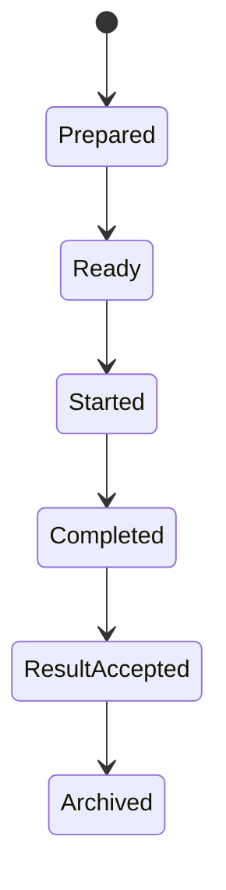

# Maç Simülasyonu ve Maç Sunumu Sistemi

**Belge:** `docs/09_MATCH_SIMULATION.md`
**Durum:** Kesinleşti
**Ana referans:** `docs/01_GAME_DESIGN_DOCUMENT.md`
**Kesin MVP sınırı:** `docs/02_MVP_SCOPE.md`
**Domain sınırları:** `docs/03_DOMAIN_MODEL.md`
**Olay ve kural sözleşmeleri:** `docs/04_EVENT_RULE_ENGINE.md`
**Hafıza ve söz sözleşmeleri:** `docs/05_MEMORY_AND_PROMISE_SYSTEM.md`
**İlişki sözleşmeleri:** `docs/06_RELATIONSHIP_SYSTEM.md`
**Diyalog ve karar sözleşmeleri:** `docs/07_DIALOGUE_SYSTEM.md`
**Transfer ve sözleşme sözleşmeleri:** `docs/08_TRANSFER_SYSTEM.md`
**Mimari yön:** `docs/17_TECHNOLOGY_AND_ARCHITECTURE_DECISION.md`
**İlgili karar günlüğü:** `docs/15_DECISION_LOG.md`

---

## 1. Belgenin Amacı

Bu belge, Football Career Simulator projesinin Maç Simülasyonu ve Maç Sunumu Sistemine ait teknoloji bağımsız domain kurallarını kesinleştirir.

Sistemin amacı en az şunları kapsar:

* oyuncunun kadro ve taktik kararlarını gerçek maç sonuçlarına dönüştürmek,
* güçlü takımın her zaman kazanmadığı fakat sonuçların anlamsız biçimde rastgele olmadığı bir model oluşturmak,
* maç sonucunu birden fazla sportif, fiziksel, taktiksel ve bağlamsal faktöre dayandırmak,
* maçın görsel sunumdan bağımsız çalışmasını sağlamak,
* maç içi müdahaleleri güvenli, doğrulanabilir command'lara dönüştürmek,
* gol, kart, sakatlık, değişiklik ve önemli performans olaylarını üretmek,
* maç sonucunun Competition tarafından yalnızca bir kez kabul edilmesini sağlamak,
* başka sistemlere gerçek, açıklanabilir ve idempotent sonuç girdileri sağlamak,
* aynı snapshot, input sequence, model sürümü ve seed ile aynı sonucu yeniden üretmek,
* kullanıcıya neden kazandığını veya kaybettiğini yaklaşık biçimde açıklamak,
* on sezon ve binlerce maç ölçeğinde performans ve veri büyümesini kontrol etmek,
* oyuncu kulübünün maçları ile arka plan maçlarını aynı semantik sözleşmeler altında desteklemektir.

Bu belge:

* üretim sınıfları, interface'ler veya enum'lar tanımlamaz,
* kesin matematiksel formül, olasılık modeli veya katsayı belirlemez,
* veritabanı şeması, migration veya SQL üretmez,
* kesin serialization biçimi belirlemez,
* fiziksel görsel motor, 2D/3D renderer veya Godot sahnesi tasarlamaz,
* kesin factor ağırlıklarını, segment uzunluğunu veya RNG algoritmasını belirlemez,
* `docs/03_DOMAIN_MODEL.md`, `docs/04_EVENT_RULE_ENGINE.md`, `docs/05_MEMORY_AND_PROMISE_SYSTEM.md`, `docs/06_RELATIONSHIP_SYSTEM.md`, `docs/07_DIALOGUE_SYSTEM.md` veya `docs/08_TRANSFER_SYSTEM.md` kararlarını değiştirmez.

---

## 2. Referanslar ve Kapsam

Kaynak önceliği:

1. `docs/01_GAME_DESIGN_DOCUMENT.md`
2. `docs/02_MVP_SCOPE.md`
3. `docs/03_DOMAIN_MODEL.md`
4. `docs/04_EVENT_RULE_ENGINE.md`
5. `docs/05_MEMORY_AND_PROMISE_SYSTEM.md`
6. `docs/06_RELATIONSHIP_SYSTEM.md`
7. `docs/07_DIALOGUE_SYSTEM.md`
8. `docs/08_TRANSFER_SYSTEM.md`
9. `docs/17_TECHNOLOGY_AND_ARCHITECTURE_DECISION.md`
10. `docs/15_DECISION_LOG.md`

Kesinleşmiş Domain Model'e göre tek bir maçın çalışma state'i, timeline'ı ve sonucu `Match` bounded context'inin authoritative state'idir. `Fixture`, `Competition` bounded context'inin authoritative state'idir. Bu belge mevcut 14 bounded context yapısını değiştirmez ve yeni bir bounded context oluşturmaz.

Bu belge şu bounded context'lerle kararlı event, command, query veya projection sözleşmeleri üzerinden çalışır:

* Competition,
* Team Preparation,
* Training & Physical State,
* Player Career,
* Social Continuity (Relationship, Memory, Promise),
* Manager Career & Employment,
* Transfer,
* Interaction & Narrative,
* Event & Rule Evaluation,
* Save Integrity.

---

## 3. Uyumluluk Notu

`docs/01_GAME_DESIGN_DOCUMENT.md` Bölüm 17 (Maç ve Taktik Sistemi) ve Bölüm 25 (Rastlantısallık ve Adalet), maçın "güçlü takımın her zaman kazanmadığı ancak sonuçların tamamen rastgele olmadığı" bir model kullanmasını ve ilk sürüm için 2D/metin tabanlı sunum seçeneklerini öngörür. `docs/02_MVP_SCOPE.md` Bölüm 14.6 ve Bölüm 19, MVP maç simülasyonu ve sunumunun minimum kapsamını ve MVP dışı bırakılan ayrıntıları kesinleştirir.

Bu belge:

* GDD'nin Bölüm 17 ve Bölüm 25 ilkelerini değiştirmez, yalnızca teknoloji bağımsız domain sözleşmelerine dönüştürür,
* `docs/02_MVP_SCOPE.md` Bölüm 14.6 ve Bölüm 19'daki minimum kapsamı ve MVP dışı sınırları korur,
* `docs/03_DOMAIN_MODEL.md` Bölüm 7.9'da tanımlanan `Match` context sorumluluğunu ayrıntılandırır; context listesini veya aggregate root adaylarını değiştirmez,
* `docs/04_EVENT_RULE_ENGINE.md` Bölüm 19'daki Match Internal/Timeline/World Event ayrımını uygular ve ayrıntılandırır,
* `docs/05_MEMORY_AND_PROMISE_SYSTEM.md` ve `docs/06_RELATIONSHIP_SYSTEM.md`'de tanımlanan Memory/Promise/Relationship authoritative ownership sınırlarını korur; Match bu sistemlerin state'ini doğrudan değiştiremez,
* `docs/07_DIALOGUE_SYSTEM.md` Bölüm 40.1'de örneklenen forma süresi/Promise entegrasyonunu ve maç içi Decision Point kavramını genişletmeden kullanır,
* `docs/08_TRANSFER_SYSTEM.md`'de tanımlanan Squad/Contract/Registration entegrasyon sınırlarını ve Transfer completion sonrası Player active club projection kuralını değiştirmeden dikkate alır,
* `docs/17_TECHNOLOGY_AND_ARCHITECTURE_DECISION.md` Bölüm 9'daki motor bağımsız simülasyon çekirdeği ve presentation-neutral çıktı yönünü uygular.

Değerlendirme sırasında bu belgeler arasında gerçek bir çelişki tespit edilmemiştir (bkz. Bölüm 40 — Tutarlılık Kontrol Listesi).

---

## 4. Bağlayıcı Tasarım İlkeleri

1. `Match` context, tek bir maçın snapshot, aktif state, timeline, skor, interventions, result ve performance summary verilerinin authoritative owner'ıdır.
2. `Fixture`, `Match Preparation` ve `Match` ayrı kimliklere, lifecycle'lara ve authoritative owner'lara sahiptir.
3. Toplam 14 bounded context yapısı korunur; yeni bir bounded context oluşturulmaz.
4. Match başladıktan sonra başlangıç snapshot'ı immutable olur; foreign context state'i geriye dönük Match input'unu değiştiremez.
5. Ana maç simülasyonu Godot scene tree veya frame loop olmadan çalışır; saf .NET headless runner üzerinden çalıştırılabilir.
6. Godot yalnız Presentation katmanıdır; simülasyon frame rate'e bağlı olamaz.
7. Global veya gizli rastlantısallık kullanılamaz; RNG state'i açık Match Simulation Context üzerinden sağlanır.
8. Snapshot ana runtime state kaynağıdır; tam event sourcing kullanılmaz.
9. Kalıcı save yönü versioned SQLite tabanlı tek dosyalı container'dır; kesin persistence şeması bu belgede belirlenmez.
10. Harici üretken yapay zekâ maç sonucu, yorum, taktik etkisi veya açıklama üretmek için zorunlu bağımlılık olamaz.
11. Bir context başka bir context'in aggregate veya repository'sini doğrudan mutate edemez; Match sonucu başka sistemlere doğrudan tablo güncellemesiyle uygulanamaz.
12. UI hiçbir authoritative domain state'ini doğrudan değiştiremez.
13. Application katmanı context'ler arası use case, idempotency, transaction ve process orchestration sınırıdır.
14. Tek bir genel takım gücü puanı bütün sonucu belirleyemez; en yüksek toplam ability otomatik galibiyet garantisi veremez.
15. Kesin factor ağırlıkları, matematik formülleri, RNG algoritması ve denge eşikleri bu belgede açık bırakılır.

---

## 5. Terminoloji

### 5.1. Fixture

Competition tarafından planlanan resmî karşılaşmadır. Tarih, katılımcı kulüpler ve competition bağlamını taşır. Fixture ile Match aynı aggregate veya lifecycle değildir.

### 5.2. Match Preparation

Team Preparation tarafından maç öncesinde onaylanan selection, starting eleven, substitutes, tactic plan ve match plan bütünüdür.

### 5.3. Match

Tek bir karşılaşmanın hazırlanan snapshot'tan tamamlanmış ve immutable sonuca kadar ilerleyen authoritative çalışma state'idir.

### 5.4. Match Snapshot

Maç başlamadan önce Match context'e aktarılan, dış context'lerin gerekli authoritative state'lerinden oluşturulmuş immutable girdidir.

### 5.5. Match Simulation Context

Maçın simulation version, content version, RNG version, seed/stream, fidelity profile ve deterministic processing bilgilerini taşıyan çalışma bağlamıdır.

### 5.6. Simulation Fidelity Profile

Maçın hangi ayrıntı seviyesinde hesaplanacağını tanımlayan açık ve sürümlenmiş profildir. Profil değişimi foreign domain kurallarını veya çıktı sözleşmesini ortadan kaldıramaz.

### 5.7. Internal Simulation Signal

Maç matematiğinin kendi içinde kullandığı yüksek hacimli geçici değerlendirmedir. Domain Event veya oyuncuya gösterilecek Timeline Event değildir.

### 5.8. Timeline Event

Oyuncuya gösterilmeye değer önemli maç olayıdır. Gol, temel kart, sakatlık olayı, değişiklik veya kritik pozisyon gibi olayları temsil edebilir.

### 5.9. Match Fact

Başka domain context'lerin değerlendirmesine sunulabilecek commit edilmiş maç gerçeğidir. Timeline Event ile bire bir aynı olmak zorunda değildir.

### 5.10. Match Intervention

Teknik direktörün maç sırasında yaptığı, Application üzerinden Match context'e gönderilen doğrulanabilir command'dır.

### 5.11. Safe Checkpoint

Maç simülasyonunun tutarlı state bıraktığı; müdahale, pause, save veya presentation güncellemesinin güvenli biçimde yapılabildiği sınırdır.

### 5.12. Match Result

Skor, tamamlanma durumu ve gerekli resmî sonuç verilerini taşıyan immutable maç sonucudur.

### 5.13. Performance Summary

Futbolcu ve takım performanslarına ilişkin Match tarafından üretilen sınırlı, açıklanabilir sonuç özetidir.

### 5.14. Explanation Metadata

Maç sonucuna gerçek simülasyon içinden katkı yapan ana faktörleri, olayları ve taktiksel bağlamı doğal dil sunumuna uygun fakat formülü ifşa etmeyen biçimde temsil eden metadata'dır.

### 5.15. Result Acceptance

Competition context'inin Match Result'ı belirli Fixture için yalnızca bir kez resmî olarak kabul etmesidir.

### 5.16. Match Presentation Read Model

Presentation katmanının skor, saat, timeline, istatistik, aktif oyuncular, müdahale seçenekleri ve açıklamaları göstermek için kullandığı türetilmiş modeldir.

---

## 6. Authoritative Veri Sahipliği

| Veri | Authoritative owner |
|---|---|
| Fixture tarihi ve katılımcıları | Competition |
| Match preparation durumu | Team Preparation |
| Starting eleven ve substitutes onayı | Team Preparation |
| Reusable tactic plan | Team Preparation |
| Maç başlangıç snapshot'ı | Match |
| Aktif maç saati ve maç içi state | Match |
| Maç içi skor | Match |
| Maç timeline'ı | Match |
| Maç içi substitution kayıtları | Match |
| Maç içi intervention sonuçları | Match |
| Maç sonucu | Match |
| Resmî fixture result acceptance | Competition |
| Uzun vadeli fatigue ve fitness | Training & Physical State |
| Kalıcı injury episode | Training & Physical State |
| Player ability ve career state | Player Career |
| Relationship, Memory ve Promise | Social Continuity |
| Board Confidence ve manager career sonucu | Manager Career & Employment |
| Presentation state | Presentation |
| Save metadata ve bütünlük | Save Integrity |

Match context başka context'lerin state'ini doğrudan değiştiremez. Match yalnızca committed Match Fact ve Integration Event üretir; ilgili owner kendi kurallarıyla değerlendirir ve kendi state'ini değiştirir.

---

## 7. Match, Fixture ve Match Preparation Ayrımı

### 7.1. Fixture lifecycle

```text
Planned
→ PreparationOpen
→ Ready
→ ResultAccepted
→ Archived
```

### 7.2. Match lifecycle

```text
Prepared
→ Ready
→ Started
→ Completed
→ ResultAccepted
→ Archived
```

### 7.3. Bağlayıcı kurallar

* Fixture ve Match farklı kimliklere sahiptir.
* Ready olmayan Fixture için Match başlatılamaz.
* Match başlayınca başlangıç snapshot'ı immutable olur.
* Completed Match yeniden başlatılamaz.
* Completed Match Result normal oynanış yoluyla değiştirilemez.
* Aynı Match iki kez tamamlanamaz.
* Aynı Match Result aynı Fixture'a iki kez uygulanamaz.
* Match'in `ResultAccepted` aşaması, Competition acceptance onayından sonra oluşur.
* Match'in teknik olarak yarıda kalması, otomatik olarak geçerli bir tamamlanmış sonuç üretmez.
* Pause veya intervention checkpoint'i yeni bir üst seviye business lifecycle state'i oluşturmak zorunda değildir; aktif Match içindeki execution state olarak modellenebilir.



---

## 8. MVP Kapsamı

`docs/02_MVP_SCOPE.md` Bölüm 14.6 ile uyumlu olarak MVP en az şunları içerir:

* iki geçerli takım, maç kadroları, ilk 11 ve yedekler,
* futbolcu yetenekleri, taktik girdileri, kondisyon, yorgunluk,
* temel maç bağlamı, kontrollü rastlantısallık,
* skor üretimi, gol olayları, temel kartlar, maç içi sakatlık,
* oyuncu değişiklikleri, sınırlı taktik müdahaleler,
* önemli olay zaman çizelgesi, oyuncu performans özeti,
* tekrar üretilebilir maç bağlamı (determinism).

MVP presentation'ı `docs/02_MVP_SCOPE.md` Bölüm 19 ile uyumlu olarak olay zaman çizelgesi, skor, temel maç istatistikleri, önemli anlar, oyuncu değişiklikleri, sınırlı maç içi taktik müdahaleleri, hızlandırma ve doğrudan sonuca gitme seçeneklerinden oluşur.

---

## 9. MVP Dışı Kapsam

`docs/02_MVP_SCOPE.md` Bölüm 14.6 ve Bölüm 19 ile uyumlu olarak MVP dışında tutulur:

* fiziksel 2D futbolcu hareketleri,
* fiziksel top simülasyonu,
* 3D maç motoru,
* gerçek zamanlı fizik tabanlı futbol simülasyonu,
* ayrıntılı animasyonlu saha gösterimi,
* ayrıntılı hakem kişiliği ve VAR,
* ayrıntılı hava durumu ve saha simülasyonu.

Gelecekte gelişmiş 2D veya olası 3D sunum aynı temel simülasyon çıktılarını tüketebilmelidir. Gelecekte görsel katman eklenmesi, maç çekirdeğinin yeniden yazılmasını gerektirmemelidir.

---

## 10. Match Snapshot

Kesin class, interface, record, serialization şeması veya tablo üretmeden Match Snapshot en az şu bilgileri desteklemelidir:

* `MatchId`
* `FixtureId`
* Competition ve season referansları
* Home ve away club referansları
* Onaylanmış starting eleven
* Onaylanmış substitutes
* Player identity referansları
* Pozisyon ve tactical assignment bilgileri
* Gerekli sadeleştirilmiş ability profile
* Position fit veya role fit girdileri
* Tactic plan snapshot'ları
* Match plan
* Tactical familiarity veya preparation girdisi
* Fitness
* Fatigue
* Match availability
* Başlangıçtaki geçerli injury ve sanction bilgisi
* Form veya önceki belgelerde authoritative kaynağı bulunan diğer sportif bağlam girdileri
* Home advantage bağlamı
* Match importance
* Gerekliyse pressure veya leadership girdileri
* Simulation fidelity profile
* Root match seed veya named RNG stream referansı
* RNG algorithm/version
* Match simulation model version
* Rule set version
* Content version
* Snapshot creation game time
* Correlation ve causation bilgileri
* Schema version

### 10.1. Bağlayıcı kurallar

* Snapshot, dış context'lerin mutable nesne referanslarını taşıyamaz.
* Snapshot stable ID ve immutable değerlerden oluşmalıdır.
* Match başladıktan sonra foreign context değişiklikleri mevcut Match Snapshot'ı geriye dönük değiştiremez.
* Maç sırasında yapılan müdahaleler başlangıç snapshot'ını yeniden yazmaz; Match'in aktif effective state'inde yeni revision oluşturur.
* Snapshot oluşturulurken eksik veya bozuk referans sessizce atlanamaz.
* Geçersiz selection, unavailable player veya çakışan oyuncu kaydıyla Match başlatılamaz.

---

## 11. Match Simulation Context

Match Simulation Context en az şunları taşır:

* Match simulation model version,
* content version,
* rule set version,
* RNG algorithm/version,
* root seed veya named deterministic stream referansları,
* seçilen Simulation Fidelity Profile ve version'ı,
* deterministic processing/queue sıralama bilgisi,
* correlation ve causation bağlamı.

Match Simulation Context, `docs/04_EVENT_RULE_ENGINE.md` Bölüm 10'daki deterministik işleme ve seeded Random Context ilkelerine tabidir. Farklı amaçlar için named deterministic streams veya eşdeğer ayrıştırılmış RNG bağlamı kullanılabilir.

---

## 12. Match Lifecycle

Bölüm 7.2'de tanımlanan lifecycle bağlayıcıdır. Ek olarak:

* Match içindeki müdahaleler ve safe checkpoint'ler, `Started` state'i içinde execution-level alt state olarak modellenir; yeni bir üst seviye lifecycle state'i gerektirmez.
* `Completed` state'i, bütün zorunlu simulation segment'lerinin ve finalization adımlarının tamamlanmasını gerektirir.
* `ResultAccepted`, yalnız Competition context'in kabulünden sonra Match lifecycle'a yansıtılır; Match bu kabulü kendi başına üretemez.
* `Archived`, retention ve compaction politikalarına tabi tarihsel state'tir (bkz. Bölüm 31).

---

## 13. Simülasyon Mimarisi

MVP için şu ana model bağlayıcı kabul edilir:

> Fiziksel hareket simülasyonu yerine ayrık zamanlı, phase/segment tabanlı ve olay üreten presentation-neutral maç simülasyonu.

Bu model:

* frame-by-frame top ve futbolcu fiziği çalıştırmaz,
* Godot render döngüsüne bağlı değildir,
* maç zamanını deterministik simulation segment'leriyle ilerletir,
* her segmentte takımların güncel effective state'ini değerlendirir,
* hücum kurma, fırsat üretme, şans kalitesi ve sonuç çözümleme gibi kavramsal aşamaları destekleyebilir,
* gol, kritik şans, kart, sakatlık veya başka önemli sonuçlar üretebilir,
* kesin probability formüllerini bu belgede belirlemez,
* gerçek zamanlı animasyon olmadan bütün maçı tamamlayabilir.

### 13.1. Kavramsal işlem zinciri

```text
Validated Match Snapshot
→ Pre-Match Derived State
→ Match Start
→ Repeated Simulation Segments
→ Internal Opportunity Evaluation
→ Incident / Chance Resolution
→ Timeline Projection
→ Safe Checkpoint
→ Optional Intervention
→ Match Completion
→ Performance and Explanation Finalization
→ Immutable Match Result
→ Competition Result Acceptance
```

### 13.2. Aşama sorumlulukları

* **Validated Match Snapshot:** Snapshot geçerliliği ve eksiksizliği doğrulanmış girdidir; Bölüm 10 kurallarına tabidir.
* **Pre-Match Derived State:** Snapshot'tan türetilen, simülasyonun ilk segmentinde kullanılacak effective ability/tactic/physical bileşimidir; snapshot'ı değiştirmez.
* **Match Start:** Match `Started` durumuna geçer; başlangıç snapshot'ı immutable hâle gelir.
* **Repeated Simulation Segments:** Maç zamanı ayrık, deterministik segmentlerle ilerler; her segment güncel effective state'i değerlendirir.
* **Internal Opportunity Evaluation:** Segment içi yüksek hacimli Internal Simulation Signal üretimidir; dünya event akışına yayınlanmaz.
* **Incident / Chance Resolution:** Gol, kart, sakatlık gibi önemli sonuçların kontrollü rastlantısallık ile çözümlenmesidir.
* **Timeline Projection:** Önemli sonuçların oyuncuya sunulacak Timeline Event'lere dönüştürülmesidir.
* **Safe Checkpoint:** Tutarlı state sınırıdır; müdahale, pause veya save bu noktalarda güvenle yapılabilir.
* **Optional Intervention:** Teknik direktörün Match Intervention Command'ları bu noktalarda değerlendirilir (bkz. Bölüm 19).
* **Match Completion:** Bütün zorunlu segmentler ve pending intervention'lar tamamlandığında Match `Completed` olur.
* **Performance and Explanation Finalization:** Performance Summary ve Explanation Metadata üretilir.
* **Immutable Match Result:** Skor ve resmî sonuç verileri immutable hâle gelir.
* **Competition Result Acceptance:** Competition, Match Result'ı ilgili Fixture için yalnızca bir kez resmî olarak kabul eder (bkz. Bölüm 24).

---

## 14. Sonucu Etkileyen Faktörler

GDD ve MVP ile uyumlu olarak en az şu faktör aileleri değerlendirilir:

* Player quality
* Position fit
* Tactic fit
* Tactical familiarity
* Starting eleven ve bench kalitesi
* Team mentality
* Tempo veya risk yaklaşımı
* Sınırlı attacking approach
* Sınırlı defensive approach
* Team-level compatibility girdileri
* Player form, yalnız authoritative kaynağı mevcutsa
* Morale veya psikolojik bağlam, yalnız authoritative kaynağı mevcutsa
* Fitness
* Fatigue
* Existing injury etkisi
* Match importance
* Pressure
* Leadership
* Player personality girdileri, yalnız uygun ve kesinleşmiş contract üzerinden
* Home advantage
* Opponent tactic
* Manager interventions
* Controlled randomness

### 14.1. Bağlayıcı kurallar

* Tek bir genel takım gücü puanı bütün sonucu belirleyemez.
* En yüksek toplam ability otomatik galibiyet garantisi veremez.
* Düşük güçlü takımın kazanması mümkün olmalı fakat açıklanamaz sıklıkta olmamalıdır.
* Kesin factor ağırlıkları ve matematik formülleri açık bırakılır.
* MVP dışında bırakılmış weather simulation zorunlu input hâline getirilmez.
* Kulüp itibarı veya transfer değeri doğrudan saha içi güç yerine kullanılmaz.
* Relationship state doğrudan gizli bir maç bonusuna dönüştürülmez; etkisi varsa ilgili authoritative sistemin açık ve tanımlı takım/oyuncu bağlam girdisi üzerinden gelir.

---

## 15. Taktik Modeli

MVP taktik kapsamı:

* Formation veya field shape
* Player-position matching
* Team mentality
* Tempo veya risk approach
* Sınırlı attacking approach
* Sınırlı defensive approach
* Match plan
* Tactical familiarity veya preparation
* Önceki geçerli taktiği tekrar kullanma
* Sınırlı maç içi tactical revision

### 15.1. Bağlayıcı sınırlar

* Reusable `TacticPlan`, Team Preparation state'idir (`docs/03_DOMAIN_MODEL.md` Bölüm 7.7 ile uyumlu).
* Match yalnız onaylanmış tactic snapshot'ını ve maç içi effective revision'ları yönetir.
* Match context reusable tactic planı doğrudan değiştiremez.
* Taktik yalnız formasyon seçimi değildir.
* Taktik etkisi bütün rakiplere karşı sabit bir bonus olamaz.
* Rakip yaklaşımıyla etkileşim değerlendirilmelidir.
* Yeni taktiğe alışma anlık olmamalıdır; tactical familiarity girdisi desteklenmelidir.
* Tactical familiarity'nin uzun vadeli authoritative state sahibi ilgili Team Preparation veya Training sözleşmesine bırakılır.
* Kesin taktik alanı sayısı, değer aralıkları, familiarity artış formülü ve matchup matematiği açık bırakılır.
* Ayrıntılı bireysel roller, bireysel talimatlar, duran top editörü, pres bölgesi ve pas ağı editörü MVP kapsamına alınmaz.

---

## 16. Controlled Randomness ve Determinism

Aşağıdaki sözleşme bağlayıcıdır.

Aynı:

* başlangıç Match Snapshot'ı,
* match simulation model version,
* rule set version,
* content version,
* RNG algorithm/version,
* seed veya named stream state,
* intervention command sequence,
* command ordering

aynı canonical Match Result'ı, semantik Timeline Event zincirini ve temel Performance Summary'yi üretmelidir.

### 16.1. Kurallar

* `System.Random`, Godot RNG veya global RNG domain içine dağınık biçimde çağrılamaz.
* Rastlantısallık açık Match Simulation Context üzerinden sağlanır.
* Farklı amaçlar için named deterministic streams veya eşdeğer ayrıştırılmış RNG bağlamı kullanılabilir.
* Başka sistemlerin RNG tüketim sayısı Match sonucunu kontrolsüz biçimde değiştiremez.
* RNG draw sırası collection veya dictionary iteration sırasına bağlı olamaz.
* Reload işlemi yeni seed üretmemelidir.
* Presentation hızı veya animasyon frame sayısı RNG tüketimini değiştiremez.
* Mid-match save/load sonrasında RNG state'i veya deterministik draw konumu korunmalıdır.
* Farklı simulation model sürümleri arasında aynı sonucun garanti edilmesi zorunlu değildir; sürüm bilgisi açıkça taşınmalıdır.
* Kesin PRNG algoritması bu belgede seçilmez.

Bu ilkeler `docs/04_EVENT_RULE_ENGINE.md` Bölüm 10.5 ile uyumludur.

---

## 17. Simulation Fidelity Profiles

İki kavramsal profil tanımlanır.

### 17.1. Interactive / Detailed Profile

Oyuncunun yönettiği kulübün maçlarında kullanılır.

Destekler:

* önemli olay timeline'ı,
* maç içi intervention checkpoint'leri,
* daha ayrıntılı performance ve explanation metadata,
* oyuncuya sunulan temel istatistikler,
* safe checkpoint save/load.

### 17.2. Background / Condensed Profile

Oyuncunun doğrudan yönetmediği maçlarda veya sunum gerekmeyen simülasyonlarda kullanılabilir.

Kurallar:

* aynı Fixture, Match Result ve Competition acceptance sözleşmelerini kullanır,
* aynı temel oyuncu, takım, taktik ve fiziksel context ailelerine dayanır,
* keyfi veya yalnız genel güç farkına dayanan sahte skor üreticisi olamaz,
* aynı invariant ve determinism kurallarına tabidir,
* daha az internal segment, daha az Timeline Event ve daha düşük retention kullanabilir,
* oyuncuya açık olmayan maçlar için tam presentation read model üretmek zorunda değildir,
* profile kimliği ve version bilgisi Match Simulation Context içinde bulunmalıdır.

### 17.3. Ortak sınırlar

İki profil için bire bir aynı skor dağılımı veya aynı event zinciri garanti edilmez. Ancak ikisi de açıklanabilir, sürümlenmiş ve test edilebilir gerçek simülasyon yolu olmalıdır.

Kesin condensed model matematiği açık karar olarak bırakılır.

---

## 18. Match Clock, Phase ve Safe Checkpoint

Match Clock, maç zamanını ayrık simulation segmentleriyle ilerletir. Her segment, sonunda potansiyel bir Safe Checkpoint üretebilir.

### 18.1. Safe Checkpoint'in özellikleri

* Match'in bütün authoritative state'i tutarlıdır (skor, timeline, effective tactic, participation, injury/card state).
* İşlenmemiş kritik commit bulunmaz.
* Bu noktada intervention, pause veya save güvenle uygulanabilir.
* Checkpoint kimliği, save/load ve idempotency için kullanılabilir bir referans taşır.

### 18.2. Bağlayıcı kurallar

* Presentation'ın normal, hızlı veya anlık ilerlemesi Safe Checkpoint sıklığını değiştiremez.
* Checkpoint oluşturulmadan başarılı save raporlanamaz.
* Kesin checkpoint aralığı ve granularity açık bırakılır (bkz. Bölüm 39).

---

## 19. Maç İçi Müdahaleler

MVP'de şu müdahale ailelerini destekler:

* Player substitution
* Team mentality change
* Tempo veya risk change
* Sınırlı tactical approach change
* Injury durumuna tepki
* Card durumuna tepki
* Score durumuna tepki

### 19.1. Bağlayıcı akış

1. Presentation oyuncunun seçimini toplar.
2. Application bir Match Intervention Command oluşturur.
3. Match context command'ın aktif Match'e, geçerli checkpoint'e ve yetkili manager'a ait olduğunu doğrular.
4. Oyuncu, substitution ve tactic invariant'ları kontrol edilir.
5. Command kabul veya reddedilir.
6. Kabul edilirse Match'in effective state'i yeni revision'a geçer.
7. İlgili Match Fact ve Timeline Event üretilir.
8. Sonraki simulation segment'leri yeni effective state'i kullanır.

### 19.2. Kurallar

* UI oyuncuyu doğrudan değiştiremez.
* Aynı substitution iki kez uygulanamaz.
* Oyundan çıkmış oyuncu yeniden kullanılamaz; kesin competition değişiklik kuralları Competition sözleşmesine bırakılır.
* Bench'te bulunmayan oyuncu oyuna alınamaz.
* Uygun olmayan, ihraç edilmiş veya daha önce değiştirilmiş oyuncu için geçersiz command reddedilmelidir.
* Taktik intervention başlangıç TacticPlan'ı geriye dönük değiştiremez.
* Müdahaleler güvenli simulation checkpoint'lerinde uygulanmalıdır.
* Presentation'ın normal, hızlı veya anlık ilerlemesi müdahale sonucunu değiştiremez.
* Kesin checkpoint aralığı, maksimum değişiklik sayısı ve competition-specific substitution kuralları açık bırakılır.

---

## 20. Olay Katmanları

Aşağıdaki dört katman birbirinden kesin olarak ayrılır.

### 20.1. Internal Simulation Signals

Örnekler: geçici possession evaluation, attack pressure, opportunity candidate, chance quality component, internal duel resolution, geçici tactical matchup sonucu.

Kurallar:

* Domain Event değildir.
* Dünya event queue'suna yayınlanmaz.
* Varsayılan olarak save history'ye yazılmaz.
* Oyuncuya doğrudan gösterilmez.
* Debug veya denge analizi için sınırlı trace üretilebilir.

### 20.2. Timeline Events

Örnek kategoriler: Match started, Important chance, Goal, Basic card, Match injury incident, Substitution, Tactical change, Half-time veya önemli phase transition, Final whistle.

Kurallar:

* Her internal signal Timeline Event'e dönüşmez.
* Timeline yalnız oyuncuya anlamlı olayları taşır.
* Metin ve localization Timeline Event'in authoritative anlamı değildir.
* Timeline event türleri stable semantic contract kullanmalıdır.

### 20.3. Match Domain Events / Match Facts

Örnek kategoriler (kavramsal, kesin üretim kataloğu değildir): `MatchStarted`, `GoalRecorded`, `PlayerParticipationRecorded`, `CardIncidentRecorded`, `MatchInjuryIncidentRecorded`, `SubstitutionCompleted`, `MatchCompleted`, `MatchResultPrepared`, `PerformanceSummaryFinalized`.

### 20.4. Integration Events

Yalnız başka context'in ihtiyaç duyduğu committed gerçekler için üretilir.

Kurallar:

* Her Timeline Event Integration Event olmaz.
* High-volume internal olaylar Integration Event olmaz.
* Integration Event minimum, sürümlenmiş payload taşır.
* Foreign context'e mutation talimatı vermez.
* İlgili context kendi kurallarını değerlendirir.
* Causation, correlation, EventId ve schema version korunur.

Notification ve doğal dil anlatımının bu dört katmandan ayrı olduğu `docs/04_EVENT_RULE_ENGINE.md` Bölüm 20 ile uyumlu biçimde vurgulanır.

---

## 21. Gol, Kart, Sakatlık ve Substitution

### 21.1. Gol

* Gol yalnız geçerli match state içinde kaydedilebilir.
* Skor negatif olamaz.
* Tamamlanmış maçta yeni gol eklenemez.
* Goal scorer ve gerekiyorsa assist referansı aktif katılımcılardan gelmelidir.
* Exact chance conversion formülü açık bırakılır.

### 21.2. Kart

* MVP yalnız temel kart olaylarını destekler.
* Ayrıntılı hakem kişiliği ve gelişmiş officiating sistemi MVP dışıdır.
* Match kart olayını kaydeder.
* Uzun vadeli suspension veya competition sanction sonucu Competition tarafından değerlendirilir.
* Match doğrudan gelecek fixture sanction state'ini değiştiremez.

### 21.3. Maç içi sakatlık

* Match yalnız maç içindeki injury incident gerçeğini ve oyuncunun mevcut Match içindeki devam/çıkış durumunu yönetir.
* Kalıcı Injury Episode ve recovery state'i `Training & Physical State` owner'ına aittir.
* Match, injury incident Integration Event'i üzerinden ilgili owner'ın değerlendirmesini tetikler.
* Match uzun vadeli injury duration'ı doğrudan yazamaz.
* Kesin injury probability ve severity formülü açık bırakılır.

### 21.4. Oyuncu değişikliği

* Match substitution state'inin sahibidir.
* Selection ve bench listesi Team Preparation snapshot'ından gelir.
* Substitution sayısı ve competition-specific kurallar doğrulanabilir contract üzerinden sağlanmalıdır.
* Substitution timeline ve participation facts üretmelidir.

---

## 22. Player Performance ve Statistics

Match sistemi en az şunları üretebilmelidir:

* oyuncunun başladı mı/yedekten mi girdi bilgisi,
* maçta yer aldığı süre veya semantic participation özeti,
* gol ve temel olay katkıları,
* kart ve sakatlık olayları,
* takım ve oyuncu için sınırlı istatistik özeti,
* önemli olumlu veya olumsuz performans faktörleri,
* qualitative veya sürümlenmiş performance summary,
* explanation references.

### 22.1. Bağlayıcı kurallar

* Match sistemi Player ability state'ini doğrudan geliştiremez veya düşüremez.
* Match sistemi Relationship, Memory, Promise, Transfer Value veya Board Confidence state'ini doğrudan değiştiremez.
* Match yalnız committed performance facts ve summary üretir.
* Başka context'ler bu gerçekleri kendi rule set'leriyle değerlendirir.
* Tek bir gizli "performans puanı" bütün sonuçların authoritative kaynağı olamaz.
* Sayısal oyuncu rating'i kullanılacaksa türetilmiş ve sürümlenmiş presentation/summary değeri olmalıdır.
* Kesin istatistik kataloğu, rating aralığı ve rating formülü açık bırakılır.
* Background maçlarında retention için daha sınırlı performance fact set'i kullanılabilir; gerekli career, contract, suspension ve world integrity gerçekleri kaybolamaz.

---

## 23. Match Result Finalization

Bağlayıcı akış:

1. Match simulation bütün zorunlu segmentleri tamamlar.
2. Aktif intervention veya unresolved internal işlem kalmadığı doğrulanır.
3. Final score, incidents, participation, performance ve explanation metadata finalize edilir.
4. Match `Completed` olur.
5. Immutable Match Result üretilir.

Match Result en az skoru, tamamlanma durumunu, katılımcı referanslarını, önemli incidents özetini, performance summary referanslarını ve explanation metadata'yı taşır. Kesin alan listesi ve serialization biçimi bu belgede belirlenmez.

---

## 24. Competition Result Acceptance

Bağlayıcı akış:

1. (Bölüm 23'ün devamı) Application sonucu ilgili Fixture'a kabul edilmek üzere Competition context'e gönderir.
2. Competition Fixture durumunu ve duplicate result identity'yi doğrular.
3. Competition sonucu yalnızca bir kez kabul eder.
4. Standings Competition tarafından güncellenir.
5. Acceptance onayı Match lifecycle'a yansıtılır.
6. Sonraki integration süreçleri committed result üzerinden ilerler.

### 24.1. Kurallar

* Match standings değiştiremez.
* Competition Match timeline'ını yeniden hesaplayamaz.
* Duplicate acceptance ikinci puan veya gol uygulaması üretemez.
* Competition acceptance başarısızsa Match Result kaybolmaz; process açık ve recoverable state'te kalır.
* Match completion identity en az `MatchId + Completion` semantiğini desteklemelidir.
* Fixture acceptance identity en az `FixtureId + ResultApplication` semantiğini desteklemelidir.
* Kısmi veya geçersiz result oyuncuya tamamlanmış resmî sonuç olarak gösterilemez.

Bu akış `docs/04_EVENT_RULE_ENGINE.md` Bölüm 16.3 (Match completion process manager) ve Bölüm 28.3 (Maç tamamlanması olay zinciri) ile uyumludur.

---

## 25. Sistem Entegrasyonları

Her entegrasyon için okunan veriler, üretilen Match Fact veya Integration Event, authoritative owner, duplicate koruması ve doğrudan mutation yasağı belirtilir.

### 25.1. Competition

* Fixture context'ini sağlar; Match bunu yalnız okur.
* Result'ı yalnızca bir kez kabul eder.
* Standings ve sanction state'inin sahibidir.
* Duplicate koruması: `FixtureId + ResultApplication`.

### 25.2. Team Preparation

* Selection, XI, substitutes ve TacticPlan sağlar; Match bunları yalnız snapshot olarak okur.
* Match bu source state'i doğrudan değiştiremez.
* Maç sonrası reusable tactic plan otomatik olarak yeniden yazılamaz.

### 25.3. Training & Physical State

* Başlangıç fitness, fatigue, availability ve mevcut injury bağlamını sağlar.
* Match participation load ve injury incident facts üretir.
* Uzun vadeli fatigue, recovery ve Injury Episode sonuçlarını bu context değerlendirir.

### 25.4. Player Career

* Player identity, position ve ability profile girdilerini sağlar.
* Match performance ve participation facts üretir.
* Development, decline veya career milestone kararını Player Career verir.

### 25.5. Social Continuity

* Match doğrudan Relationship, Memory veya Promise değiştiremez.
* Selection, started status, played time, critical performance, Promise-relevant participation ve Match Result gibi committed facts sağlar.
* Promise progress ve resolution Social Continuity tarafından değerlendirilir (`docs/05_MEMORY_AND_PROMISE_SYSTEM.md` Bölüm 23 ile uyumlu).
* Her maç veya her küçük timeline olayı Memory üretmek zorunda değildir.
* Kritik maç veya olağanüstü performans Memory candidate olabilir.
* Tek rutin maç Relationship'te büyük ve kalıcı değişim üretmemelidir (`docs/06_RELATIONSHIP_SYSTEM.md` Bölüm 13.5, 17 ile uyumlu).

### 25.6. Manager Career & Employment

* Match Result ve anlamlı performance/result context'i sağlar.
* Board Confidence, reputation veya career sonucu bu context tarafından değerlendirilir.
* Match doğrudan manager state değiştiremez.

### 25.7. Transfer

* Match performance veya participation facts transfer kararlarında query/read model girdisi olabilir (`docs/08_TRANSFER_SYSTEM.md` Bölüm 19, 30 ile uyumlu).
* Match doğrudan Market Value, Transfer Process veya Player Decision state'ini değiştiremez.
* Transfer sistemi kendi kurallarını uygular.

### 25.8. Interaction & Narrative

* Kritik maç öncesi veya maç sonrası Decision Point üretilebilir (`docs/07_DIALOGUE_SYSTEM.md` Bölüm 40.1 ile uyumlu).
* Presentation notification ile Decision Point birbirine karıştırılamaz.
* Maç anlatımı authoritative domain sonucu uyduramaz.

### 25.9. Event & Rule Evaluation

* Routing, causation, correlation, idempotency ve delayed evaluation desteği sağlar.
* Match state'inin owner'ı değildir.
* High-volume internal simulation signal'larını global event queue'ya taşıyamaz (`docs/04_EVENT_RULE_ENGINE.md` Bölüm 19, 26.3 ile uyumlu).

### 25.10. Save Integrity

* Match snapshot, active state, RNG bilgisi ve processed effect identity'lerini güvenli biçimde persist eder.
* Match invariant'larını atlayarak state oluşturamaz.

---

## 26. Maç Sunumu

MVP maç sunumu şu bileşenleri desteklemelidir:

* Match clock veya phase göstergesi
* Score
* Home ve away takım bilgileri
* Starting lineups ve mevcut aktif oyuncular
* Important event timeline
* Textual event description
* Temel team statistics
* Önemli player performance summaries
* Injury ve card bilgileri
* Yapılmış substitutions
* Current effective tactical state özeti
* Geçerli intervention seçenekleri
* Half-time ve full-time summary
* Post-match explanation summary

### 26.1. Bağlayıcı kurallar

* Presentation yalnız Application command/query ve read model akışı üzerinden çalışır.
* Presentation Match aggregate'ını doğrudan mutate edemez.
* Timeline metni domain event payload'ının authoritative karşılığı değildir.
* Localization değişikliği simulation sonucunu değiştiremez.
* Eksik metin template'i Match Result'ı veya Timeline Event'i kaybettiremez.
* Presentation çökerse veya kapatılırsa committed Match state bozulmamalıdır.
* UI'da gösterilmeyen internal signal domain state kaybı sayılmaz.
* Presentation state save state'in authoritative kaynağı değildir.
* Godot animasyon süresi simulation time'ı belirleyemez.

---

## 27. Presentation Read Model

Match Presentation Read Model, Bölüm 26'da listelenen bileşenleri sunmak için committed Match state'inden türetilir.

### 27.1. Bağlayıcı yön

* Read model authoritative state'in kopyası değil, ondan türetilen projection'dır.
* Read model, Match aggregate'ının iç yapısını sızdırmadan gerekli minimum veriyi taşır.
* Read model'in kaynağı ve yeniden üretim kuralı açık olmalıdır (`docs/03_DOMAIN_MODEL.md` Bölüm 15.3 ile uyumlu).
* Read model üzerinde yapılan UI etkileşimi (örn. filtreleme, sıralama) domain state'i değiştiremez.
* Read model kaybı veya yeniden hesaplanması committed Match state'i bozmaz.

Kesin read model alan şeması ve UI ekran yerleşimi bu belgede belirlenmez.

---

## 28. Sunum Hızı ve Akış

Şu presentation modları kavramsal olarak desteklenir:

* normal timeline ilerletme,
* hızlı ilerletme,
* güvenli checkpoint'e kadar ilerletme,
* kalan maçı anlık tamamlama,
* maç sonrası timeline inceleme.

### 28.1. Kurallar

* Presentation hızı Match Result'ı değiştiremez.
* Aynı snapshot, seed ve intervention sequence için normal, hızlı ve anlık ilerletme aynı canonical sonucu üretmelidir.
* Anlık tamamlama başka bir basitleştirilmiş veya keyfi skor yolu kullanamaz; aynı seçilmiş fidelity profile'ı sunum göstermeden tamamlar.
* Oyuncu müdahale imkânından vazgeçip anlık tamamlamayı seçerse sonraki intervention command'ları doğal olarak bulunmaz; bu farklı input sequence olarak değerlendirilir.
* Kesin buton düzeni, animasyon hızı ve ekran navigasyonu bu belgede belirlenmez.

---

## 29. Açıklanabilirlik

Maç sonu açıklaması gerçek simülasyon sonuçlarından türetilmelidir.

Explanation Metadata en az şu tür nedenleri destekleyebilir:

* takım kalite farkı,
* önemli position mismatch,
* tactical matchup,
* tactical familiarity,
* tempo veya risk yaklaşımının sonucu,
* fatigue veya fitness etkisi,
* bench/substitution etkisi,
* home advantage,
* critical incident,
* finishing variance,
* discipline veya injury etkisi,
* manager intervention sonucu.

### 29.1. Kurallar

* Açıklama metni sonradan rastgele uydurulamaz.
* Explanation Metadata simülasyon sırasında veya finalization aşamasında gerçek factor references üzerinden üretilmelidir.
* Oyuncuya exact probability, gizli katsayı veya bütün formül gösterilmek zorunda değildir.
* Açıklama kesin nedensellik iddia etmemelidir; uygun yerlerde "önemli etken", "katkı", "olası kırılma noktası" gibi niteliksel dil kullanılabilir.
* Her kayıp "şanssızlık" açıklamasına indirgenemez.
* Controlled randomness önemliyse bunun sonucu etkilediği fakat tek neden olmadığı anlaşılabilir olmalıdır.
* Developer-facing trace ile player-facing explanation ayrılmalıdır.
* Açıklama metadata'sı sürümlenebilir ve test edilebilir olmalıdır.

Bu yaklaşım `docs/04_EVENT_RULE_ENGINE.md` Bölüm 25 ile uyumludur.

---

## 30. Save/Load ve Recovery

MVP yönü:

> Aktif maç, yalnız tutarlı Safe Checkpoint sınırlarında kaydedilebilir ve aynı canonical state'ten devam ettirilebilir.

### 30.1. Save state en az şunları korumalıdır

* MatchId ve FixtureId
* Match lifecycle state
* Match Snapshot referansı veya gerekli immutable snapshot verisi
* Simulation fidelity profile
* Match clock/phase
* Score
* Aktif oyuncular
* Bench ve substitution state
* Cards
* Injury incident state
* Applied interventions
* Effective tactic revisions
* Önemli timeline
* Gerekli internal continuation state
* RNG algorithm/version
* RNG state veya deterministic stream cursor'ları
* Match simulation model version
* Rule/content/schema versions
* Processed CommandId ve effect identity'leri
* Correlation ve causation state
* Pending result acceptance process, varsa

### 30.2. Kurallar

* Arbitrary handler çalışmasının ortasında save alınamaz.
* Safe Checkpoint oluşturulmadan başarılı save raporlanamaz.
* Load sonrasında completed command veya effect yeniden uygulanmaz.
* Mid-match load yeni seed oluşturamaz.
* Load sonrasında Timeline Event'ler duplicate üretilemez.
* Completed Match yeniden simüle edilemez.
* Result acceptance bekliyorsa aynı Result yeniden güvenli biçimde teslim edilebilir fakat Competition'a ikinci kez uygulanamaz.
* Bozuk active Match state sessizce "tamamlanmış" sayılmaz.
* Recovery mümkün değilse son sağlıklı checkpoint veya backup açık biçimde raporlanır.
* Kesin SQLite tablo ve serialization ayrıntıları `docs/13_SAVE_SYSTEM.md` sorumluluğunda kalır.

---

## 31. Veri Saklama ve Compaction

### 31.1. Active Match State

Aktif Match'i devam ettirmek için gereken bütün authoritative state.

### 31.2. Completed Managed Match History

Oyuncunun yönettiği önemli maçlar için: immutable result, temel statistics, participation facts, important timeline, key incidents, performance summary, explanation summary.

### 31.3. Background Match History

En az: result, fixture reference, gerekli participation ve career facts, temel disciplinary/injury facts, gerekli competition integrity bilgileri.

### 31.4. Disposable Internal Data

* internal opportunity evaluations,
* geçici duel sonuçları,
* tekrar üretilebilir debug ara değerleri,
* presentation animation state,
* düşük önem processing trace'leri.

### 31.5. Kurallar

* Bütün internal segment sonuçları on sezon boyunca saklanamaz.
* Bütün background maçlar için tam timeline zorunlu değildir.
* Kritik Match Facts ve resmî sonuçlar silinemez.
* Retention ve compaction açıklanabilirliği, save bütünlüğünü veya duplicate korumasını bozamaz.
* Kesin retention süreleri ve boyut limitleri `docs/13_SAVE_SYSTEM.md` ile performans testlerine bırakılır.

Bu ayrım `docs/03_DOMAIN_MODEL.md` Bölüm 18.1 ve `docs/04_EVENT_RULE_ENGINE.md` Bölüm 26.7 ile uyumludur.

---

## 32. Invariant'lar

1. Bir Player aynı anda en fazla bir active club contract'ına sahip olabilir (referans invariant; owner Contract & Registration).
2. Aynı Player starting eleven veya substitute listesinde birden fazla kez bulunamaz.
3. Unavailable veya suspended Player geçerli selection içinde bulunamaz.
4. Completed Match yeniden başlatılamaz.
5. Completed Match Result normal oynanış sırasında değiştirilemez.
6. Aynı Fixture result'ı iki kez kabul edilemez.
7. Match sonucu skoru negatif olamaz.
8. Match başladıktan sonra başlangıç snapshot'ı immutable kalır.
9. Aynı Match iki kez tamamlanamaz.
10. Aynı substitution iki kez uygulanamaz.
11. Bench'te bulunmayan oyuncu oyuna alınamaz.
12. Aynı intervention command'ın yeniden teslimi aynı domain etkisini ikinci kez üretemez.
13. Match, foreign context'in authoritative state'ini doğrudan değiştiremez.
14. High-volume internal simulation signal'ları world event queue'ya yayınlanamaz.
15. Aynı seed, snapshot ve command sequence farklı sonuç üretemez.
16. Save/load sonrasında completed effect yeniden uygulanmaz.
17. RNG state save/load sonrasında korunur; reload yeni seed üretemez.
18. Presentation hızı Match Result'ı değiştiremez.
19. Match standings'i doğrudan değiştiremez.
20. Fixture ve Match ayrı kimliklere sahiptir; birbirinin yerine geçemez.

---

## 33. Sınır Durumları

| Durum | Beklenen yön |
|---|---|
| Fixture hazır değilken Match başlatma | Command reddedilir; Match `Prepared`/`Ready` öncesi state'e geçemez. |
| Aynı oyuncunun XI'da iki kez bulunması | Snapshot validation reddeder; Match başlatılamaz. |
| Takımların aynı Club olması | Snapshot validation reddeder. |
| Geçersiz veya eksik oyuncu referansı | Sessizce atlanmaz; Match başlatma reddedilir. |
| Başlangıçtan önce sakatlanan oyuncu | Selection son dakika revalidation ile değerlendirilir; geçersiz selection ile Match başlatılamaz. |
| Son dakika selection invalidation | Team Preparation kaynaklı revalidation tetiklenir; gerekiyorsa Decision Point oluşur. |
| Yetersiz geçerli oyuncu sayısı | Match başlatılamaz; açık hata raporlanır. |
| Geçersiz substitution | Command reddedilir; açıklanabilir sonuç üretilir. |
| İhraç edilmiş oyuncuya intervention | Command reddedilir. |
| Aynı intervention command'ın yeniden teslimi | İkinci teslim idempotency kimliğiyle no-op olur. |
| Aynı gol veya Match Fact'in duplicate işlenmesi | Duplicate effect reddedilir; state ikinci kez değişmez. |
| Teknik hata sırasında yarıda kalan simulation segment'i | Son sağlıklı checkpoint korunur; Match tamamlanmış sayılmaz. |
| Mid-match save sırasında başarısız persistence | Başarı raporlanmaz; önceki checkpoint geçerli kalır. |
| Load sonrası RNG mismatch | Load reddedilir veya açık hata raporlanır; tahmin edilerek devam edilmez. |
| Completed Match'in yeniden başlatılması | Command reddedilir. |
| Match Result'ın iki kez finalize edilmesi | İkinci finalize no-op veya reddedilir. |
| Competition acceptance'ın iki kez uygulanması | İkinci acceptance reddedilir; standings ikinci kez değişmez. |
| Competition acceptance öncesi uygulama kapanması | Result kaybolmaz; pending state korunur ve yeniden teslim edilebilir. |
| Bütün bench oyuncularının kullanılması | Yeni substitution command'ı reddedilir. |
| Injury nedeniyle forced substitution ihtiyacı | Match ilgili Decision Point veya zorunlu intervention checkpoint'i üretebilir. |
| Oyuncu müdahalesi beklenirken anlık tamamlama | Kalan input sequence boş kabul edilir; farklı fakat geçerli input sequence olarak işlenir. |
| Background Match'te gereksiz timeline büyümesi | Condensed profile ve retention kuralları uygulanır. |
| Çok yüksek veya imkânsız skor dağılımı | Property test'lerle tespit edilir; denge ayarları açık bırakılır. |
| Binlerce maçta hiç kart, hiç sürpriz veya aşırı sürpriz üretimi | Property test'lerle tespit edilir. |
| Aynı seed ve input ile farklı sonuç | Determinism test hatası olarak raporlanır; üretimde sessizce kabul edilmez. |
| Presentation hızına göre değişen sonuç | Determinism/presentation-neutrality test hatası olarak raporlanır. |

Teknik hata oluştuğunda keyfi "fallback skor" üretilmez. Son sağlıklı checkpoint korunmalı, hata açıkça raporlanmalı ve Match geçerli tamamlanmış sonuç olarak işaretlenmemelidir.

---

## 34. İlk Dikey Kesit

İlk dikey kesitte gerçek domain kurallarıyla en az şunlar bulunmalıdır:

* iki geçerli takım,
* Fixture ve Match kimliği ayrımı,
* onaylanmış selection ve tactic snapshot,
* sadeleştirilmiş player ability girdileri,
* position fit,
* fitness ve fatigue,
* home advantage,
* controlled deterministic randomness,
* event/segment tabanlı match simulation,
* skor ve gol olayları,
* temel kart,
* maç içi injury incident,
* substitution,
* mentality veya tempo/risk intervention,
* important event timeline,
* temel statistics,
* player performance summary,
* post-match explanation metadata,
* immutable Match Result,
* Competition result acceptance,
* Training & Physical State entegrasyonu,
* Promise ile en az bir gerçek participation/progress entegrasyonu,
* Relationship veya Memory ile en az bir gerçek committed event entegrasyonu,
* manager/board değerlendirmesi için result çıktısı,
* save/load için en az bir mid-match Safe Checkpoint,
* duplicate completion ve duplicate acceptance koruması,
* headless çalıştırma,
* aynı seed ile determinism doğrulaması.

İlk dikey kesitte sahte veya doğrudan mutation kullanan geçici Match Result yolu bulunmaz.

Bu kapsam `docs/02_MVP_SCOPE.md` Bölüm 20 ve `docs/04_EVENT_RULE_ENGINE.md` Bölüm 29 ile uyumludur.

---

## 35. Test Matrisi

### 35.1. Unit testleri

* factor evaluation
* tactic matchup bileşenleri
* score invariant'ları
* substitution validation
* Match lifecycle
* snapshot validation
* explanation factor selection

### 35.2. Invariant testleri

* score negatif olamaz
* completed Match yeniden başlayamaz
* aynı player aynı anda birden fazla aktif slotta bulunamaz
* invalid player oynayamaz
* duplicate completion uygulanamaz
* duplicate Fixture acceptance uygulanamaz
* Result finalize edildikten sonra değişmez

### 35.3. Integration testleri

* Competition → Team Preparation → Match
* Match → Competition result acceptance
* Match → Training & Physical State
* Match → Player Career
* Match → Promise
* Match → Memory
* Match → Relationship
* Match → Manager Career
* Match → Transfer read model girdileri

### 35.4. Determinism testleri

* aynı snapshot + seed + commands = aynı result
* save/load sonrası aynı continuation
* normal/hızlı/anlık presentation eşitliği
* collection sırasının sonucu değiştirmemesi
* background simülasyonun aynı girdilerle tekrar üretilebilirliği

### 35.5. Idempotency testleri

* duplicate intervention
* duplicate Match Fact
* duplicate completion
* duplicate result delivery
* duplicate Competition acceptance
* load sonrası redelivery

### 35.6. Property ve simulation testleri

* binlerce maçta geçersiz state oluşmaması
* gol, kart, injury ve substitution invariant'ları
* takım gücü avantajının anlamlı fakat mutlak olmayan etkisi
* aşırı skorların kontrolü
* sürpriz sonuçların sıfır veya aşırı olmaması
* player participation toplamlarının tutarlılığı
* completed Match'lerin resmî Fixture'larla eşleşmesi

### 35.7. Save/load testleri

* pre-match round-trip
* mid-match Safe Checkpoint round-trip
* post-match/pre-acceptance recovery
* completed Match round-trip
* RNG state preservation
* corrupted active Match detection
* schema/version mismatch davranışı

### 35.8. Long-running testleri

* en az 10 sezon,
* bütün lig maçlarının tamamlanması,
* kayıp veya duplicate Fixture sonucu olmaması,
* event/timeline veri büyümesinin sınırda kalması,
* performansın kabul edilebilir kalması,
* farklı seed'lerle anlamlı kariyer çeşitliliği,
* aynı seed'le canonical tekrar üretilebilirlik.

Kesin denge eşikleri ve performans bütçeleri açık bırakılabilir; ölçümlerin zorunlu olduğu belirtilir.

---

## 36. 10 Sezonluk ve Binlerce Maçlık Testler

`docs/17_TECHNOLOGY_AND_ARCHITECTURE_DECISION.md` Bölüm 13.7 ve 13.8 ile uyumlu olarak:

* En az 10 sezonluk soak test UI açılmadan çalıştırılmalı; exception, invalid state, reference corruption, uncontrolled memory growth, runaway event growth ve save/load failure aranmalıdır.
* Binlerce maçlık test skor dağılımı, güç farkı ile sonuç ilişkisi, aşırı uç sonuçlar, beraberlik oranı, home/away etkisi, determinism ve invariant ihlallerini raporlamalıdır.
* Test hataları en az seed, scenario ID, simulation version, content version, simulation date ve canonical state hash/checkpoint bilgisini raporlamalıdır.
* Kesin denge eşikleri maç sistemi için bu belgede belirlenmez; ölçüm ve raporlama zorunludur.

---

## 37. Observability ve Debug

Developer-facing Match trace en az şu bağlamları izleyebilmelidir:

* MatchId
* FixtureId
* simulation run ID
* seed
* RNG version
* simulation model version
* fidelity profile
* snapshot hash veya canonical input identity
* intervention commands
* correlation ve causation chain
* completion identity
* result acceptance identity
* failure checkpoint
* explanation factor references

### 37.1. Kurallar

* Debug trace player-facing timeline ile aynı kayıt olmak zorunda değildir.
* Production save içine sınırsız debug ayrıntısı yazılamaz.
* Aynı Match'in determinism hatası canonical input ve result hash karşılaştırmasıyla teşhis edilebilir olmalıdır.
* Logging provider domain'in içine sızamaz (`docs/17_TECHNOLOGY_AND_ARCHITECTURE_DECISION.md` Bölüm 14 ile uyumlu).

---

## 38. MVP Sonrası Genişleme

Aşağıdakiler açıkça MVP sonrası olarak işaretlenir:

* fiziksel 2D player movement
* gelişmiş 2D animasyonlu saha sunumu
* 3D match engine
* ball physics
* continuous spatial simulation
* ayrıntılı referee personality ve officiating
* VAR
* ayrıntılı weather ve pitch simulation
* set-piece editor
* gelişmiş individual role ve instruction sistemi
* pas ağı editörü
* ayrıntılı pressing zones
* çok geniş commentary/event library
* generative AI commentary
* seslendirme
* gelişmiş crowd ve stadium presentation
* gerçek zamanlı replay renderer
* fiziksel collision
* çok yüksek ayrıntılı tracking data

Gelecekte bu sistemlerin presentation-neutral Match Result ve Timeline sözleşmelerini bozmayacak biçimde eklenmesi gerekir.

---

## 39. Açık Kararlar ve Sonraki Doğrulamalar

Aşağıdaki kararlar bu belgede sessizce kesinleştirilmemiştir:

* kesin player ability sayısı,
* ability değer aralıkları,
* exact team strength formülü,
* exact chance creation formülü,
* exact goal probability,
* exact card ve injury probability,
* factor ağırlıkları,
* tactical matchup katsayıları,
* tactical familiarity artış ve decay formülü,
* match segment uzunluğu,
* exact Match clock granularity,
* intervention checkpoint sıklığı,
* substitution sayısı ve competition-specific kurallar,
* exact statistics kataloğu,
* player rating formülü,
* exact explanation threshold'ları,
* Timeline Event kataloğunun tam boyutu,
* commentary template sayısı,
* RNG algoritması,
* Background / Condensed fidelity matematiği,
* denge hedeflerinin kesin sayıları,
* AI manager intervention modeli,
* retention süreleri,
* SQLite şeması,
* serialization ayrıntıları,
* Godot ekran yerleşimi,
* animasyon ve ses tasarımı,
* gelecekteki 2D/3D renderer mimarisi.

Bu kararlar ilgili alt sistem belgeleri (`docs/13_SAVE_SYSTEM.md`, `docs/14_TEST_STRATEGY.md`), teknik spike'lar veya küçük ve ölçülebilir denge çalışmaları olmadan sessizce kapatılamaz.

---

## 40. Tutarlılık Kontrol Listesi

Bu belge hazırlanırken aşağıdaki kontroller yapılmıştır:

* GDD'nin güçlü takımın her zaman kazanmadığı fakat sonuçların anlamsız olmadığı ilkesi korunmuştur (Bölüm 14).
* MVP'de fiziksel 2D ve 3D gösterim kapsam dışı bırakılmıştır (Bölüm 9).
* Olay zaman çizelgesi tabanlı sunum açıkça MVP yönü olarak belirlenmiştir (Bölüm 8, 26).
* Match, Fixture, Selection, TacticPlan ve Physical State sahiplikleri ayrılmıştır (Bölüm 6, 7).
* Match foreign context state'ini doğrudan değiştirmemektedir (Bölüm 4, 25).
* High-volume internal Match olayları global event akışından ayrılmıştır (Bölüm 20).
* Snapshot-first persistence ve tam event sourcing olmaması korunmuştur (Bölüm 4, 30).
* Headless ve presentation-neutral simülasyon zorunlu kılınmıştır (Bölüm 4, 13).
* Determinism ve RNG version/state gereksinimleri tanımlanmıştır (Bölüm 16).
* Mid-match save yalnız Safe Checkpoint sınırında öngörülmüştür (Bölüm 18, 30).
* Competition result acceptance yalnızca bir kez olarak kesinleştirilmiştir (Bölüm 24).
* Background Match yolu sahte random score generator olmaktan çıkarılmıştır (Bölüm 17.2).
* Relationship, Memory ve Promise entegrasyonları authoritative ownership sınırlarını korumaktadır (Bölüm 25.5).
* Transfer veya Player Career state'i doğrudan değiştirilmemektedir (Bölüm 25.4, 25.7).
* Exact matematik ve denge formülleri sessizce kesinleştirilmemiştir (Bölüm 39).
* İlk dikey kesit gerçek Match nedenselliği içermektedir (Bölüm 34).
* 10 sezon ve binlerce maç testleri tanımlanmıştır (Bölüm 36).
* Karar ID'leri `D-151` ile başlayıp kesintisiz `D-171` ile bitmektedir.
* Önceki karar satırları değiştirilmemiştir.
* Yalnız izin verilen üç dosya değiştirilmiştir.
