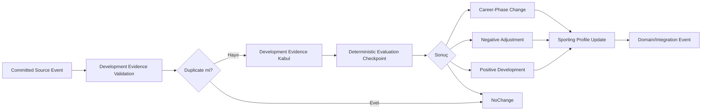
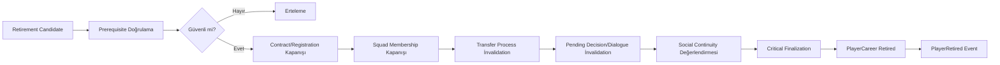

# Futbolcu Kariyeri, Gelişim ve Emeklilik Sistemi

**Belge yolu:** `docs/11_PLAYER_CAREER.md`
**Durum:** Kesinleşti
**Ana referans:** `docs/01_GAME_DESIGN_DOCUMENT.md`
**Kesin MVP sınırı:** `docs/02_MVP_SCOPE.md`
**Domain sınırları:** `docs/03_DOMAIN_MODEL.md`
**Olay ve kural sözleşmeleri:** `docs/04_EVENT_RULE_ENGINE.md`
**Hafıza ve söz sözleşmeleri:** `docs/05_MEMORY_AND_PROMISE_SYSTEM.md`
**İlişki sözleşmeleri:** `docs/06_RELATIONSHIP_SYSTEM.md`
**Diyalog ve karar sözleşmeleri:** `docs/07_DIALOGUE_SYSTEM.md`
**Transfer ve sözleşme sözleşmeleri:** `docs/08_TRANSFER_SYSTEM.md`
**Maç sözleşmeleri:** `docs/09_MATCH_SIMULATION.md`
**Teknik direktör kariyeri sözleşmeleri:** `docs/10_MANAGER_CAREER.md`
**Mimari yön:** `docs/17_TECHNOLOGY_AND_ARCHITECTURE_DECISION.md`
**İlgili karar günlüğü:** `docs/15_DECISION_LOG.md`

---

## 1. Belgenin Amacı

Bu belge, Football Career Simulator projesinde dünya futbolcularının kimliğini, kalıcı sportif profilini, gelişimini, düşüşünü, kariyer aşamasını, emekliliğini, kariyer özetini ve yıllık yeni kurgusal futbolcu üretimini yöneten `Player Career` bounded context'ine ait teknoloji bağımsız domain kurallarını kesinleştirir.

Sistemin amacı en az şunları kapsar:

* yaklaşık 500 aktif futbolcunun MVP'de zorunlu, kulüpten bağımsız kalıcı kimliğini yönetmek,
* futbolcunun yaşını doğum tarihi ve geçerli oyun tarihinden deterministik biçimde türetmek,
* kalıcı sportif profili, physical state ve match effective capability'den ayrı bir domain kavramı olarak korumak,
* gelişimi tekil maç veya antrenman olaylarının doğrudan ability güncellemesi olmaktan çıkarıp idempotent evidence ve deterministic evaluation checkpoint'lerine dayandırmak,
* potansiyeli kesin ve garanti edilen bir hedef sayı yerine çevre, fırsat, sakatlık ve kariyer bağlamından etkilenen bir aralık veya kapasite olarak modellemek,
* yaşlanma, gelişim, düşüş ve emekliliğin bütün futbolcularda aynı yaşta ve aynı biçimde gerçekleşmesini engellemek,
* emeklilik finalization sürecini birden fazla bounded context'i etkileyen atomik ve idempotent bir Application süreci olarak yürütmek,
* her sezon sınırlı ve deterministic yeni kurgusal futbolcu üretimini desteklemek,
* aktif futbolcu havuzunun on sezon boyunca çökmeden veya kontrolsüz büyümeden devam etmesini sağlamak,
* Contract & Registration, Team Preparation, Training & Physical State, Match, Transfer, Social Continuity ve Manager Career & Employment ile yalnız committed event, command ve query sözleşmeleri üzerinden entegre olmak,
* save/load sonrasında pending development evaluation ve retirement süreçlerinin güvenli biçimde devam etmesini sağlamak,
* on sezonluk simülasyonda kariyer tarihçesinin ve veri büyümesinin kontrol altında kalmasını sağlamaktır.

Bu belge:

* üretim sınıfları, interface'ler, enum'lar veya record'lar tanımlamaz,
* veritabanı şeması, migration veya SQL üretmez,
* kesin serialization biçimi belirlemez,
* kesin ability listesi, overall formülü, development/decline/retirement formülü veya generation dağılımı belirlemez,
* oynanabilir Futbolcu Kariyeri modunun ayrıntılı oynanışını tasarlamaz,
* ayrıntılı altyapı akademisi veya scouting sistemi tasarlamaz,
* `docs/01_GAME_DESIGN_DOCUMENT.md`, `docs/02_MVP_SCOPE.md`, `docs/03_DOMAIN_MODEL.md`, `docs/04_EVENT_RULE_ENGINE.md`, `docs/05_MEMORY_AND_PROMISE_SYSTEM.md`, `docs/06_RELATIONSHIP_SYSTEM.md`, `docs/07_DIALOGUE_SYSTEM.md`, `docs/08_TRANSFER_SYSTEM.md`, `docs/09_MATCH_SIMULATION.md`, `docs/10_MANAGER_CAREER.md` veya `docs/17_TECHNOLOGY_AND_ARCHITECTURE_DECISION.md` kararlarını değiştirmez.

---

## 2. Referanslar ve Kapsam

Kaynak önceliği:

1. `docs/01_GAME_DESIGN_DOCUMENT.md`
2. `docs/02_MVP_SCOPE.md`
3. `docs/03_DOMAIN_MODEL.md`
4. `docs/04_EVENT_RULE_ENGINE.md`
5. `docs/05_MEMORY_AND_PROMISE_SYSTEM.md`
6. `docs/06_RELATIONSHIP_SYSTEM.md`
7. `docs/07_DIALOGUE_SYSTEM.md`
8. `docs/08_TRANSFER_SYSTEM.md`
9. `docs/09_MATCH_SIMULATION.md`
10. `docs/10_MANAGER_CAREER.md`
11. `docs/17_TECHNOLOGY_AND_ARCHITECTURE_DECISION.md`
12. `docs/15_DECISION_LOG.md`

Kesinleşmiş Domain Model'e göre `Player Career`, futbolcunun kulüpten bağımsız kalıcı kimliğini ve sportif kariyer devamlılığını yöneten bounded context'tir (`docs/03_DOMAIN_MODEL.md` Bölüm 7.4). Bu belge mevcut 14 bounded context yapısını değiştirmez ve yeni bir bounded context oluşturmaz.

Bu belge şu bounded context'lerle kararlı event, command, query veya projection sözleşmeleri üzerinden çalışır:

* Contract & Registration,
* Team Preparation,
* Training & Physical State,
* Match,
* Transfer,
* Social Continuity (Relationship, Memory, Promise),
* Manager Career & Employment,
* Competition,
* World & Calendar,
* Interaction & Narrative,
* Event & Rule Evaluation,
* Save Integrity.

Bu belge aşağıdaki kesinleşmiş dünya ve MVP sınırlarını bağlayıcı kabul eder (`docs/02_MVP_SCOPE.md` Bölüm 17-18 ile uyumlu):

* 1 kurgusal ülke, 1 profesyonel lig, 20 kulüp,
* kulüp başına yaklaşık 23 A takım futbolcusu,
* yaklaşık 460 kulüplü aktif futbolcu ve yaklaşık 40 serbest futbolcu olmak üzere yaklaşık 500 aktif futbolcu,
* en fazla 10 tamamlanmış sezon,
* basitleştirilmiş yaşlanma, kalıcı sportif gelişim, sportif düşüş ve emeklilik,
* her sezon sınırlı sayıda yeni kurgusal futbolcu üretimi,
* aktif futbolcu havuzunun on sezon boyunca çökmeden veya kontrolsüz büyümeden devam etmesi.

"Yaklaşık" olarak ifade edilen sayılar katı ve değişmez tekil sayılar değildir. Sistem, yapılandırılabilir bir hedef aralık ve dengeleme politikası kullanır; kesin alt/üst nüfus sınırı bu belgede sessizce belirlenmez (bkz. Bölüm 19, 36).

---

## 3. Uyumluluk ve Terminoloji Notu

Bu belge hazırlanmadan önce Bölüm 2'de listelenen bütün ön koşul belgeleri baştan sona okunmuş ve ayrıntılı tutarlılık kontrolüne tabi tutulmuştur. Bu inceleme sonucunda GDD, MVP kapsamı, Domain Model, Event/Rule Engine, Memory/Promise, Relationship, Dialogue, Transfer, Match, Manager Career ve Technology/Architecture belgeleri arasında bu belgenin kapsamını etkileyen gerçek bir çelişki tespit edilmemiştir.

Terminoloji netliği için:

* `docs/03_DOMAIN_MODEL.md` Bölüm 7.4'te tanımlanan **`Player Career`** bounded context'i bu belgede aynen korunur; yeni bir on beşinci bounded context oluşturulmaz.
* `docs/01_GAME_DESIGN_DOCUMENT.md` Bölüm 7.2, 8.2 ve 27.3'te geçen **"futbolcu kariyeri"** ifadesi, oyuncunun tek bir futbolcuyu doğrudan kontrol ettiği **oynanabilir Futbolcu Kariyeri modunu** ifade eder. `docs/02_MVP_SCOPE.md` Bölüm 23'te bu oynanabilir mod MVP dışına ertelenmiştir.
* Bu belgenin konusu olan **`Player Career` bounded context'i** ise `docs/03_DOMAIN_MODEL.md` Bölüm 7.4, 11 ve 16.2'de zaten MVP için zorunlu authoritative domain sistemi olarak tanımlanmıştır ve GDD'nin MVP dışı bıraktığı oynanabilir modla aynı kavram değildir.
* Bu iki kavramın ayrımı Bölüm 4'te bağlayıcı biçimde tekrar açıklanmıştır.
* `docs/02_MVP_SCOPE.md` Bölüm 18 ve `docs/03_DOMAIN_MODEL.md` Bölüm 2'de geçen "yaklaşık 500 aktif futbolcu" ifadesi, bu belgede katı bir sayı değil yapılandırılabilir hedef aralık olarak ele alınır.

Terminolojik farklılık tek başına çelişki sayılmamıştır; aynı kavram için ikinci bir authoritative state oluşturulmamıştır.

---

## 4. MVP'de Player Career ile Oynanabilir Futbolcu Modu Ayrımı

Bu bölüm, belgedeki en önemli terminoloji ayrımını açık ve bağlayıcı biçimde tanımlar.

### 4.1. `Player Career` bounded context'i

`Player Career`, MVP'de yaklaşık 500 aktif futbolcunun tamamı için zorunlu olan domain sistemidir.

Bu sistem:

* futbolcu kimliğini,
* doğum bilgisini,
* kalıcı sportif profilini,
* gelişim ve düşüş state'ini,
* kariyer aşamasını,
* emeklilik kararını,
* kariyer özetini,
* yıllık yeni kurgusal futbolcu üretimini

yönetir.

Bu bounded context, teknik direktör kariyeri MVP'sinde gerçek ve sadeleştirilmiş biçimde zorunludur (`docs/02_MVP_SCOPE.md` Bölüm 18, `docs/03_DOMAIN_MODEL.md` Bölüm 7.4 ve 23 ile uyumlu).

### 4.2. Oynanabilir Futbolcu Kariyeri modu

Oyuncunun tek bir futbolcuyu doğrudan kontrol ettiği, keşfedilme, altyapı, saha dışı yaşam, kişisel ekonomi, menajer seçimi ve maç kontrolü gibi mekanikleri içeren **oynanabilir Futbolcu Kariyeri modu** MVP dışındadır (`docs/02_MVP_SCOPE.md` Bölüm 23).

Bağlayıcı ayrım:

* Oynanabilir futbolcu modunun MVP dışı olması, `Player Career` bounded context'inin MVP dışı olduğu anlamına **gelmez**.
* `docs/11_PLAYER_CAREER.md`, öncelikle teknik direktör kariyeri MVP'sinin ihtiyaç duyduğu dünya futbolcularının yaşam döngüsünü kesinleştirir.
* Belge, gelecekteki oynanabilir futbolcu modunun domain temelini engellemez.
* Belge bu görevde oynanabilir futbolcu modunun ayrıntılı oynanışını tasarlamaz.
* GDD Bölüm 7.2 ve Bölüm 8.2'deki uzun vadeli vizyon kaldırılmaz veya reddedilmez; yalnızca MVP sonrasına ertelenmiştir (bkz. Bölüm 35).

Bu ayrım, mevcut taslak metindeki "futbolcu kariyeri MVP dışıdır" ifadesinin, `Player Career` bounded context'inin de MVP dışı olduğu biçiminde yanlış yorumlanmasını engeller.

---

## 5. Bağlayıcı Tasarım İlkeleri

1. Her futbolcu kalıcı ve yeniden kullanılmayan bir `PlayerId` taşır.
2. Futbolcunun kimliği transfer, serbest kalma, kulüp değiştirme, sakatlık, düşüş ve emeklilik boyunca korunur.
3. Aynı futbolcu kulüp değiştirdiğinde yeni Player entity oluşturulamaz.
4. `PlayerCareer` aggregate'ı Player Career bounded context'inin ana aggregate root'udur.
5. Sporting profile, development, decline ve retirement yalnız Player Career authoritative owner'ı tarafından değiştirilebilir.
6. Training veya Match, kalıcı ability değişikliğini doğrudan uygulayamaz.
7. Physical state ile permanent sporting profile birbirinden ayrıdır.
8. Match performance ile permanent sporting profile birbirinden ayrıdır.
9. Squad role, active club ve contract career state'in parçası değildir.
10. Yaş, kayıt içinde her gün artırılan ikinci bir mutable sayı yerine `BirthDate` ve geçerli `GameDate` üzerinden türetilir.
11. Aynı doğum tarihi ve oyun tarihi aynı yaşı üretir.
12. Potential kesin ve değişmez bir hedef overall değildir.
13. Gelişim tek bir maç veya antrenman sonucunun doğrudan ability puanına dönüşmesi değildir.
14. Gelişim, committed domain girdilerinden ve deterministic evaluation kurallarından oluşur.
15. Aynı source event aynı development etkisini ikinci kez uygulayamaz.
16. Bütün futbolcular aynı yaşta düşüşe başlayamaz.
17. Emeklilik tek bir sabit yaş eşiğine indirgenemez.
18. Retired Player yeniden Active duruma dönemez.
19. Retired Player active contract, registration, squad membership veya transfer process ile bırakılamaz.
20. Emeklilik başka context'lerin state'ini Player Career içinden doğrudan değiştiremez.
21. Retirement finalization Application tarafından orkestre edilen atomik ve idempotent süreç olmalıdır.
22. Yıllık futbolcu üretimi ayrıntılı altyapı akademisi değildir.
23. Yeni futbolcu üretimi population continuity amacı taşır.
24. Yeni Player oluşturulması doğrudan contract veya squad membership oluşturmaz.
25. Yeni futbolcunun kulüp bağlantısı yalnız Contract & Registration ve Team Preparation sahiplikleri üzerinden kurulabilir.
26. Generated Player'lar stable identity, generation provenance ve version bilgisi taşımalıdır.
27. Hidden global RNG veya duvar saati kullanılamaz.
28. Player Career kuralları Godot, UI, SQLite veya harici üretken yapay zekâ servisine bağımlı olamaz.
29. Snapshot ana current-state kaynağıdır; tam event sourcing kullanılmaz.
30. Her küçük ability değişikliği ve her maç girdisi sonsuza kadar ayrıntılı tarihçe olarak saklanamaz.
31. Belge kesin matematiksel formülleri veya ability listesini sessizce kesinleştiremez.
32. Oynanabilir futbolcu kariyeri mekanikleri MVP Player Career sisteminin zorunlu bağımlılığı olamaz.

---

## 6. Terminoloji

### 6.1. Player

Kalıcı `PlayerId` ile tanımlanan futbolcu aktörüdür. Contract, squad veya club bağlantısından bağımsız kimliğini korur.

### 6.2. PlayerCareer

Futbolcunun kimliği, kalıcı sportif profili, gelişim/düşüş state'i, kariyer aşaması ve emeklilik durumunu yöneten aggregate root'tur.

### 6.3. Career Status

PlayerCareer'ın ana yaşam döngüsü durumudur.

Bağlayıcı ana lifecycle:

```text
Created → Active → Retired → Archived
```

`FreeAgent` ve `Contracted`, Career Status değildir. Bunlar Contract & Registration state'inden türetilen affiliation projection'larıdır (`docs/03_DOMAIN_MODEL.md` Bölüm 12.1 ile uyumlu).

### 6.4. Career Phase

Active kariyer içindeki gelişim eğilimini ve kariyer bağlamını temsil eden aşamadır.

Kavramsal örnekler: Emerging, Developing, Prime, Declining, Late Career.

Bunlar kesin enum, kesin yaş aralığı veya değişmez sayısal eşik olarak tanımlanmaz.

### 6.5. Sporting Profile

Futbolcunun kalıcı sportif kapasitesini temsil eden, Match effective strength veya güncel Physical State'ten ayrı profildir.

### 6.6. Ability Profile

Sporting Profile içindeki kalıcı sportif yeteneklerin kavramsal bütünüdür.

Kesin ability sayısı, adları, ölçekleri ve overall formülü açık bırakılır.

### 6.7. Effective Match Capability

Match Snapshot oluşturulurken Sporting Profile, Physical State, tactical context ve diğer Match girdilerinden türetilen geçici maç kapasitesidir.

Player Career authoritative state'i değildir (`docs/09_MATCH_SIMULATION.md` Bölüm 10 ile uyumlu).

### 6.8. Potential Range

Futbolcunun gelişebileceği olası kapasite alanıdır. Tek bir kesin hedef overall veya herkes tarafından görülebilen sabit tavan değildir.

### 6.9. Development Capacity

Yaş, çevre, fırsat, profesyonellik, sakatlık geçmişi ve diğer kesinleşmiş girdiler altında gelişim değerlendirmesinde kullanılan kalıcı veya yavaş değişen kapasite bilgisidir.

Potential Range ile aynı fiziksel alan olmak zorunda değildir; kesin veri yapısı açık bırakılır.

### 6.10. Development Evidence

Training, Match ve diğer committed kaynaklardan gelen, kalıcı gelişim değerlendirmesine girdi sağlayan idempotent kanıttır.

Development Evidence doğrudan ability değişikliği değildir.

### 6.11. Development Evaluation

Player Career authoritative owner'ının bir veya daha fazla geçerli girdiyi değerlendirerek kalıcı Sporting Profile sonucu üretmesi veya `NoChange` kararı vermesidir.

### 6.12. Decline

Yaş, fiziksel geçmiş ve kariyer bağlamı sonucunda permanent Sporting Profile üzerinde oluşan uzun vadeli düşüş eğilimidir.

Fatigue veya geçici düşük form değildir.

### 6.13. Retirement Evaluation

Player'ın kariyerini sürdürüp sürdürmeyeceğine ilişkin Player Career tarafından yapılan authoritative değerlendirmedir.

### 6.14. Retirement Plan veya Retirement Candidate

Final retirement uygulanmadan önce değerlendirilmiş fakat cross-context finalization süreci tamamlanmamış geçici süreç state'idir.

Bu state yeni bir bounded context veya ikinci Player aggregate oluşturmaz.

### 6.15. Retired Player

Career Status'u `Retired` olan, yeni Match Selection, active Contract, Registration veya Transfer Process içinde bulunamayan fakat kimliği ve tarihsel referansları korunan Player'dır.

### 6.16. Generated Player

Başlangıç authored player verisinden doğrudan yüklenmek yerine sürümlü ve deterministic generation kurallarıyla oluşturulmuş Player'dır.

### 6.17. Active Player Population

Career Status'u `Active` olan contracted ve free-agent futbolcuların toplamıdır. Retired ve Archived oyuncular bu sayıya dahil değildir.

---

## 7. Authoritative Veri Sahipliği

`docs/03_DOMAIN_MODEL.md` Bölüm 11 ile uyumlu olarak aşağıdaki sahiplik matrisi bağlayıcıdır.

| Veri veya süreç | Authoritative owner | Player Career'ın rolü |
| --- | --- | --- |
| Player identity, doğum bilgisi | Player Career | Owner |
| Kalıcı sporting profile | Player Career | Owner |
| Permanent development ve decline | Player Career | Owner |
| Career phase ve retirement | Player Career | Owner |
| Active contract, authoritative active club, registration | Contract & Registration | Yalnız query/read model okur |
| Squad membership, squad role, match selection | Team Preparation | Yalnız query/read model okur |
| Fatigue, fitness, injury, recovery, availability | Training & Physical State | Committed fact'i development/decline girdisi olarak okur |
| Match participation ve match performance facts | Match | Committed fact'i development evidence olarak okur |
| Transfer negotiation ve Transfer Process | Transfer | Committed event'i okur; doğrudan değiştiremez |
| Relationship, Memory ve Promise | Social Continuity | Committed event üretir; state'i doğrudan okuyamaz/değiştiremez |
| Game date ve season-boundary zamanlaması | World & Calendar ve ilgili Competition lifecycle'ı | Zamanlama girdisini okur |
| Context'ler arası süreç orkestrasyonu | Application katmanı | Application'a command/event sağlar |
| Snapshot ve save bütünlüğü | Save Integrity | Kendi state'ini snapshot'a dahil eder |

Bağlayıcı sonuçlar:

* Player Career içinde ikinci bir authoritative `ActiveClubId` alanı oluşturulamaz.
* Player Career içinde authoritative contract, registration veya squad membership tutulamaz.
* Player Career içinde fatigue, fitness, injury veya recovery state'i tutulamaz.
* Player Career içinde Relationship, Memory veya Promise kayıtları kopyalanamaz.
* Player Career içinde Transfer Process state'i tutulamaz.
* Player Career içinde Match Result veya Match Performance geçmişinin tam kopyası tutulamaz.
* Başka context'lerin Player Career state'ini doğrudan değiştirmesine izin verilmez.
* UI'ın Player Career state'ini doğrudan değiştirmesine izin verilmez.
* Player Career aggregate'ı bütün futbolcu verilerini içine alan devasa bir aggregate hâline getirilemez (`docs/03_DOMAIN_MODEL.md` Bölüm 24.3 ile uyumlu).

---

## 8. Aggregate ve Model Sınırları

### 8.1. PlayerCareer kavramsal modeli

Aşağıdaki alanlar kavramsal gereksinimlerdir; kesin class, record, tablo veya serialization şeması değildir.

| Alan | Neden gerekli | Authoritative owner | Save/load önemi | Determinism/idempotency bağlantısı |
| --- | --- | --- | --- | --- |
| `PlayerId` | Kulüpten ve isimden bağımsız kalıcı kimlik; bütün referanslar bu kimliğe bağlanır. | Player Career | Save/load sonrası değişmez; retired olsa bile korunur. | Bütün development/retirement idempotency kimliklerinin temelidir. |
| Kalıcı kimlik ve display-name bilgileri | Aynı isimde birden fazla futbolcunun ayırt edilmesini sağlar. | Player Career | İsim değişse bile PlayerId sabit kalır. | Kimlik referansı isimden bağımsızdır. |
| `BirthDate` | Yaşın deterministik türetilmesinin temel girdisidir. | Player Career | Save/load sonrası değişmez. | Aynı BirthDate + GameDate aynı yaşı üretir. |
| `PositionProfile` | Development, decline ve generation değerlendirmesinde pozisyon bağlamı sağlar. | Player Career | Kalıcı sportif kimliğin parçasıdır. | Position-aware evaluation'ın girdisidir. |
| `SportingProfile` | Kalıcı sportif kapasitenin authoritative temsilidir. | Player Career | Development/decline sonuçlarının hedefidir. | Her değişiklik source evidence ve rule version taşır. |
| `AbilityProfile` | Sporting Profile içindeki yeteneklerin kavramsal bütünüdür. | Player Career | Kalıcı state olarak korunur. | Development evaluation sonucu güncellenir. |
| `PotentialRange` veya eşdeğer development-capacity temsili | Gelişim yolunun sınırlarını değerlendirmek için gereklidir. | Player Career | Kalıcı veya yavaş değişen state olarak korunur. | Nadir ve açık kurallarla değişebilir; sessizce değişmez. |
| `DevelopmentState` | Development evaluation'ın mevcut ilerleme ve trend bilgisini taşır. | Player Career | Checkpoint'ler arası süreklilik için korunur. | Development Evidence idempotency'sinin bağlamıdır. |
| İşlenmiş development evidence veya idempotency referansları | Aynı evidence'in ikinci kez uygulanmasını engeller. | Player Career | Duplicate koruması için zorunludur. | `SourceEventId + PlayerId + DevelopmentRuleId` gibi kimliklerin temelidir. |
| `CareerStatus` | Ana lifecycle durumunu taşır. | Player Career | Terminal state save/load sonrası korunur. | Geçersiz geçişlerin engellenmesinin temelidir. |
| `CareerPhase` | Development/decline bağlamını temsil eder. | Player Career | Kalıcı state olarak korunur. | Aynı phase transition iki kez uygulanamaz. |
| `CreatedAtGameTime` | Kariyerin başlangıç oyun zamanını izler. | Player Career | Kalıcı referans olarak korunur. | Yaş ve career phase hesaplarının başlangıç noktasıdır. |
| `LastDevelopmentEvaluationGameTime` | Bir sonraki değerlendirme checkpoint'inin belirlenmesini sağlar. | Player Career | Save/load sonrası korunur. | Aynı dönemin ikinci kez değerlendirilmesini engeller. |
| `LastCareerPhaseEvaluationGameTime` | Career phase değerlendirmesinin tekrarını engeller. | Player Career | Save/load sonrası korunur. | Duplicate phase transition koruması sağlar. |
| Generation veya authored provenance | Player'ın başlangıç authored içerikten mi yoksa runtime generation'dan mı geldiğini ayırır. | Player Career | Kalıcı referans olarak korunur. | Generation batch idempotency'sinin parçasıdır. |
| Content version | Authored player verisinin hangi içerik sürümüne bağlı olduğunu gösterir. | Player Career (içerik); Save Integrity (format) | Migration uyumluluğu için gereklidir. | Bilinmeyen sürüm sessizce tahmin edilmez. |
| Rule/simulation version | Development, decline ve retirement değerlendirmesinin hangi kural sürümüyle yapıldığını gösterir. | Player Career | Aktif süreçlerin migration ihtiyacını belirler. | Eski sonuçlar yeni kurallarla sessizce yeniden değerlendirilmez. |
| Schema version | Save/load ve migration uyumluluğu için gereklidir. | Save Integrity (format); Player Career (içerik) | Migration ve geriye dönük uyumluluk için zorunludur. | Bilinmeyen sürüm sessizce tahmin edilmez. |
| Önemli career milestone referansları | Career History'nin özetlenebilir kaynağıdır. | Player Career | Önemli geçmiş olarak korunur; her küçük olay kaydedilmez. | Milestone idempotency kimliği taşır. |
| Retirement evaluation/finalization bilgisi | Retirement candidate ile final retirement arasındaki ara state'i izler. | Player Career (evaluation); Application (finalization orkestrasyonu) | Pending finalization save/load sonrası korunur. | Aynı candidate ikinci kez finalize edilemez. |
| Retirement game date ve reason, emekli olduysa | Emekliliğin nedenini ve zamanını açıklar. | Player Career | Terminal state'in parçası olarak kalıcıdır. | Aynı retirement completion ikinci kez uygulanamaz. |
| Career summary veya bunu yeniden üretecek kaynak referansları | Kariyer özetinin authoritative kaynağını belirtir. | Player Career (kaynak veri); türetilen projection Application/Presentation'da üretilebilir. | Rebuild kuralı açık olmalıdır. | Derived data, authoritative source'a bağlı kalır (`docs/03_DOMAIN_MODEL.md` Bölüm 15.3). |

Bu tablo doğrudan üretim sınıfı listesi değildir; fiziksel kod organizasyonu geliştirme aşamasında ayrıca belirlenir.

### 8.2. PlayerCareer'a eklenmeyecek alanlar

Aşağıdakiler Player Career aggregate'ının içine eklenmez:

* authoritative active club,
* active contract,
* squad membership,
* fatigue,
* fitness,
* active injury,
* match selection,
* transfer negotiation,
* relationship,
* memory,
* promise,
* tam Match Result geçmişi,
* UI selection state.

### 8.3. Aggregate sınırı ile ilgili risk

`docs/03_DOMAIN_MODEL.md` Bölüm 24.3'te belirtildiği gibi Player Career yalnızca kalıcı kariyer kimliğinin sahibidir; physical state, contract, squad, relationship ve memory ayrı owner'lara aittir. Bu ayrım korunmadığı takdirde Player aggregate'ı bütün futbolcu verilerini içeren devasa ve test edilemez bir yapıya dönüşür.

---

## 9. Futbolcu Kimliği, Doğum Bilgisi ve Yaş

Aşağıdaki kurallar bağlayıcıdır:

* `PlayerId`, isimden, kulüpten, forma numarasından veya liste index'inden bağımsızdır.
* Aynı isimde birden fazla futbolcu bulunabilir.
* PlayerId save/load sonrasında değişmez.
* Retired veya Archived PlayerId yeniden kullanılamaz.
* Historical record içindeki PlayerId referansları futbolcu emekli olsa bile korunur.
* Yaş authoritative mutable alan olarak her gün artırılmaz.
* Yaş, `BirthDate` ve `GameDate` üzerinden deterministic biçimde türetilir.
* Birthday veya season transition, career-phase ve aging değerlendirmesi için tetikleyici olabilir.
* Kesin aging evaluation cadence'i açık karardır; gizli frame veya wall-clock zamanı kullanılamaz.
* Geçersiz veya gelecekteki doğum tarihi kabul edilemez.
* Save/load aynı GameDate için farklı yaş üretmemelidir.

Bu kurallar `docs/03_DOMAIN_MODEL.md` Bölüm 10 (Kimlik ve Referans Kuralları) ve Bölüm 13 (Domain Değişmezleri madde 20) ile uyumludur.

---

## 10. Sporting Profile

Sporting Profile:

* kalıcıdır,
* Player Career tarafından yönetilir,
* physical state'ten bağımsızdır,
* Match effective capability'den bağımsızdır,
* position-aware'dır,
* sürümlenebilir bir domain kavramıdır.

Açıkça belirtilir:

* Fatigue, fitness ve injury Sporting Profile değildir.
* Tek maçlık form veya rating Sporting Profile değildir.
* Match engine'in geçici factor'ları Sporting Profile değildir.
* Squad role Sporting Profile değildir.
* Market value Sporting Profile değildir.
* Potential mevcut Sporting Profile değildir.
* Overall gerekiyorsa türetilmiş projection olabilir; ayrı authoritative state olmak zorunda değildir.
* Kesin ability kataloğu bu belgede belirlenmez.
* Sporting Profile değişiklikleri neden, source evidence, rule version ve oyun zamanı ile açıklanabilir olmalıdır.
* Aynı development outcome ikinci kez uygulanamaz.

Bu ayrım `docs/09_MATCH_SIMULATION.md` Bölüm 5.4-5.6 ve Bölüm 22.1'de tanımlanan Match Performance/Sporting Profile ayrımıyla uyumludur.

---

## 11. Potential Range ve Development Capacity

GDD Bölüm 18.2 ile uyumlu olarak Potential tek ve kesin hedef sayı hâline getirilmez.

Bağlayıcı yön:

* Potential, gelişim için olası bir aralık veya kapasite alanıdır.
* Çevre, fırsat, sakatlık, kişilik/profesyonellik girdileri, antrenörlük kalitesi, doğru pozisyon ve kariyer kararları gelişim yolunu etkileyebilir.
* Potential Range ile mevcut ability aynı kavram değildir.
* Potential Range doğrudan UI'da tam doğrulukla gösterilmek zorunda değildir.
* Presentation veya scouting raporları gelecekte tahmin üretebilir; tahmin authoritative state değildir.
* Potential her maç sonrasında kontrolsüz biçimde değiştirilemez.
* Potential Range'in tamamen immutable mı yoksa açık ve nadir kurallarla değişebilir mi olacağı kesin veri/model kararı olarak açık bırakılır.
* Exact potential veri yapısı, ölçeği, dağılımı ve değişim formülü bu belgede belirlenmez.
* Gelişim, potansiyel hedefe doğru otomatik ve garantili ilerleme değildir.
* Yüksek potential, başarı veya zirve seviyesini garanti etmez.

---

## 12. Gelişim Girdileri

Player Career yalnız committed ve stable kimlikli girdileri değerlendirir.

### 12.1. Training girdileri

`Training & Physical State` veya ilgili training sonucu üzerinden: tamamlanmış training period, ana training focus, uygulanmış workload, training participation, recovery veya availability bağlamı, ilgili development contribution/fact.

Training sistemi kalıcı ability değiştiremez.

### 12.2. Match girdileri

`Match` tarafından üretilen committed facts üzerinden: oynanan süre, starter/substitute durumu, position veya role bağlamı, performance summary, önemli performans olayı, competition veya match importance bağlamı, gerekiyorsa.

Match sistemi kalıcı ability değiştiremez. Her maç otomatik ability artışı üretmek zorunda değildir.

### 12.3. Physical ve injury girdileri

`Training & Physical State` üzerinden: ciddi injury, uzun recovery, tekrar eden injury, permanent-impact adayı, availability geçmişi özeti.

Physical system kalıcı decline veya retirement kararı veremez.

### 12.4. Time ve age girdileri

`World & Calendar` üzerinden: GameDate, season boundary, birthday veya aging checkpoint, kariyerde geçen süre.

### 12.5. Diğer bağlamsal girdiler

Kesinleşmiş authoritative kaynaklardan geldiği sürece: professionalism veya development-related profile girdileri, rol ve fırsat bağlamı, takım seviyesi, rekabet seviyesi, mentor veya staff contribution özeti, ileride desteklenirse.

Bu girdilerin kesin ownership'i ön koşul belgelerinde tanımlanmamışsa Player Career içine sessizce ikinci state eklenmez.

---

## 13. Gelişim Değerlendirmesi ve Kalıcı Değişiklik

Gelişim, her Training veya Match event'inin doğrudan sayısal ability güncellemesine dönüşmesi olarak tasarlanmaz.

### 13.1. Bağlayıcı genel akış

1. Kaynak context committed fact veya Integration Event üretir.
2. Event identity, source, schema version, game time ve PlayerId doğrulanır.
3. Aynı evidence daha önce işlendi mi kontrol edilir.
4. Development Evidence kabul edilir, reddedilir veya mevcut değerlendirme dönemine eklenir.
5. Deterministic evaluation checkpoint geldiğinde Player Career; age, current Sporting Profile, Potential Range veya Development Capacity, geçerli development evidence, physical ve injury girdileri, career phase, rule/simulation version bilgilerini değerlendirir.
6. Sonuç: positive development, negative adjustment, mixed profile change, career-phase change veya no change olabilir.
7. Kabul edilen sonuç Player Career tarafından tek kez uygulanır.
8. Gerekli Domain Event ve Integration Event'ler üretilir.
9. İşlenmiş evidence ve idempotency bilgisi korunur.
10. Düşük seviyeli evidence retention/compaction politikasına tabi tutulabilir.



### 13.2. Evaluation cadence

Kesin değerlendirme periyodu belirlenmez. Sistem şu yaklaşımları destekler:

* event accumulation,
* deterministic periodic checkpoint,
* season transition evaluation,
* gerektiğinde milestone evaluation.

Her gün bütün futbolcuları kontrolsüz biçimde taramak zorunlu çözüm değildir.

---

## 14. Yaşlanma ve Career Phase

Career Status ile Career Phase ayrı tutulur.

Bağlayıcı yön:

* Career Status ana lifecycle'dır: `Created → Active → Retired → Archived`.
* Career Phase yalnız Active Player'ın gelişim ve düşüş bağlamını temsil eder.
* Phase, yalnız yaşa göre belirlenemez.
* Aynı yaştaki iki futbolcu farklı phase veya gelişim eğiliminde olabilir.
* Phase geçişi permanent Sporting Profile değişikliğiyle aynı şey değildir.
* Phase geçişi development ve retirement değerlendirmelerine girdi sağlar.
* Exact phase listesi, yaş aralıkları ve transition eşikleri açık bırakılır.
* Phase geriye dönüşü veya nadir yeniden gelişim senaryoları açık rule gerektirir; sessiz state değişimi yapılamaz.
* Birthday veya season transition sırasında aynı phase transition iki kez uygulanamaz.

---

## 15. Sportif Düşüş

GDD Bölüm 18.3 ile uyumlu olarak bütün oyuncular için tek bir düşüş yaşı belirlenmez.

Düşüş değerlendirmesinde kullanılabilecek girdiler: yaş, position profile, physical profile bağlamı, ciddi ve tekrar eden injury geçmişi, profesyonellik veya yaşam düzeni girdileri (authoritative kaynak bulunduğunda), kariyer boyunca match load, recovery geçmişi, mevcut Sporting Profile, current Career Phase.

Bağlayıcı kurallar:

* Decline, fatigue değildir.
* Decline, tek maçlık kötü performance değildir.
* Decline permanent Sporting Profile değişikliğidir.
* Decline yalnız Player Career tarafından uygulanır.
* Bütün ability alanları aynı anda ve aynı oranda düşmek zorunda değildir.
* Declining phase küçük veya sınırlı gelişimi tamamen imkânsız kılmak zorunda değildir.
* Aynı source evidence iki kez decline üretemez.
* Exact decline age curve, probability, katsayılar ve position etkileri açık bırakılır.
* Düşüş açıklanabilir source factors ve rule version taşır.

---

## 16. Emeklilik Değerlendirmesi

Retirement kararının authoritative owner'ı Player Career'dır.

Değerlendirilebilecek girdiler: yaş, Career Phase, Sporting Profile ve decline eğilimi, ciddi injury veya physical-history özeti, aktif contract bulunup bulunmaması, son dönem oynama fırsatı ve kariyer bağlamı, motivasyon veya professionalism girdileri (authoritative kaynak bulunduğunda), önceki retirement evaluation sonuçları, season boundary, explicit career-ending condition (ileride tanımlanırsa).

Bağlayıcı kurallar:

* Tek bir sabit yaş eşiği otomatik retirement üretmez.
* Aynı yaşta bütün futbolcular emekli olamaz.
* Retirement, açıklamasız global random roll olamaz.
* Rastlantı kullanılıyorsa sürümlü ve seeded Random Context kullanılır.
* Retirement evaluation `Retire`, `Continue`, `ReevaluateLater` veya eşdeğer semantik sonuç üretebilir.
* Evaluation sonucu ile final retirement aynı şey değildir.
* Active Match sırasında final retirement yapılamaz.
* Aynı evaluation veya finalization ikinci kez uygulanamaz.
* Normal MVP yönü season-boundary veya başka güvenli simulation checkpoint'inde değerlendirmedir.
* Sezon ortası retirement yalnız açık exceptional rule ve güvenli cross-context finalization ile mümkün olabilir.
* Exact retirement formula, probability ve age thresholds açık bırakılır.

---

## 17. Emeklilik Finalization Süreci

Retirement finalization, birden fazla bounded context'i etkileyen Application-owned process'tir (`docs/04_EVENT_RULE_ENGINE.md` Bölüm 16 ile uyumlu).

### 17.1. Bağlayıcı genel süreç

1. Player Career, geçerli bir retirement candidate veya retirement plan üretir.
2. Application ilgili Player'ın mevcut durumunu doğrular: active Match var mı, active Contract ve Registration var mı, Squad Membership var mı, açık Transfer Process var mı, pending Decision veya Dialogue var mı, aktif Promise veya ilgili sosyal süreç var mı.
3. Active Match veya güvenli olmayan simulation step varsa finalization ertelenir.
4. Contract & Registration kendi authoritative kurallarıyla contract ve registration kapanışını hazırlar.
5. Team Preparation kendi authoritative kurallarıyla Squad Membership ve geçersiz Match Selection kayıtlarını kapatır.
6. Transfer kendi authoritative kurallarıyla açık Transfer Process'i iptal eder veya geçersizleştirir.
7. Interaction & Narrative ilgili pending kararları geçersizleştirir veya fallback policy uygular.
8. Social Continuity aktif Promise, Relationship ve Memory sonuçlarını kendi kurallarıyla değerlendirir.
9. Critical finalization sınırında: bağımlı active state'ler kapanır, PlayerCareer `Retired` olur, `PlayerRetired` veya eşdeğer committed event üretilir.
10. İşlem başarısız olursa kısmi ve invariant bozan state geçerli kabul edilmez.
11. Completed process idempotency ve completion identity ile kaydedilir.



### 17.2. Bağlayıcı sonuçlar

* Player Career başka context repository'lerini doğrudan değiştiremez.
* Retired Player active contract, registration veya squad içinde bırakılamaz.
* Relationship ve Memory kayıtları retirement sırasında silinmez.
* Promise'lar sessizce silinmez.
* Historical Match ve Career kayıtları korunur.
* Retirement, PlayerId'nin silinmesi değildir.
* Retired Player transfer edilemez veya yeni Match Selection'a eklenemez.
* MVP'de `Retired → Active` dönüşü desteklenmez.

---

## 18. Yeni Kurgusal Futbolcu Üretimi

Her sezon sınırlı yeni kurgusal futbolcu üretimi MVP için zorunludur (`docs/02_MVP_SCOPE.md` Bölüm 18 ile uyumlu).

Bu sistem:

* ayrıntılı youth academy değildir,
* youth-team management değildir,
* scout network simülasyonu değildir,
* academy staff simülasyonu değildir,
* oynanabilir keşfedilme süreci değildir,
* gerçek dünyadaki oyuncuları kopyalama sistemi değildir.

Player generation, `Player Career` bounded context'inin Player identity ve başlangıç Sporting Profile oluşturma sorumluluğu içinde çalışır.

World & Calendar veya season-transition süreci generation değerlendirmesini tetikleyebilir. Çoklu context koordinasyonu Application tarafından yürütülür.

### 18.1. Generated Player için değerlendirilecek girdiler

En az şu kavramsal girdiler değerlendirilir: yeni ve kalıcı `PlayerId`, name/content reference, `BirthDate`, başlangıç `PositionProfile`, başlangıç `SportingProfile`, Potential Range veya Development Capacity, başlangıç Career Phase, generation batch veya provenance bilgisi, generation rule version, content version, RNG version, deterministic Random Context, created game date, correlation ve causation bilgisi.

Kesin isim havuzu yapısı, yaş aralığı, ability dağılımı, potential dağılımı, position dağılımı, generation batch büyüklüğü ve ülke/bölge dağılımı bu belgede sayısal olarak belirlenmez.

### 18.2. Generated Player'ın kulüp bağlantısı

Player generation doğrudan active club, contract, registration veya squad membership yazamaz.

Bağlayıcı kurallar:

* Yeni Player, Player Career içinde `Active` kariyer kimliğiyle oluşturulur.
* Contract bulunmaması, Contract & Registration projection'ında `FreeAgent` sonucunu üretir.
* Generated Player'a kulüp bağlantısı gerekiyorsa: Contract & Registration contract/registration oluşturur, Team Preparation squad membership oluşturur.
* Bu işlemler Application tarafından orkestre edilir.
* Player Career içine ikinci active-club alanı eklenmez.
* Yıllık generation işlemi kulüplere gizli ve doğrudan oyuncu yerleştiremez.
* AI kulüpler yeni oyuncuları mevcut Transfer/Contract sınırları üzerinden kadrolarına almalıdır (`docs/08_TRANSFER_SYSTEM.md` Bölüm 21 ile uyumlu).
* İlk dünya kurulumu için authored initial players ile runtime-generated players ayrılır.
* Authored content stable ID ile runtime PlayerId aynı kavram değildir.

---

## 19. Aktif Futbolcu Havuzunun Devamlılığı

Population continuity sistemi aşağıdaki hedeflerle tanımlanır:

* yaklaşık 500 aktif futbolcu hedefini korumak,
* yaklaşık 460 contracted ve yaklaşık 40 free-agent dağılımını uzun vadede desteklemek,
* retirement nedeniyle futbolcu havuzunun çökmesini engellemek,
* kontrolsüz generation nedeniyle nüfusun sürekli büyümesini engellemek,
* position distribution'ın anlamsız biçimde bozulmasını engellemek,
* kulüplerin geçerli A takım kadrosu kurabilmesini desteklemek,
* retired oyuncuları aktif population'a dahil etmemek,
* kimlikleri silerek veya yeniden kullanarak nüfus dengelememek.

Generation ihtiyacı değerlendirilirken kullanılabilecek girdiler: mevcut Active Player sayısı, son season retirement sayısı, beklenen yakın dönem retirement sayısı, contracted/free-agent dağılımı, position distribution, kulüp kadro ihtiyaçları, configured population target ve tolerance, generation rule version.

Kesin population tolerance veya yıllık üretim sayısı bu belgede belirlenmez; bu değerler authored/balance content ve test stratejisinde yapılandırılabilir bırakılır.

### 19.1. Season transition sırası

Season transition sırası deterministic ve açık olmalıdır. Örnek semantik sıra:

1. Season tamamlanır.
2. Development, decline ve retirement değerlendirmeleri tamamlanır.
3. Retirement finalization süreçleri tamamlanır.
4. Active population yeniden hesaplanır.
5. Generation ihtiyacı belirlenir.
6. Generated Player batch oluşturulur.
7. Contract ve squad yerleştirme süreçleri ayrı authoritative context'lerce yürütülür.
8. Yeni season başlatılmadan önce population invariant'ları doğrulanır.

Kesin teknik işlem sırası ön koşul belgeleriyle uyumlu kalmalı; handler dictionary sırasına veya gizli yan etkilere bırakılamaz (`docs/03_DOMAIN_MODEL.md` Bölüm 17 ile uyumlu).

---

## 20. Contract, Registration ve Active Club Entegrasyonu

* Active contract ve authoritative active club, Contract & Registration'a aittir.
* PlayerCareer yalnız PlayerId üzerinden bu state'i sorgular veya read model olarak tüketir.
* Contract expiry PlayerCareer'ı otomatik Retired yapmaz.
* Contract bulunmaması PlayerCareer status'unu değiştirmez.
* Player, `Active` ve `FreeAgent` olabilir.
* Contracted/FreeAgent projection'ı Player Career içinde ikinci lifecycle değildir.

Bu ayrım `docs/08_TRANSFER_SYSTEM.md` Bölüm 14 ve Bölüm 41 madde 23'te tanımlanan Player active club projection kuralıyla birebir uyumludur.

---

## 21. Squad ve Match Selection Entegrasyonu

* Squad membership ve squad role Team Preparation'a aittir.
* PlayerCareer gelişim veya retirement nedeniyle Squad'ı doğrudan değiştiremez.
* Retired Player'ın Squad içinde kalması invariant ihlalidir.
* Squad role permanent ability veya Career Phase değildir.

Retirement finalization sırasında Squad Membership ve Match Selection kapanışı yalnız Team Preparation'ın kendi authoritative kurallarıyla, Application orkestrasyonu üzerinden gerçekleşir (bkz. Bölüm 17).

---

## 22. Training, Physical State ve Injury Entegrasyonu

Aşağıdaki sınırlar bağlayıcıdır:

* Training plan, load, fatigue, fitness, injury, recovery ve availability `Training & Physical State` sahibidir.
* Player Career permanent development ve decline sahibidir.
* Training sonucu development evidence üretebilir.
* Physical history decline veya retirement değerlendirmesine girdi sağlayabilir.
* Injury doğrudan Player Career ability state'ini değiştiremez.
* Player Career injury state'ini doğrudan kapatamaz veya değiştiremez.
* Career-ending injury kavramı ileride tanımlanırsa: Physical owner committed fact üretir, Player Career retirement/permanent-impact değerlendirmesi yapar, finalization Application tarafından orkestre edilir.
* Temporary physical loss ile permanent decline aynı şey değildir.
* Recovery, permanent ability'nin otomatik eski hâline dönmesi anlamına gelmez.
* Save/load sırasında iki context'in state'leri kendi authoritative sınırlarında korunur.

---

## 23. Match Performance Entegrasyonu

Aşağıdaki sınırlar bağlayıcıdır:

* Match, participation ve performance facts'in authoritative owner'ıdır.
* Player Career bu facts'i development evidence olarak değerlendirebilir.
* Match rating, goal, assist veya minutes doğrudan ability delta değildir.
* Aynı Match Performance fact ikinci kez development etkisi üretemez.
* Background Match ve player-club Match aynı semantik evidence sözleşmesini kullanır.
* Condensed Match simulation, Player Career için sahte veya ikinci sınıf development yolu oluşturmaz.
* Match, PlayerCareer repository'sini doğrudan değiştiremez.
* Player Career Match Result'ı değiştiremez.
* Career history için yalnız önemli milestone veya özetler korunur; her Match ayrıntısı PlayerCareer içinde kopyalanmaz.
* Match effective capability, pre-match snapshot sırasında Sporting Profile ve diğer authoritative girdilerden türetilir (`docs/09_MATCH_SIMULATION.md` Bölüm 25.4 ile uyumlu).

---

## 24. Transfer Entegrasyonu

* Transfer Process Transfer context'ine aittir.
* Transfer sonucu PlayerId veya Sporting Profile'ı değiştirmez.
* Transfer sırasında Player identity ve career state korunur.
* Retirement finalization açık Transfer Process'i Transfer owner üzerinden iptal veya invalidation sürecine sokar.
* Transfer interest veya market value Player Career authoritative state'i değildir.

Bu sınırlar `docs/08_TRANSFER_SYSTEM.md` Bölüm 14 ve Bölüm 41 ile uyumludur.

---

## 25. Relationship, Memory ve Promise Entegrasyonu

Bağlayıcı sınırlar:

* Relationship, Memory ve Promise Social Continuity'ye aittir.
* Development, decline, transfer veya retirement olayları Memory adayı veya Relationship girdisi üretebilir.
* Player Career bu state'leri doğrudan değiştiremez.
* Emeklilik, önemli career milestone ve Memory adayı oluşturabilir.
* Aktif Promise'lar emeklilikte sessizce silinemez.
* Player'ın transferi personal Relationship ve Memory kayıtlarını silmez.
* Oynama süresi Promise'ları Match ve Team Preparation facts üzerinden Social Continuity tarafından değerlendirilir; Player Career Promise sonucunun sahibi değildir (`docs/05_MEMORY_AND_PROMISE_SYSTEM.md` Bölüm 31 ile uyumlu).

---

## 26. Manager Career ve Dünya Entegrasyonu

* Manager Career, bir futbolcunun gelişiminden veya genç oyuncu geliştirme başarısından kendi profile/reputation değerlendirmesi için committed fact tüketebilir.
* Player Career Manager Profile veya Reputation state'ini doğrudan değiştiremez.
* Manager'ın kulüp değiştirmesi Player kimliğini veya Sporting Profile'ı değiştirmez.
* World & Calendar ve Competition, season boundary ve game date zamanlamasını sağlar; Player Career bu zamanlamaya göre development, decline ve retirement evaluation checkpoint'lerini tetikler.
* Player Career, World & Calendar veya Competition state'ini doğrudan değiştiremez.

---

## 27. Command, Domain Event ve Integration Event Kategorileri

Kesin production class veya bütün event kataloğu oluşturulmaz. Kavramsal kategori ve örnekler kullanılır.

### 27.1. Command kategorileri

En az şunlar ele alınır: Player oluşturma, Authored Player'dan runtime career oluşturma, Generated Player oluşturma, Development Evidence kabul etme, Development evaluation çalıştırma, Sporting Profile değişikliği uygulama, Career Phase değerlendirme, Decline değerlendirme, Retirement değerlendirme, Retirement finalization, Player arşivleme, Population generation batch başlatma.

Örnek semantic command adları: `CreatePlayerCareer`, `RegisterDevelopmentEvidence`, `EvaluatePlayerDevelopment`, `EvaluateCareerPhase`, `EvaluateRetirement`, `FinalizePlayerRetirement`, `GeneratePlayerBatch`.

Bunlar kesin interface veya enum olarak tanımlanmaz.

### 27.2. Domain Event kategorileri

En az şunlar ele alınır: Player oluşturuldu, Generated Player oluşturuldu, Development evidence kabul edildi veya reddedildi, Development evaluation tamamlandı, Sporting Profile değişti, Career Phase değişti, Decline başladı veya anlamlı decline sonucu oluştu, Retirement candidate oluştu, Retirement ertelendi, Player emekli oldu, Player arşivlendi, Generation batch tamamlandı, Population continuity kontrolü tamamlandı.

### 27.3. Tepki verilen event kategorileri

GameDate veya season boundary, Training period sonucu, Match participation/performance fact, serious injury veya physical-history fact, Contract/Registration değişikliği, Transfer completion, Manager departure (yalnız anlamlı entegrasyon için), Save/load recovery checkpoint.

### 27.4. Üretilen cross-context etkiler

Player Career yalnız committed facts ve Integration Event'ler üretir.

Örnek tüketiciler: Contract & Registration, Team Preparation, Match, Transfer, Social Continuity, Manager Career & Employment, Interaction & Narrative, World & Calendar, Save Integrity.

Integration Event foreign state mutation talimatı değildir.

---

## 28. Yaşam Döngüleri ve Domain Değişmezleri

### 28.1. Ana lifecycle

```text
Created → Active → Retired → Archived
```

### 28.2. Geçersiz geçişler

* `Retired → Active`
* `Archived → Active`
* Player oluşturulmadan Active yapmak
* aynı retirement completion'ı iki kez uygulamak
* Retired Player'a yeni development evidence uygulamak
* Archived Player'ın Sporting Profile'ını normal gameplay command ile değiştirmek

### 28.3. Bağlayıcı değişmezler

1. PlayerId yaşam döngüsü boyunca değişmez.
2. PlayerId yeniden kullanılamaz.
3. Aynı runtime player için iki authoritative PlayerCareer bulunamaz.
4. Retired Player active contract taşıyamaz.
5. Retired Player active registration taşıyamaz.
6. Retired Player squad member olamaz.
7. Retired Player Match Selection'a eklenemez.
8. Retired Player için yeni Transfer Process başlatılamaz.
9. Aynı source evidence aynı semantic development effect'i iki kez üretemez.
10. Sporting Profile geçerli domain aralıklarında kalmalıdır.
11. Geçersiz BirthDate kabul edilemez.
12. Aynı BirthDate ve GameDate aynı yaşı üretmelidir.
13. Player'ın active club state'i PlayerCareer içinde ikinci kez tutulamaz.
14. Player transfer olduğunda identity, career state ve Sporting Profile korunur.
15. Retirement finalization kısmi ve invariant bozan state bırakamaz.
16. Generation aynı runtime identity'yi iki kez oluşturamaz.
17. Retired veya Archived Player active population sayısına dahil edilemez.
18. Population balancing, aktif Player silerek yapılamaz.
19. UI veya başka bounded context PlayerCareer state'ini doğrudan değiştiremez.
20. Save/load completed development veya retirement işlemini yeniden çalıştıramaz.

---

## 29. Determinizm, İdempotency ve Simulation Ordering

Bağlayıcı gereksinimler:

* Aynı snapshot, input sequence, content version, simulation/rule version, RNG version ve seed aynı canonical Player Career sonucunu üretmelidir.
* Development Evidence stable source identity taşımalıdır.
* Aynı source event'in tekrar teslimi ikinci gelişim etkisi üretmemelidir.
* Aynı birthday veya season transition iki kez aging/phase değişimi uygulamamalıdır.
* Aynı retirement candidate iki retirement completion üretmemelidir.
* Aynı generation batch ikinci kez Player oluşturmamalıdır.
* Dictionary, collection veya dosya okuma sırası generation veya evaluation sonucunu değiştirmemelidir.
* Global `Random` veya Godot RNG domain içine dağınık biçimde çağrılamaz.
* Rastlantı gerekiyorsa named/versioned Random Context kullanılmalıdır.
* Wall clock, frame delta veya gerçek dünyada geçen süre domain kararını etkileyemez.
* Processing key, source evidence identity, evaluation period identity ve finalization process identity kavramsal olarak ayrılmalıdır.
* Save/load sonrasında pending evaluation ve finalization güvenli biçimde devam etmelidir.

### 29.1. Idempotency kimlik örnekleri

* `SourceEventId + PlayerId + DevelopmentRuleId`
* `PlayerId + EvaluationPeriodId`
* `PlayerId + RetirementCandidateId + Finalization`
* `GenerationBatchId + PlayerSlotIndex`

Bunlar kesin persistence şeması olarak tanımlanmaz; bu yaklaşım `docs/04_EVENT_RULE_ENGINE.md` Bölüm 11 ile uyumludur.

---

## 30. Save/Load, Tarihçe ve Veri Büyümesi

### 30.1. Save en az şunları korur

PlayerId; identity ve BirthDate; PositionProfile; Sporting Profile; Potential Range veya Development Capacity state'i; Development State; Career Status; Career Phase; generation/authored provenance; önemli evaluation checkpoint bilgileri; pending retirement evaluation/finalization bilgisi; işlenmiş evidence veya gerekli idempotency kayıtları; RNG/generation context bilgisi (gerekiyorsa); schema, content, simulation ve rule version bilgileri; önemli career milestones; retirement metadata; Application process manager state'i (cross-context süreç açıksa).

### 30.2. Bağlayıcı retention yaklaşımı

* Her training contribution sonsuza kadar tutulmaz.
* Her match performance PlayerCareer içine kopyalanmaz.
* Düşük önem development evidence tamamlanmış evaluation sonrasında özetlenebilir veya compact edilebilir.
* Önemli Sporting Profile değişimleri, Career Phase geçişleri, decline başlangıcı ve retirement history korunur.
* Career summary, historical records veya rebuild edilebilir projection üzerinden üretilebilir.
* Snapshot current state'in ana kaynağıdır.
* Tam event sourcing kullanılmaz.
* Migration, eski save'de eksik yeni alanlar için açık ve testli strateji gerektirir.
* Bozuk Player reference sessizce atlanamaz.
* Retired Player historical references korunur.
* Save/load round-trip canonical state eşdeğerliği sağlamalıdır.

Kesin SQLite tablo şeması, index veya serialization alan düzeni oluşturulmaz.

---

## 31. Presentation, Read Model ve Bilgi Belirsizliği

UI ve read model sınırları:

* UI PlayerCareer state'ini doğrudan değiştiremez.
* UI yalnız Application command ve query akışı üzerinden çalışır.
* Current Sporting Profile, Career Phase, development trend ve career summary read model üzerinden gösterilebilir.
* Potential'ın authoritative iç temsili tam doğrulukla gösterilmek zorunda değildir.
* Future scouting veya staff report sistemi tahmin aralığı gösterebilir.
* Tahmini potential authoritative Potential Range değildir.
* UI'daki overall, yıldız, bar veya label türetilmiş projection olabilir.
* Presentation label değişikliği domain state'ini değiştirmez.
* Player listesi yaklaşık 500 aktif futbolcuyu destekleyecek şekilde paging, filtering veya virtualization yönüyle uyumlu olmalıdır; UI tasarımı bu belgenin sorumluluğu değildir (`docs/17_TECHNOLOGY_AND_ARCHITECTURE_DECISION.md` Bölüm 10.1 ile uyumlu).
* Retired Players aktif kadro listelerinde gösterilmemeli, ancak career history veya archive sorgularında bulunabilmelidir.
* Exact scouting accuracy, hidden attributes ve visibility sistemi bu görevde kesinleştirilmemelidir.

---

## 32. Sınır Durumları

| Durum | Beklenen yön |
| --- | --- |
| Player'ın contract olmadan Active olması | Career Status Active kalır; FreeAgent projection Contract & Registration'dan türetilir; retirement sayılmaz. |
| Aynı gün contract expiry ve retirement finalization | Deterministic simulation ordering ile ayrı ayrı ve tutarlı sırayla işlenir; finalization prerequisite doğrulaması güncel contract durumunu kullanır. |
| Aynı gün transfer completion ve retirement candidate | Retirement finalization açık Transfer Process olup olmadığını doğrular; transfer tamamlanmışsa candidate yeniden değerlendirilir. |
| Active Match sırasında retirement evaluation | Finalization ertelenir; safe checkpoint beklenir. |
| Season transition sırasında açık Match veya Transfer Process | Season transition sırası (Bölüm 19.1) açık süreçleri önce güvenli state'e getirir. |
| Aynı development evidence'in duplicate teslimi | İkinci teslim idempotency kimliğiyle no-op olur. |
| Aynı generation batch'in yeniden çalıştırılması | Batch idempotency kimliği ile ikinci kez Player oluşturulmaz. |
| Save'in development evaluation ortasında alınması | Pending evaluation state korunur; load sonrası idempotent devam eder. |
| Save'in retirement process ortasında alınması | Process manager step state'i korunur; load sonrası kaldığı yerden devam eder. |
| Generated Player'ın content reference'ının migration sonrası değişmesi | Runtime PlayerId korunur; authored content reference güncellenir veya migration ile eşlenir; sessizce tahmin edilmez. |
| Aynı isim ve doğum tarihine sahip iki farklı Player | Her ikisi de ayrı PlayerId ile geçerli kabul edilir; kimlik isim/doğum tarihi kombinasyonuna dayanmaz. |
| Ciddi injury ile normal age decline'ın aynı evaluation period'da oluşması | Her girdi ayrı factor olarak değerlendirilir; owner tek atomik sonuç üretir. |
| Player'ın uzun süre free agent kalması | Career Status Active kalır; population continuity girdisi olarak izlenir. |
| Contract bulunmamasının yanlışlıkla retirement sayılması | FreeAgent projection retirement değildir; Career Status yalnız retirement evaluation sonucunda değişir. |
| Retired Player'a yanlışlıkla contract veya squad command gönderilmesi | Command reddedilir; invariant korunur. |
| Population hedefinin üzerinde active player bulunması | Generation ihtiyacı azaltılır; mevcut aktif oyuncular silinmez. |
| Population hedefinin altında kalınması | Generation batch büyüklüğü artırılabilir; kesin tolerans açık bırakılır. |
| Position distribution'ın bozulması | Generation ihtiyacı position distribution girdisini dikkate alır; kesin denge formülü açık bırakılır. |
| Generation için uygun isim veya content girdisinin bulunmaması | Batch başarısız kabul edilir; sessizce geçersiz veri üretilmez. |
| Invalid BirthDate veya future BirthDate | Command reddedilir. |
| Eski save'de Potential/Development alanlarının eksik olması | Migration açık ve testli strateji ile eksik alanları tamamlar; sessiz varsayım yapılmaz. |
| Player Career event'i işlendiği hâlde consumer context'in başarısız olması | Retry veya explicit pending state ile ele alınır; source event committed kalır. |
| Retirement finalization sırasında kısmi işlem hatası | Application Unit of Work rollback edilir; önceki geçerli state korunur. |
| Retired Player referanslı Relationship veya Memory kaydı | Kayıt silinmez; historical actor reference olarak korunur. |
| Oynanabilir futbolcu modu verisi bulunmayan MVP save'i | Geçerli kabul edilir; oynanabilir mod verisi MVP'de zorunlu değildir. |

Her sınır durumunda authoritative owner, beklenen sonuç, invariant, idempotency davranışı ve save/load etkisi yukarıdaki gibi kavramsal olarak açıklanmıştır.

---

## 33. İlk Dikey Kesit ve Çok Sezonlu Kilometre Taşları

### 33.1. İlk dikey kesit

İlk dikey kesitte zorunlu minimum:

* başlangıç authored Player'ların runtime PlayerCareer olarak yüklenmesi,
* stable PlayerId,
* BirthDate ve age derivation,
* basitleştirilmiş Sporting Profile,
* basitleştirilmiş Potential/Development Capacity,
* Training'den en az bir gerçek development evidence,
* Match'ten en az bir gerçek participation/performance evidence,
* deterministic development evaluation,
* no-change ve profile-change sonuçları,
* duplicate evidence koruması,
* Player Career read model,
* save/load round-trip,
* Player Career state'inin başka context tarafından doğrudan değiştirilmemesi.

İlk dikey kesitte zorunlu değildir: ayrıntılı aging curve, tam decline modeli, gerçek retirement population turnover, annual generation batch, kapsamlı career history, oynanabilir futbolcu modu, scouting ve hidden-attribute UI, ayrıntılı individual training, youth academy.

### 33.2. Aynı kulüpte çok sezon kilometre taşı

Zorunlu: yaşlanma, Career Phase geçişi, development ve decline, retirement evaluation, retirement finalization, yıllık generated-player üretimi, active population continuity, save boyutu ve event büyümesi kontrolü (`docs/02_MVP_SCOPE.md` Bölüm 6.2 ile uyumlu).

### 33.3. 10 sezonluk kabul kilometre taşı

Zorunlu: yaklaşık 500 aktif futbolcu havuzunun kontrollü aralıkta kalması, retired ve generated Player kimliklerinin bütünlüğü, contracted/free-agent dağılımının çökmeden devam etmesi, bütün kulüplerin geçerli kadro kurabilmesi, duplicate development/retirement/generation etkisi oluşmaması, save/load ve migration bütünlüğü, deterministik tekrar üretim, kontrolsüz history veya memory büyümesi olmaması (`docs/02_MVP_SCOPE.md` Bölüm 6.4 ile uyumlu).

---

## 34. Otomatik Testler ve 10 Sezonluk Kabul Kriterleri

### 34.1. Unit testleri

age derivation, BirthDate validation, career lifecycle transitions, development evidence validation, Sporting Profile range invariants, Potential/Development Capacity validation, Career Phase evaluation, decline evaluation, retirement evaluation, generated-player validation, active-population counting.

### 34.2. Invariant testleri

stable PlayerId, Retired Player'ın contract/registration/squad taşımaması, ActiveClub ownership duplication olmaması, duplicate development effect oluşmaması, duplicate retirement completion oluşmaması, duplicate generated Player oluşmaması, invalid Sporting Profile oluşmaması, invalid BirthDate oluşmaması, retired identity reuse olmaması.

### 34.3. Integration testleri

Training → Player Career development evidence; Match → Player Career performance evidence; Physical injury → Player Career decline/retirement evaluation; Player Retirement → Contract/Registration closure; Player Retirement → Squad removal; Player Retirement → Transfer invalidation; Player Retirement → Social Continuity evaluation; Generated Player → Contract/Registration; Generated Player → Squad Membership; Player Transfer → identity ve Sporting Profile preservation; Manager development profile → Player development fact consumption.

### 34.4. Determinism ve idempotency testleri

aynı state/seed/input ile aynı development sonucu; aynı state/seed ile aynı generation batch; duplicate evidence; duplicate season transition; duplicate retirement finalization; save/load sonrası aynı evaluation continuation.

### 34.5. Property-based testler

ability/profile geçerli aralıklarda kalır; age negatif olamaz; retired player active population'a giremez; active population hiçbir zaman retired player saymaz; generated identity çakışmaz; lifecycle geçersiz transition üretmez.

### 34.6. Save/load testleri

active development period round-trip; pending retirement process round-trip; generated-player provenance round-trip; retired-player history round-trip; canonical state hash eşdeğerliği; migration sonrası referential integrity.

### 34.7. Uzun dönem testleri

En az 10 sezon boyunca doğrulanır: yaklaşık 500 aktif futbolcu hedefinin kontrolsüz biçimde çökmediği veya büyümediği, retirement ile generation arasında sürdürülebilir denge bulunduğu, position dağılımının geçerli kaldığı, kulüp kadrolarının kurulabildiği, free-agent havuzunun anlamsız biçimde sıfırlanmadığı veya patlamadığı, aynı PlayerId'nin yeniden kullanılmadığı, duplicate event etkisi oluşmadığı, invalid contract/squad/retirement kombinasyonu oluşmadığı, save boyutu ve event/history büyümesinin kontrol altında kaldığı, farklı seed'lerde anlamlı kariyer çeşitliliği bulunduğu.

Kesin nüfus toleransı ve istatistiksel eşikler Test Strategy belgesinde veya dengeleme kararında belirlenmek üzere açık bırakılır.

---

## 35. MVP Dışında Kalan Özellikler

Aşağıdakiler açıkça MVP dışında bırakılır; bu özellikler reddedilmiş nihai vizyon değildir, yalnızca MVP sonrasına ertelenmiştir:

* oynanabilir Futbolcu Kariyeri modu,
* mahalle/okul takımı oynanışı,
* ayrıntılı keşfedilme süreci,
* ayrıntılı academy ve youth-team management,
* oyuncunun maç içinde tek futbolcuyu doğrudan kontrol etmesi,
* saha dışı yaşam yönetimi,
* kişisel ekonomi,
* ev, araç, yatırım ve yaşam giderleri,
* ayrıntılı sponsor kariyeri,
* ayrıntılı family/social-life sistemi,
* oyuncu menajeri seçme ve menajer ağı yönetimi,
* ayrıntılı individual training,
* position retraining,
* mentorship groups,
* kapsamlı leadership development,
* milli takım futbolcu kariyeri,
* ayrıntılı scouting visibility sistemi,
* gerçek dünya oyuncu verisi,
* emeklilik sonrası oynanabilir roller,
* retired Player'ın teknik direktör veya personel rolüne otomatik dönüşümü,
* career comeback veya `Retired → Active`,
* ayrıntılı regen/newgen yüz ve görsel üretimi,
* harici üretken yapay zekâ ile zorunlu player generation.

---

## 36. Açık Bırakılan Kararlar

Aşağıdaki kararlar bu belgede sessizce kapatılmamış, açık bırakılmıştır:

* kesin ability listesi ve veri ölçekleri,
* overall veya rating formülü,
* Potential Range'in kesin veri yapısı,
* Development Capacity'nin kesin veri yapısı,
* exact development formülü ve katsayıları,
* development evaluation cadence'i,
* evidence aggregation ve compaction limitleri,
* Career Phase kesin listesi, yaş aralıkları ve transition eşikleri,
* decline age curve ve position-specific decline parametreleri,
* injury'nin permanent impact formülü,
* retirement formülü, probability ve minimum/maksimum retirement yaşı,
* season ortası exceptional retirement kuralları,
* annual generation sayısı ve active-population exact tolerance,
* generated-player age/position/ability/potential dağılımı,
* isim havuzu ve bölge üretim modeli,
* generated-player contract placement politikası,
* scouting ve potential visibility,
* PlayerCareer history retention limitleri,
* persistence tablo şeması ve serialization biçimi,
* UI ekran ayrıntıları,
* oynanabilir Futbolcu Kariyeri modu tasarımı,
* emeklilik sonrası rol dönüşümü.

Bu kararlar ilgili alt sistem belgeleri, `docs/13_SAVE_SYSTEM.md`, `docs/14_TEST_STRATEGY.md`, teknik spike'lar veya uygulama öncesi ayrıntılı tasarım çalışmaları olmadan sessizce kapatılamaz. Karar günlüğündeki karşılığı `D-216` (Açık) kaydıdır (bkz. `docs/15_DECISION_LOG.md`).
