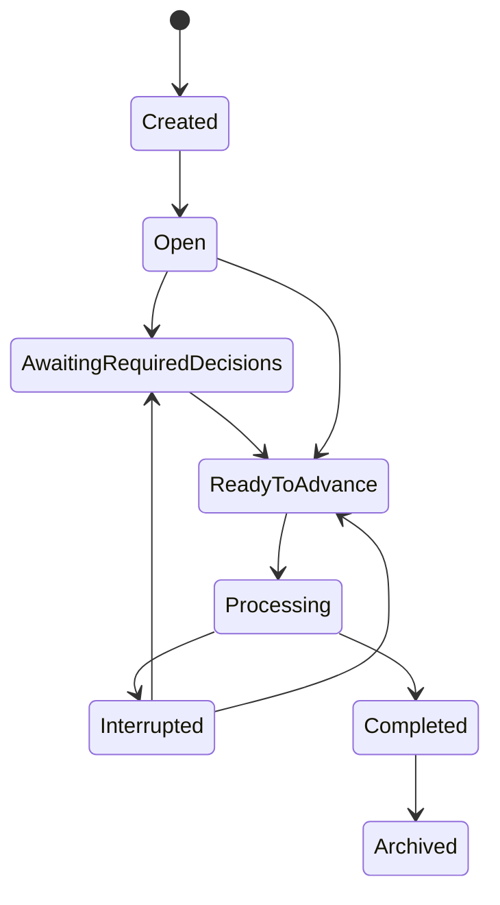
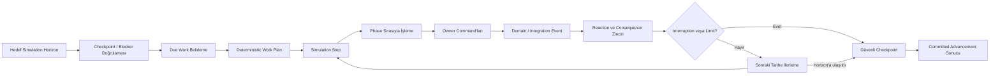
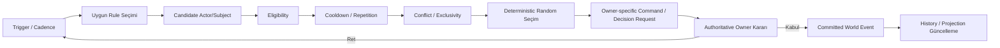
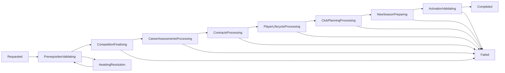

# Dünya Simülasyonu ve Zaman Akışı Sistemi

**Belge yolu:** `docs/12_WORLD_SIMULATION.md`
**Durum:** Kesinleşti
**Ana referans:** `docs/01_GAME_DESIGN_DOCUMENT.md`
**Kesin MVP sınırı:** `docs/02_MVP_SCOPE.md`
**Domain sınırları:** `docs/03_DOMAIN_MODEL.md`
**Olay ve kural sözleşmeleri:** `docs/04_EVENT_RULE_ENGINE.md`
**Hafıza ve söz sözleşmeleri:** `docs/05_MEMORY_AND_PROMISE_SYSTEM.md`
**İlişki sözleşmeleri:** `docs/06_RELATIONSHIP_SYSTEM.md`
**Diyalog ve karar sözleşmeleri:** `docs/07_DIALOGUE_SYSTEM.md`
**Transfer ve sözleşme sözleşmeleri:** `docs/08_TRANSFER_SYSTEM.md`
**Maç sözleşmeleri:** `docs/09_MATCH_SIMULATION.md`
**Teknik direktör kariyeri sözleşmeleri:** `docs/10_MANAGER_CAREER.md`
**Futbolcu kariyeri sözleşmeleri:** `docs/11_PLAYER_CAREER.md`
**Mimari yön:** `docs/17_TECHNOLOGY_AND_ARCHITECTURE_DECISION.md`
**İlgili karar günlüğü:** `docs/15_DECISION_LOG.md`

---

## 1. Belgenin Amacı

Bu belge, Football Career Simulator projesinde oyuncunun eylemlerinden bağımsız olarak ilerleyen **Dünya Simülasyonu ve Zaman Akışı** sorumluluğuna ait teknoloji bağımsız domain kurallarını kesinleştirir.

Sistemin amacı en az şunları kapsar:

* oyuncu herhangi bir işlem yapmasa dahi futbol dünyasının geçerli domain kurallarıyla ilerleyebilmesini sağlamak,
* oyun tarihini monoton, deterministik ve save/load uyumlu biçimde ilerletmek,
* oyuncunun haftalık kontrol merkezi ile gerçek takvim zamanını birbirinden ayırmak,
* aynı dünya snapshot'ı, input dizisi, content/rule sürümü ve seed ile aynı sonucu yeniden üretebilmek,
* oyuncu kulübü dışındaki 19 kulübün geçerli kadro, manager, fixture ve kariyer sonuçları üretmesini sağlamak,
* bütün bounded context'lerin kendi authoritative state'lerini korumasını sağlamak,
* background actor kararlarını doğrudan state mutation yerine command ve event zincirleriyle yürütmek,
* zamanı gelen maç, transfer, contract, injury, promise, job offer ve season işlemlerini güvenli sırada çalıştırmak,
* kritik oyuncu kararlarında zamanı durdurmak, rutin gelişmelerde akışı kesmemek,
* season transition sürecini kısmi veya tutarsız dünya state'i bırakmadan tamamlamak,
* on sezon boyunca futbolcu, manager, club, contract, fixture ve tarihsel verinin devamlılığını korumak,
* dünyanın yalnız başlangıç verisinin yaşlandırılmış kopyası hâline gelmesini engellemek,
* simülasyonu Godot veya kullanıcı arayüzü açılmadan headless olarak çalıştırabilmek,
* event, processing, checkpoint ve history verilerinin kontrolsüz büyümesini engellemek,
* hatalı, sonsuz veya patlayan event zincirlerini güvenli biçimde durdurabilmek,
* dünya sonuçlarını oyuncuya açıklanabilir news, summary ve timeline projection'ları olarak sunabilmektir.

Bu belge:

* üretim sınıfları, interface'ler veya enum'lar tanımlamaz,
* veritabanı tabloları veya migration üretmez,
* kesin serialization biçimi belirlemez,
* kesin olasılık formülleri veya cooldown süreleri belirlemez,
* kesin AI puanlama katsayılarını belirlemez,
* fiziksel thread modeli veya scheduler implementasyonu seçmez,
* UI ekran tasarımı veya Godot sahnesi tasarlamaz,
* `docs/01_GAME_DESIGN_DOCUMENT.md`, `docs/02_MVP_SCOPE.md`, `docs/03_DOMAIN_MODEL.md`, `docs/04_EVENT_RULE_ENGINE.md`, `docs/05_MEMORY_AND_PROMISE_SYSTEM.md`, `docs/06_RELATIONSHIP_SYSTEM.md`, `docs/07_DIALOGUE_SYSTEM.md`, `docs/08_TRANSFER_SYSTEM.md`, `docs/09_MATCH_SIMULATION.md`, `docs/10_MANAGER_CAREER.md`, `docs/11_PLAYER_CAREER.md` veya `docs/17_TECHNOLOGY_AND_ARCHITECTURE_DECISION.md` kararlarını değiştirmez.

---

## 2. Referanslar ve Kapsam

Kaynak önceliği:

1. `docs/01_GAME_DESIGN_DOCUMENT.md`
2. `docs/02_MVP_SCOPE.md`
3. `docs/03_DOMAIN_MODEL.md`
4. `docs/04_EVENT_RULE_ENGINE.md`
5. `docs/05_MEMORY_AND_PROMISE_SYSTEM.md`
6. `docs/06_RELATIONSHIP_SYSTEM.md`
7. `docs/07_DIALOGUE_SYSTEM.md`
8. `docs/08_TRANSFER_SYSTEM.md`
9. `docs/09_MATCH_SIMULATION.md`
10. `docs/10_MANAGER_CAREER.md`
11. `docs/11_PLAYER_CAREER.md`
12. `docs/17_TECHNOLOGY_AND_ARCHITECTURE_DECISION.md`
13. `docs/15_DECISION_LOG.md`

Bu belge şu bounded context'lerle kararlı event, command, query veya projection sözleşmeleri üzerinden çalışır: World & Calendar, Competition, Club & Governance, Player Career, Manager Career & Employment, Contract & Registration, Team Preparation, Training & Physical State, Match, Transfer, Social Continuity, Interaction & Narrative, Event & Rule Evaluation, Save Integrity. Bu belge mevcut 14 bounded context yapısını değiştirmez ve yeni bir bounded context oluşturmaz.

Bu belge aşağıdaki kesinleşmiş dünya ve MVP sınırlarını bağlayıcı kabul eder (`docs/02_MVP_SCOPE.md` ile uyumlu): 1 kurgusal ülke, 1 profesyonel lig, 20 kulüp, çift devreli sezon başına 38 lig maçı, yaklaşık 500 aktif futbolcu, en fazla 10 tamamlanmış sezon, sezon öncesi hazırlık dönemi, aktif lig sezonu, sezon arası dönem, yaz ve kış transfer dönemleri.

---

## 3. Uyumluluk ve Tutarlılık Notu

Bu belge hazırlanmadan önce Bölüm 2'de listelenen bütün ön koşul belgeleri baştan sona okunmuş ve ayrıntılı tutarlılık kontrolüne tabi tutulmuştur. Bu inceleme sonucunda GDD, MVP kapsamı, Domain Model, Event/Rule Engine, Memory/Promise, Relationship, Dialogue, Transfer, Match, Manager Career, Player Career ve Technology/Architecture belgeleri arasında bu belgenin kapsamını etkileyen gerçek bir çelişki tespit edilmemiştir.

Terminoloji netliği için:

* `docs/01_GAME_DESIGN_DOCUMENT.md` Bölüm 9'da "Dünya Simülasyonu" GDD düzeyinde geniş bir vizyon (aktörler, kulüp yaşam döngüsü, dünyanın dönüşümü) olarak tanımlanır. Bu belge bu vizyonu MVP'nin kesinleşmiş 14 bounded context yapısına uyacak biçimde teknik direktör kariyeri MVP'sine uygulanabilir domain sözleşmelerine dönüştürür.
* `docs/03_DOMAIN_MODEL.md` Bölüm 7.1'de tanımlanan **`World & Calendar`** bounded context'i bu belgede aynen korunur; bu belge onun sorumluluklarını ayrıntılandırır, değiştirmez veya genişletmez.
* Bu belgede kullanılan **"Dünya Simülasyonu"** ifadesi, `World & Calendar` context'inin authoritative state'inden ayrı bir **Application ve Simulation katmanı orkestrasyon sorumluluğunu** ifade eder (bkz. Bölüm 4). Bu ifade on beşinci bir bounded context oluşturmaz.
* `docs/02_MVP_SCOPE.md` Bölüm 7'de tanımlanan "oyun haftası" ve "haftalık kontrol merkezi" ifadeleri, bu belgedeki `Planning Period` kavramıyla aynı kavramsal alanı paylaşır; haftalık kontrol merkezi bir domain sistemi değildir ve bu belge onu yeniden tanımlamaz, yalnızca `Planning Period`'ı onun temel domain karşılığı olarak ayrıntılandırır.
* `docs/04_EVENT_RULE_ENGINE.md` Bölüm 14.2'de listelenen deadline authoritative owner tablosu bu belgede aynen korunur; World & Calendar yalnızca transfer window gibi kendi authoritative zaman pencerelerinin sahibidir, diğer context'lerin deadline'larının ikinci sahibi değildir.

Terminolojik farklılık tek başına çelişki sayılmamıştır; aynı kavram için ikinci bir authoritative state oluşturulmamıştır.

---

## 4. Kritik Mimari Ayrım

Bu belgenin en önemli ayrımı aşağıda açık ve bağlayıcı biçimde tanımlanır.

### 4.1. Dünya Simülasyonu

`World Simulation`, bütün dünya verilerinin sahibi olan yeni bir bounded context, devasa aggregate veya merkezi tablo değildir.

Dünya Simülasyonu:

* zamanın ilerletilmesini,
* zamanı gelmiş işlerin bulunmasını,
* farklı bounded context'lere ait işlemlerin doğru sırada çalıştırılmasını,
* background actor kararlarının tetiklenmesini,
* event queue'nun kararlı duruma getirilmesini,
* zorunlu kararların zamanı durdurmasını,
* season transition gibi çok context'li süreçlerin orkestrasyonunu,
* güvenli checkpoint oluşturulmasını

sağlayan **Application ve Simulation orkestrasyon modelidir**. Bu model `docs/03_DOMAIN_MODEL.md` Bölüm 6'daki Context Map'te tanımlanan Application katmanı ve `docs/17_TECHNOLOGY_AND_ARCHITECTURE_DECISION.md` Bölüm 8.2/8.3'te tanımlanan Simulation ve Application/Use Cases katmanlarının somut karşılığıdır.

Dünya Simülasyonu başka bounded context'lerin authoritative state'ini sahiplenmez.

### 4.2. `World & Calendar` bounded context'i

`World & Calendar`, mevcut 14 bounded context'ten biridir (`docs/03_DOMAIN_MODEL.md` Bölüm 7.1).

Authoritative olarak en az şu kavramlara sahiptir:

* geçerli `GameDate`,
* aktif `PlanningPeriod`,
* zaman ilerletme cursor'ı,
* simulation ordering bilgisi,
* `SimulationStep` kimlikleri,
* transfer ve benzeri zaman pencereleri,
* root seed,
* RNG version,
* gerekli runtime random state,
* simulation checkpoint referansları.

`World & Calendar` şunların authoritative sahibi **değildir**: Competition Season, Fixture, Standings, Match Result, Club bütçesi veya politikaları, Player development veya retirement, Manager employment, Contract, Registration, Squad, Transfer Process, Relationship, Memory, Promise, Decision Request, save dosyasının fiziksel şeması.

### 4.3. Yeni bounded context yasağı

Bu belge yeni bir `World Simulation`, `AI World`, `Club Lifecycle`, `Scheduler`, `News` veya `Simulation Engine` bounded context'i oluşturmaz.

Mevcut 14 bounded context yapısı korunur: World & Calendar, Competition, Club & Governance, Player Career, Manager Career & Employment, Contract & Registration, Team Preparation, Training & Physical State, Match, Transfer, Social Continuity, Interaction & Narrative, Event & Rule Evaluation, Save Integrity.

Application ve Simulation katmanı teknik orkestrasyon sorumluluğuna sahip olabilir; bu durum onları authoritative business domain sahibi yapmaz.

---

## 5. Bağlayıcı Tasarım İlkeleri

1. Dünya Simülasyonu, `docs/03_DOMAIN_MODEL.md` Bölüm 5'teki 14 bounded context listesini değiştirmez veya genişletmez.
2. `World & Calendar`, GameDate, Planning Period ve simulation ordering'in tek authoritative owner'ıdır.
3. Başka hiçbir context World & Calendar'ın authoritative state'ini doğrudan değiştiremez.
4. Dünya Simülasyonu başka context'lerin aggregate veya repository'lerini doğrudan mutate edemez; foreign mutation yasaktır (`docs/03_DOMAIN_MODEL.md` Bölüm 3, `docs/04_EVENT_RULE_ENGINE.md` Bölüm 3 ile uyumlu).
5. Context'ler arası her orkestrasyon Application-owned use case veya process manager üzerinden yürütülür.
6. Zaman yalnız açık bir Application use case'i (`AdvanceSimulationTime` veya eşdeğeri) üzerinden ilerletilir; UI, frame delta veya gerçek dünya saati zamanı ilerletemez.
7. Domain kararlarında duvar saati veya gizli global rastlantısallık kullanılamaz; rastlantısallık yalnız açık, seeded ve sürümlenmiş Random Context üzerinden sağlanır.
8. Snapshot ana runtime state kaynağıdır; tam event sourcing kullanılmaz (`docs/04_EVENT_RULE_ENGINE.md` Bölüm 18 ile uyumlu).
9. Handler registration sırası, dictionary/collection iteration sırası veya veritabanının doğal satır sırası business rule olarak kullanılamaz.
10. Aynı Simulation Step, aynı GameDate advancement veya aynı season transition stage ikinci kez tamamlanmış sayılamaz; idempotency zorunludur.
11. Kritik blocker ile non-blocking development ayrımı bağlayıcıdır; düşük önemli gelişmeler oyuncunun akışını sürekli kesemez.
12. Background actor kararları doğrudan state mutation değil, owner-specific Command üretir; aynı eligibility ve invariant kurallarına tabidir.
13. Simulation Fidelity farkı yalnızca hesaplama ve saklama ayrıntısını değiştirebilir; domain gerçeğinin anlamını değiştiremez.
14. Event chain depth, step work budget ve duplicate-effect koruması gibi güvenlik limitleri zorunludur; limit aşımı sessizce yok sayılamaz.
15. Harici üretken yapay zekâ, dünya simülasyonunun semantic sonucunu belirleyen zorunlu bir bağımlılık olamaz.
16. Kesin sayısal eşikler, olasılık formülleri, cooldown süreleri, work budget değerleri ve persistence şeması bu belgede belirlenmez.

---

## 6. Terminoloji

### 6.1. Game Date

Domain dünyasının geçerli tarihidir.

* Gerçek dünya duvar saatinden bağımsızdır.
* Frame rate'e bağlı değildir.
* Geriye ilerleyemez.
* Save/load sırasında korunur.
* Tarih karşılaştırmaları authoritative oyun zamanı üzerinden yapılır.

MVP'de `GameDate` için gün çözünürlüğü bağlayıcıdır. Saat ve dakika düzeyinde simülasyon MVP için zorunlu değildir. Aynı gün içindeki sıralama `SimulationStep`, priority phase ve sequence bilgileriyle açık biçimde çözülür.

### 6.2. Planning Period

Oyuncunun bir sonraki anlamlı planlama ve değerlendirme penceresidir (`docs/02_MVP_SCOPE.md` Bölüm 7.1'deki "oyun haftası" kavramının domain karşılığı).

Planning Period:

* her zaman pazartesi–pazar değildir,
* hiç maç içermeyebilir,
* bir maç içerebilir,
* birden fazla maç içerebilir,
* transfer deadline veya kritik karar nedeniyle erken kesilebilir,
* gerçek takvim günlerini yönetilebilir oyuncu akışına dönüştürür.

Planning Period, gerçek takvim haftasıyla aynı kavram değildir.

### 6.3. Simulation Horizon

Tek bir zaman ilerletme isteğinde ulaşılmak istenen hedef tarih veya hedef checkpoint'tir.

Örnekler: bir sonraki maç hazırlığı, bir sonraki zorunlu karar, planlama döneminin sonu, transfer deadline, belirli bir GameDate, season boundary.

Simulation Horizon'a ulaşılmadan kritik blocker oluşursa işlem erken durabilir.

### 6.4. Simulation Step

Dünya ilerlemesi sırasında atomik veya açık tutarlılık sınırında işlenen mantıksal adımdır.

Simulation Step: benzersiz kimlik taşır, kaynak checkpoint'i bilir, GameDate ve processing phase bilgisi taşır, bir kez tamamlanabilir, tamamlanmadan başarılı gösterilemez, tekrar çalıştırmaya karşı korunur.

Simulation Step, bir frame veya fiziksel thread iteration'ı değildir.

### 6.5. Simulation Phase

Aynı GameDate içindeki işlerin deterministik sırasını belirleyen açık processing kategorisidir.

Kavramsal phase örnekleri:

1. Ön koşul ve blocker doğrulaması
2. Tarih veya pencere boundary işlemleri
3. Due scheduled evaluations
4. Background actor kararları
5. Fixture ve match preparation
6. Match resolution
7. Sonuçların authoritative context'lere kabulü
8. Reaction rule ve consequence işlemleri
9. Decision Request ve interruption değerlendirmesi
10. Projection, summary ve checkpoint işlemleri

Bunlar kesin code enum'ları olarak tanımlanmaz; semantic ordering kategorileri olarak kullanılır (`docs/04_EVENT_RULE_ENGINE.md` Bölüm 10.2 ile uyumlu). Handler kayıt sırası business rule yapılamaz.

### 6.6. Simulation Checkpoint

Dünyanın yeniden yüklenebilir ve invariant'ları doğrulanmış güvenli state noktasıdır.

Checkpoint: yarım uygulanmış critical process içeremez, completed step kimliklerini bilir, pending fakat geçerli süreçleri açıkça koruyabilir, save alınması için güvenli sınır sağlayabilir, aynı step'in tekrar uygulanmasını engeller.

Her küçük event için ayrı kalıcı checkpoint zorunlu değildir.

### 6.7. Due Work Item

Belirli bir oyun tarihinde veya koşul gerçekleştiğinde işlenmesi gereken mantıksal iştir.

Örnekler: contract expiration değerlendirmesi, promise deadline, injury recovery evaluation, job offer expiration, transfer window open/close, player development checkpoint, retirement evaluation, fixture başlangıcı, board assessment, season transition adımı.

Due Work Item gerçekleşmiş bir Domain Event değildir.

### 6.8. Scheduled Evaluation

İlgili authoritative context'in gelecekte değerlendirmesi gereken domain işleminin zamanlanmış kaydıdır (`docs/04_EVENT_RULE_ENGINE.md` Bölüm 4.6 ile uyumlu).

Due olduğunda: rule evaluation, owner-specific Command, process manager adımı üretebilir.

Scheduled Evaluation, gelecekte gerçekleşmiş gibi saklanan bir Domain Event değildir.

### 6.9. Background Actor Decision

Oyuncu tarafından doğrudan kontrol edilmeyen manager, club veya diğer desteklenen aktörün domain bağlamına göre verdiği karardır.

Background Actor Decision: doğrudan tablo güncellemesi yapamaz, target authoritative context'e Command üretir, aynı eligibility ve invariant kurallarına tabidir, seeded ve deterministic olabilir, açıklama metadata'sı taşımalıdır.

### 6.10. World Event Candidate

Dünyada oluşma ihtimali değerlendirilen fakat henüz gerçekleşmemiş olay adayıdır.

Candidate: eligibility, cooldown, importance, conflict, frequency, actor scope, random context kurallarıyla değerlendirilir.

Candidate'ın seçilmesi doğrudan foreign state mutation anlamına gelmez.

### 6.11. World Event

Authoritative context tarafından kabul edilmiş ve gerçekleşmiş domain gerçeğidir.

World Event: committed olmalıdır, causation ve correlation bilgisi taşımalıdır, başka context'lerin state'ini doğrudan değiştirmez, oyuncuya gösterilen haber metniyle aynı kavram değildir.

### 6.12. Interruption

Simulation ilerlemesinin oyuncu kararı, geçersiz state, kritik hata veya güvenlik limiti nedeniyle hedef horizon'dan önce durmasıdır.

### 6.13. Blocker

Zaman ilerletilmeden önce çözülmesi gereken authoritative durumdur.

Örnekler: zorunlu maç kadrosu, süresi dolmak üzere olan kritik Decision Request, geçersiz squad, çözülmemiş critical process conflict, eksik fixture sonucu, tamamlanmamış season finalization prerequisite'i.

### 6.14. Simulation Fidelity

Bir domain sürecinin ne kadar ayrıntılı değerlendirildiğini ifade eder.

Fidelity: authoritative ownership'i değiştiremez, invariant'ları atlayamaz, farklı anlamda domain sonucu üretemez, yalnız hesaplama ve içerik ayrıntısını sadeleştirebilir.

### 6.15. World Summary ve News Projection

Committed domain sonuçlarının oyuncuya sunulan özetidir.

World Summary veya News: authoritative domain state değildir, olayın gerçekleşmesine neden olamaz, kaybolması business state'i bozmamalıdır, mümkün olduğunda current state ve history'den yeniden üretilebilir.

---

## 7. Dünya Simülasyonu Veri Sahipliği

Aşağıdaki authoritative ownership tablosu bağlayıcıdır (`docs/03_DOMAIN_MODEL.md` Bölüm 5 ve 11 ile uyumlu):

| Context | Authoritative sahip olduğu veriler |
|---|---|
| `World & Calendar` | GameDate, Planning Period, simulation ordering, root seed ve runtime random state |
| `Competition` | Season, Fixture, kabul edilmiş Match Result ve Standings |
| `Club & Governance` | Club identity, policies, budget boundaries ve club history |
| `Player Career` | Player identity, kalıcı Sporting Profile, development, decline, retirement ve generation |
| `Manager Career & Employment` | Manager identity, employment, job offers, Board Confidence ve dismissal |
| `Contract & Registration` | Player contract, registration ve authoritative active club |
| `Team Preparation` | Squad Membership, Match Selection ve reusable Tactic Plan |
| `Training & Physical State` | fatigue, fitness, injury ve training state |
| `Match` | tek maçın runtime state'i, timeline'ı ve Match Result |
| `Transfer` | Transfer Process |
| `Social Continuity` | Relationship, Memory ve Promise |
| `Interaction & Narrative` | Decision Request, Dialogue Session ve public narrative |
| `Event & Rule Evaluation` | event metadata, scheduled evaluation index, processing ve idempotency kayıtları |
| `Save Integrity` | snapshot manifest, schema version, migration ve integrity metadata |
| `Application` (bounded context değildir) | use case, process manager ve context'ler arası orkestrasyon |

Dünya Simülasyonu adı altında bu state'lerin ikinci kopyaları oluşturulmaz. Her authoritative sahip yalnızca kendi committed event'lerini yayınlar; Application/Simulation katmanı bu event'leri okuyup ilgili sonraki adımları tetikler.

---

## 8. Kesin MVP Dünya Kapsamı

Belgede aşağıdaki kapsam bağlayıcı kabul edilir:

* 1 kurgusal ülke,
* 1 profesyonel lig,
* 20 kulüp,
* çift devreli lig,
* kulüp başına sezon başına 38 lig maçı,
* yaklaşık 500 aktif futbolcu,
* her kulüp için bir aktif manager kaydı,
* en fazla 10 tamamlanmış sezon,
* sezon öncesi hazırlık dönemi,
* aktif lig sezonu,
* sezon arası dönem,
* yaz transfer dönemi,
* kış transfer dönemi,
* oyuncu manager'ın kulüpler arasında geçiş yapabilmesi,
* oyuncu kulübü dışındaki kulüplerin gerçek fakat sadeleştirilmiş simülasyonu,
* background fixture ve match sonuçlarının gerçek domain sözleşmeleriyle üretilmesi,
* player aging, development, decline, retirement ve generation,
* manager dismissal, unemployment, job offer ve employment değişimleri,
* squad ve transfer yoluyla kulüp kadrolarının zaman içinde değişmesi,
* kulüp politikaları, bütçe sınırları, sporting reputation veya strength summary'nin sınırlı biçimde değişebilmesi,
* ilişki, hafıza ve söz devamlılığının kulüp değişiminde korunması.

MVP kapsamında **bulunmayacak** dünya özellikleri: ikinci profesyonel lig, yükselme ve düşme, ulusal kupa, kıtasal turnuva, milli takım, çok ülke, çok lig, yeni kulüp oluşturma veya kulüp kapatma, ayrıntılı başkanlık seçimleri, ayrıntılı yönetim kurulu siyaseti, bağımsız yatırımcı simülasyonu, ayrıntılı sponsorluk ekonomisi, stadyum geliştirme simülasyonu, ayrıntılı borç ve muhasebe sistemi, kapsamlı federasyon ve kural değişikliği simülasyonu, ayrıntılı hakem kariyerleri, ayrıntılı medya kuruluşu ağı, ayrıntılı taraftar grubu simülasyonu, tam personel piyasası, ayrıntılı oyuncu menajeri ağı, dinamik lig formatı değişiklikleri.

GDD'nin uzun vadeli vizyonundaki bu sistemler kaldırılmış veya reddedilmiş değildir; MVP sonrası genişleme noktaları olarak korunur (`docs/01_GAME_DESIGN_DOCUMENT.md` Bölüm 28-29 ile uyumlu).

---

## 9. Zaman Çözünürlüğü ve İlerletme Modeli

MVP için bağlayıcı zaman modeli:

> Domain takvimi gün çözünürlüğünde ilerler; simülasyon her günü ve her entity'yi kör biçimde taramak yerine due-work ve boundary tabanlı, çok oranlı bir processing modeli kullanır.

Bağlayıcı kurallar:

1. `GameDate` minimum semantic tarih çözünürlüğü olarak günü kullanır.
2. Aynı gün içinde birden fazla işlem açık Simulation Phase ve sequence ile sıralanır.
3. UI frame'leri oyun zamanını ilerletmez.
4. Gerçek dünya saati oyun zamanını ilerletmez.
5. Zaman yalnız açık Application use case'i üzerinden ilerletilir.
6. Sistem, bir sonraki anlamlı due date veya boundary'ye atlayabilir.
7. Büyük tarih atlamaları aradaki due work'ü atlayamaz.
8. Günlük çalışan bir rule varsa tarih atlamasında deterministik olarak telafi edilmelidir.
9. Bütün aktif entity'ler her gün taranmak zorunda değildir.
10. Aynı GameDate ikinci kez tamamlanmış world advancement olarak uygulanamaz.
11. Time advance, blocker bulunduğunda başlamadan reddedilebilir.
12. Processing sırasında kritik interruption oluşursa horizon'a ulaşılmadan durabilir.
13. Başarılı time advance yalnız güvenli checkpoint oluşturulduğunda tamamlanmış sayılabilir.
14. Zaman geriye alınamaz; eski save yüklemek ayrı bir rehydration işlemidir.
15. Season veya transfer boundary'si normal günlük ilerleme içinde kaybolamaz.

---

## 10. Planning Period Modeli

Planning Period için en az şu kavramsal bilgiler değerlendirilir:

* `PlanningPeriodId`
* başlangıç GameDate'i
* hedef veya beklenen bitiş GameDate'i
* bağlı Competition Season referansı
* yaklaşan Fixture referansları
* pending critical Decision Request referansları
* blocker referansları
* status
* oluşturulma nedeni
* interruption nedeni
* tamamlanma zamanı
* causation ve correlation bilgisi
* schema version

Kesin class veya tablo oluşturulmaz.

### 10.1. Yaşam döngüsü

```text
Created → Open → AwaitingRequiredDecisions → ReadyToAdvance → Processing → Interrupted → Completed → Archived
```



### 10.2. Bağlayıcı kurallar

* Aynı Planning Period iki kez tamamlanamaz.
* Completed dönem yeniden Open olamaz.
* Interruption, dönemin tamamen başarısız olduğu anlamına gelmez.
* Yeni kritik karar mevcut dönemi kesebilir.
* Bir sonraki dönem yalnız geçerli checkpoint sonrasında açılabilir.
* Planning Period'ın UI ekranı domain state'in sahibi değildir.
* Planning Period gerçek haftayla zorunlu olarak aynı tarihlere sahip değildir.

---

## 11. Zaman İlerletme Use Case'i

Belgede `AdvanceSimulationTime` veya eşdeğer use case için aşağıdaki kavramsal akış bağlayıcıdır:

1. Kullanıcı, AI test runner veya sistem hedef Simulation Horizon talep eder.
2. Application mevcut checkpoint ve expected world version bilgisini doğrular.
3. Pending mandatory blocker'lar kontrol edilir.
4. Hedef tarihe kadar due olacak işler belirlenir.
5. Deterministik work plan oluşturulur.
6. Bir sonraki GameDate veya boundary seçilir.
7. İlgili Simulation Step açılır.
8. Phase sırasına göre due work işlenir.
9. Authoritative owner'lara Command gönderilir.
10. Committed Domain Event ve Integration Event'ler logical queue'ya eklenir.
11. Reaction ve consequence zinciri kararlı duruma getirilir.
12. Background actor kararları kendi cadence ve eligibility kurallarıyla değerlendirilir.
13. Critical Decision Request veya conflict oluşursa interruption üretilir.
14. Güvenlik limitleri kontrol edilir.
15. Step invariant'ları doğrulanır.
16. Step completed ve idempotency kayıtları commit edilir.
17. Gerekirse bir sonraki tarihe ilerlenir.
18. Horizon'a, blocker'a veya interruption'a ulaşıldığında güvenli checkpoint oluşturulur.
19. UI veya runner'a committed advancement sonucu döndürülür.



Bir UI düğmesi doğrudan GameDate alanını değiştiremez.

---

## 12. Deterministik İş Sırası

Aynı due date içindeki iş sırası açık ve sürümlenebilir olmalıdır.

Sıralama en az şu semantic bileşenleri değerlendirebilir: GameDate, Simulation Phase, business priority, source context, stable aggregate veya entity identity, Scheduled Evaluation kimliği, deterministic sequence, causation depth.

Bağlayıcı kurallar:

* Handler registration order iş kuralı olamaz.
* Hash map iteration order iş kuralı olamaz.
* Veritabanının doğal satır sırası iş kuralı olamaz.
* Thread scheduling sonucu değiştiremez.
* UI render sırası sonucu değiştiremez.
* Aynı sıralama anahtarındaki eşitlik stable identity ile çözülmelidir.
* Physical parallelism kullanılsa bile committed logical outcome order açık kalmalıdır.
* Kesin teknik comparator implementasyonu bu belgede kod olarak tanımlanmaz.

Bu ilkeler `docs/04_EVENT_RULE_ENGINE.md` Bölüm 10.2-10.3 ile birebir uyumludur.

---

## 13. Event Queue Stabilizasyonu

Bir Simulation Step tamamlanmadan önce gerekli logical event queue kararlı duruma getirilmelidir.

Bağlayıcı kurallar:

* Committed event foreign state'i doğrudan değiştirmez.
* Rule evaluation consequence request veya owner-specific Command üretir.
* Yeni Command yeni committed event üretebilir.
* Queue, iş kalmayana, critical interruption oluşana veya güvenlik limiti aşılana kadar işlenir.
* Aynı consumer effect iki kez uygulanamaz.
* Failed consumer source event'i gerçekleşmemiş hâle getirmez.
* Critical effect tamamlanmadan başarılı checkpoint oluşturulamaz.
* Low-priority projection veya notification business completion'ı engellemek zorunda değildir.
* Event chain depth kontrolsüz büyüyemez.
* Aynı correlation chain kendi kendisini sonsuz biçimde tekrar tetikleyemez.
* Safety limit aşımı sessizce sonuç atlamaz; açık Simulation Failure veya quarantine sonucu üretir.

Bu bölüm `docs/04_EVENT_RULE_ENGINE.md` Bölüm 8, 9 ve 17 ile uyumludur.

---

## 14. Simulation Blocker ve Interruption Politikası

Belgede blocker ve interruption'lar sınıflandırılır.

### 14.1. Hard Blocker

Zaman ilerlemesini başlatmadan durdurur.

Örnekler: zorunlu ve geçerli match squad bulunmaması, illegal squad veya registration state, unresolved critical transfer finalization conflict, active fixture'ın sonucu olmadan season completion, bozuk authoritative referans, yüklenemeyen required content/rule version.

### 14.2. Player Decision Interruption

Güvenli checkpoint'te zamanı durdurur ve oyuncu kararı bekler.

Örnekler: kritik futbolcu talebi, Promise talebi veya deadline kararı, kritik transfer onayı, kritik Board kararı, iş teklifi, kritik basın sorusu, maç hazırlığı.

### 14.3. Non-blocking Development

Dünyada gerçekleşir fakat zamanı durdurmaz.

Örnekler: rutin background transfer haberi, düşük önem Relationship değişimi, minor club policy summary, routine Player development, background match sonucu, düşük önem world news.

### 14.4. Technical Interruption

Güvenli biçimde devam edilemeyen teknik veya invariant hatasıdır.

Örnekler: event storm limiti, duplicate identity conflict, determinism violation, failed critical transaction, missing authoritative owner, invalid state transition.

### 14.5. Bağlayıcı kurallar

* Notification tek başına blocker değildir.
* Presentation hatası domain işlemini geri alamaz.
* Low-importance world event oyuncunun akışını sürekli kesemez.
* Blocking nedeni oyuncuya ve debug araçlarına açıklanabilir olmalıdır.
* Aynı blocker duplicate Decision Request üretmemelidir.

Bu sınıflandırma `docs/02_MVP_SCOPE.md` Bölüm 9-10 ve `docs/04_EVENT_RULE_ENGINE.md` Bölüm 13 ile uyumludur.

---

## 15. Background Actor Karar Modeli

Final MVP'de oyuncu dışındaki kulüp ve manager'lar yalnız statik kayıt olarak kalamaz.

Background decision sistemi en az şu alanlarda sadeleştirilmiş fakat gerçek kararlar üretmelidir: kadro ihtiyacı değerlendirmesi, squad role ve selection kararları, temel tactic plan seçimi, match preparation, transfer ihtiyacı, transfer target değerlendirmesi, satışa sportif yaklaşım, contract veya registration gereksinimlerinin fark edilmesi, manager employment ve dismissal süreçleri, player development ve retirement sonuçlarına tepki, season expectation ve club policy uyumu.

Background actor kararı en az şu girdileri kullanabilir: authoritative current state, club policy, budget boundary, squad need, player profile, physical availability, manager profile, season context, standings, fixture proximity, transfer window, relationship veya memory girdileri (yalnız ilgili sistem destekliyorsa), deterministic Random Context, rule/content version.

### 15.1. Bağlayıcı kurallar

1. Background AI foreign state'i doğrudan değiştiremez.
2. Background AI owner-specific Command üretir.
3. Command authoritative context tarafından reddedilebilir.
4. AI karar sonucu Domain Event'ten önce gerçekleşmiş sayılmaz.
5. AI, oyuncuya uygulanmayan gizli ayrı invariant set'i kullanamaz.
6. AI daha az seçenek değerlendirebilir fakat illegal sonuç üretemez.
7. AI kararları açıklama kodu veya factor summary taşımalıdır.
8. Her entity her gün karar vermek zorunda değildir.
9. Karar cadence'i due-work, event veya checkpoint tabanlı olabilir.
10. Aynı state ve seed ile aynı karar üretilmelidir.
11. AI başarısızlığını gizlemek için doğrudan state düzeltmesi yapılamaz.
12. AI bütün transfer ve squad kararlarını yalnız overall değerine göre veremez.

Kesin AI utility formülleri ve katsayıları bu belgede açık bırakılır (bkz. Bölüm 38). Bu yaklaşım `docs/08_TRANSFER_SYSTEM.md` Bölüm 21'deki AI Club kararı ilkeleriyle uyumludur.

---

## 16. Simulation Fidelity Seviyeleri

MVP için sınırlı fidelity modeli tanımlanır (`docs/09_MATCH_SIMULATION.md` Bölüm 17'deki Match'e özgü fidelity modeliyle uyumlu, dünya genelinde genişletilmiş biçimi).

### 16.1. Interactive Fidelity

Şunlar için kullanılır: oyuncunun yönettiği kulüp, oyuncuya ait pending kararlar, oyuncu kulübünün yaklaşan maçları, kritik transfer ve employment süreçleri, oyuncuyla doğrudan ilişkili Promise, Memory ve Relationship süreçleri.

Bu seviyede bütün gerekli context sözleşmeleri ve açıklama metadata'sı korunur.

### 16.2. Background Fidelity

Şunlar için kullanılır: diğer 19 kulüp, background fixture'lar, routine squad ve transfer kararları, background manager değerlendirmeleri, player aging ve development batch'leri.

Bu seviyede hesaplama ve içerik ayrıntısı sadeleştirilebilir. Ancak:

* gerçek Match Result üretilmeli,
* sonuç Competition tarafından kabul edilmeli,
* Contract, Registration ve Squad invariant'ları korunmalı,
* retirement ve generation gerçek owner üzerinden yürümeli,
* duplicate veya illegal state üretilememelidir.

### 16.3. Historical Fidelity

Tamamlanmış ve aktif karar üretmeyen eski dönemler için: ayrıntılı processing kayıtları compact edilebilir, önemli history ve milestone korunur, current authoritative state etkilenmez, audit ve explainability için gerekli minimum lineage saklanır.

### 16.4. Bağlayıcı kural

> Fidelity farkı domain gerçeğinin anlamını değil, hesaplama ve saklama ayrıntısını değiştirebilir.

Oyuncunun görmediği maçların sonucu doğrudan rastgele standings tablosuna yazılamaz.

---

## 17. MVP Dünya Aktörleri

GDD'deki bütün nihai aktörler MVP'de bağımsız ve tam simüle edilen entity hâline getirilmez.

### 17.1. MVP'de gerçek domain kimliği bulunan ana aktörler

Player, Manager, Club, Competition ve Season katılımcıları, gerekli kurumsal karar sahipleri (mevcut bounded context sınırları içinde).

### 17.2. MVP'de soyut veya özet temsil edilebilecek aktörler

Kulüp yönetimi, operasyonel müzakere temsilcisi (`docs/08_TRANSFER_SYSTEM.md` Bölüm 8 ile uyumlu), taraftar topluluğu, medya, gazeteciler, sağlık veya teknik personel, sponsor ve yatırımcı etkileri.

Bu aktörler ayrı tam kariyer yaşam döngüsü, geniş relationship ağı, tam ekonomik state veya bağımsız günlük karar döngüsü taşımak zorunda değildir.

### 17.3. MVP sonrası aktörler

Ayrıntılı player agent ağı, bağımsız gazeteci kariyerleri, sponsor şirketleri, yatırımcılar, federasyon aktörleri, hakem kariyerleri, aile ve yakın çevre, tam teknik personel piyasası.

Gelecekte eklenebilmeleri mevcut kimlik ve Actor Reference modelince engellenmez (`docs/03_DOMAIN_MODEL.md` Bölüm 4.10 ile uyumlu).

---

## 18. Kulüp Yaşam Döngüsü MVP Modeli

GDD'deki geniş kulüp dönüşümü vizyonu MVP'de sadeleştirilir.

Final MVP'de kulüp zaman içinde en az şu değişimleri yaşayabilir: manager değişimi, season expectation değişimi, Board Confidence sonuçları, sportif reputation veya strength summary değişimi, transfer ve maaş budget boundary değişimi, sınırlı club policy değişimi, squad yaş yapısının değişimi, transfer stratejisi veya ihtiyaç önceliğinin değişmesi, önemli achievement veya crisis history kaydı, oyuncu üretimi, gelişimi, transferi ve emekliliği nedeniyle kadronun dönüşmesi.

MVP'de gerçek ve ayrıntılı olarak simüle edilmeyecek kulüp süreçleri: muhasebe defteri, borç yapılandırması, yatırımcı pazarlığı, hisse devri, başkanlık seçimi, stadyum inşaatı, sponsorluk sözleşmesi, altyapı tesisi yönetimi, taraftar grubu siyaseti, kulüp kapanması veya yeni kulüp oluşturulması.

### 18.1. Kulüp değişimlerinin sahipliği

* Club policy ve budget boundary değişimi `Club & Governance` tarafından uygulanır.
* Manager değişimi `Manager Career & Employment` tarafından uygulanır (`docs/10_MANAGER_CAREER.md` ile uyumlu).
* Squad değişimi `Team Preparation` tarafından uygulanır.
* Contract ve active club değişimi `Contract & Registration` tarafından uygulanır.
* Transfer süreci `Transfer` tarafından uygulanır (`docs/08_TRANSFER_SYSTEM.md` ile uyumlu).
* Reputation veya strength state'i hangi kesinleşmiş context tarafından sahipleniliyorsa yalnız orada değiştirilir.
* World Simulation yalnız değerlendirme zamanını ve orkestrasyonu sağlar; doğrudan mutation yapmaz.

---

## 19. Dünyanın Uzun Vadeli Dönüşümü

On sezon sonunda dünya yalnız başlangıç kadrolarının yaşlandırılmış kopyası olmamalıdır.

Minimum yapısal dönüşüm kaynakları: Player aging, Player development, Player decline, Player retirement, New generated players (`docs/11_PLAYER_CAREER.md` ile uyumlu), Player transfers, Free-agent hareketleri, Squad role değişimleri, Manager dismissals, Manager employment changes (`docs/10_MANAGER_CAREER.md` ile uyumlu), Club reputation veya strength değişimleri, Club policy ve budget boundary değişimleri, Season standings history, Persistent Relationship, Persistent Memory, Promise sonuçları, Manager career reputation ve profile değişimleri, kulüplerin farklı transfer ve kadro kararları.

Dünya farklı seed'lerle farklı fakat geçerli transfer yolları, farklı manager kariyerleri, farklı player gelişimleri, farklı standings, farklı club güç dengeleri üretebilmelidir.

Aynı seed ve aynı input dizisiyle kontrolsüz biçimde farklı dünya üretilemez (bkz. Bölüm 33 — Determinizm Sözleşmesi).

---

## 20. World Event Sistemi

World Event sistemi, sınırsız rastgele hikâye üreticisi olarak tasarlanmaz.

Bir World Event kuralı kavramsal olarak şunları tanımlar: `WorldEventRuleId`, rule version, event category, eligible actor veya subject türleri, required context, minimum ve maksimum importance, eligibility conditions, cooldown policy, repetition policy, exclusivity veya conflict group, random context gereksinimi, üretebileceği command veya consequence türleri, blocking policy, explanation code, retention direction, test senaryoları.

Kesin class veya DSL üretilmez.

### 20.1. Candidate değerlendirmesi

Genel akış:

1. Trigger veya cadence oluşur.
2. Uygun event rule'ları seçilir.
3. Candidate actor ve subject'ler belirlenir.
4. Eligibility doğrulanır.
5. Cooldown ve repetition kontrol edilir.
6. Conflict ve exclusivity değerlendirilir.
7. Gerekirse deterministic random seçim yapılır.
8. Candidate seçilirse owner-specific Command veya Decision Request üretilir.
9. Authoritative owner sonucu kabul veya reddeder.
10. Committed event oluşursa history ve projection güncellenir.
11. Cooldown ve completion identity kaydedilir.



### 20.2. World Event sınırlamaları

* Her gün rastgele event üretmek zorunlu değildir.
* Event sayısı kariyer ilerledikçe kontrolsüz büyüyemez.
* Aynı event metni farklı semantic event'lerin yerine geçemez.
* Event yalnız metin veya notification olarak kalmamalıdır.
* Domain etkisi olmayan flavor event'ler düşük önem ve sınırlı frekansta olabilir.
* Critical event'ler gerçek authoritative state'e dayanmalıdır.
* Random event illegal contract, squad, match veya employment state'i oluşturamaz.
* Harici generative AI semantic event seçemez veya domain sonucunu belirleyemez.
* Gelecekte generative AI yalnız committed sonucu metinsel olarak çeşitlendirebilir.

---

## 21. Rastlantısallık ve Random Context

Belgede aşağıdaki kararlar bağlayıcıdır:

* Tek ve kontrolsüz global random generator kullanılmayacaktır.
* Root seed `World & Calendar` simulation state'inde korunacaktır.
* RNG algoritması veya sürümü açıkça sürümlenecektir.
* Domain kararları gerekli `Random Context` üzerinden random değer isteyecektir.
* Random kullanımının amacı ve scope'u açıklanabilir olmalıdır.
* Random stream'ler sistem, season, process, fixture, entity veya event family temelinde bölünebilir.
* Bir sistemin yeni random çağrısı ilgisiz bütün dünya sonuçlarını gereksiz yere değiştirmemelidir.
* Save/load random state veya deterministik stream derivation bilgisini korumalıdır.
* Random sonuç event veya audit metadata'sıyla izlenebilir olmalıdır.
* Rastlantısallık invalid state'i düzeltmek için kullanılamaz.
* Aynı Random Context ikinci kez tüketildiğinde duplicate domain etkisi üretilemez.
* Kesin PRNG algoritması bu belgede belirlenmez (`docs/17_TECHNOLOGY_AND_ARCHITECTURE_DECISION.md` Bölüm 9.1 ile uyumlu).

---

## 22. Competition ve Fixture Akışı

World Simulation ile Competition sorumluluğu açıkça ayrılır.

Bağlayıcı akış:

1. Competition active Season ve Fixture state'inin sahibidir.
2. World & Calendar Fixture tarihine ulaşıldığını bildirir.
3. Team Preparation gerekli selection ve tactic state'ini hazırlar.
4. Match context tek maçın runtime state'ini açar.
5. Match Result yalnız Match context tarafından tamamlanır.
6. Competition Match Result'ı yalnızca bir kez kabul eder.
7. Standings yalnız Competition tarafından güncellenir.
8. World Simulation sonraki due work ve checkpoint'i koordine eder.

Background maçlar için de aynı semantic akış korunur. Background maç sonucu doğrudan Standings'e yazılamaz (`docs/09_MATCH_SIMULATION.md` Bölüm 24 ile birebir uyumlu).

---

## 23. Season Lifecycle

Competition Season için kesinleşmiş lifecycle korunur:

```text
Preseason → Active Season → Completed → Archived
```

World Simulation bu state'lerin sahibi değildir; transition zamanını ve çok context'li işlemleri koordine eder.

MVP season akışı en az şunları kapsar:

1. Preseason initialization
2. Club ve manager assignment doğrulaması
3. Player contract, registration ve squad doğrulaması
4. Fixture oluşturulması veya aktive edilmesi
5. Yaz transfer penceresi
6. Active league season
7. Kış transfer penceresi
8. Son fixture'ların tamamlanması
9. Match Result'ların Competition tarafından kabulü
10. Final standings
11. Season assessment
12. Manager board değerlendirmeleri
13. Contract expiration ve renewal sonuçları
14. Player development/decline değerlendirmeleri
15. Retirement değerlendirmeleri
16. New player generation
17. Club policy ve budget boundary değerlendirmeleri
18. Yeni season hazırlığı
19. Yeni fixture ve window state'i
20. Güvenli season activation checkpoint'i

---

## 24. Season Transition Process

Season transition tek handler içinde bütün tabloları değiştiren devasa işlem olamaz.

Application-owned process manager veya eşdeğer orkestrasyon modeli kullanılır (`docs/04_EVENT_RULE_ENGINE.md` Bölüm 16.6 ile uyumlu).

### 24.1. Kavramsal state'ler

```text
Requested → PrerequisitesValidating → CompetitionFinalizing → CareerAssessmentsProcessing → ContractsProcessing → PlayerLifecycleProcessing → ClubPlanningProcessing → NewSeasonPreparing → ActivationValidating → Completed
```

Ek terminal/ara state'ler: `Failed`, `AwaitingResolution`.



### 24.2. Minimum kavramsal alanlar

`SeasonTransitionProcessId`, source Season reference, target Season reference, source checkpoint, current stage, completed stage identities, pending command identities, prerequisite results, failure veya blocker reason, retry count veya retry state, causation ve correlation bilgisi, rule/content/schema versions.

Kesin class veya persistence şeması oluşturulmaz.

### 24.3. Season completion prerequisites

Season tamamlanmadan en az şunlar doğrulanır: bütün zorunlu Fixture'lar tamamlanmış, bütün Match Result'lar yalnızca bir kez kabul edilmiş, Standings geçerli, açık active Match bulunmuyor, competition completion invariant'ları sağlanmış, critical unresolved result conflict bulunmuyor.

### 24.4. New season activation prerequisites

Yeni season aktive edilmeden en az şunlar doğrulanır: 20 geçerli katılımcı kulüp, her kulüp için geçerli active manager veya açık tanımlı fallback policy, aktif futbolcu havuzu kabul edilen aralıkta, retired player active contract/registration/squad ile kalmamış, contract ve registration state'i geçerli, squad invariant'ları geçerli, fixture set'i geçerli, transfer window state'i geçerli, root simulation state ve RNG version yüklenebilir, pending process ve due work state'i tutarlı.

### 24.5. Atomiklik yönü

Bütün season transition tek veritabanı transaction'ında yapılmak zorunda değildir. Ancak: her stage idempotent olmalı, completed stage tekrar uygulanmamalı, başarısızlık açık process state'i bırakmalı, kritik activation checkpoint'i kısmi yeni season state'i göstermemeli, retry aynı futbolcuyu ikinci kez emekli etmemeli, retry aynı generated player'ı ikinci kez oluşturmamalı, retry aynı contract expiration'ı ikinci kez uygulamamalı, retry aynı manager assessment sonucunu ikinci kez uygulamamalıdır.

---

## 25. Transfer Window ve Deadline Akışı

World & Calendar transfer window zaman sınırlarını yönetebilir; Transfer Process'in authoritative owner'ı değildir (`docs/08_TRANSFER_SYSTEM.md` Bölüm 23 ile birebir uyumlu).

Kurallar:

* Window open ve close boundary'leri belirli GameDate'lerde gerçekleşir.
* Window açılması veya kapanması committed event üretir.
* Window kapanışında due Transfer Process'ler authoritative Transfer kurallarıyla değerlendirilir.
* Deadline sırasında processing order açık olmalıdır.
* Kapanış anında başlayan ve daha önce başlayan süreçlerin eligibility farkı açık kuralla belirlenmelidir.
* Window kapandıktan sonra illegal yeni offer oluşturulamaz.
* Window close active process'leri doğrudan silmez.
* Completion Contract, Registration, Squad ve budget state'leriyle atomik finalization gerektirir.
* Save/load deadline'ı veya process'i ikinci kez çalıştırmamalıdır.
* Kesin deadline saat modeli MVP dışında bırakılabilir; gün çözünürlüğü ve aynı gün sequence policy kullanılır.

---

## 26. Player Lifecycle Entegrasyonu

World Simulation şu işlemlerin zamanını ve orkestrasyonunu destekler: age derivation, development checkpoint, decline checkpoint, retirement evaluation, retirement finalization, annual player generation, population continuity validation (`docs/11_PLAYER_CAREER.md` ile birebir uyumlu).

Ancak:

* permanent Sporting Profile yalnız Player Career tarafından değiştirilebilir,
* Physical State yalnız Training & Physical State tarafından değiştirilebilir,
* active club yalnız Contract & Registration'dan türetilir,
* squad membership yalnız Team Preparation tarafından değiştirilebilir,
* generation doğrudan contract veya squad oluşturamaz.

Annual generation ve retirement aynı season transition içinde çalışıyorsa processing order açık olmalıdır (`docs/11_PLAYER_CAREER.md` Bölüm 19.1 ile uyumlu).

Population target kontrolü exact sabit sayıyı zorla korumak için illegal player üretmemelidir.

---

## 27. Manager ve Employment Entegrasyonu

World Simulation şu süreçlerin zamanını destekler: periodic veya event-driven Board Assessment, employment risk review, dismissal, unemployment market review, job offer creation, offer expiration, employment activation, season-end career assessment (`docs/10_MANAGER_CAREER.md` ile birebir uyumlu).

Ancak:

* Board Confidence yalnız Manager Career & Employment tarafından değiştirilebilir,
* active employment aynı context'in authoritative state'idir,
* Club budget World Simulation tarafından değiştirilemez,
* dismissal sonucu UI veya news tarafından üretilemez,
* player manager'ın iş teklifi Decision Request'i Interaction & Narrative üzerinden sunulur,
* background manager kararları da owner-specific Command'larla yürür.

---

## 28. Club Policy ve Bütçe Değerlendirmesi

Club & Governance değişimleri event-driven veya season checkpoint tabanlı olabilir.

Değerlendirilebilecek girdiler: final standings, season expectation sonucu, major achievement veya failure, transfer mali commitments, squad age ve need summary, club reputation, manager employment durumu, önceki policy state.

Bağlayıcı kurallar:

* World Simulation yeni budget değerini doğrudan yazamaz.
* Club & Governance kendi invariant'larıyla sonucu kabul eder.
* Budget boundary negatif olamaz.
* Active transfer süreçleri budget düşüşünde sessizce silinemez.
* Policy değişimi active season ortasında oluşuyorsa effective date açık olmalıdır.
* Exact finansal formül ve policy boyutları açık bırakılır.
* Detailed debt, investor veya sponsorship modeli eklenmez.

---

## 29. Dünya Haberleri ve Oyuncuya Sunum

Dünya haberleri committed domain state'ten türetilir.

Oyuncuya gösterilebilecek özetler: background match sonuçları, standings değişimleri, manager dismissal veya appointment, önemli transferler, önemli player development veya retirement, club policy veya budget pressure özeti, önemli Promise/Relationship/public narrative sonucu, season milestone, kariyer açısından ilgili eski aktör gelişmeleri.

Presentation politikası:

* bütün düşük önem event'ler tek tek gösterilmez,
* news importance ve relevance'e göre gruplanabilir,
* oyuncunun kulübü ve geçmiş ilişkileri daha yüksek relevance taşıyabilir,
* aynı gelişme duplicate haber üretmemelidir,
* haber metni event schema'sının yerine geçmez,
* localization değişikliği domain sonucunu değiştirmez,
* haber kaybı authoritative state'i bozmaz,
* geçmiş özetleri current state veya history'den yeniden oluşturulabilir.

---

## 30. Performans ve Ölçek Yaklaşımı

MVP ölçeği: 20 kulüp, yaklaşık 500 aktif futbolcu, sezon başına 380 lig maçı, en fazla 10 tamamlanmış sezon, binlerce Match ve çok sayıda event/process kaydı.

Bağlayıcı performans ilkeleri:

1. Bütün dünya her frame taranamaz.
2. Bütün entity'ler her GameDate'te taranmak zorunda değildir.
3. Due-date index veya eşdeğer çalışma planı kullanılmalıdır.
4. Background kararlar cadence ve event trigger üzerinden çalışabilir.
5. Aynı query tekrar tekrar bütün world graph'ını dolaşmamalıdır.
6. Büyük object graph'lar aggregate'lar arasında taşınmamalıdır.
7. Stable ID ve projection kullanımı desteklenmelidir.
8. Tamamlanmış low-value processing kayıtları retention/compaction politikasına tabi olmalıdır.
9. Match içi yüksek hacimli internal event'ler world queue'ya doğrudan aktarılmamalıdır.
10. News ve reporting projection'ları authoritative state'i şişirmemelidir.
11. Simulation Step başına work budget veya safety limit bulunmalıdır.
12. Limit nedeniyle ertelenen non-critical work açık state'te kalmalıdır.
13. Critical work sessizce atlanamaz.
14. On sezon simülasyon sonunda performans ve save boyutu ölçülmelidir.

Kesin milisaniye, memory veya save boyutu eşiği bu belgede sabitlenmez. Ölçüm hedefleri `docs/14_TEST_STRATEGY.md` belgesine bırakılır.

---

## 31. Güvenlik Limitleri

Dünya simülasyonu aşağıdaki güvenlik korumalarını kavramsal olarak destekler: maksimum event chain depth, Simulation Step başına maksimum logical work item, aynı correlation içinde duplicate command limiti, aynı effect identity için duplicate koruması, stuck process tespiti, aynı GameDate'te ilerlemeyen loop tespiti, repeated Decision Request tespiti, invalid ordering tespiti, deterministic timeout veya budget sonucu, quarantine veya diagnostic failure state'i.

Bağlayıcı kurallar:

* Limit aşımı sonucu silently success dönülemez.
* Critical work atlanmışken checkpoint successful sayılamaz.
* Non-critical projection work ertelenebilir.
* Safety limit gerçek dünya duvar saati timeout'una bağlı olmak zorunda değildir.
* Limitler save/load sonrasında kontrolsüz biçimde sıfırlanamaz.
* Exact limit değerleri açık bırakılır.

---

## 32. Save/Load Gereksinimleri

Bu belge fiziksel save şemasını tasarlamaz. Bu sorumluluk `docs/13_SAVE_SYSTEM.md` belgesine aittir.

Ancak Dünya Simülasyonu save'i en az şu kavramsal state'i korur: geçerli GameDate, active Planning Period, current Simulation Horizon (aktifse), completed Simulation Step kimlikleri veya eşdeğer cursor, current processing stage (aktif ve güvenli biçimde persist edilebiliyorsa), root seed, RNG version, gerekli random stream state veya derivation bilgisi, scheduled evaluation kayıtları, due-work index'in yeniden üretim bilgisi, pending Process Manager state'leri, pending Decision Request referansları, active blocker'lar, transfer window state'i, active Season referansı, last safe checkpoint, idempotency ve completion kayıtları, world/content/rule/schema version bilgileri.

Bağlayıcı kurallar:

1. Yarım uygulanmış Simulation Step save edilemez veya açık recovery state'i olmadan yüklenemez.
2. Save isteği processing sırasında gelirse mevcut atomik işlem tamamlanmalı ya da geri alınmalıdır.
3. Load sonrasında aynı due work ikinci kez uygulanmamalıdır.
4. Load sonrasında kaçırılmış due work sessizce atlanmamalıdır.
5. RNG state kaybı farklı dünya sonucu üretmemelidir.
6. Pending season transition korunmalıdır.
7. Pending time interruption korunmalıdır.
8. Derived due index yeniden üretilebiliyorsa authoritative ikinci kopya olarak saklanmamalıdır.
9. Save validation World & Calendar invariant'larını kontrol etmelidir.
10. Eski save migration'ı business invariant'ları atlayamaz.

---

## 33. Determinizm Sözleşmesi

Belgede aşağıdaki sözleşme bağlayıcıdır:

> Aynı doğrulanmış snapshot, aynı ordered command/input dizisi, aynı rule ve content sürümleri, aynı RNG sürümü ve aynı seed kullanıldığında Dünya Simülasyonu aynı committed domain sonuçlarını üretmelidir.

Ayrıca:

* farklı seed farklı fakat geçerli sonuçlar üretebilir,
* presentation metni veya UI animasyonu determinism sözleşmesinin parçası değildir,
* wall-clock timestamp domain ordering için kullanılamaz,
* thread scheduling sonuç üretemez,
* unordered collection iteration sonucu etkileyemez,
* database row order sonucu etkileyemez,
* version değişimi kontrollü migration veya compatibility policy gerektirir,
* determinism testleri bütün dünya snapshot hash'i yerine semantic state comparison kullanabilir,
* farklı serialization byte düzeni aynı semantic state'i temsil edebilir.

Bu sözleşme `docs/04_EVENT_RULE_ENGINE.md` Bölüm 10.5 ve `docs/09_MATCH_SIMULATION.md` Bölüm 16 ile tutarlıdır.

---

## 34. İlk Dikey Kesit ve Kilometre Taşları

### 34.1. İlk dikey kesit

İlk dikey kesitte Dünya Simülasyonu en az şunları gerçek kurallarla içermelidir: tek season, gerçek GameDate ilerlemesi, gün çözünürlüğü, Planning Period, Fixture due-date akışı, oyuncu kulübü için gerçek match preparation ve Match Result, sınırlı background fixture sonucu, Competition result acceptance, basit deterministic work ordering, minimum event queue stabilizasyonu, en az bir scheduled evaluation, en az bir player-facing blocker, checkpoint, save/load sonrasında aynı sıranın devamı, duplicate Simulation Step koruması.

İlk dikey kesitte geçici veya özet temsil edilebilecek alanlar: background club transfer kararlarının ayrıntısı, background manager kararlarının çeşitliliği, world news havuzu, club policy değişimleri, job market çeşitliliği, season transition'ın bütün uzun vadeli ayrıntıları.

Geçici temsiller final MVP'de gerekli gerçek domain akışlarının yerine kalıcı olarak kullanılamaz.

### 34.2. Çok sezon kilometre taşı

En az şunları eklemelidir: season transition process, contract expiration, player development ve decline, retirement, new player generation, club planning, manager assessment, yeni fixture set'i, population continuity, history compaction.

### 34.3. Kulüp değiştirme kilometre taşı

En az şunları eklemelidir: dismissal, unemployment, job offers, employment activation, eski kulüp ve eski player'larla yeniden karşılaşma, kişisel Memory, Relationship ve Promise devamlılığı.

### 34.4. On sezon kabul testi

En az şunları doğrulamalıdır: on tamamlanmış season, geçerli fixture ve standings, her active club için geçerli manager, player population continuity, contract ve registration bütünlüğü, duplicate match/result bulunmaması, duplicate retirement/generation bulunmaması, deterministic replay, farklı seed çeşitliliği, save/load bütünlüğü, event/process hacminin kontrol altında kalması.

---

## 35. Test Gereksinimleri

`docs/12_WORLD_SIMULATION.md` içinde ayrıntılı test stratejisi oluşturulmaz; bu sorumluluk `docs/14_TEST_STRATEGY.md` belgesine aittir. Ancak aşağıdaki zorunlu test aileleri belirtilir.

### 35.1. Unit testleri

GameDate monotonicity, Planning Period lifecycle, Simulation Step uniqueness, due-work ordering, blocker classification, deterministic tie-breaking, cooldown ve repetition policy.

### 35.2. Invariant testleri

GameDate geriye gidemez, aynı Simulation Step iki kez tamamlanamaz, completed Planning Period yeniden açılamaz, future result erken uygulanamaz, active Season olmadan ilgili fixture processing yapılamaz, critical work eksikken successful checkpoint oluşturulamaz.

### 35.3. Integration testleri

Fixture due → Match → Competition result acceptance; transfer window open/close; Promise deadline; contract expiration; player retirement finalization; manager dismissal ve offer; season transition; background club decision → Command → Domain Event.

### 35.4. Determinizm testleri

Aynı seed ve snapshot ile aynı semantic sonuç; save/load sonrasında aynı sonuç; farklı collection order ile aynı sonuç; farklı UI frame rate ile aynı sonuç; headless runner ve presentation üzerinden aynı domain sonucu.

### 35.5. Idempotency testleri

Duplicate time advance command; duplicate scheduled evaluation; duplicate Match Result acceptance; duplicate season transition stage; duplicate retirement; duplicate player generation; duplicate news projection.

### 35.6. Property testleri

Rastgele geçerli calendar aralıklarında tarih monotonluğu; bütün generated fixture set'lerinde takım başına 38 maç; bütün active club'larda en fazla bir active manager; retired player'ın active squad veya registration ile kalmaması; same effect identity'nin en fazla bir kez uygulanması.

### 35.7. Failure ve recovery testleri

Event queue ortasında failure; season transition stage failure; window deadline failure; checkpoint creation failure; missing content version; stuck process; event storm; save/load sonrası retry.

### 35.8. Uzun dönem testleri

En az 10 season; 20 club; yaklaşık 500 active player başlangıcı; population continuity; manager turnover; club strength çeşitlenmesi; transfer hareketi; save büyümesi; event ve processing kayıt büyümesi; determinism; farklı seed çeşitliliği.

### 35.9. Performans testleri

Headless 10-season runtime; Simulation Step başına work item sayısı; event chain distribution; due-work index maliyeti; save snapshot büyüklüğü; load ve validation süresi.

Kesin performans eşikleri açık bırakılır.

---

## 36. Domain Değişmezleri

1. `GameDate` geriye gidemez.
2. Aynı Simulation Step iki kez tamamlanamaz.
3. Completed Planning Period yeniden Open olamaz.
4. Gelecekteki oyun zamanına ait completed result erken uygulanamaz.
5. Active Season olmadan ilgili fixture processing yapılamaz.
6. Critical work eksikken bir Simulation Step successful checkpoint sayılamaz.
7. Aynı Fixture result'ı iki kez kabul edilemez (authoritative owner: Competition).
8. Aynı Transfer Process ikinci kez tamamlanamaz (authoritative owner: Transfer).
9. Aynı season transition stage ikinci kez uygulanamaz.
10. Aynı player ikinci kez emekli edilemez; aynı generation batch ikinci kez player üretemez.
11. Bir club aynı anda en fazla bir active manager'a sahip olabilir (authoritative owner: Manager Career & Employment).
12. Bir player aynı anda en fazla bir active contract'a sahip olabilir (authoritative owner: Contract & Registration).
13. World Simulation başka context'in authoritative state'ini doğrudan değiştiremez.
14. Handler registration sırası veya collection iteration sırası business sonucu belirleyemez.
15. Aynı seed, snapshot ve command sequence farklı sonuç üretemez.
16. Save/load sonrasında completed effect yeniden uygulanmaz.
17. Root seed ve RNG version save/load sonrasında korunur; reload yeni seed üretemez.
18. Event chain depth ve step work budget limitleri sessizce aşılamaz.
19. Hard Blocker çözülmeden zaman ilerlemesi başlayamaz.
20. Non-blocking development oyuncunun zaman akışını zorunlu olarak kesemez.
21. Derived projection'ın authoritative source'u bulunmalıdır.
22. Yeni bounded context, World Simulation adı altında oluşturulamaz.

---

## 37. Sınır Durumları

| Durum | Beklenen yön |
|---|---|
| Aynı gün içinde birden fazla due work item oluşması | Simulation Phase ve stable sequence ile deterministik sırayla işlenir; handler sırası kullanılmaz. |
| Büyük zaman atlaması (örn. birkaç ay) talep edilmesi | Aradaki bütün due work atlanmadan sırayla işlenir; günlük kural varsa deterministik telafi edilir. |
| Time advance sırasında Hard Blocker ortaya çıkması | İlerleme başlamadan reddedilir veya en yakın güvenli checkpoint'te durur. |
| Aynı anda birden fazla Player Decision Interruption oluşması | Deterministic due time, decision priority ve stable ID ile sıralanır; hepsi çözülmeden ilgili checkpoint'in ötesine geçilmez. |
| Season son fixture'ı tamamlanmadan season transition talebi | Prerequisite doğrulaması reddeder; transition başlamaz. |
| Season transition sırasında retirement ve annual generation'ın aynı stage'e denk gelmesi | Açık processing order (Bölüm 26) kullanılır; ikisi de idempotent uygulanır. |
| Transfer window kapanışı ile devam eden bir Transfer Process'in çakışması | Window close active process'i silmez; Transfer kendi lifecycle kurallarıyla sonuçlandırır. |
| Aynı Simulation Step içinde dismissal ve kabul edilmiş dış Job Offer çakışması | Manager Career & Employment'ın açık conflict policy'si (`docs/10_MANAGER_CAREER.md` Bölüm 32) uygulanır. |
| Background manager kararının illegal squad state üretmeye çalışması | Command authoritative owner tarafından reddedilir; illegal state commit edilmez. |
| Save'in bir Simulation Step'in ortasında alınmaya çalışılması | Reddedilir veya güvenli checkpoint'e kadar tamamlanır; yarım step persist edilmez. |
| Load sonrasında RNG version'ın bulunamaması | Load reddedilir veya açık migration/hata raporlanır; sessizce tahmin edilmez. |
| Event chain depth veya step work budget limitinin aşılması | Step başarısız kabul edilir; event'ler sessizce düşürülmez; quarantine veya failure state raporlanır. |
| Aynı correlation chain'in kendi kendini tekrar tetiklemesi (cycle) | Cycle detection tarafından durdurulur; state version farkı meşru tekrar ile cycle'ı ayırt eder. |
| Population hedefinin (yaklaşık 500) üzerinde veya altında kalınması | Generation ihtiyacı ayarlanır; mevcut aktif oyuncular silinerek denge sağlanmaz. |
| Aynı World Event Candidate'in cooldown içinde tekrar tetiklenmesi | Cooldown policy adayı reddeder; duplicate event üretilmez. |
| Season boundary ile bir Promise deadline'ının aynı GameDate'e denk gelmesi | Deterministic simulation ordering ile ayrı ayrı işlenir; owner conflict policy tek sonuç üretir. |
| Checkpoint oluşturma işleminin teknik olarak başarısız olması | Önceki güvenli checkpoint korunur; başarı raporlanmaz. |

---

## 38. Açık Kalan Kararlar

Aşağıdaki konular bu belgede sessizce kesinleştirilmemiştir:

* exact background AI utility formülleri ve katsayıları,
* exact World Event frequency ve probability değerleri,
* exact cooldown süreleri,
* exact Simulation Step work budget,
* exact event chain depth sayısı,
* exact RNG algoritması ve stream stratejisi,
* exact checkpoint cadence ve granularity,
* exact retention ve compaction sınırları,
* exact club policy ve budget adjustment formülleri,
* exact news relevance eşikleri,
* exact persistence şeması ve serialization biçimi,
* exact performance kabul eşikleri (milisaniye, memory, save boyutu),
* exact population tolerance ve yıllık generation sayısı (`docs/11_PLAYER_CAREER.md` Bölüm 36 ile uyumlu, tekrar kapatılmaz),
* exact Job Offer/market review aralığı (`docs/10_MANAGER_CAREER.md` Bölüm 40 ile uyumlu, tekrar kapatılmaz),
* exact transfer dönemi tarihleri (`docs/08_TRANSFER_SYSTEM.md` Bölüm 47 ile uyumlu, tekrar kapatılmaz).

Bu kararlar ilgili sonraki belge (`docs/13_SAVE_SYSTEM.md`, `docs/14_TEST_STRATEGY.md`), teknik spike veya dengeleme çalışması olmadan sessizce kesinleştirilmeyecektir.

---

## 39. Riskler ve Azaltma Yönleri

| Risk | Azaltma yönü |
|---|---|
| World Simulation'ın gizli bir ikinci authoritative state hâline gelmesi | Katı ownership sınırı (Bölüm 4, 7); yalnız orkestrasyon, command üretimi ve query okuma. |
| Handler sırasının gizli business rule hâline gelmesi | Explicit Simulation Phase, stable sequence ve deterministic tie-break (Bölüm 12). |
| Season transition'ın devasa tek transaction'a dönüşmesi | Application-owned, staged, idempotent process manager (Bölüm 24). |
| Event storm veya sonsuz cycle | Depth, budget, cycle detection, aggregation ve quarantine (Bölüm 31). |
| Background dünyanın performansı tüketmesi | Due-date index, background/condensed fidelity, batch processing (Bölüm 16, 30). |
| Save/load sonrası duplicate effect | Processing ledger, business completion identity, RNG state koruması (Bölüm 32). |
| Determinizmin call-order değişiklikleriyle bozulması | Versioned seed/state, stable comparator, canonical state comparison (Bölüm 33). |
| Population'ın çökmesi veya kontrolsüz büyümesi | Configurable population target/tolerance, generation-retirement dengesi (Bölüm 19, 26). |
| Dünyanın yalnız başlangıç verisinin yaşlandırılmış kopyası hâline gelmesi | Bölüm 19'daki minimum yapısal dönüşüm kaynaklarının zorunlu tutulması. |
| Yeni bounded context'in sessizce oluşturulması | Bölüm 4.3'teki açık yasak ve mevcut 14 context listesinin korunması. |
| Açık bırakılan sayısal kararların erken ve sessizce kapatılması | Bölüm 38'deki açık karar listesinin korunması ve ilgili belgelere yönlendirme. |

---

## 40. Sonraki Adım

Bir sonraki en küçük mantıklı adım:

> `docs/13_SAVE_SYSTEM.md` — Kayıt ve Dünya Bütünlüğü Sistemi dokümantasyonunun kesinleştirilmesi.

Bu adımdan önce:

* üretim kodu yazılmamalı,
* dünya simülasyonu sayısal formülleri veya UI ayrıntıları belirlenmemeli,
* GDD veya MVP kapsamı değiştirilmemeli,
* bu belgede açık bırakılan kararlar sessizce kapatılmamalıdır.

`docs/13_SAVE_SYSTEM.md` hazırlanırken bu belgede tanımlanan Simulation Step/Checkpoint modeli, Planning Period yaşam döngüsü, season transition process ve determinizm sözleşmesi (Bölüm 32-33) değiştirilmeden dikkate alınmalıdır.
