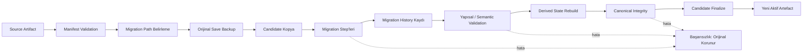

# Kayıt ve Dünya Bütünlüğü Sistemi

**Belge yolu:** `docs/13_SAVE_SYSTEM.md`
**Durum:** Kesinleşti
**Ana referans:** `docs/01_GAME_DESIGN_DOCUMENT.md`
**Kesin MVP sınırı:** `docs/02_MVP_SCOPE.md`
**Domain sınırları:** `docs/03_DOMAIN_MODEL.md`
**Olay ve kural sözleşmeleri:** `docs/04_EVENT_RULE_ENGINE.md`
**Hafıza ve söz sözleşmeleri:** `docs/05_MEMORY_AND_PROMISE_SYSTEM.md`
**İlişki sözleşmeleri:** `docs/06_RELATIONSHIP_SYSTEM.md`
**Diyalog ve karar sözleşmeleri:** `docs/07_DIALOGUE_SYSTEM.md`
**Transfer ve sözleşme sözleşmeleri:** `docs/08_TRANSFER_SYSTEM.md`
**Maç sözleşmeleri:** `docs/09_MATCH_SIMULATION.md`
**Teknik direktör kariyeri sözleşmeleri:** `docs/10_MANAGER_CAREER.md`
**Futbolcu kariyeri sözleşmeleri:** `docs/11_PLAYER_CAREER.md`
**Dünya simülasyonu ve zaman akışı sözleşmeleri:** `docs/12_WORLD_SIMULATION.md`
**Mimari yön:** `docs/17_TECHNOLOGY_AND_ARCHITECTURE_DECISION.md`
**İlgili karar günlüğü:** `docs/15_DECISION_LOG.md`

---

## 1. Belgenin Amacı

Bu belge, Football Career Simulator projesinde **Kayıt ve Dünya Bütünlüğü Sistemi**ne (`Save Integrity` bounded context ve onunla ilişkili Application/Infrastructure sorumlulukları) ait teknoloji bağımsız domain kurallarını kesinleştirir.

Sistemin amacı en az şunları kapsar:

* on sezonluk kariyer state'ini güvenilir biçimde kaydetmek ve yüklemek,
* her bounded context'in authoritative ownership sınırını save/load boyunca korumak,
* save sonrasında entity kimliklerini ve referanslarını değiştirmemek,
* snapshot'ın tek ve tutarlı bir safe checkpoint'e ait olmasını sağlamak,
* yarım uygulanmış Simulation Step veya critical process'i geçerli save olarak kabul etmemek,
* pending Decision Request, Promise, Transfer, Match ve process state'lerini korumak,
* RNG state'i ve deterministik stream bilgisini korumak,
* load sonrasında aynı domain etkisinin ikinci kez uygulanmasını engellemek,
* save schema, game, simulation, content ve RNG sürümlerini izlemek,
* eski kayıtları kontrollü migration zincirleriyle güncelleyebilmek,
* migration öncesinde orijinal kaydı korumak,
* bozuk veya eksik kayıtları sessizce yüklememek,
* son sağlıklı backup üzerinden kurtarma sunmak,
* save dosyasının on sezon sonunda kontrolsüz büyümesini engellemek,
* önemli history, audit ve explanation verilerini korurken düşük değerli teknik kayıtları compact edebilmek,
* save/load işlemlerini Godot veya UI açılmadan otomatik test edebilmek,
* round-trip sonrasında semantic state eşdeğerliğini doğrulamak,
* load işlemini mevcut aktif world state'ini bozmadan aday state üzerinde doğrulamak,
* hataları kullanıcıya ve geliştirici araçlarına açıklanabilir biçimde raporlamaktır.

Bu belge:

* üretim sınıfları, interface'ler, enum'lar veya record'lar tanımlamaz,
* SQL, veritabanı tablo şeması, index tasarımı veya migration script'i üretmez,
* ORM modeli seçmez,
* kesin dosya yolu, kesin backup sayısı, kesin hash algoritması, kesin compression veya encryption yöntemi belirlemez,
* UI ekran tasarımı yapmaz,
* `docs/01_GAME_DESIGN_DOCUMENT.md`, `docs/02_MVP_SCOPE.md`, `docs/03_DOMAIN_MODEL.md`, `docs/04_EVENT_RULE_ENGINE.md`, `docs/05_MEMORY_AND_PROMISE_SYSTEM.md`, `docs/06_RELATIONSHIP_SYSTEM.md`, `docs/07_DIALOGUE_SYSTEM.md`, `docs/08_TRANSFER_SYSTEM.md`, `docs/09_MATCH_SIMULATION.md`, `docs/10_MANAGER_CAREER.md`, `docs/11_PLAYER_CAREER.md`, `docs/12_WORLD_SIMULATION.md` veya `docs/17_TECHNOLOGY_AND_ARCHITECTURE_DECISION.md` kararlarını değiştirmez.

---

## 2. Referanslar ve Kapsam

Kaynak önceliği:

1. `docs/01_GAME_DESIGN_DOCUMENT.md`
2. `docs/02_MVP_SCOPE.md`
3. `docs/03_DOMAIN_MODEL.md`
4. `docs/04_EVENT_RULE_ENGINE.md`
5. `docs/05_MEMORY_AND_PROMISE_SYSTEM.md`
6. `docs/06_RELATIONSHIP_SYSTEM.md`
7. `docs/07_DIALOGUE_SYSTEM.md`
8. `docs/08_TRANSFER_SYSTEM.md`
9. `docs/09_MATCH_SIMULATION.md`
10. `docs/10_MANAGER_CAREER.md`
11. `docs/11_PLAYER_CAREER.md`
12. `docs/12_WORLD_SIMULATION.md`
13. `docs/17_TECHNOLOGY_AND_ARCHITECTURE_DECISION.md`
14. `docs/15_DECISION_LOG.md`

Kesinleşmiş Domain Model'e göre `Save Integrity`, mevcut 14 bounded context'ten biridir (`docs/03_DOMAIN_MODEL.md` Bölüm 7.14). Bu belge yeni bir bounded context oluşturmaz; `Save Integrity`'nin authoritative sorumluluğunu ayrıntılandırır.

Bu belge şu bounded context ve katmanlarla kararlı sözleşmeler üzerinden çalışır: World & Calendar, Competition, Club & Governance, Player Career, Manager Career & Employment, Contract & Registration, Team Preparation, Training & Physical State, Match, Transfer, Social Continuity, Interaction & Narrative, Event & Rule Evaluation, Application, Infrastructure, Presentation.

---

## 3. Uyumluluk ve Tutarlılık Notu

Bu belge hazırlanmadan önce Bölüm 2'de listelenen bütün ön koşul belgeleri baştan sona okunmuş ve save/load, snapshot, event retention, migration, checkpoint, RNG state ve authoritative ownership açısından ayrıntılı tutarlılık kontrolüne tabi tutulmuştur.

Bu inceleme sonucunda:

* `docs/12_WORLD_SIMULATION.md` Bölüm 32'de tanımlanan Dünya Simülasyonu save gereksinimleri (GameDate, Planning Period, Simulation Step cursor, root seed/RNG, scheduled evaluation, pending Process Manager, pending Decision Request, active blocker, transfer window state, last safe checkpoint) bu belgede aynen korunmuş ve World & Calendar/Application context snapshot'ları içine yerleştirilmiştir.
* `docs/09_MATCH_SIMULATION.md` Bölüm 30'daki mid-match Safe Checkpoint save/load gereksinimleri bu belgede Match context snapshot'ı olarak korunmuştur.
* `docs/04_EVENT_RULE_ENGINE.md` Bölüm 18'deki snapshot-first / tam event sourcing olmayan yön bu belgede genişletilmiş ve fiziksel şema belirlemeden ayrıntılandırılmıştır.
* `docs/05_MEMORY_AND_PROMISE_SYSTEM.md` Bölüm 39, `docs/06_RELATIONSHIP_SYSTEM.md` Bölüm 38, `docs/08_TRANSFER_SYSTEM.md` Bölüm 37, `docs/10_MANAGER_CAREER.md` Bölüm 33 ve `docs/11_PLAYER_CAREER.md` Bölüm 30'daki save/load gereksinimleri bu belgede context snapshot kategorileri olarak toplanmıştır.
* `docs/17_TECHNOLOGY_AND_ARCHITECTURE_DECISION.md` Bölüm 12'de kesinleşmiş "versioned SQLite tabanlı tek dosyalı save container" yönü bu belgede aynen korunmuştur; kesin tablo şeması bu belgede de belirlenmemiştir.

Bu belgenin kapsamını etkileyen gerçek bir çelişki tespit edilmemiştir. Terminolojik farklılıklar (`örn. "checkpoint" kelimesinin farklı belgelerde biraz farklı vurgularla kullanılması`) tek başına çelişki sayılmamış, aynı kavram için ikinci bir authoritative state oluşturulmamıştır.

---

## 4. Kesin MVP Sınırı

Bu belge:

* üretim sınıfları,
* SQL,
* tablo şeması,
* ORM modeli,
* migration script'i,
* kesin dosya yolu,
* kesin backup sayısı,
* kesin hash algoritması,
* kesin compression yöntemi,
* kesin encryption yöntemi,
* UI ekran tasarımı

üretmez. Bu kararlar ilgili teknik spike'lar, test stratejisi (`docs/14_TEST_STRATEGY.md`) veya uygulama öncesi ayrıntılı implementasyon tasarımı olmadan sessizce kesinleştirilemez (bkz. Bölüm 43 — Açık Kalan Kararlar).

---

## 5. Bağlayıcı Tasarım İlkeleri

1. Runtime domain state, oyun çalışırken memory içinde bulunan, ilgili bounded context'lerin authoritative owner olduğu, domain invariant'larıyla yönetilen ve Application/Simulation tarafından orkestre edilen canlı oyun state'idir.
2. Runtime domain state'in authoritative sahibi SQLite değildir.
3. Domain ve Simulation, SQLite sorgularından, fiziksel save dosyasından, tablo yapısından veya dosya sisteminden doğrudan karar üretemez.
4. Save snapshot, belirli bir safe checkpoint'teki authoritative runtime state'in kalıcı ve sürümlenmiş temsilidir; runtime state'in ikinci canlı sahibi değildir.
5. `Save Integrity`, mevcut 14 bounded context'ten biridir; yeni bir bounded context oluşturulmaz.
6. Kalıcı save yönü versioned SQLite tabanlı tek dosyalı save container'dır.
7. SQLite yalnız persistence mekanizmasıdır.
8. UI SQLite'a doğrudan erişemez.
9. Domain ve Simulation SQLite paketine bağımlı olamaz.
10. Save formatı Godot scene veya Godot resource formatına bağlanamaz.
11. Snapshot ana current-state persistence kaynağıdır; tam event sourcing kullanılmayacaktır.
12. Her state değişikliği sonsuza kadar event olarak tutulmayacaktır.
13. Authored content ile runtime state birbirinden ayrıdır.
14. Save/load Application portları üzerinden yürür.
15. Infrastructure, Application tarafından tanımlanan portları uygular.
16. Save dosyası sürüm, migration ve bütünlük metadata'sı taşır.
17. Kesin fiziksel tablo şeması bu belgede belirlenmeyecektir.
18. Her başarılı save işlemi, yükleme için tam event replay gerektirmeyen, kendi başına yeterli bir full authoritative snapshot üretir.
19. Incremental save, delta chain veya yalnız event replay'e dayanan save modeli MVP için zorunlu değildir.
20. Save işlemi yalnız tutarlı bir safe checkpoint'te committed olabilir.
21. Save işlemi GameDate'i ilerletemez, yeni domain sonucu üretemez ve random stream tüketemez.
22. Aynı Save Request duplicate artefact üretmemelidir.
23. Migration'lar sıralı, sürümlenmiş, deterministik, tek yönlü, loglanabilir, otomatik test edilebilir, tekrar çalıştırmaya karşı güvenli ve orijinal save'i koruyan işlemler olmalıdır.
24. MVP tek oyunculu ve yerel bir oyundur; save encryption MVP için zorunlu değildir.

---

## 6. Kritik Mimari Ayrım

Bu belgenin en önemli ayrımı aşağıda açık ve bağlayıcı biçimde tanımlanır.

### 6.1. Runtime Domain State

Runtime domain state:

* oyun çalışırken memory içinde bulunan,
* ilgili bounded context'lerin authoritative owner olduğu,
* domain invariant'larıyla yönetilen,
* Application ve Simulation tarafından orkestre edilen

canlı oyun state'idir.

Runtime domain state'in authoritative sahibi SQLite değildir.

Domain kuralları:

* SQLite sorgularından,
* fiziksel save dosyasından,
* tablo yapısından,
* dosya sisteminden

doğrudan karar üretemez.

### 6.2. Save Snapshot

Save snapshot:

* belirli bir safe checkpoint'teki authoritative runtime state'in,
* aktif süreçlerin,
* pending kararların,
* scheduled evaluation kayıtlarının,
* idempotency ve determinism bilgilerinin

kalıcı ve sürümlenmiş temsilidir.

Snapshot, runtime state'in ikinci canlı sahibi değildir.

### 6.3. `Save Integrity` Bounded Context'i

`Save Integrity`, mevcut 14 bounded context'ten biridir (`docs/03_DOMAIN_MODEL.md` Bölüm 7.14 ile birebir uyumlu).

Authoritative olarak en az şu kavramların sahibidir:

* `SaveId`,
* save manifest,
* schema version,
* game version,
* simulation version,
* content version,
* rule veya model version bilgileri,
* RNG version,
* snapshot metadata,
* migration history,
* backup metadata,
* integrity status,
* canonical state hash veya eşdeğer semantic integrity sonucu,
* son doğrulanmış safe checkpoint referansı.

`Save Integrity` şunların authoritative sahibi **değildir**:

* Club state,
* Player Career state,
* Manager Career state,
* Competition,
* Match,
* Transfer,
* Contract,
* Registration,
* Squad,
* Physical State,
* Relationship,
* Memory,
* Promise,
* Decision Request,
* GameDate,
* runtime random state'in canlı sahibi,
* domain business kuralları.

### 6.4. Application Sorumluluğu

Application:

* save ve load use case'lerini,
* güvenli snapshot koordinasyonunu,
* context snapshot'larının toplanmasını,
* validation akışını,
* migration planının yürütülmesini,
* candidate world rehydration'ını,
* başarılı load sonrasında aktif world değişimini

koordine eder.

Application, persistence tablosunun authoritative business owner'ı değildir.

### 6.5. Infrastructure Sorumluluğu

Infrastructure:

* SQLite adapter'ını,
* dosya sistemi işlemlerini,
* fiziksel transaction ve candidate file işlemlerini,
* backup dosyalarını,
* atomic replacement desteğini,
* migration implementation'larını,
* checksum veya hash implementation'ını,
* save dosyasının okunması ve yazılmasını

sağlar.

Infrastructure domain invariant'larını atlayamaz.

### 6.6. Presentation Sınırı

UI:

* save slotlarını ve metadata'yı gösterir,
* save/load talebi toplar,
* progress, validation ve hata sonuçlarını sunar,
* backup veya recovery seçeneğini gösterir.

UI:

* SQLite'a doğrudan erişemez,
* domain state'i serialize edemez,
* migration kararı veremez,
* bozuk kaydı sessizce düzeltmez,
* validation sonucunu atlayamaz,
* runtime state'i doğrudan rehydrate edemez.

---

## 7. Kesin Teknoloji ve Persistence Yönü

Aşağıdaki kesinleşmiş teknoloji kararları `docs/17_TECHNOLOGY_AND_ARCHITECTURE_DECISION.md` Bölüm 12 ile birebir uyumlu biçimde aynen korunur:

* Kalıcı save yönü, **versioned SQLite tabanlı tek dosyalı save container**dır.
* SQLite yalnız persistence mekanizmasıdır.
* Runtime domain state memory içinde çalışır.
* UI SQLite'a doğrudan erişemez.
* Domain ve Simulation SQLite paketine bağımlı olamaz.
* Save formatı Godot scene veya Godot resource formatına bağlanamaz.
* Snapshot ana current-state persistence kaynağıdır.
* Tam event sourcing kullanılmayacaktır.
* Her state değişikliği sonsuza kadar event olarak tutulmayacaktır.
* Authored content ile runtime state birbirinden ayrıdır.
* Save/load Application portları üzerinden yürür.
* Infrastructure, Application tarafından tanımlanan portları uygular.
* Save dosyası sürüm, migration ve bütünlük metadata'sı taşır.
* Kesin fiziksel tablo şeması bu görevde belirlenmeyecektir.

MVP için aşağıdaki yön bağlayıcıdır:

> Her başarılı save işlemi, yükleme için tam event replay gerektirmeyen, kendi başına yeterli bir full authoritative snapshot üretir.

Incremental save, delta chain veya yalnız event replay'e dayanan save modeli MVP için zorunlu değildir.

---

## 8. Terminoloji

### 8.1. Save Artifact

Kullanıcının veya sistemin yükleyebildiği fiziksel ve sürümlenmiş SQLite save container'ıdır.

Save Artifact:

* bir `SaveId` taşır,
* bir committed snapshot içerir,
* manifest ve integrity metadata taşır,
* tamamlanmamış candidate file ile aynı kavram değildir.

### 8.2. Save Slot

Kullanıcıya gösterilen mantıksal kayıt konumudur.

Save Slot:

* bir manual save,
* autosave,
* quick save veya recovery generation

gibi sunum kategorisine sahip olabilir.

Save Slot authoritative world state değildir. Kesin save slot sayısı veya UI düzeni bu belgede belirlenmez.

### 8.3. Save Manifest

Save Artifact'ın kimliğini, sürümlerini, checkpoint'ini ve integrity durumunu tanımlayan authoritative metadata'dır.

### 8.4. Runtime Snapshot

İlgili bounded context'lerin authoritative current state'lerinden safe checkpoint'te oluşturulan kalıcı temsil bütünüdür.

### 8.5. Context Snapshot

Tek bir bounded context'in kendi authoritative state'ini dış persistence sınırına sunan sürümlenmiş snapshot temsilidir.

Context Snapshot fiziksel tablo olmak zorunda değildir.

### 8.6. Safe Checkpoint

Dünya state'inin:

* invariant'larının geçerli olduğu,
* gerekli critical effect'lerin tamamlandığı,
* event queue'nun ilgili business aşama için kararlı olduğu,
* yarım transaction bulunmadığı,
* save alınmasının duplicate veya eksik sonuç üretmeyeceği

mantıksal sınırdır. `docs/12_WORLD_SIMULATION.md` Bölüm 6.6'da tanımlanan Simulation Checkpoint kavramı ile `docs/09_MATCH_SIMULATION.md` Bölüm 5.11'deki maça özgü Safe Checkpoint kavramı bu belgede aynı üst kavramın (Safe Checkpoint) farklı bağlamlardaki uygulamaları olarak korunur.

### 8.7. Candidate Save

Henüz tam yazılmamış, doğrulanmamış veya committed olarak işaretlenmemiş save artefact adaydır.

Candidate Save başarılı validation ve finalization olmadan yüklenebilir kayıt sayılmaz.

### 8.8. Committed Save

Bütün gerekli snapshot parçaları, manifest, sürüm bilgisi ve integrity kontrolleri tamamlanmış save artefact'tır.

### 8.9. Canonical State

Fiziksel satır sırası veya serialization byte düzeninden bağımsız, dünya state'inin semantic ve deterministik temsilidir.

### 8.10. Canonical State Hash

Canonical State üzerinden oluşturulan integrity veya equivalence değeridir.

Hash:

* corruption detection ve test için kullanılabilir,
* tek başına kötü niyetli değiştirmeye karşı güvenlik garantisi değildir,
* fiziksel SQLite dosyasının byte-for-byte hash'i olmak zorunda değildir.

### 8.11. Schema Version

Save container'ın yapısal persistence sözleşmesinin sürümüdür.

### 8.12. Game Version

Save'i oluşturan uygulama sürümüdür.

### 8.13. Simulation Version

Domain ve simulation sonuçlarının semantic davranış sürümüdür.

### 8.14. Content Version

Save'in bağlı olduğu authored content kataloğunun sürümüdür.

### 8.15. Rule Set Version

Save içindeki state'in oluşturulmasında kullanılan domain rule veya model sürümüdür.

Kesin tek alan veya birden fazla alt sürüm olarak nasıl saklanacağı açık bırakılabilir.

### 8.16. RNG Version

Kullanılan random abstraction veya algoritma sözleşmesinin sürümüdür.

### 8.17. Migration

Eski bir save sözleşmesini desteklenen daha yeni sözleşmeye deterministik ve doğrulanabilir biçimde dönüştüren işlemdir.

### 8.18. Structural Migration

Persistence yapısını dönüştürür.

### 8.19. Semantic Migration

Domain anlamı değişen state'i yeni invariant ve sözleşmeye dönüştürür.

### 8.20. Content Migration

Kaldırılan, değiştirilen veya yeniden adlandırılan stable content ID referanslarını kontrollü biçimde dönüştürür.

### 8.21. Backup

Bir save overwrite, migration veya recovery işleminden önce korunan sağlıklı artefact kopyasıdır.

### 8.22. Recovery

Ana save artefact yüklenemediğinde doğrulanmış backup veya desteklenen kurtarma stratejisi üzerinden kullanılabilir state'e dönme işlemidir.

### 8.23. Rehydration

Doğrulanmış Context Snapshot'lardan runtime aggregate ve process state'lerinin tekrar oluşturulmasıdır.

Rehydration, geçmiş event'leri yeniden gerçekleşmiş gibi yayınlamak değildir.

### 8.24. Derived Data

Authoritative state'ten tekrar üretilebilen projection, cache, index, summary veya read model'dir.

### 8.25. Durable Operational State

Henüz tamamlanmamış fakat save/load sonrasında devam etmesi gereken process, pending decision, scheduled evaluation ve idempotency state'idir.

### 8.26. Corrupted Save

Yapısal, referential, semantic veya integrity doğrulamasından geçemeyen save artefact'tır.

### 8.27. Incompatible Save

Fiziksel olarak bozuk olmayan fakat mevcut uygulama, schema, content, simulation veya RNG sözleşmeleriyle güvenli biçimde yüklenemeyen save'dir.

Corrupted ve Incompatible aynı kavram değildir.

---

## 9. Save Manifest Kavramsal Modeli

Save Manifest en az şu kavramsal bilgileri desteklemelidir:

* `SaveId`
* bağlı manager career veya career reference
* user-facing save name, varsa
* save category
* oluşturulma technical timestamp'i
* son güncellenme technical timestamp'i
* geçerli `GameDate`
* current Season referansı
* current manager referansı
* current employment ve club summary referansı
* last safe checkpoint referansı
* snapshot identity veya generation
* schema version
* game version
* simulation version
* content version
* RNG version
* ilgili rule/model version bilgileri
* integrity status
* canonical state hash veya eşdeğer doğrulama sonucu
* migration history reference
* backup lineage veya source reference, varsa
* load compatibility sonucu
* completion/commit status
* platform veya build metadata, yalnız teşhis için gerekiyorsa
* manifest schema version

Bu alanlardan kesin class, SQLite tablo, column type veya serialization formatı üretilmez.

Technical timestamp:

* kullanıcıya bilgi verebilir,
* backup sıralamasında kullanılabilir,
* domain event ordering veya GameDate yerine kullanılamaz.

---

## 10. Snapshot Kapsamı

Başarılı full snapshot en az aşağıdaki authoritative ve operational state kategorilerini kapsamalıdır.

### 10.1. World & Calendar

* geçerli GameDate
* aktif Planning Period
* simulation cursor
* completed veya current Simulation Step bilgisi
* root seed
* RNG version
* gerekli random stream state veya derivation bilgisi
* transfer window gibi authoritative calendar window state'i
* son safe checkpoint

Bu alan `docs/12_WORLD_SIMULATION.md` Bölüm 32'deki Dünya Simülasyonu save gereksinimleriyle birebir uyumludur.

### 10.2. Competition

* Competition identity
* active ve historical Season state'i
* Fixture state'leri
* accepted Match Result referansları
* Standings
* season completion state'i

### 10.3. Club & Governance

* Club identity
* policies
* budget boundaries
* gerekli club history ve reputation/strength state'i

### 10.4. Player Career

* Player identity
* BirthDate
* permanent Sporting Profile
* Potential veya Development state
* Career Status ve Career Phase
* development/decline state
* retirement state
* generation provenance
* gerekli career history

Bu alan `docs/11_PLAYER_CAREER.md` Bölüm 30.1'deki save gereksinimleriyle birebir uyumludur.

### 10.5. Manager Career & Employment

* Manager identity
* profile
* reputation
* active employment
* career history
* Board Confidence
* Season Expectation
* Job Offer state'leri
* unemployment ve dismissal state'i

Bu alan `docs/10_MANAGER_CAREER.md` Bölüm 33'teki save gereksinimleriyle birebir uyumludur.

### 10.6. Contract & Registration

* active ve gerekli historical Contract state'i
* Registration state'i
* authoritative active club ilişkileri

### 10.7. Team Preparation

* Squad Membership
* reusable Tactic Plan
* geçerli Match Selection
* pending preparation state'i

### 10.8. Training & Physical State

* Training Plan
* fatigue
* fitness
* injury
* recovery
* availability
* pending physical evaluation state'i

### 10.9. Match

* aktif Match varsa safe checkpoint'teki Match state'i
* immutable completed Match Result
* gerekli timeline ve performance summary
* Match Simulation Context
* RNG/stream state'i
* uygulanmış intervention kimlikleri
* Competition tarafından kabul edilme durumu ayrı owner üzerinden

Bu alan `docs/09_MATCH_SIMULATION.md` Bölüm 30.1'deki save gereksinimleriyle birebir uyumludur.

### 10.10. Transfer

* aktif Transfer Process state'leri
* offer, negotiation ve approval state'i
* completed transfer history'nin gerekli özeti
* idempotent finalization bilgisi

Bu alan `docs/08_TRANSFER_SYSTEM.md` Bölüm 37'deki save gereksinimleriyle birebir uyumludur.

### 10.11. Social Continuity

* Relationship state'leri
* Memory Record state'leri
* Promise state'leri
* deadline ve progress state'i
* gerekli duplicate-effect kayıtları

Bu alan `docs/05_MEMORY_AND_PROMISE_SYSTEM.md` Bölüm 39 ve `docs/06_RELATIONSHIP_SYSTEM.md` Bölüm 38'deki save gereksinimleriyle birebir uyumludur.

### 10.12. Interaction & Narrative

* pending Decision Request
* aktif Dialogue Session
* deadline
* selected option veya pending resolution bilgisi
* public narrative'ın gerekli authoritative state'i

Bu alan `docs/07_DIALOGUE_SYSTEM.md` Bölüm 37'deki save gereksinimleriyle birebir uyumludur.

### 10.13. Event & Rule Evaluation

* aktif scheduled evaluation kayıtları
* delayed evaluation state'i
* event processing ledger'ın gerekli kısmı
* active correlation/process state'i
* consumer effect completion kimlikleri
* causation ve idempotency bilgileri

Bu alan `docs/04_EVENT_RULE_ENGINE.md` Bölüm 18.3'teki save/load gereksinimleriyle birebir uyumludur.

### 10.14. Application-owned Süreçler

* active Process Manager state'leri
* season transition stage'i
* transfer finalization stage'i
* retirement finalization stage'i
* employment transition stage'i
* tamamlanmış stage kimlikleri
* pending command kimlikleri
* retry ve failure state'i

### 10.15. Save Integrity

* Save Manifest
* migration history
* backup metadata
* integrity sonuçları
* snapshot version metadata

---

## 11. Snapshot'a Dahil Edilmeyecek veya Yeniden Üretilebilecek State

Aşağıdaki state kategorileri ayrılır.

### 11.1. Yeniden Üretilebilir Projection ve Cache

Örnekler:

* UI read model'leri
* sorting/filtering cache'leri
* geçici listeler
* presentation selection state'i
* localization sonucu metinler
* yeniden üretilebilir news listeleri
* tekrar oluşturulabilen due-work index'leri
* hesaplanabilir özet tablolar

Bunlar authoritative ikinci kopya olarak zorunlu tutulmamalıdır.

### 11.2. Geçici Technical State

Örnekler:

* açık dosya handle'ları
* database connection
* thread veya task referansı
* UI node referansı
* dependency injection container
* logger instance
* in-memory callback
* cancellation token
* transient retry timer
* Godot scene state'i

Bunlar save'e yazılamaz.

### 11.3. Seçici Tarihçe

Önemli domain history korunabilir; her geçici signal veya internal calculation sonsuza kadar saklanamaz.

### 11.4. Authored Content

Başlangıç kulüpleri, event template'leri, dialogue template'leri ve benzeri authored content bütünüyle runtime save içine kopyalanmak zorunda değildir.

Save:

* stable content ID,
* content version,
* gerekli compatibility veya migration metadata'sı

taşımalıdır.

Runtime'da domain anlamına dönüşmüş generated veya modified state, yalnız content referansına güvenilerek kaybedilemez.

---

## 12. Save Eligibility ve Safe Checkpoint Politikası

Save işlemi yalnız tutarlı bir safe checkpoint'te committed olabilir.

Bağlayıcı kurallar:

1. Yarım uygulanmış aggregate command sırasında save alınamaz.
2. Critical cross-context finalization ortasında rastgele snapshot alınamaz.
3. Logical event queue gerekli critical effect'ler açısından kararlı olmalıdır.
4. Pending fakat geçerli ve durable process state'i save edilebilir.
5. In-flight transient handler veya açık database transaction save state'i olarak tutulamaz.
6. Save talebi unsafe processing sırasında gelirse: reddedilebilir veya bir sonraki safe checkpoint'e ertelenebilir.
7. Ertelenmiş save talebi duplicate save üretmemelidir.
8. Save işlemi GameDate'i ilerletemez.
9. Save işlemi yeni domain sonucu üretemez.
10. Save alınması random stream tüketemez.
11. Save başarısızlığı runtime domain state'i geri alamaz veya değiştiremez.
12. Başarılı save sonucu yalnız candidate artefact doğrulandıktan sonra bildirilir.

---

## 13. Maç Sırasında Save Politikası

`docs/09_MATCH_SIMULATION.md` içindeki Safe Checkpoint sözleşmesi aynen korunur.

MVP yönü:

* Arbitrary internal simulation signal ortasında save alınamaz.
* Match'in tanımlı Safe Checkpoint noktalarında save alınabilir.
* Match snapshot, skor, timeline state'i, intervention state'i, RNG stream bilgisi ve current simulation position korunmalıdır.
* Load sonrasında aynı segment, event veya intervention ikinci kez uygulanmamalıdır.
* Presentation animasyonunun ortasında olmak domain save eligibility'sini tek başına belirlemez.
* Match tamamlanmış fakat Competition sonucu henüz kabul etmemişse iki ayrı authoritative state açıkça korunmalıdır.
* Result acceptance load sonrasında ikinci kez uygulanamaz.
* Match safe checkpoint desteği implementasyonda doğrulanamıyorsa özellik sessizce çalışıyor kabul edilemez; açık unsupported state veya kontrollü save engeli gerekir.

Kesin Match checkpoint sıklığı bu belgede belirlenmez.

---

## 14. Dünya Simülasyonu Sırasında Save Politikası

`docs/12_WORLD_SIMULATION.md` sözleşmeleri aynen korunur.

Save en az şunları korumalıdır:

* Simulation Step identity
* completed step kayıtları
* simulation cursor
* current GameDate
* active Planning Period
* pending Simulation Horizon, durable ise
* root seed ve RNG state
* pending Process Manager state'i
* scheduled evaluations
* blockers
* Decision Request referansları
* last safe checkpoint

Bağlayıcı kurallar:

* yarım Simulation Step committed save olamaz,
* completed step load sonrasında yeniden çalıştırılamaz,
* kaçırılmış due work sessizce atlanamaz,
* season transition stage'i korunmalıdır,
* stuck veya failed process state'i geçerli metadata ile saklanabilir,
* critical work eksikken save başarılı checkpoint olarak işaretlenemez.

---

## 15. Save Oluşturma Yaşam Döngüsü

Save oluşturma akışı en az şu aşamalarla tanımlanır:

1. Save Requested
2. Request Validated
3. Safe Checkpoint Resolved
4. Simulation Quiesced
5. Context Snapshots Captured
6. Operational State Captured
7. Candidate Snapshot Assembled
8. Pre-persistence Validation
9. Existing Target Backup Prepared
10. Candidate Container Created
11. Snapshot Persisted
12. Manifest Finalized
13. Integrity Verification
14. Candidate Committed
15. Target Replaced veya Save Slot Activated
16. Save Completed
17. Save Failed

```mermaid
flowchart LR
    A[Save Requested]
    B[Request Validated]
    C[Safe Checkpoint Resolved]
    D[Simulation Quiesced]
    E[Context Snapshots Captured]
    F[Operational State Captured]
    G[Candidate Snapshot Assembled]
    H[Pre-persistence Validation]
    I[Existing Target Backup Prepared]
    J[Candidate Container Created]
    K[Snapshot Persisted]
    L[Manifest Finalized]
    M[Integrity Verification]
    N[Candidate Committed]
    O[Target Replaced / Slot Activated]
    P[Save Completed]
    Q[Save Failed]

    A --> B --> C --> D --> E --> F --> G --> H --> I --> J --> K --> L --> M --> N --> O --> P
    B -.geçersiz.-> Q
    C -.unsafe.-> Q
    H -.başarısız.-> Q
    M -.başarısız.-> Q
    N -.başarısız.-> Q
```

Bağlayıcı kurallar:

* başarısız aşama başarılı save mesajı üretemez,
* target eski save candidate doğrulanmadan yok edilemez,
* candidate artefact tamamlanmadan committed sayılamaz,
* aynı Save Request duplicate artefact üretmemelidir,
* retry eski sağlıklı save'i bozamaz,
* save sırasında runtime aggregate'lara persistence-specific mutation uygulanamaz,
* save tamamlandığında simulation güvenli biçimde devam edebilir.

Kesin teknik transaction veya dosya API'sini bu belge belirlemez.

---

## 16. Full Snapshot Politikası

MVP için bağlayıcı yön:

* Her committed Save Artifact yükleme için yeterli full current snapshot taşımalıdır.
* Load için baştan itibaren bütün Domain Event'leri replay etmek zorunlu değildir.
* Save Artifact yalnız delta zincirine bağımlı olamaz.
* Eksik bir önceki incremental artefact yüzünden ana save kullanılamaz hâle gelmemelidir.
* Event history açıklanabilirlik ve audit içindir; authoritative current state yerine geçmez.
* Full snapshot içinde selected history ve active operational state bulunabilir.
* Kesin fiziksel data layout belirlenmez.

Incremental save veya snapshot deduplication gelecekte performance optimizasyonu olarak değerlendirilebilir; MVP'nin doğruluk modeli bunlara bağımlı olamaz.

---

## 17. Atomic Persistence ve Overwrite Politikası

Belgede aşağıdaki güvenlik modeli tanımlanır:

1. Mevcut geçerli save tek sağlam kopyıyken doğrudan kontrolsüz biçimde üzerine yazılmaz.
2. Yeni snapshot önce candidate artefact'a yazılır.
3. Candidate içindeki bütün zorunlu state ve manifest tamamlanır.
4. Candidate yapısal ve semantic validation'dan geçer.
5. Gerekli integrity sonucu oluşturulur.
6. Önceki target için backup politikası uygulanır.
7. Ancak bundan sonra yeni artefact aktif target hâline getirilir.
8. Replacement başarısızsa eski geçerli save korunur.
9. Yarım candidate normal save listesinde geçerli kayıt gibi görünmez.
10. Candidate veya temporary artefact'ların temizlenmesi eski sağlıklı save'i etkilemez.

SQLite transaction kullanılabilir; ancak bu belgede:

* journal mode,
* PRAGMA,
* connection string,
* locking mode,
* checkpoint komutu,
* tablo yapısı

belirlenmez.

---

## 18. Load Yaşam Döngüsü

Load işlemi en az şu aşamalarla tanımlanır:

1. Load Requested
2. Save Artifact Located
3. Container Readability Checked
4. Manifest Read
5. Version Compatibility Evaluated
6. Migration Requirement Determined
7. Migration Copy Prepared, gerekiyorsa
8. Migration Executed, gerekiyorsa
9. Structural Validation
10. Referential Validation
11. Content Compatibility Validation
12. Domain Invariant Validation
13. Operational State Validation
14. RNG ve determinism state validation
15. Candidate World Rehydrated
16. Derived Data Rebuilt
17. Post-rehydration Validation
18. Canonical State veya equivalence validation
19. Active World Replaced
20. Load Completed
21. Load Failed

```mermaid
flowchart LR
    A[Load Requested]
    B[Save Artifact Located]
    C[Container Readability Checked]
    D[Manifest Read]
    E[Version Compatibility Evaluated]
    F[Migration Requirement Determined]
    G[Migration Copy Prepared]
    H[Migration Executed]
    I[Structural Validation]
    J[Referential Validation]
    K[Content Compatibility Validation]
    L[Domain Invariant Validation]
    M[Operational State Validation]
    N[RNG / Determinism Validation]
    O[Candidate World Rehydrated]
    P[Derived Data Rebuilt]
    Q[Post-rehydration Validation]
    R[Canonical State Validation]
    S[Active World Replaced]
    T[Load Completed]
    U[Load Failed]

    A --> B --> C --> D --> E --> F
    F -->|gerekli| G --> H --> I
    F -->|gerekmiyor| I
    I --> J --> K --> L --> M --> N --> O --> P --> Q --> R --> S --> T
    C -.başarısız.-> U
    D -.başarısız.-> U
    E -.desteklenmiyor.-> U
    I -.başarısız.-> U
    J -.başarısız.-> U
    K -.başarısız.-> U
    L -.başarısız.-> U
    M -.başarısız.-> U
    N -.başarısız.-> U
    Q -.başarısız.-> U
    R -.başarısız.-> U
```

Bağlayıcı kurallar:

* aktif runtime world, candidate world tamamen doğrulanmadan değiştirilmez,
* load sırasında kısmi world oyuncuya gösterilmez,
* failed load mevcut çalışan world'ü bozamaz,
* rehydration yeni domain olayı gerçekleşmiş gibi event yayınlamaz,
* pending process ve kararlar kaldıkları valid state'ten devam eder,
* load GameDate'i ilerletmez,
* load RNG tüketmez,
* load completed effects'i tekrar uygulamaz,
* load sonrasında ilk simulation step açık compatibility ve idempotency kontrolleriyle çalışır.

---

## 19. Candidate World ve Aktif World Ayrımı

Load doğrudan mevcut aggregate collection'larını satır satır mutate etmemelidir.

MVP yönü:

* Save önce bağımsız bir candidate world veya eşdeğer rehydration scope içinde yüklenir.
* Candidate world bütün required context state'lerini içerir.
* Referans ve invariant doğrulamaları candidate üzerinde yapılır.
* Derived index ve projection'lar candidate üzerinden yeniden kurulur.
* Başarılı validation sonrasında candidate aktif world olarak değiştirilir.
* Eski aktif world, replacement kesinleşene kadar geçerli kalır.
* Partial context replacement yapılamaz.
* Bir context yeni, diğer context eski snapshot'tan bırakılamaz.

Kesin memory swap veya dependency injection implementasyonu bu belgede belirlenmez.

---

## 20. Rehydration Kuralları

Bağlayıcı rehydration kuralları:

1. Runtime identity'ler save/load sonrasında değişmez.
2. Archived veya retired identity'ler yeniden kullanılmaz.
3. Aggregate referansları stable ID ile çözülür.
4. Eksik required reference sessizce `null` yapılamaz.
5. Rehydration, public gameplay command'larını tekrar çalıştırmak zorunda değildir.
6. Geçmiş Domain Event'ler yeniden gerçekleşmiş gibi publish edilemez.
7. Rehydration path'i domain invariant'larını atlayamaz.
8. Migration ile oluşturulmuş state ayrıca doğrulanmalıdır.
9. Active process stage'leri kaldıkları yerden devam edebilmelidir.
10. Completed process stage'leri tekrar uygulanmamalıdır.
11. Derived index ve cache'ler authoritative state'ten yeniden oluşturulmalıdır.
12. Notification veya UI state kaybı domain state'i bozmamalıdır.
13. Load completion'ın kendisi gameplay event zinciri başlatmamalıdır.
14. Gerekli system-level `SaveLoaded` sonucu business event'ten ayrılmalıdır.

---

## 21. Rehydration Sıralaması

Kesin teknik object construction sırasını bu belge belirlemez; ancak bağımlılık açısından güvenli kavramsal sıra aşağıda tanımlanır.

Örnek yön:

1. Manifest ve version metadata
2. Stable identity katalogları ve authored content compatibility
3. World & Calendar
4. Club ve Competition identity state'i
5. Player ve Manager identity/career state'i
6. Contract ve Registration
7. Squad ve Team Preparation
8. Physical State
9. Match ve Fixture bağlantıları
10. Transfer süreçleri
11. Social Continuity
12. Interaction ve pending Decision Request
13. Event processing ledger ve scheduled evaluations
14. Application-owned Process Manager state'leri
15. Derived projection ve index'ler
16. Cross-context invariant validation

Bu sıralama authoritative ownership'i değiştirmez.

---

## 22. Validation Katmanları

Save validation'ı tek bir "dosya açıldı" kontrolüne indirgenmez.

### 22.1. Container Validation

* dosya erişilebilir mi,
* beklenen container türü mü,
* tamamlanmış candidate mı,
* required manifest okunabiliyor mu.

### 22.2. Version Validation

* schema version destekleniyor mu,
* game version uyumlu mu,
* simulation version uyumlu mu,
* content version uyumlu mu,
* RNG version destekleniyor mu,
* migration chain var mı.

### 22.3. Structural Validation

* required state bölümleri var mı,
* required kayıtlar eksik mi,
* duplicate primary identity var mı,
* schema sözleşmesi geçerli mi.

### 22.4. Referential Validation

* bütün required ID referansları çözülebiliyor mu,
* active club, manager, fixture, contract ve process referansları geçerli mi,
* archived entity referansları history içinde korunuyor mu.

### 22.5. Domain Invariant Validation

En az şu invariant ailelerini değerlendirir:

* aynı Player için birden fazla active Contract bulunmaması,
* bir Club'da birden fazla active Manager bulunmaması,
* retired Player'ın active Registration veya Squad Membership taşımaması,
* completed Match'in tekrar active olmaması,
* Fixture Result'ın iki kez kabul edilmemesi,
* Promise'ın birden fazla terminal sonucu bulunmaması,
* Transfer completion'ın kısmi state bırakmaması,
* GameDate'in geçerli olması,
* completed Simulation Step'in tekrar pending olmaması.

### 22.6. Operational Validation

* pending Decision Request geçerli mi,
* deadline GameDate ile tutarlı mı,
* Process Manager stage'leri tutarlı mı,
* completed stage ve pending command çelişiyor mu,
* scheduled evaluation geçmişte kaybolmuş mu,
* effect completion identity'leri geçerli mi.

### 22.7. Determinism Validation

* root seed mevcut mu,
* RNG version destekleniyor mu,
* random state veya derivation bilgisi tam mı,
* simulation cursor ve checkpoint uyumlu mu,
* active Match stream state'i geçerli mi.

### 22.8. Content Compatibility Validation

* stable content ID'leri çözülebiliyor mu,
* kaldırılmış content için migration veya fallback policy var mı,
* semantic content değişimi save'i anlamsız hâle getiriyor mu.

### 22.9. Integrity Validation

* canonical state hash veya eşdeğer integrity sonucu uyumlu mu,
* migration sonrası yeniden doğrulama başarılı mı,
* backup kaydı gerçekten yüklenebilir mi.

---

## 23. Version Modeli

Belgede aşağıdaki version alanları birbirinden ayrılır:

* `SchemaVersion`
* `GameVersion`
* `SimulationVersion`
* `ContentVersion`
* `RngVersion`
* gerekli `RuleSetVersion`
* stored event veya process kayıtlarının kendi schema version'ları
* manifest version

Bağlayıcı kurallar:

1. Yalnız GameVersion eşitliği load uyumluluğu için yeterli değildir.
2. Daha yeni ve bilinmeyen SchemaVersion sessizce yüklenemez.
3. Forward compatibility varsayılamaz.
4. Eski desteklenen schema migration gerektirebilir.
5. Aynı schema fakat farklı content version ayrıca compatibility değerlendirmesi gerektirir.
6. RNG version bilinmiyorsa deterministik devam garanti edilemez.
7. Version alanları UI metni değildir.
8. Version değişiklikleri migration veya explicit compatibility policy gerektirir.
9. Kesin desteklenen eski sürüm sayısı bu belgede belirlenmez.
10. SemVer veya başka fiziksel version formatı bu belgede zorunlu kılınmaz.

---

## 24. Compatibility Sonucu

Compatibility değerlendirmesi kavramsal olarak şu sonuçları ayırt eder:

* Directly Compatible
* Migration Required
* Compatible With Rebuild
* Unsupported Newer Save
* Unsupported Old Save
* Content Incompatible
* RNG Incompatible
* Corrupted
* Recoverable From Backup

Bunlar kesin enum olarak üretilmez.

Kullanıcıya gösterilen mesaj:

* teknik exception metni olmak zorunda değildir,
* kaydın neden yüklenemediğini açıklamalıdır,
* orijinal kaydın korunup korunmadığını belirtmelidir,
* recovery veya backup seçeneğini göstermelidir.

---

## 25. Migration Stratejisi

Migration'lar:

* sıralı,
* sürümlenmiş,
* deterministik,
* tek yönlü,
* loglanabilir,
* otomatik test edilebilir,
* tekrar çalıştırmaya karşı güvenli,
* orijinal save'i koruyan

işlemler olmalıdır.

### 25.1. Migration Akışı

1. Source artefact okunur.
2. Source manifest doğrulanır.
3. Migration path belirlenir.
4. Orijinal save için backup hazırlanır.
5. Migration ayrı candidate kopya üzerinde başlatılır.
6. Her migration step sırasıyla uygulanır.
7. Her step migration history'ye kaydedilir.
8. Yapısal ve semantic validation çalıştırılır.
9. Derived state gerekiyorsa yeniden üretilir.
10. Canonical integrity sonucu yeniden oluşturulur.
11. Candidate başarıyla final edilir.
12. Başarılı candidate yeni aktif artefact olabilir.
13. Başarısızlıkta orijinal save ve backup korunur.

### 25.2. Migration Kuralları

* migration duvar saatine göre domain kararı üretemez,
* migration random değer kullanamaz,
* migration harici üretken AI veya internet servisine bağımlı olamaz,
* migration eksik required ID'yi sessizce silemez,
* migration history yeniden yazılamaz,
* başarısız migration yarım geçerli save bırakamaz,
* aynı migration step ikinci kez semantic etki uygulayamaz,
* migration eski domain event'leri yeniden publish etmez,
* migration business command çalıştırmak yerine explicit state transformation kullanabilir,
* transformation sonrasında yeni invariant'lar doğrulanmalıdır.

Kesin migration framework'ü veya SQL script formatı bu belgede belirlenmez.

---

## 26. Authored Content Uyumluluğu

Runtime state ile authored content ayrımı korunur.

Bağlayıcı kurallar:

1. Authored content stable ID kullanmalıdır.
2. Save ContentVersion taşımalıdır.
3. Runtime entity kimliği authored content ID ile aynı kavram değildir.
4. Content kaydının yalnız görünen adı değiştirilirse identity değişmemelidir.
5. Stable ID kaldırılırsa açık migration veya compatibility policy gerekir.
6. Eksik content reference sessizce başka content'e eşlenemez.
7. Localization değişikliği save uyumluluğunu bozmamalıdır.
8. Domain anlamı değişen content update'i yalnız metin değişikliği kabul edilemez.
9. Generated Player ve runtime oluşmuş entity'ler yalnız authored template referansına indirgenemez.
10. Runtime'da değişmiş authoritative state save içinde korunmalıdır.
11. Content package bütünü save içine kopyalanmak zorunda değildir.
12. Gerekli critical resolved values'in snapshot'lanıp snapshot'lanmayacağı kesin fiziksel şemaya bırakılır.

---

## 27. Determinizm ve RNG Gereksinimleri

Save en az şu determinism state'ini korumalıdır:

* root seed,
* RNG version,
* gerekli RNG state,
* deterministic stream derivation bilgisi,
* active Match random context'i,
* active Simulation Step veya checkpoint,
* SimulationVersion,
* ContentVersion,
* relevant RuleSetVersion,
* ordered input/command continuity için gerekli cursor.

Bağlayıcı sözleşme:

> Aynı doğrulanmış save snapshot'ı, aynı ordered input dizisi ve aynı desteklenen simulation/content/RNG sürümleriyle devam ettirildiğinde aynı committed domain sonuçları üretilmelidir.

Bu sözleşme `docs/12_WORLD_SIMULATION.md` Bölüm 33'teki Determinizm Sözleşmesi ile birebir uyumludur.

Ayrıca:

* save almak random stream tüketemez,
* load random stream'i resetleyemez,
* load sonucu değiştirmek için yeni seed oluşturamaz,
* eksik RNG state sessizce default değerle doldurulamaz,
* farklı serialization byte düzeni aynı semantic state olabilir,
* canonical equality fiziksel dosya hash eşitliği olmak zorunda değildir.

---

## 28. Idempotency ve Processing State

Save/load sonrasında aynı domain etkisinin ikinci kez uygulanmaması için en az şu state korunmalıdır:

* processed command kimlikleri, gerekli kapsamda
* event consumer effect kimlikleri
* business completion kimlikleri
* completed Simulation Step kimlikleri
* accepted Match Result kimlikleri
* completed transfer finalization kimlikleri
* completed Promise resolution kimlikleri
* completed retirement kimlikleri
* generated player generation identity'leri
* completed season transition stage'leri
* resolved Decision Request kimlikleri
* scheduled evaluation completion state'i
* correlation ve causation lineage'ın gerekli kısmı

Bütün geçmiş processing kayıtları sonsuza kadar tutulmak zorunda değildir.

Compaction sonrasında bile duplicate etkiyi engellemek için gerekli minimum completion identity korunur.

---

## 29. Event Log, Audit ve History Politikası

Snapshot ana state kaynağıdır.

Event log:

* tam event sourcing değildir,
* bütün state'i yeniden kurmak için zorunlu değildir,
* her internal simulation signal'ı içermez,
* önemli history,
* açıklanabilirlik,
* audit,
* debugging,
* migration teşhisi

için seçici biçimde tutulur.

State kategorileri ayrılır:

### 29.1. Zorunlu Current Authoritative State

Load için eksiksiz gerekir.

### 29.2. Durable Operational State

Aktif süreçlerin devamı için gerekir.

### 29.3. Durable History

Kariyer anlatısı, Memory, Match Result, transfer, employment ve önemli milestone için gerekir.

### 29.4. Rebuildable Projection

Save'den çıkarılabilir ve load sonrasında yeniden üretilebilir.

### 29.5. Disposable Technical Trace

Retention süresi dolduğunda silinebilir.

Bağlayıcı kurallar:

* active process'e bağlı processing kaydı silinemez,
* redelivery riski devam eden completion kaydı compact edilemez,
* important historical record normal oynanış sırasında yeniden yazılamaz,
* Memory ve Promise state'i genel event log compaction bahanesiyle silinemez,
* detailed Match internal signals dünya event log'una taşınamaz,
* exact retention süresi bu belgede belirlenmez.

---

## 30. Derived Data ve Rebuild Politikası

Load sonrasında yeniden üretilebilecek alanlar açıkça işaretlenmelidir.

Örnekler:

* standings, Competition tarafından authoritative kabul edilmiş state ise snapshot'ta korunur; yalnız cache gibi davranılamaz,
* UI listeleri yeniden üretilir,
* due-work index authoritative schedule state'ten yeniden kurulabilir,
* news projection yeniden üretilebilir,
* search index yeniden kurulabilir,
* aggregate lookup cache yeniden kurulabilir,
* canonical reports yeniden hesaplanabilir.

Bağlayıcı kurallar:

* derived state'in authoritative kaynağı açık olmalıdır,
* derived data eksikliği load'ı business state açısından bozmazsa rebuild edilebilir,
* rebuild sırasında yeni domain event üretilmez,
* rebuild sonucu authoritative state'i sessizce değiştiremez,
* cache içeriği save compatibility contract'ına dönüştürülemez.

---

## 31. Pending Kararlar ve Aktif Süreçler

Save/load en az şu pending state'leri korumalıdır:

* Decision Request
* Dialogue Session
* Promise deadline ve progress
* Transfer Process
* Job Offer
* injury recovery evaluation
* contract expiration
* active Match
* season transition
* retirement finalization
* employment transition
* scheduled evaluation
* simulation interruption ve blocker state'i

Bağlayıcı kurallar:

1. Pending karar load sonrasında sessizce kaybolamaz.
2. Deadline aynı GameDate anlamını korur.
3. Terminal karar yeniden pending olamaz.
4. Seçilmiş option domain sonucu uygulanmadıysa iki state ayrı tutulmalıdır.
5. Domain sonucu uygulanmışsa selected option yeniden command üretemez.
6. Active process current stage ve completed stage kimliklerini korur.
7. Retry completed stage'i tekrar uygulayamaz.
8. Failed process açık failure state'iyle yüklenebilir.
9. Unsupported process version sessizce atlanamaz.
10. Pending state migration ile invalid hâle geliyorsa explicit resolution policy gerekir.

---

## 32. Autosave Politikası

Autosave yalnız safe checkpoint'lerde çalışmalıdır.

Autosave için değerlendirilebilecek trigger kategorileri:

* yeni kariyer oluşturulması,
* Planning Period başlangıcı veya tamamlanması,
* Match Result'ın Competition tarafından kabul edilmesi,
* önemli Transfer finalization,
* employment değişimi,
* season transition tamamlanması,
* kritik Decision Request sonucu,
* uygulamanın güvenli çıkış süreci.

Bağlayıcı kurallar:

* exact autosave sıklığı bu belgede belirlenmez,
* her küçük event autosave üretmemelidir,
* autosave blocking gameplay command'ın ortasında alınamaz,
* aynı checkpoint için duplicate autosave coalesce edilebilir,
* autosave başarısızlığı manual save'i bozamaz,
* autosave slotları backup politikasıyla karıştırılmamalıdır,
* autosave retention exact sayısı açık bırakılır,
* oyuncuya autosave'in başarılı veya başarısız olduğu açıklanabilir olmalıdır.

---

## 33. Backup Politikası

Minimum backup gereksinimleri:

* overwrite öncesi önceki sağlıklı save'i koruma,
* migration öncesi source save'i koruma,
* candidate doğrulanmadan eski save'i silmeme,
* backup manifest ve source lineage bilgisi,
* backup validation,
* recovery sırasında yalnız doğrulanmış backup önerme.

Bağlayıcı kurallar:

* exact backup sayısı belirlenmez,
* exact retention süresi belirlenmez,
* backup dosya adı ve klasörü belirlenmez,
* en yeni backup otomatik olarak sağlıklı kabul edilmez,
* backup load öncesinde aynı validation katmanlarından geçmelidir,
* backup recovery orijinal bozuk artefact'ı sessizce silmemelidir,
* backup oluşturma başarısızsa migration veya destructive overwrite güvenli policy'ye göre durdurulmalıdır.

---

## 34. Bozuk Kayıt ve Recovery Politikası

MVP recovery yönü:

> Öncelikli recovery yöntemi, orijinal save'i koruyarak son doğrulanmış sağlıklı backup üzerinden geri yüklemedir.

Bağlayıcı kurallar:

1. Bozuk save sessizce yüklenmez.
2. Eksik required state default değerlerle gizlenmez.
3. Orijinal artefact korunur.
4. Recovery işlemi yeni bir candidate artefact üzerinde yürür.
5. Backup ayrıca doğrulanır.
6. Recovery sonucu yeni SaveId mi yoksa aynı lineage mı kullanacak, fiziksel ayrıntı olarak açık bırakılır.
7. Kullanıcıya hangi progress noktasına dönüldüğü gösterilir.
8. Recovery başarısızsa açık hata ve diagnostic bilgi sağlanır.
9. Record-level otomatik salvage MVP için zorunlu değildir.
10. Keyfi satır silerek load'u zorlamak yasaktır.
11. Developer tooling üzerinden salvage gelecekte ayrıca tasarlanabilir.
12. Recovery business invariant'larını atlayamaz.

---

## 35. Save Operasyonu Concurrency Kuralları

Bağlayıcı kavramsal kurallar:

* Aynı save slotuna aynı anda birden fazla write işlemi yapılamaz.
* Save ve migration aynı artefact üzerinde eş zamanlı çalışamaz.
* Load ve active write aynı artefact üzerinde eş zamanlı çalışamaz.
* Manual save ve autosave talepleri açık operation identity taşımalıdır.
* Duplicate request aynı işlemi ikinci kez tamamlamamalıdır.
* Save operasyon lock state'i uygulama kapanmasında bozuk committed save üretmemelidir.
* Stale temporary artefact committed save olarak görünmemelidir.
* Background file I/O kullanılsa bile snapshot immutable olmalıdır.
* Simulation snapshot alındıktan sonra devam ediyorsa persisted snapshot'ın hangi checkpoint'e ait olduğu değişemez.
* Kesin async/task/locking implementasyonu bu belgede belirlenmez.

---

## 36. Save Slot ve Kullanıcı Metadata'sı

Kullanıcıya sunulabilecek metadata:

* save adı
* save category
* GameDate
* Season
* manager adı
* current club
* career season count
* save technical timestamp
* game version
* compatibility status
* migration required durumu
* integrity status
* backup availability
* son successful checkpoint özeti

Bu metadata:

* authoritative domain state'in yerine geçmez,
* dosyanın tamamını yüklemeden manifest üzerinden okunabilir olabilir,
* bozuk manifest varsa tahmin edilmemelidir,
* user-facing isim dışında domain kimliği olarak kullanılmamalıdır.

Kesin slot sayısı, quick-save kısayolu veya UI layout'u bu belgede belirlenmez.

---

## 37. Güvenlik, Bütünlük ve Tamper Ayrımı

Belgede aşağıdaki ayrım açıklanır:

* Integrity kontrolü, yanlışlıkla oluşan corruption ve eksik yazmayı tespit etmeyi amaçlar.
* Canonical hash tek başına kötü niyetli save editing'e karşı güvenlik garantisi değildir.
* MVP tek oyunculu ve yerel bir oyundur.
* Save encryption MVP için zorunlu değildir.
* Anti-cheat save tasarımının ana hedefi değildir.
* Cloud save ve account senkronizasyonu MVP dışındadır.
* Save içinde zorunlu olmayan kişisel veya hassas kullanıcı verisi tutulmamalıdır.
* Technical log ile save artefact aynı veri yüzeyi değildir.
* Encryption, signing veya cloud conflict resolution gelecekte ayrı karar gerektirir.

---

## 38. Veri Büyümesi ve Compaction

On sezonluk save büyümesi en az şu kaynaklardan gelebilir:

* Match Result ve timeline history
* Player career history
* Manager career history
* Transfer history
* Relationship
* Memory
* Promise
* Decision Request
* event processing ledger
* scheduled evaluation
* migration history
* audit ve explanation metadata
* backups

Compaction ilkeleri:

1. Current authoritative state kaybedilemez.
2. Active operational state compact edilemez.
3. Important historical record korunur.
4. Rebuildable projection çıkarılabilir.
5. Düşük değerli technical trace retention politikasına tabidir.
6. Event sourcing varsayımıyla bütün event'ler sonsuza kadar tutulmaz.
7. Duplicate koruması için gereken completion identity korunur.
8. Migration history silinemez veya yeniden yazılamaz.
9. Backup retention ana save içi history compaction ile aynı şey değildir.
10. Compaction sonucu semantic canonical state değişmemelidir.
11. Exact retention eşikleri `docs/14_TEST_STRATEGY.md` ve teknik ölçümler olmadan sabitlenmez.
12. Compaction işlemi de migration benzeri doğrulama ve backup güvenliği gerektirebilir.

---

## 39. Tooling Gereksinimleri

Üretim dışı tooling için en az şu araç yönleri tanımlanır.

### 39.1. Save Inspector

Salt-okunur biçimde en az şunları gösterebilir:

* manifest
* versions
* GameDate
* entity counts
* active process counts
* pending decisions
* integrity sonucu
* canonical hash
* migration history
* backup lineage

### 39.2. Save Validator

Bütün validation katmanlarını UI açmadan çalıştırabilir.

### 39.3. Migration Verifier

Bir source save fixture'ını migration chain'den geçirip sonucu doğrulayabilir.

### 39.4. Canonical State Comparer

İki save veya runtime snapshot arasındaki semantic farkları raporlayabilir.

### 39.5. Corruption Test Tooling

Kontrollü bozulma senaryolarıyla validation ve recovery davranışını test edebilir.

Bağlayıcı kurallar:

* Tooling domain invariant'larını atlayamaz.
* Inspector varsayılan olarak save'i değiştiremez.
* Tool çıktıları teknik teşhis içindir.
* Kesin CLI komutları veya proje yapısı bu belgede belirlenmez.

---

## 40. İlk Dikey Kesit ve Kilometre Taşları

### 40.1. İlk Dikey Kesit

İlk dikey kesitte en az şu save/load özellikleri gerçek kurallarla bulunmalıdır:

* versioned Save Manifest
* tek SQLite save artefact yönü
* full snapshot
* safe checkpoint save
* GameDate ve Planning Period
* Player ve Club identity
* Match Result veya active Match safe checkpoint state'i
* Relationship'in minimum gerçek örneği
* Promise'ın minimum gerçek örneği
* pending Decision Request
* root seed ve RNG state
* event/idempotency state'in gerekli minimumu
* save/load round-trip
* duplicate effect koruması
* invalid reference detection
* candidate save ve failed write güvenliği
* minimum backup
* UI açılmadan save/load testi

İlk dikey kesitte zorunlu olmayanlar:

* çok eski sürümler arası migration zinciri,
* gelişmiş record-level salvage,
* compression,
* encryption,
* cloud save,
* save sharing,
* çok geniş backup ayarları,
* incremental save,
* delta snapshot,
* gelişmiş save editing tooling.

Bu kapsam `docs/02_MVP_SCOPE.md` Bölüm 20 ve `docs/12_WORLD_SIMULATION.md` Bölüm 34.1 ile uyumludur.

### 40.2. Çok Sezon Kilometre Taşı

En az şunları eklemelidir:

* season transition state'i
* Player aging/development/retirement
* generation provenance
* Manager employment değişimleri
* aktif Transfer Process
* contract expiration
* history growth
* compaction
* 10-season save büyümesi
* migration fixture'ları

### 40.3. Recovery Kilometre Taşı

En az şunları doğrulamalıdır:

* interrupted write
* invalid candidate
* corrupted primary save
* healthy backup detection
* backup recovery
* failed migration
* original artefact preservation
* post-recovery canonical validation

---

## 41. Test Gereksinimleri

`docs/13_SAVE_SYSTEM.md` ayrıntılı genel test stratejisini devralmaz. Bu sorumluluk `docs/14_TEST_STRATEGY.md` belgesine aittir.

Ancak aşağıdaki zorunlu test aileleri belirtilir.

### 41.1. Unit Testleri

* manifest validation
* version comparison
* compatibility classification
* migration path selection
* canonical ordering
* SaveId ve snapshot identity kuralları
* backup lineage
* save eligibility

### 41.2. Round-trip Testleri

* runtime → save → load → semantic equality
* pending Decision Request
* active Promise
* active Transfer
* active Job Offer
* active Process Manager
* active Match safe checkpoint
* season transition checkpoint

### 41.3. Identity Testleri

* PlayerId preservation
* ManagerId preservation
* ClubId preservation
* ContractId preservation
* MatchId ve FixtureId ayrımı
* archived identity preservation
* no ID reuse

### 41.4. Referential Integrity Testleri

* missing Player reference
* missing Club reference
* invalid active contract
* orphan Squad Membership
* invalid Employment
* unresolved Promise actor
* missing Fixture
* invalid process reference

### 41.5. Determinizm Testleri

* save boundary öncesi ve sonrası aynı sonuç
* aynı seed ve input dizisi
* RNG state preservation
* active Match continuation
* Simulation Step continuation
* different serialization row order with same semantic result

### 41.6. Idempotency Testleri

* duplicate save request
* duplicate load request
* duplicate scheduled evaluation
* duplicate Match Result acceptance
* duplicate transfer completion
* duplicate Promise resolution
* duplicate retirement
* duplicate generated Player
* duplicate season transition stage

### 41.7. Migration Testleri

* single-step migration
* multi-step migration
* missing migration path
* interrupted migration
* migration retry
* semantic migration
* content ID remap
* original artefact preservation
* migration history correctness

### 41.8. Corruption ve Recovery Testleri

* unreadable container
* incomplete manifest
* missing required state
* duplicate identity
* broken reference
* invalid hash
* truncated candidate
* corrupted primary with healthy backup
* corrupted backup
* recovery failure

### 41.9. Failure Injection Testleri

Save lifecycle'ın her anlamlı aşamasında kontrollü failure:

* snapshot capture
* pre-validation
* candidate creation
* persistence
* manifest finalization
* integrity validation
* backup creation
* replacement
* migration step
* post-load validation

### 41.10. Long-running Testler

* 10 season
* yüzlerce save/load cycle
* repeated autosave
* history growth
* backup growth
* compaction
* migration sonrası 10-season continuation
* save/load memory growth
* no reference corruption
* no duplicate effect

### 41.11. Performans Testleri

* full snapshot oluşturma süresi
* SQLite persist süresi
* validation süresi
* load ve rehydration süresi
* canonical comparison süresi
* save artefact boyutu
* 10-season artefact büyümesi

Kesin performans eşikleri bu belgede belirlenmez.

---

## 42. Domain Değişmezleri

1. `Save Integrity`, save manifest, schema version, migration history ve integrity metadata'nın authoritative owner'ıdır.
2. Runtime domain state'in authoritative sahibi SQLite değildir.
3. Kalıcı format versioned SQLite tabanlı tek dosyalı save container'dır.
4. UI ve Domain SQLite'a doğrudan erişemez.
5. Snapshot current state'in ana persistence kaynağıdır; tam event sourcing kullanılmaz.
6. MVP save artefact'ı yükleme için yeterli full snapshot taşımalıdır.
7. Save yalnız safe checkpoint'te committed olabilir.
8. Yarım Simulation Step veya critical finalization geçerli save olamaz.
9. Save candidate artefact üzerinde oluşturulup doğrulandıktan sonra active target hâline gelir.
10. Önceki sağlıklı save candidate doğrulanmadan yok edilemez.
11. Save Manifest çok katmanlı version metadata taşımalıdır.
12. Load compatibility yalnız GameVersion üzerinden belirlenemez.
13. Daha yeni bilinmeyen schema sessizce yüklenemez.
14. Migration source artefact'ın kopyası üzerinde, sıralı ve deterministik çalışmalıdır.
15. Migration öncesinde backup zorunludur.
16. Başarısız migration orijinal save'i değiştiremez.
17. Load bağımsız candidate world üzerinde tamamlanıp doğrulandıktan sonra active world'ü değiştirmelidir.
18. Rehydration geçmiş Domain Event'leri yeniden publish edemez.
19. Stable entity identity save/load sonrasında korunmalıdır.
20. Eksik required reference sessizce atlanamaz.
21. Root seed, RNG version/state ve simulation cursor save içinde korunmalıdır.
22. Pending Decision Request, scheduled evaluation ve Process Manager state'i korunmalıdır.
23. Event log seçicidir ve full event sourcing değildir.
24. Derived projection ve cache load sonrasında yeniden üretilebilir.
25. Duplicate-effect koruması için gerekli minimum completion identity compaction sonrasında korunmalıdır.
26. Active Match yalnız tanımlı Safe Checkpoint'te kaydedilebilir.
27. Season transition stage ve completed stage identity'leri korunmalıdır.
28. Autosave yalnız safe checkpoint'lerde çalışmalıdır.
29. Overwrite ve migration öncesi backup politikası uygulanmalıdır.
30. Bozuk save sessizce yüklenemez.
31. MVP recovery yönü doğrulanmış backup üzerinden kurtarmadır.
32. Record-level otomatik salvage MVP için zorunlu değildir.
33. Canonical State Hash semantic state üzerinden değerlendirilir ve fiziksel file hash'i olmak zorunda değildir.
34. Integrity hash anti-cheat veya malicious tamper garantisi değildir.
35. Save Artifact'ların yazma, load ve migration işlemleri aynı hedef üzerinde serialize edilmelidir.
36. Runtime authored content'ten ayrıdır; stable content ID ve ContentVersion korunmalıdır.
37. Save inspector, validator, migration verifier ve canonical comparer tooling yönü desteklenmelidir.
38. İlk dikey kesit gerçek full snapshot, round-trip, backup, corruption detection ve determinism akışını içermelidir.
39. Unit, integration, round-trip, migration, corruption, recovery, failure injection ve 10-season test aileleri zorunludur.
40. Kesin tablo şeması, hash algoritması, backup sayısı, autosave sıklığı, compression, encryption, file path, supported migration window, retention eşikleri ve performance hedefleri açık bırakılır.

---

## 43. Sınır Durumları

| Durum | Beklenen yön |
|---|---|
| Save talebi unsafe processing sırasında gelir | Reddedilir veya bir sonraki safe checkpoint'e ertelenir; duplicate save üretilmez. |
| Mid-match save talebi | Yalnız tanımlı Safe Checkpoint'te kabul edilir; aksi hâlde reddedilir veya bir sonraki checkpoint'e ertelenir. |
| Season transition ortasında save talebi | Application açık stage sınırlarında güvenli checkpoint sağlanana kadar save'i erteler veya reddeder. |
| Save persistence sırasında teknik hata | Başarı raporlanmaz; önceki geçerli save korunur; candidate temizlenir. |
| Candidate container tamamlanmadan uygulama kapanır | Stale candidate committed save olarak görünmez; sonraki başlangıçta temizlenebilir. |
| Migration sırasında hata | Orijinal save ve backup değişmeden kalır; candidate migration artefact'ı geçerli save sayılmaz. |
| Bilinmeyen ve daha yeni SchemaVersion | Sessizce yüklenmez; açık unsupported-newer-save sonucu üretilir. |
| Desteklenmeyen çok eski SchemaVersion | Sessizce yüklenmez; açık unsupported-old-save sonucu üretilir. |
| RNG version eksik veya tanınmıyor | Load reddedilir veya açık uyarıyla sınırlı biçimde ilerler; deterministik devam garanti edilmez. |
| Content reference çözülemiyor | Sessizce başka content'e eşlenmez; açık content-incompatible sonucu üretilir veya migration/fallback policy uygulanır. |
| Aynı Player için iki active Contract referansı | Save invalid kabul edilir; sessiz seçim yapılmaz. |
| Aynı Club için iki active Manager referansı | Save invalid kabul edilir. |
| Retired Player active Squad/Registration ile birlikte kaydedilmiş | Save invalid kabul edilir veya açık corrupted-state sonucu üretilir. |
| Pending Decision Request deadline'ı geçmiş GameDate ile tutarsız | Operational validation başarısız olur; sessizce düzeltilmez. |
| Load sırasında iki farklı checkpoint'e ait context snapshot'ları karışık | Candidate world reddedilir; partial context replacement yapılmaz. |
| Duplicate save/load request aynı anda gelir | İkinci istek aynı işlemi ikinci kez başlatmaz; operation identity ile no-op veya bekletme uygulanır. |
| Aynı artefact üzerinde eşzamanlı save ve migration talebi | Talep serileştirilir; ikisi aynı anda çalışamaz. |
| Backup oluşturma başarısız olur | Migration veya destructive overwrite güvenli policy'ye göre durdurulur; eski save korunur. |
| Ana save bozuk fakat sağlıklı backup mevcut | Backup doğrulanır ve recovery önerilir; orijinal bozuk artefact sessizce silinmez. |
| Ana save ve backup'ın ikisi de bozuk | Açık ve teşhis edilebilir hata raporlanır; sessiz varsayılan state üretilmez. |
| Compaction aktif process'e bağlı completion identity'yi silmeye çalışır | Compaction reddedilir veya bu kayıtları koruyacak şekilde sınırlandırılır. |
| Save dosyası on sezon sonunda kontrolsüz büyür | Retention/compaction politikası uygulanmalı; exact eşik `docs/14_TEST_STRATEGY.md` ve ölçümlere bırakılır. |
| Save dosyası harici olarak (manuel) değiştirilmiş | Integrity validation farkı tespit eder; sessizce güvenilir kabul edilmez. |
| Uygulama save sırasında beklenmedik biçimde kapanır | Yarım candidate committed save olarak görünmez; önceki sağlıklı save geçerli kalır. |

---

## 44. Açık Kalan Kararlar

Aşağıdaki konular bu belgede sessizce kesinleştirilmemiştir:

* exact SQLite tablo ve index şeması,
* exact canonical serialization biçimi,
* exact hash/checksum algoritması,
* exact autosave trigger set'i ve sıklığı,
* exact backup generation sayısı,
* exact backup retention süresi,
* exact save dosya adı ve klasörü,
* exact maximum save boyutu,
* exact load/save performans eşikleri,
* exact eski sürüm destek penceresi,
* exact compression yöntemi,
* encryption veya signing kararı,
* incremental/delta save,
* record-level salvage,
* cloud save,
* save conflict resolution,
* exact async I/O ve locking implementasyonu.

Bu kararlar ilgili teknik spike, test stratejisi veya implementasyon tasarımı olmadan sessizce kesinleştirilemez.

---

## 45. Riskler ve Azaltma Yönleri

| Risk | Azaltma yönü |
|---|---|
| Save Integrity'nin runtime domain state'in ikinci sahibi hâline gelmesi | Katı authoritative ownership sınırı (Bölüm 6); Save Integrity yalnız manifest/version/integrity metadata sahibi. |
| SQLite'ın domain karar mekanizmasına sızması | Domain ve Simulation'ın SQLite paketine bağımlı olamaması (Bölüm 5, 7); Application port sınırı. |
| Tam event sourcing'e kayma ve kontrolsüz büyüme | Snapshot-first yaklaşım; seçici event/audit retention (Bölüm 29, 38). |
| Yarım transaction veya kısmi state'in geçerli save sayılması | Safe Checkpoint zorunluluğu ve candidate/committed ayrımı (Bölüm 12, 15, 17). |
| Overwrite sırasında tek sağlam kopyanın kaybolması | Candidate-first yazım, backup-before-replace politikası (Bölüm 17, 33). |
| Migration'ın orijinal save'i bozması | Migration'ın candidate kopya üzerinde çalışması ve backup zorunluluğu (Bölüm 25). |
| Load sırasında aktif world'ün yarım rehydrate edilmiş state ile bozulması | Candidate world / active world ayrımı (Bölüm 19). |
| Save/load sonrası duplicate domain etkisi | Business completion identity ve idempotency ledger (Bölüm 28). |
| Determinizmin save/load sonrası bozulması | Root seed, RNG version/state ve simulation cursor korunumu (Bölüm 27). |
| Save dosyasının 10 sezon sonunda kontrolsüz büyümesi | Aktif/kalıcı/özetlenebilir/silinebilir veri ayrımı ve compaction ilkeleri (Bölüm 38). |
| Bozuk kaydın sessizce yüklenmesi | Çok katmanlı validation (Bölüm 22) ve recovery politikası (Bölüm 34). |
| Canonical hash'in güvenlik garantisi gibi yanlış anlaşılması | Integrity/tamper ayrımının açık biçimde belgelenmesi (Bölüm 37). |
| Açık bırakılan fiziksel kararların erken ve sessizce kapatılması | Açık Kalan Kararlar listesinin korunması ve ilgili belgelere yönlendirme (Bölüm 44). |

---

## 46. Sonraki Adım

Bir sonraki en küçük mantıklı adım:

> `docs/14_TEST_STRATEGY.md` — Test Stratejisi ve Uzun Dönem Simülasyon Testleri dokümantasyonunun kesinleştirilmesi.

Bu adımdan önce:

* üretim kodu, SQL, migration script'i veya tablo şeması yazılmamalı,
* save sayısal, fiziksel veya implementasyon ayrıntıları (Bölüm 44) sessizce kapatılmamalı,
* GDD veya MVP kapsamı değiştirilmemeli,
* önceki kesinleşmiş belgelerdeki kararlar değiştirilmemelidir.
